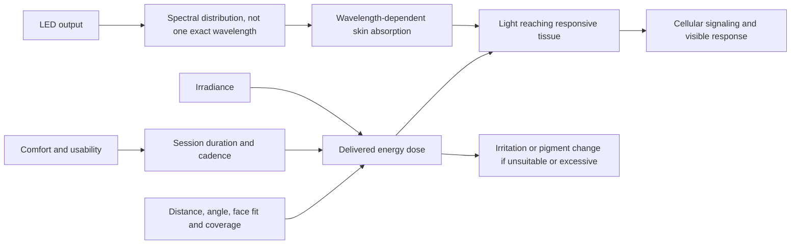

# Home skin photobiomodulation

Home skin photobiomodulation uses non-ionizing visible red and near-infrared light to produce a biological response without deliberately ablating tissue. Consumer masks are lower-powered than many office devices, so outcome depends on the delivered spectrum and dose, treatment geometry, safety, and repeated adherence—not on LED count or a fashionable color alone. The source describes smoother-looking lines, less redness, and reduced sensitivity as intended outcomes while emphasizing that home effects require consistent use. (@LabMuffinBeautyScience (Lab Muffin Beauty Science) — "Innovative new beauty favourites (Nooance AD)", 2026-04-25, [link](https://www.youtube.com/watch?v=GBTdWi_2DD0))

## From specification to tissue exposure

An LED labeled 633 nm or 830 nm emits a distribution around a peak rather than a single wavelength; nominally identical LEDs can differ, and multiple emitters in one device need not be perfectly matched. Narrower spectral bandwidth may make tissue exposure more predictable because skin absorption varies by wavelength, but precision is not itself proof of superior visible outcomes. Likewise, higher irradiance and more LEDs can shorten a regimen or increase dose, but “more” is not automatically better and may increase irritation or hyperpigmentation risk. (@LabMuffinBeautyScience (Lab Muffin Beauty Science) — "Innovative new beauty favourites (Nooance AD)", 2026-04-25, [link](https://www.youtube.com/watch?v=GBTdWi_2DD0))

Mask shape affects exposure and adherence. A molded mask may hold emitters more nearly perpendicular to facial contours without requiring uncomfortable strap tension; comfort, glare, heat, setup burden, and a visible timer can determine whether the nominal protocol is actually completed. These engineering considerations are plausible delivery advantages, not substitutes for independent comparative trials. (@LabMuffinBeautyScience (Lab Muffin Beauty Science) — "Innovative new beauty favourites (Nooance AD)", 2026-04-25, [link](https://www.youtube.com/watch?v=GBTdWi_2DD0))

The proposed biology is anti-inflammatory signaling, increased collagen production, improved cellular metabolism, and increased circulation; the metabolic effect is offered as part of why red light can jump-start follicle cells back into the growing phase in androgenetic alopecia, which is among the best-established uses. Indication strength diverges sharply from there. Hair loss: home low-level laser/LED devices have a growing evidence base for mild-to-moderate androgenetic alopecia as an adjunct, with reputable brands that publish on their devices preferred ([[hair-loss-diagnosis-and-scalp-health]]). Rejuvenation: plausible and commonly cited. Rosacea: theoretical benefit from the anti-inflammatory effect, but no large trials, and the circulation increase might itself trigger flushing in some. Skin cancer: red light alone treats nothing, but paired with a photosensitizer as photodynamic therapy it is an established treatment for non-melanoma skin cancers and extensive sun damage, with a photorejuvenation side effect. (@DrDrayzday (Dr Dray) — "Can Adapalene Really Prevent Wrinkles? Dermatologist Q&A", 2026-08-15, [link](https://www.youtube.com/watch?v=l30kQh-VdwI))

Delivery geometry separates the marketed formats. Commercial red-light beds and panels in spas and gyms are loosely specified: the dosing and the amount of effective light actually reaching the target are unclear, distance decreases the likelihood of a targeted effect, and there are no good studies establishing that a bed outperforms a close-fitting device. The intuition that a whole-body bed must be better is therefore backwards for skin and hair endpoints — a well-characterized home mask or helmet held close to the target, from a brand that publishes on its device, is the better-supported purchase. (@DrDrayzday (Dr Dray) — "Can Adapalene Really Prevent Wrinkles? Dermatologist Q&A", 2026-08-15, [link](https://www.youtube.com/watch?v=l30kQh-VdwI))

## Blue light for acne

Blue light works through a different mechanism than red and near-infrared photobiomodulation: it targets the acne-causing bacteria rather than cellular signaling. The evidence tier is respectable for a home device category — a systematic review of treatment outcomes in 1,185 people with acne who received blue light reported that 95% obtained a reduction in acne spots, and Dr Dray characterizes the home devices as a genuinely supported option with a plausible mechanism, calling flat claims that no evidence exists inaccurate. The honest boundaries are comparative and longitudinal: there are no good head-to-head studies against isotretinoin or other standard-of-care acne treatments and little long-term follow-up, so blue light does not carry the same degree of evidence as isotretinoin, tretinoin, benzoyl peroxide, or antibiotics. It is an adjunct or alternative with real supporting data, not a demonstrated equal of established therapy. (@DrDrayzday (Dr Dray) — "Can Adapalene Cause Facial Fat Loss? Dermatologist Q&A", 2026-08-23, [link](https://www.youtube.com/watch?v=DprHVOUpvaM))

Pre-treatment skincare adds a formulation problem. Bright light may degrade some ingredients, and occlusive or reactive products may alter exposure or irritation. The source describes a one-person green-tea report and sponsor-associated testing of an antioxidant product claiming greater improvement than mask use alone after three months; neither establishes that antioxidants generally enhance photobiomodulation or that the reported effect is independent, reproducible, and clinically meaningful. The episode was sponsored by the device maker, which materially lowers confidence in brand-comparative claims even though the sponsorship was disclosed. (@LabMuffinBeautyScience (Lab Muffin Beauty Science) — "Innovative new beauty favourites (Nooance AD)", 2026-04-25, [link](https://www.youtube.com/watch?v=GBTdWi_2DD0))

## Practical implications

- **Before purchase: compare wavelength distribution, irradiance, treatment time, fit, eye comfort, safety instructions, and independent finished-device evidence — evidence-screening principle, not a validated ranking formula.** Do not infer superiority from LED count or spectral narrowness alone. (@LabMuffinBeautyScience (Lab Muffin Beauty Science) — "Innovative new beauty favourites (Nooance AD)", 2026-04-25, [link](https://www.youtube.com/watch?v=GBTdWi_2DD0))
- **During use: follow the exact device schedule and stop for persistent irritation, worsening pigment, eye symptoms, or other unexpected reactions — strong harm-minimization principle.** Do not increase frequency merely because home devices are weaker. (@LabMuffinBeautyScience (Lab Muffin Beauty Science) — "Innovative new beauty favourites (Nooance AD)", 2026-04-25, [link](https://www.youtube.com/watch?v=GBTdWi_2DD0))
- **Unless the device maker has compatibility data for the exact combination: use clean, dry skin or only products explicitly allowed by the instructions — cautious, indirect evidence.** A one-person green-tea report does not admit a general antioxidant pre-treatment protocol. (@LabMuffinBeautyScience (Lab Muffin Beauty Science) — "Innovative new beauty favourites (Nooance AD)", 2026-04-25, [link](https://www.youtube.com/watch?v=GBTdWi_2DD0))
- **For mild-to-moderate acne: a blue-light LED device is a reasonable evidence-supported adjunct, judged over several weeks — moderate for lesion reduction; not established as equivalent to standard-of-care drugs.** Keep diagnosed moderate-to-severe or scarring acne under dermatologic treatment. (@DrDrayzday (Dr Dray) — "Can Adapalene Cause Facial Fat Loss? Dermatologist Q&A", 2026-08-23, [link](https://www.youtube.com/watch?v=DprHVOUpvaM))
- **At baseline and monthly: photograph under the same lighting, angle, distance, and expression — pragmatic measurement practice.** Continue only if benefit, burden, tolerability, and cost remain favorable; consumer-device evidence does not establish prevention of aging or long-term disease benefit.

## Gaps & open questions

- Which home-device specifications independently predict clinically meaningful outcomes rather than bench precision alone?
- Do commercial red-light beds deliver an effective dose to face or scalp, and how do they compare with close-fitting devices?
- Does red light measurably improve rosacea in controlled trials, and in whom does flushing outweigh the anti-inflammatory effect?
- What dose–response window balances benefit and pigment risk across skin tones and pigment disorders?
- Are red and near-infrared combinations superior to either wavelength range alone for defined outcomes?
- Do antioxidant pre-treatments add benefit, and which ingredients remain stable and safe under illumination?
- How durable are changes after treatment stops, and how much real-world benefit is explained by adherence?
- How does blue light compare head-to-head with benzoyl peroxide, topical retinoids, or isotretinoin for acne, and does benefit persist after stopping?

## Related

[[skincare-evidence-and-routine-design]] · [[procedural-skin-remodeling]] · [[photoprotection]] · [[hyperpigmentation-and-dark-spots]] · [[hair-loss-diagnosis-and-scalp-health]]
