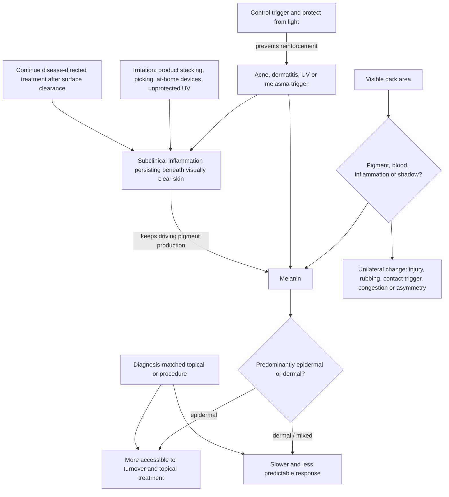

# Hyperpigmentation and dark spots

Hyperpigmentation is excess or uneven visible pigment, not a single diagnosis. Post-inflammatory hyperpigmentation, solar lentigines, melasma, a resolving bruise, irritation, and shadow from facial anatomy can all look dark while arising through different mechanisms. Treatment therefore begins by identifying the lesion, its depth, its trigger, and whether the apparent color is melanin at all. (@DrDrayzday (Dr Dray) — "Are Copper Peptides Better Than Vitamin C? Dermatologist Explain", 2026-08-01, [link](https://www.youtube.com/watch?v=YuHLRmJMUzI))

## Depth, cause, and treatment response

New epidermal pigment after acne or sun exposure may show visible improvement over weeks, whereas older or dermal pigment is generally more persistent. Melasma often contains both compartments; improvement of superficial pigment can reveal the remaining deeper component and create the appearance of worsening without proving that treatment created more pigment. The source offers four to eight weeks as a possible response window for some recent superficial lesions, but this is not a reliable universal forecast and was not independently evidence-reviewed here. (@DrDrayzday (Dr Dray) — "Are Copper Peptides Better Than Vitamin C? Dermatologist Explain", 2026-08-01, [link](https://www.youtube.com/watch?v=YuHLRmJMUzI))

Controlling the driver can matter more than adding a pigment active. In acne-associated post-inflammatory hyperpigmentation, adapalene plus benzoyl peroxide may reduce new pigment indirectly by controlling inflammatory lesions; benzoyl peroxide is not itself presented as a pigment-lightening or anti-aging ingredient. Prescription hydroquinone combinations and pigment-targeting lasers are diagnosis-, skin-tone-, and device-dependent treatments, not generic escalation steps. [[topical-retinoids]] [[procedural-skin-remodeling]] (@DrDrayzday (Dr Dray) — "Are Copper Peptides Better Than Vitamin C? Dermatologist Explain", 2026-08-01, [link](https://www.youtube.com/watch?v=YuHLRmJMUzI))

## Post-inflammatory pigment with ongoing inflammation

The prefix in post-inflammatory hyperpigmentation misleads: pigment left after acne, eczema, contact dermatitis, rosacea, insect bites, procedures, or picking is not always the aftermath of a finished event. Lesions that look to the eye like plain dark spots can harbor persisting inflammation — skin biopsies of apparently pigment-only lesions show inflammatory cell infiltrates, and objective measurements detect inflammation where visual inspection sees only a dark mark. The detection failure is largest in melanin-rich skin, where erythema is an unreliable inflammation marker: melanin changes how light interacts with skin, so active inflammation can read as purple, gray, or brown — colors indistinguishable from pigment — or produce no visible color at all. Deeper skin tones are simultaneously more prone to PIH, more extensively affected, and slower to clear, so the population most affected is the one in which the driving inflammation is hardest to see. (@DrDrayzday (Dr Dray) — "Why Your Hyperpigmentation Won’t Go Away | Dermatologist Explains", 2026-08-13, [link](https://www.youtube.com/watch?v=DYqU1VIR3pw))

This changes treatment logic in three ways. First, disease-directed therapy continues past visible clearance: acne is a chronic inflammatory disease, so a topical retinoid, benzoyl peroxide, or azelaic acid retains an active role after lesions clear — both maintaining disease control and, for several acne topicals, directly treating the pigment; the same applies to continuing eczema treatment briefly onto normal-appearing skin after a flare settles ([[topical-retinoids]]). Second, irritation is a pigment accelerant: stacking new dark-spot correctors (retinols, acids, vitamin C, peels, scrubs, masks) raises irritation risk, and the dryness, stinging, flaking, and sensitivity they cause are themselves hallmarks of subtle inflammation that entrenches the discoloration — the argument for a simple cleanse-moisturize-sunscreen base with few, tolerated actives ([[skincare-evidence-and-routine-design]]). Third, trauma avoidance is treatment: picking and squeezing lesions, at-home microneedling, and at-home IPL devices all add inflammatory injury and are recurrent documented causes of new pigment in predisposed skin ([[procedural-skin-remodeling]]). (@DrDrayzday (Dr Dray) — "Why Your Hyperpigmentation Won’t Go Away | Dermatologist Explains", 2026-08-13, [link](https://www.youtube.com/watch?v=DYqU1VIR3pw))

Over-exfoliation is a specific, common instance of the irritation-accelerant problem. Exfoliation legitimately hastens clearance of superficial epidermal pigment, but exceeding the skin's tolerance — usually by unknowingly stacking chemical and mechanical exfoliants on top of shaving, washcloths, and cleansing — generates the inflammation that drives new post-inflammatory pigment, and melasma is singled out as especially sensitive to exfoliation-induced irritation. Stinging, burning, or redness from previously tolerated products marks the threshold; the cumulative-load accounting lives at [[exfoliation-and-desquamation]]. (@DrDrayzday (Dr Dray) — "How Often Should You Really Exfoliate Your Skin?", 2026-09-02, [link](https://www.youtube.com/watch?v=bLDs-KM0F1o))

The same model explains the composition of the classic triple-combination therapy (Kligman's formula; branded as Tri-Luma): hydroquinone inhibits tyrosinase, tretinoin accelerates epidermal turnover and restrains pigment-producing enzymes, and the third component — low-strength fluocinolone acetonide 0.01%, a corticosteroid — is there deliberately: it suppresses pigmentation, calms inflammation lingering from the primary disease, and blunts the irritation that hydroquinone and tretinoin themselves cause, which would otherwise feed the pigment cycle the cream is meant to break. Photoprotection is framed as the non-negotiable co-treatment on a two-hit rationale: UV both upregulates melanogenesis and generates cutaneous inflammation, and visible light — particularly blue light — is additionally described as a substantial pigment driver, which is why iron-oxide-containing tinted sunscreens are recommended for PIH and melasma ([[photoprotection]]). (@DrDrayzday (Dr Dray) — "Why Your Hyperpigmentation Won’t Go Away | Dermatologist Explains", 2026-08-13, [link](https://www.youtube.com/watch?v=DYqU1VIR3pw))

Melasma is also not purely a melanin problem: it has a vascular component, which is why pulsed dye lasers that target hemoglobin (V-Beam) have some — conflicting — evidence of benefit. That option remains second-line at most, demands low-fluence settings and an experienced board-certified dermatologist, and carries a genuine risk of worsening melasma, concentrated in deeper skin tones; the procedural detail lives in [[procedural-skin-remodeling]]. (@DrDrayzday (Dr Dray) — "Can You Mix Azelaic Acid With Anything? Dermatologist Q&A", 2026-08-16, [link](https://www.youtube.com/watch?v=oyQl5MU3pRQ))

Topical vitamin C has more clinical support for hyperpigmentation than [[topical-copper-peptides]], but stability and penetration remain formulation constraints. Its depigmenting mechanism is tyrosinase inhibition — less enzyme activity, less melanin — and a 2023 systematic review of the small randomized-trial base found significant skin lightening in some studies, without head-to-head comparisons against hydroquinone or other tyrosinase inhibitors that would rank it among options ([[topical-vitamin-c]]). The tolerability trade-off is pigmentation-specific: ascorbic-acid irritation (burning, redness, dryness) can itself worsen and entrench hyperpigmentation, a risk concentrated in deeper skin tones, so a stinging vitamin C serum is counterproductive for the very goal it was bought for. (@DrDrayzday (Dr Dray) — "Do You Actually Need Vitamin C Serum? A Dermatologist Explains", 2026-08-17, [link](https://www.youtube.com/watch?v=WQrwaOFMEzc)) Copper's role in tyrosinase biology creates a hypothesis, not evidence that a copper-peptide serum reliably lightens pigment. Likewise, a severe unilateral under-eye dark area points toward a localized process—injury, dermatitis from transfer or rubbing, congestion, swelling, or anatomical asymmetry—more than a whole-body lifestyle explanation and warrants assessment if new or persistent. (@DrDrayzday (Dr Dray) — "Are Copper Peptides Better Than Vitamin C? Dermatologist Explain", 2026-08-01, [link](https://www.youtube.com/watch?v=YuHLRmJMUzI))

## Practical implications

- **Daily: prevent reinforcement with tolerable broad-spectrum photoprotection and avoid rubbing or picking — strong general practice.** Visible-light-sensitive melasma may require an appropriately tinted product. [[photoprotection]]
- **At onset: identify and control acne, dermatitis, injury, or another driver before stacking lighteners — moderate-to-strong clinical logic.** Treating the source prevents new lesions even when old pigment clears slowly.
- **After the primary condition looks clear: continue disease-directed maintenance treatment as directed rather than switching wholly to dark-spot correctors — moderate; biopsy-level evidence of subclinical inflammation plus dermatologic practice.** Confirm the intended maintenance duration with the treating clinician. (@DrDrayzday (Dr Dray) — "Why Your Hyperpigmentation Won’t Go Away | Dermatologist Explains", 2026-08-13, [link](https://www.youtube.com/watch?v=DYqU1VIR3pw))
- **Do not pick or squeeze lesions, and avoid at-home microneedling and at-home IPL when prone to hyperpigmentation, especially in melanin-rich skin — strong precaution.** Each adds inflammatory trauma that drives new pigment; interpret dryness, stinging, flaking, or new sensitivity from a product as inflammation even without visible redness. (@DrDrayzday (Dr Dray) — "Why Your Hyperpigmentation Won’t Go Away | Dermatologist Explains", 2026-08-13, [link](https://www.youtube.com/watch?v=DYqU1VIR3pw))
- **Every 8–12 weeks: assess standardized photographs rather than day-to-day appearance — limited practical method.** Stop products that cause persistent inflammation because irritation can create more discoloration.
- **For persistent, mixed-depth, rapidly changing, or one-sided discoloration: obtain clinical diagnosis — strong safety practice.** Prescription combinations and lasers require individualized selection; no transcript-only dose or device protocol is admitted here.

## Gaps & open questions

- Which accessible measurements best distinguish epidermal pigment, dermal pigment, vascular color, and anatomical shadow in routine care?
- Which finished vitamin C formulations produce clinically meaningful benefit across skin tones, and how do they compare with established prescription options?
- How should trials measure recurrence, irritation-induced worsening, and visible-light exposure rather than short-term color change alone?
- What proportion of unilateral under-eye darkness is caused by contact exposure, rubbing, congestion, tissue asymmetry, or another diagnosis?
- What fraction of clinically pigment-only PIH lesions carry histologic inflammation, and does adding anti-inflammatory treatment measurably speed clearance in that subgroup?
- Which accessible tools (beyond biopsy) can detect subclinical inflammation under pigment in deep skin tones in routine care?

## Related

[[photoprotection]] · [[topical-retinoids]] · [[topical-vitamin-c]] · [[topical-copper-peptides]] · [[procedural-skin-remodeling]] · [[skincare-evidence-and-routine-design]] · [[exfoliation-and-desquamation]] · [[dr-dray]]
