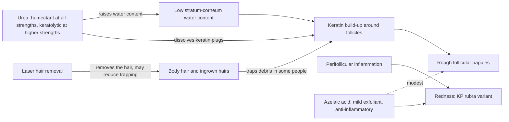

# Keratosis pilaris

Keratosis pilaris (KP) is a common, chronic, relapsing-and-remitting condition in which dry keratinous material builds up around hair follicles, producing rough, bumpy "chicken skin" — most often on the upper arms and thighs. The primary problem is retention of dry, rough keratin at the follicular opening rather than infection or acne; a recognized variant, keratosis pilaris rubra, adds prominent redness from perifollicular inflammation. Because the driver is keratin build-up in the setting of low skin-surface water content, treatments that raise hydration and dissolve keratin address the mechanism directly, while the relapsing course means maintenance matters more than any single clearing. (@DrDrayzday (Dr Dray) — "Dermatologist Answers Your Skincare Questions | AmLactin, Fraxel, Sunscreen & KP", 2026-08-29, [link](https://www.youtube.com/watch?v=YIQdXvlvmgA))

## Mechanism and treatment targets

Urea is the best-supported topical for KP and does two things. At any strength it is a humectant, and better water content reduces the build-up of dry rough skin over time; at keratolytic strengths (higher concentrations) it additionally dissolves accumulated keratin, exfoliating and loosening the plugs directly. Azelaic acid is not a common KP recommendation but can be a helpful addition: it is very mildly exfoliating, so it may modestly smooth the skin, and its anti-inflammatory action makes it most relevant to the redness of KP rubra ([[azelaic-acid]]). Combining a keratolytic urea cream with 15% azelaic acid is therefore mechanistically coherent — the two act on different nodes. (@DrDrayzday (Dr Dray) — "Dermatologist Answers Your Skincare Questions | AmLactin, Fraxel, Sunscreen & KP", 2026-08-29, [link](https://www.youtube.com/watch?v=YIQdXvlvmgA))

Alpha-hydroxy-acid lotions such as ammonium lactate act on the same hydration-plus-keratolysis pathway and are covered with the barrier system in [[skin-barrier-and-moisturization]].

## Laser hair removal: not a cause, sometimes a help

Laser hair removal does not cause KP. It works by heating melanin in the hair follicle to disable growth, which does not create the dry-keratin build-up that defines KP; in many cases it helps, because some people's KP is aggravated by ingrown hairs and body hair trapping dry skin. What laser hair removal can produce is transient follicular prominence — mild swelling, redness, and irritation around treated follicles that looks bumpy and superficially resembles chicken skin — but this settles on its own and lacks KP's relapsing-remitting course. Distinguishing the two prevents misattributing a short-lived treatment effect to a chronic disease. (@DrDrayzday (Dr Dray) — "Dermatologist Answers Your Skincare Questions | AmLactin, Fraxel, Sunscreen & KP", 2026-08-29, [link](https://www.youtube.com/watch?v=YIQdXvlvmgA))

## Practical implications

- **Ongoing, not as a one-off course: use a urea cream, preferring keratolytic strengths (around 10% and above) for established rough build-up — moderate; source-described clinical practice with a direct mechanism, no trial audit performed here.** Expect relapse when maintenance stops. (@DrDrayzday (Dr Dray) — "Dermatologist Answers Your Skincare Questions | AmLactin, Fraxel, Sunscreen & KP", 2026-08-29, [link](https://www.youtube.com/watch?v=YIQdXvlvmgA))
- **For the red (rubra) component: adding 15% azelaic acid to urea is a reasonable, mechanism-matched adjunct — limited; azelaic acid is not an established KP treatment.** Watch cumulative dryness when stacking actives ([[azelaic-acid]]). (@DrDrayzday (Dr Dray) — "Dermatologist Answers Your Skincare Questions | AmLactin, Fraxel, Sunscreen & KP", 2026-08-29, [link](https://www.youtube.com/watch?v=YIQdXvlvmgA))
- **After laser hair removal: treat new bumpiness as probable transient follicular prominence and reassess only if it persists or relapses — moderate diagnostic guidance.** (@DrDrayzday (Dr Dray) — "Dermatologist Answers Your Skincare Questions | AmLactin, Fraxel, Sunscreen & KP", 2026-08-29, [link](https://www.youtube.com/watch?v=YIQdXvlvmgA))

## Gaps & open questions

- What urea concentration best balances keratolysis, tolerability, and adherence for KP by body site, and how do urea, lactic acid, and salicylic acid compare head-to-head?
- Does azelaic acid measurably improve KP rubra redness in controlled trials, or is the benefit inferred from its rosacea evidence?
- How often does laser hair removal produce durable KP improvement, and in whom?

## Related

[[skin-barrier-and-moisturization]] · [[azelaic-acid]] · [[exfoliation-and-desquamation]] · [[skincare-evidence-and-routine-design]] · [[dr-dray]]
