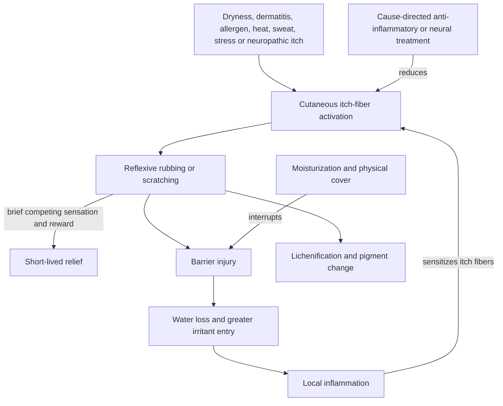

# Lichen simplex chronicus

Lichen simplex chronicus, also called neurodermatitis, is a localized thickened plaque produced and maintained by repeated rubbing or scratching. It is not simply a primary rash: an initial itch recruits a protective scratching reflex, scratching briefly suppresses itch but injures the barrier, and the resulting inflammation sensitizes cutaneous itch fibers. Repetition produces lichenification—thick, leathery skin with exaggerated surface lines—and can leave post-inflammatory hyperpigmentation or hypopigmentation. (@DrDrayzday (Dr Dray) — "Why You Can't Stop Scratching That One Spot | Lichen Simplex Chronicus", 2026-07-30, [link](https://www.youtube.com/watch?v=NNXRXZEY4so))

## The itch–scratch feedback loop

Scratching is strongly reinforcing and can occur automatically or during sleep; telling a person simply to stop mistakes a reflexive, learned loop for a freely chosen habit. Lesions therefore favor reachable sites such as the wrists, ankles, lower legs, forearms, genitals, and accessible upper back, often sparing the central area a person cannot reach. Stress can amplify neural itch signaling without making the disease imaginary or proving that stress initiated it. (@DrDrayzday (Dr Dray) — "Why You Can't Stop Scratching That One Spot | Lichen Simplex Chronicus", 2026-07-30, [link](https://www.youtube.com/watch?v=NNXRXZEY4so))

## Triggers, differential diagnosis, and persistence

The loop may begin in otherwise normal skin after an insect bite, friction, heat, sweat, dryness, or habitual rubbing. It may instead be secondary to atopic dermatitis, allergic contact dermatitis, or systemic and neuropathic itch associated with diabetes, kidney disease, or liver disease. Unlike histamine-driven urticaria, the source describes this itch as substantially non-histaminergic, with IL-4, IL-13, IL-31, barrier inflammation, and neural sensitization as candidate pathways; this is mechanistic expert interpretation, not an independently reviewed pathway model. (@DrDrayzday (Dr Dray) — "Why You Can't Stop Scratching That One Spot | Lichen Simplex Chronicus", 2026-07-30, [link](https://www.youtube.com/watch?v=NNXRXZEY4so))

Diagnosis matters because psoriasis, fungal disease, contact dermatitis, neuropathic itch, and other dermatoses can resemble a lichenified plaque, while generalized itch can signal systemic disease. A clinician should identify the initiating condition and location-specific constraints rather than treating thickness alone. Antihistamines may sedate but are not described as treating the central mechanism, and sedation can worsen sleep quality or falls risk in older adults. (@DrDrayzday (Dr Dray) — "Why You Can't Stop Scratching That One Spot | Lichen Simplex Chronicus", 2026-07-30, [link](https://www.youtube.com/watch?v=NNXRXZEY4so))

## Treatment structure and evidence boundary

Treatment acts on several nodes at once: moisturizers reduce water loss and friction; cooling or pramoxine may provide a non-damaging competing sensation; a breathable dressing both retains moisture and blocks access; and clinician-directed anti-inflammatory therapy suppresses the signaling that keeps itch fibers sensitized. Potent topical corticosteroids are commonly used on appropriate body sites, whereas facial and genital disease may require steroid-sparing topical calcineurin inhibitors. The transcript also describes intralesional steroid, phototherapy, selected centrally acting medicines, and procedural options for refractory disease. These are source-described clinical practices; their comparative efficacy, dose, cadence, contraindications, and long-term harms were not externally reviewed for this page. (@DrDrayzday (Dr Dray) — "Why You Can't Stop Scratching That One Spot | Lichen Simplex Chronicus", 2026-07-30, [link](https://www.youtube.com/watch?v=NNXRXZEY4so))

Dupilumab is described as an off-label option under study for difficult disease, particularly genital involvement, and IL-31-directed agents as an emerging strategy. Neither mention establishes routine use for lichen simplex chronicus. Cryotherapy can scar or depigment; psoralen plus UVA has a different burden from narrow-band UVB; and potent steroids or occlusion can cause harm when used at the wrong site, strength, or duration. These uncertainties make specialist supervision part of the intervention rather than an optional add-on. (@DrDrayzday (Dr Dray) — "Why You Can't Stop Scratching That One Spot | Lichen Simplex Chronicus", 2026-07-30, [link](https://www.youtube.com/watch?v=NNXRXZEY4so))

## Practical implications

- **At onset of a persistent localized itchy plaque: seek diagnosis rather than assuming eczema — strong safety practice.** Seek prompt care for genital or facial involvement, infection, rapid spread, sleep-disrupting itch, generalized itch, or relevant systemic illness.
- **Daily and after washing: apply a bland moisturizer and reduce heat, sweat, friction, and known irritants — moderate mechanistic support; protocol not independently reviewed here.** Keep nails short and use loose breathable clothing. [[skin-barrier-and-moisturization]]
- **When automatic scratching is likely: use a breathable physical cover if safe for the site — limited/source-described practice.** A dressing can support hydration and create a mechanical barrier, but do not occlude prescription medicine unless the prescriber directs it because occlusion can increase drug delivery.
- **For prescription treatment: follow the site-, potency-, and duration-specific plan and attend reassessment — strong safety practice.** Do not transfer a potent steroid regimen to eyelid, face, or genital skin or stop and restart indefinitely without guidance.
- **For refractory disease: specialist escalation is reasonable, but biologics, phototherapy, injections, neural medicines, and procedures are not interchangeable — investigational or clinician-directed practice.** Selection should follow diagnosis, comorbidity, site, burden, and treatment response.

## Gaps & open questions

- Which component—barrier repair, access blocking, inflammation control, or habit-focused treatment—adds the greatest independent benefit, and in which phenotype?
- Which biomarkers or clinical features identify IL-31-dominant disease or response to dupilumab and other targeted agents?
- What are the comparative remission, relapse, adverse-effect, sleep, and quality-of-life outcomes of topical, behavioral, phototherapy, and systemic strategies?
- How often is an apparent primary lichen simplex lesion maintained by an unrecognized allergen, neuropathy, or systemic disease?

## Related

[[skin-barrier-and-moisturization]] · [[chronic-itch-and-pruritus]] · [[uv-phototherapy]] · [[skincare-evidence-and-routine-design]] · [[sleep-quality-and-circadian-alignment]] · [[stress-threat-discrimination]] · [[dr-dray]]
