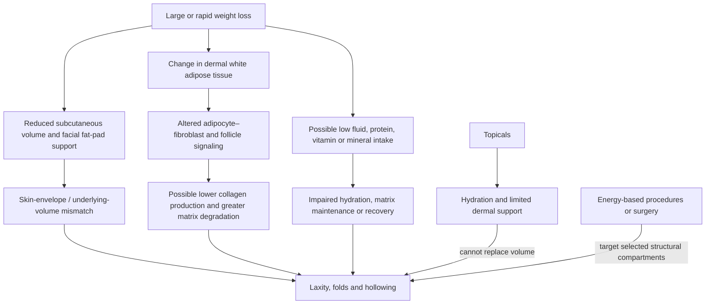

# Post-weight-loss skin laxity

Post-weight-loss skin laxity is a mismatch between the surface area and mechanical support of skin and the smaller volume of the tissues beneath it after substantial weight loss. The colloquial label “Ozempic face” is misleading: facial hollowing, neck laxity, and redundant skin can follow rapid or large weight loss by medication, surgery, or lifestyle change, so the phenotype should not be assumed to be a drug-specific toxic effect. (@DrDrayzday (Dr Dray) — "Can Skincare Fix Ozempic Face? Dermatologist Explains", 2026-07-29, [link](https://www.youtube.com/watch?v=zURv_nMTUc0))

## Tissue compartments and recoil

Subcutaneous fat is not inert packing: its volume supports the skin envelope, while dermal white adipose tissue participates in signaling with fibroblasts and hair follicles. A proposed pathway is that rapid depletion changes fibroblast signaling, reduces matrix production, and increases matrix-metalloproteinase activity; biopsy descriptions summarized in the source include a thinner epidermis, altered dermal–epidermal junction, and damaged collagen and elastic fibers. These mechanisms are biologically plausible but their relative contribution, and whether GLP-1 receptor agonists have a direct effect beyond weight-loss rate and intake, remain incompletely established in humans. (@DrDrayzday (Dr Dray) — "Can Skincare Fix Ozempic Face? Dermatologist Explains", 2026-07-29, [link](https://www.youtube.com/watch?v=zURv_nMTUc0))

Volume loss, surface dehydration, dermal matrix change, muscle loss, and true redundant skin are different targets. A moisturizer can improve stratum-corneum hydration, and a retinoid can support dermal collagen over time, but neither replaces a fat pad or removes an excess skin envelope. This compartment model explains why a statistically measurable improvement in a rating scale can still be much smaller than a surgical change. (@DrDrayzday (Dr Dray) — "Can Skincare Fix Ozempic Face? Dermatologist Explains", 2026-07-29, [link](https://www.youtube.com/watch?v=zURv_nMTUc0))

## What topical evidence can and cannot show

The reviewed topical literature is heterogeneous: tested products combine peptides, conditioned media or growth-factor mixtures, botanicals, hyaluronic acid, vitamin-A derivatives, antioxidants, and other co-actives. A 24-week vehicle-controlled crossover study reportedly found modest facial-sagging improvement beginning around eight weeks with a multi-ingredient serum; separate controlled studies reported modest neck- and upper-arm-laxity changes at eight to twelve weeks. Because the products and ingredient combinations differ, these studies cannot identify one active ingredient, establish class efficacy, or demonstrate restoration of lost volume. Most participants had age- or photoaging-related laxity rather than laxity after GLP-1-associated weight loss, making application to the latter an extrapolation. (@DrDrayzday (Dr Dray) — "Can Skincare Fix Ozempic Face? Dermatologist Explains", 2026-07-29, [link](https://www.youtube.com/watch?v=zURv_nMTUc0))

Topical exosome claims are still less settled. The source describes a small pilot with improved facial laxity and another platelet-derived-exosome study with no improvement; preparations were not reproduced across studies, and penetration, cargo identity, dose, stability, target engagement, and excessive growth signaling remain unresolved. Dr Dray’s contrarian interpretation is that expensive topical growth-factor and exosome products probably function mainly as moisturizers until receptor-level delivery and reproducible clinical advantage are shown. (@DrDrayzday (Dr Dray) — "Can Skincare Fix Ozempic Face? Dermatologist Explains", 2026-07-29, [link](https://www.youtube.com/watch?v=zURv_nMTUc0))

## Practical implications

- **During medically supervised weight loss: preserve nutrition, hydration, and muscle while monitoring the pace and pattern of loss — moderate for general health, indirect for preventing laxity.** Discuss inadequate intake, vomiting, dehydration, weakness, or marked hair and skin change with the prescribing team; do not stop a beneficial prescribed drug solely for a cosmetic change. (@DrDrayzday (Dr Dray) — "Can Skincare Fix Ozempic Face? Dermatologist Explains", 2026-07-29, [link](https://www.youtube.com/watch?v=zURv_nMTUc0))
- **Daily: moisturize as needed and use photoprotection — moderate for barrier support and prevention of further ultraviolet matrix damage; unproven for reversing post-weight-loss laxity.** See [[skin-barrier-and-moisturization]] and [[photoprotection]]. (@DrDrayzday (Dr Dray) — "Can Skincare Fix Ozempic Face? Dermatologist Explains", 2026-07-29, [link](https://www.youtube.com/watch?v=zURv_nMTUc0))
- **If using a tolerated retinoid: expect gradual, modest matrix effects rather than lifting or volume replacement — moderate for photoaged dermis, indirect for post-weight-loss laxity.** Follow product or prescriber directions and the safety boundaries in [[topical-retinoids]]. (@DrDrayzday (Dr Dray) — "Can Skincare Fix Ozempic Face? Dermatologist Explains", 2026-07-29, [link](https://www.youtube.com/watch?v=zURv_nMTUc0))
- **Before buying peptide, growth-factor, or exosome products: treat use as an optional cosmetic experiment, not a proven corrective protocol — limited.** Starting such products before weight loss is a hypothesis proposed in the reviewed paper, not an established prevention schedule. (@DrDrayzday (Dr Dray) — "Can Skincare Fix Ozempic Face? Dermatologist Explains", 2026-07-29, [link](https://www.youtube.com/watch?v=zURv_nMTUc0))
- **For substantial functional or cosmetic burden after weight stabilizes: seek anatomy-specific procedural assessment — source-described clinical principle.** Energy-based tightening may address selected tissue depths, whereas surgery is the intervention that can remove truly redundant skin; benefits, scars, pigment risk, cost, and durability require individualized counseling. (@DrDrayzday (Dr Dray) — "Can Skincare Fix Ozempic Face? Dermatologist Explains", 2026-07-29, [link](https://www.youtube.com/watch?v=zURv_nMTUc0))

## Gaps & open questions

- How much laxity is explained by loss rate, total loss, age, baseline photodamage, genetics, nutrition, muscle loss, and direct drug effects?
- Do any finished topical products improve patient-important outcomes in people with post-GLP-1 or post-bariatric laxity rather than ordinary photoaging?
- Can a slower loss trajectory or earlier resistance training reduce laxity independently of total weight lost?
- Which non-surgical procedures provide durable net benefit across anatomical sites and skin tones?
- Can topical growth factors or exosomes reproducibly reach viable target cells at a safe, active dose?

## Related

[[glp-1-receptor-agonists]] · [[skin-barrier-and-moisturization]] · [[skincare-evidence-and-routine-design]] · [[topical-retinoids]] · [[procedural-skin-remodeling]] · [[photoprotection]] · [[hair-loss-diagnosis-and-scalp-health]]
