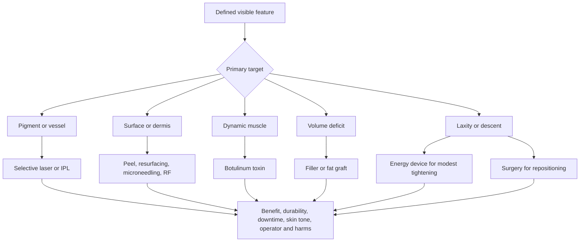

# Procedures, injectables, and structural facial aging

Procedural facial treatment should begin with the anatomical target, not a device name. Pigment and vessels, epidermal or dermal texture, dynamic muscle-driven lines, soft-tissue volume loss, and tissue laxity or descent arise from different compartments ([[visible-skin-and-facial-aging]]). A procedure can improve one compartment while leaving another unchanged, and temporary edema or lighting can imitate benefit unless outcomes are standardized ([[visible-aging-outcomes-and-evidence]]).

## Match mechanism to layer

Target selection is necessary but not sufficient. Wavelength, pulse structure, depth, thermal profile, peel chemistry, needle geometry, injected material, plane, anatomy, sterility, operator training, and aftercare all change exposure and risk. This chapter therefore compares classes and boundaries; it does not provide device settings or injection protocols.

## Pigment and vessels: selective optical targets

Lasers deliver relatively narrow wavelength bands; intense pulsed light (IPL) delivers filtered, noncoherent wavelength ranges. Both can exploit differential absorption by melanin or hemoglobin, but epidermal melanin competes for energy and can increase burn or dyspigmentation risk. Diagnosis matters: a lentigo, melasma, post-inflammatory pigment, telangiectasia, and suspicious pigmented lesion are not interchangeable treatment targets.

A systematic review of IPL rejuvenation included 16 studies and 637 participants, mostly Fitzpatrick types I–IV; nine studies were judged low quality, treatment parameters varied, and combination treatments often outperformed IPL alone.[^barros-2021] The evidence supports possible improvement in selected pigmentary and vascular features, not a universal “photofacial” effect or settings transferable across skin tones. Post-inflammatory hyperpigmentation, hypopigmentation, burns, scarring, infection, and ocular injury are uncommon but consequential laser/light harms; darker skin and recent tanning require target- and device-specific expertise.[^zakhary-2026]

## Surface and dermis: injury followed by repair

Chemical peels, ablative or nonablative lasers, microneedling, and radiofrequency create controlled chemical, optical, mechanical, or thermal injury. Repair can reorganize epidermis and dermal matrix, but more injury also means more pain, erythema, edema, crusting, infection risk, downtime, and pigment risk. “Collagen induction” is a mechanism, not a complete outcome.

Microneedling evidence for facial rejuvenation remains heterogeneous. A systematic review found 21 studies and 723 predominantly female participants; wrinkles were the most common endpoint, but designs and patient-reported measures varied.[^foppiani-2025] Radiofrequency studies report modest laxity and texture improvement, yet a systematic review found substantial variation and mostly subjective outcomes; unintended facial-fat reduction is a mechanistic possibility, not automatically a benefit.[^kaye-2021] In skin types III–VI, a systematic review of 35 RF or RF-microneedling reports found mostly transient pigment change but also prolonged hyperpigmentation and one permanent scar, so “color-blind” energy does not mean risk-free.[^lolis-2023]

Microfocused ultrasound deposits focal thermal injury below the surface. A meta-analysis of 13 studies (477 participants) estimated Global Aesthetic Improvement Scale response in 77% at 90 days and 69% at 180 days, but called for larger multicenter randomized studies; a response on this global scale does not quantify millimeters of lift or establish equivalence to surgery.[^ling-2023] Energy devices may produce modest tightening in selected mild-to-moderate laxity. They do not mechanically reposition advanced descent as predictably as excisional surgery.

## Dynamic lines: temporary muscle modulation

Botulinum toxin type A blocks acetylcholine release at the neuromuscular junction and temporarily weakens selected muscles. It targets dynamic expression lines, not pigment, volume loss, or skin-envelope descent. A Cochrane review of 65 RCTs and 14,919 participants found wrinkle reduction within four weeks, with certainty varying by outcome and an increased risk of ptosis; most studies involved a single cycle and women aged 18–65, leaving repeated-cycle and long-term comparative evidence thinner.[^hennessy-2021]

Effect depends on product, anatomy, placement, dose, and the desired balance between line reduction and expression. Headache, bruising, asymmetry, unwanted weakness, eyelid or brow ptosis, and rarely more serious toxin effects are part of informed consent. A temporary pharmacologic effect is not dermal regeneration.

## Volume loss: fillers, biostimulators, and fat grafting

Fillers add material to a defined plane; some products also provoke a longer-lived tissue response. Hyaluronic-acid fillers are often described as reversible because hyaluronidase can reduce them, but reversibility is incomplete and context-dependent. Other fillers, biostimulators, and permanent materials may be difficult or impossible to remove. Product approval is site- and indication-specific, not a blanket endorsement for every facial plane.

Common reactions include swelling, pain, bruising, firmness, nodules, and asymmetry. The rare catastrophic risk is inadvertent intravascular injection: the US Food and Drug Administration warns that vascular entry can cause skin necrosis, stroke, or blindness and recommends treatment only by appropriately trained licensed clinicians using approved, labeled products.[^fda-fillers-2024] Trial series can miss rare events, so absence of blindness or vascular occlusion in a few thousand selected participants is not proof of zero risk.

Autologous fat grafting transfers living tissue but retention is variable. A meta-analysis of 27 studies and 1,011 patients found retention ranging from 26% to 83%, with pooled retention of 47% (95% CI 41%–53%) over mean follow-up periods of 3–24 months.[^lv-2020] Complication case literature includes fat necrosis, contour irregularity, infection, and rare devastating vascular events including vision loss and stroke; incidence cannot be estimated reliably from case reports, but severity changes consent and operator requirements.[^brucato-2024]

## Laxity and descent: the surgical boundary

When the primary problem is laxity or descent of skin and deeper soft tissue, resurfacing can improve surface quality and energy devices may create modest contraction, but neither removes redundant skin nor reliably repositions deep compartments. Rhytidectomy can reposition and excise tissue and is therefore anatomically more capable, while introducing anesthesia, bleeding, hematoma, infection, scarring, delayed healing, nerve injury, and longer recovery. Durability varies with technique, anatomy, aging, smoking, sun exposure, and weight change; high-quality head-to-head evidence with standardized patient-reported outcomes remains limited.

Surgery, injectables, and skin procedures may be complementary because they solve different problems. Combination also compounds cost, downtime, diagnostic ambiguity, and interaction risk. Sequencing belongs to an individualized plan made by qualified clinicians, not to a universal anti-aging protocol.

## How to compare options

For each option, ask:

1. What exact feature and anatomical layer is being treated?
2. What absolute visible change occurred versus sham, vehicle, active comparator, or baseline, and who judged it?
3. How long did benefit persist after edema, peeling, bruising, or temporary paralysis resolved?
4. Were the studied skin tones, ages, anatomy, and severity applicable?
5. What are the downtime, pain, number of sessions, maintenance burden, and total cost?
6. Which outcomes depend strongly on operator technique, and what rescue capability exists for burns, vascular occlusion, infection, or vision symptoms?
7. Is the intervention reversible, partly reversible, or effectively permanent?

## Practical implications

- **Obtain a diagnosis and name one primary target before selecting a procedure—strong anatomical and safety principle.** A pigment lesion should be diagnosed before cosmetic destruction; dynamic lines, volume loss, and descent require different interventions.
- **For lasers, IPL, peels, microneedling, RF, or ultrasound, seek a clinician experienced with the device, indication, and your skin tone—moderate efficacy evidence, strong harm-reduction principle.** Ask for realistic absolute benefit, downtime, pigment risk, and standardized complete before-and-after sets.
- **Treat botulinum toxin as a temporary treatment for dynamic lines—high-certainty short-term efficacy for studied facial regions, less certain repeated-cycle evidence.** Discuss unwanted weakness, asymmetry, ptosis, and duration rather than expecting structural lifting.
- **Treat all fillers and fat grafting as medical procedures with rare catastrophic vascular risk—strong regulator safety warning.** Confirm the exact material, approval and site, reversibility, injector training, and an emergency plan for acute pain, blanching, visual change, or neurological symptoms.
- **Consider surgery when the desired outcome requires actual repositioning or removal of descended tissue—anatomically appropriate but procedure- and patient-specific evidence.** Compare its greater structural capability with scar, anesthesia, nerve, bleeding, recovery, and irreversibility burdens.

## Gaps & open questions

- Which procedures produce a patient-important benefit rather than a statistically detectable score change, and how long does it last?
- What are reliable absolute rates of rare serious harms by device, material, facial site, skin tone, and operator experience?
- Which energy devices preserve facial fat while improving mild laxity, and how should unintended volume loss be measured?
- How do procedures compare head-to-head on standardized blinded appearance and FACE-Q outcomes after total cost and downtime are counted?
- Which combinations are complementary, redundant, or risk-amplifying, and what sequencing has direct comparative evidence?
- How durable are facelift and fat-graft outcomes under standardized long-term measurement rather than selected photographs?

## References

[^barros-2021]: Sales AFS, Pandolfo IL, Cruz MA, et al. “Intense Pulsed Light on Skin Rejuvenation: A Systematic Review.” *Archives of Dermatological Research*, 2022. [systematic review]. [doi:10.1007/s00403-021-02283-2](https://doi.org/10.1007/s00403-021-02283-2)
[^zakhary-2026]: Zakhary I, Goldstein M, Carniol PJ. “Facial Laser Complications (A Five Year Review).” *Lasers in Medical Science*, 2026. [systematic review with FDA adverse-event contextualization]. [doi:10.1007/s10103-026-04862-z](https://doi.org/10.1007/s10103-026-04862-z)
[^foppiani-2025]: Foppiani JA, et al. “Microneedling for Facial Rejuvenation: A Systematic Review.” *Aesthetic Plastic Surgery*, 2025. [systematic review]. [doi:10.1007/s00266-025-04972-z](https://doi.org/10.1007/s00266-025-04972-z)
[^kaye-2021]: Austin GK, Struble SL, Quatela VC. “Evaluating the Effectiveness and Safety of Radiofrequency for Face and Neck Rejuvenation: A Systematic Review.” *Lasers in Surgery and Medicine*, 2022. [systematic review]. [doi:10.1002/lsm.23506](https://doi.org/10.1002/lsm.23506)
[^lolis-2023]: Syder NC, Chen A, Elbuluk N. “Radiofrequency and Radiofrequency Microneedling in Skin of Color: A Review of Usage, Safety, and Efficacy.” *Dermatologic Surgery*, 2023. [systematic review]. [doi:10.1097/DSS.0000000000003733](https://doi.org/10.1097/DSS.0000000000003733)
[^ling-2023]: Ling J, Zhao H. “A Systematic Review and Meta-Analysis of the Clinical Efficacy and Patients' Satisfaction of Micro-focused Ultrasound Treatment for Facial Rejuvenation and Tightening.” *Aesthetic Plastic Surgery*, 2023. [systematic review and meta-analysis]. [doi:10.1007/s00266-023-03384-1](https://doi.org/10.1007/s00266-023-03384-1)
[^hennessy-2021]: Camargo CP, Xia J, Costa CS, et al. “Botulinum Toxin Type A for Facial Wrinkles.” *Cochrane Database of Systematic Reviews*, 2021. [Cochrane systematic review of RCTs]. [doi:10.1002/14651858.CD011301.pub2](https://doi.org/10.1002/14651858.CD011301.pub2)
[^fda-fillers-2024]: US Food and Drug Administration. “Dermal Filler Do's and Don'ts for Wrinkles, Lips and More.” 2024. [regulatory safety guidance]. [FDA consumer guidance](https://www.fda.gov/consumers/consumer-updates/dermal-filler-dos-and-donts-wrinkles-lips-and-more)
[^lv-2020]: Lv Q, Li X, Qi Y, Gu Y, Liu Z, Ma GE. “Volume Retention After Facial Fat Grafting and Relevant Factors: A Systematic Review and Meta-analysis.” *Aesthetic Plastic Surgery*, 2020. [systematic review and meta-analysis]. [doi:10.1007/s00266-020-01612-6](https://doi.org/10.1007/s00266-020-01612-6)
[^brucato-2024]: Brucato D, Ülgür II, Alberti A, Weinzierl A, Harder Y. “Complications Associated with Facial Autologous Fat Grafting for Aesthetic Purposes: A Systematic Review of the Literature.” *Plastic and Reconstructive Surgery Global Open*, 2024. [systematic review of complication reports]. [doi:10.1097/GOX.0000000000005538](https://doi.org/10.1097/GOX.0000000000005538)

## Related

[[visible-skin-and-facial-aging]] · [[visible-aging-outcomes-and-evidence]] · [[procedural-skin-remodeling]] · [[hyperpigmentation-and-dark-spots]] · [[scars-and-dermal-remodeling]] · [[post-weight-loss-skin-laxity]] · [[topical-visible-aging-interventions]] · [[practice-playbook]]
