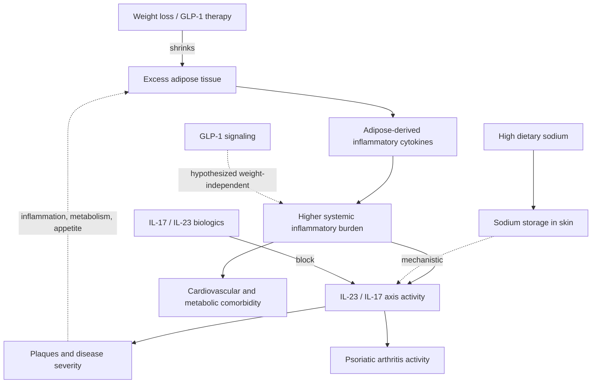

# Psoriasis and systemic inflammation

Psoriasis is a chronic inflammatory disease that manifests on the skin but is not confined to it: the same immune dysregulation produces psoriatic arthritis in a subset of patients and travels with cardiovascular disease, insulin resistance, and obesity often enough that the condition is best understood as a total systemic illness with a cutaneous signature. The central immunology runs through the interleukin-23/interleukin-17 axis: IL-23 sustains a population of IL-17-producing T cells, and IL-17 signaling drives the keratinocyte hyperproliferation and inflammation of plaques. Highly effective biologics interrupt this axis at either node — IL-17 blockers directly, and IL-23 (p19) blockers such as guselkumab upstream. (A sourcing note: the staged transcript describes guselkumab as IL-17-targeted; its regulatory labeling characterizes it as an IL-23 blocker, which acts on the same axis one step earlier.) (@DrDrayzday (Dr Dray) — "Can Ozempic & Wegovy Improve Your Skin? Skin Benefits of GLP-1s", 2026-08-28, [link](https://www.youtube.com/watch?v=vESsyr2i6iA))

## The metabolic–inflammatory loop

Obesity was long treated as a coexisting finding in psoriasis; the current understanding is that adipose tissue is biologically active, producing inflammatory cytokines whose systemic burden fuels the skin disease — making it more involved, more inflamed, and more stubborn to treat, without being its cause. The coupling likely runs both ways: something about having the disease appears to incline patients toward overweight, plausibly through inflammation and effects on metabolism, energy, appetite, and satiety. Reducing excess adipose tissue does not cure psoriasis, but treating it is part of treating the disease. (@DrDrayzday (Dr Dray) — "Can Ozempic & Wegovy Improve Your Skin? Skin Benefits of GLP-1s", 2026-08-28, [link](https://www.youtube.com/watch?v=vESsyr2i6iA))

The combination evidence now supports acting on both arms at once. In the TOGETHER-PsO randomized trial (274 adults with moderate-to-severe psoriasis plus overweight or obesity), guselkumab plus tirzepatide beat guselkumab alone on complete clearance, and some combination patients cleared fully without reaching the weight-loss target — the first randomized hint that the GLP-1 contribution may be partly weight-independent; a parallel trial found the same directional result in psoriatic arthritis. Trial detail, dosing cautions, and the indication boundary live at [[glp-1-receptor-agonists]]. (@DrDrayzday (Dr Dray) — "Can Ozempic & Wegovy Improve Your Skin? Skin Benefits of GLP-1s", 2026-08-28, [link](https://www.youtube.com/watch?v=vESsyr2i6iA))

A second dermatologist source independently corroborates the systemic framing and extends it in two directions. Clinically, Teo Soleymani describes psoriasis as a biologic marker of immune dysregulation and, in many adults, of metabolic syndrome, reporting that weight loss and an anti-inflammatory dietary shift can improve plaques without medication in some patients — practice observation aligned with, and no stronger than, the trial evidence above ([[diet-and-inflammatory-skin-disease]]). Therapeutically, he identifies narrowband UVB phototherapy as exceptionally effective for psoriasis when topicals fail, with some patients clearing completely and without the adverse-effect burden of systemic drugs; the modality is covered at [[uv-phototherapy]]. (@maxlugavere (Max Lugavere) — "The Skin Doctor: Hair Loss, Itchy Skin, Sunscreen Myths, and Anti-Aging Truths", 2026-07-15, [link](https://www.youtube.com/watch?v=99LCstvkNVw))

## Dietary sodium and the IL-17 connection

Diet reaches the psoriasis axis through at least one specific, mechanistically coherent route: the body can store excess sodium in the skin, and skin-accumulated sodium can activate inflammatory cell types and promote inflammatory pathways including IL-17 — the pathway psoriasis biologics target. High-sodium diets can also disrupt the skin barrier itself. Human evidence for sodium's clinical relevance is currently strongest in eczema (an association study detailed at [[diet-and-inflammatory-skin-disease]]); for psoriasis it remains mechanism plus plausibility rather than outcome data, and no sodium-restriction trial in psoriasis is cited in the sources. The practical sodium sources are ultra-processed convenience foods, restaurant meals, deli and packaged meats, sauces, soups, and shelf-stable bread rather than home seasoning. (@DrDrayzday (Dr Dray) — "Your Diet Could Be Making Your Skin Inflammation Worse", 2026-08-25, [link](https://www.youtube.com/watch?v=kwdfMqF6SSk))

## Practical implications

- **For diagnosed psoriasis: stay on disease-directed treatment; diet and weight interventions are adjuncts, not replacements — strong safety principle.** Rare online cure testimonies are confounded by misdiagnosis and spontaneous remission. (@DrDrayzday (Dr Dray) — "Your Diet Could Be Making Your Skin Inflammation Worse", 2026-08-25, [link](https://www.youtube.com/watch?v=kwdfMqF6SSk))
- **With moderate-to-severe disease plus overweight, obesity, or metabolic comorbidity: treat the metabolic disease as part of the psoriasis plan and discuss GLP-1 combination therapy with the dermatologist and prescriber — moderate-to-strong; supported by one phase 3b randomized trial for the tirzepatide–guselkumab combination.** (@DrDrayzday (Dr Dray) — "Can Ozempic & Wegovy Improve Your Skin? Skin Benefits of GLP-1s", 2026-08-28, [link](https://www.youtube.com/watch?v=vESsyr2i6iA))
- **Ongoing: expect cardiovascular and metabolic comorbidity screening as part of psoriasis care — moderate; the disease travels with systemic risk.** (@DrDrayzday (Dr Dray) — "Can Ozempic & Wegovy Improve Your Skin? Skin Benefits of GLP-1s", 2026-08-28, [link](https://www.youtube.com/watch?v=vESsyr2i6iA))
- **Daily dietary pattern: reduce ultra-processed, high-sodium, refined-carbohydrate load in favor of whole foods — limited for psoriasis-specific outcomes, mechanistically coherent, strong for general cardiometabolic health.** ([[diet-and-inflammatory-skin-disease]]) (@DrDrayzday (Dr Dray) — "Your Diet Could Be Making Your Skin Inflammation Worse", 2026-08-25, [link](https://www.youtube.com/watch?v=kwdfMqF6SSk))

## Gaps & open questions

- How much of the tirzepatide combination benefit is weight-independent, and would normal-weight psoriasis patients benefit from GLP-1 therapy at all?
- Does dietary sodium restriction measurably change psoriasis severity or biologic response in controlled trials?
- Which direction dominates the psoriasis–obesity coupling — inflammation driving weight gain, or adiposity driving disease — and does it differ by phenotype?
- Do combination metabolic–biologic strategies change psoriatic-arthritis joint damage and cardiovascular events, not just skin and composite scores?

## Related

[[glp-1-receptor-agonists]] · [[hidradenitis-suppurativa]] · [[diet-and-inflammatory-skin-disease]] · [[fiber-gut-skin-axis]] · [[inflammaging-and-il-6]] · [[insulin-resistance]] · [[visceral-and-ectopic-fat]] · [[uv-phototherapy]] · [[dr-dray]] · [[teo-soleymani]]
