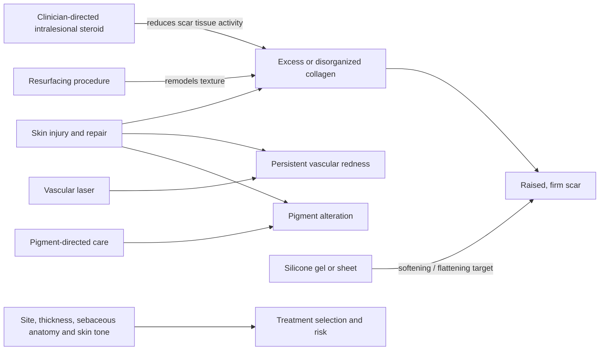

# Scars and dermal remodeling

A scar is repaired tissue whose collagen architecture differs from uninjured dermis. Hypertrophic scars remain raised within the original wound boundary because collagen production, vascular signaling, and remodeling have not returned the tissue to a flatter state. Treatment must distinguish raised tissue, redness, pigment change, and textural irregularity because each is a different target. (@DrDrayzday (Dr Dray) — "Are Copper Peptides Better Than Vitamin C? Dermatologist Explain", 2026-08-01, [link](https://www.youtube.com/watch?v=YuHLRmJMUzI))

## Target-matched remodeling

Silicone sheets or gels are non-procedural options intended to soften and flatten raised scars. Clinicians may combine intralesional corticosteroid, resurfacing, vascular laser, and pigment-directed treatment according to the component being treated. Nasal skin is thick and sebaceous, so a raised acne scar on the nose is not automatically managed like one elsewhere. The transcript also identifies topical tretinoin as a possible remodeling adjunct, but its effect size for established hypertrophic scars and its comparative role were not independently reviewed here. [[topical-retinoids]] (@DrDrayzday (Dr Dray) — "Are Copper Peptides Better Than Vitamin C? Dermatologist Explain", 2026-08-01, [link](https://www.youtube.com/watch?v=YuHLRmJMUzI))

## Practical implications

- **After a wound closes: minimize ultraviolet exposure and avoid repeated trauma — strong general scar-care practice.** Seek early advice if tissue becomes progressively raised, painful, itchy, or extends beyond the wound.
- **For a diagnosed hypertrophic scar: discuss silicone therapy and target-matched office treatment — clinician-directed; comparative evidence not reviewed here.** Use sheets or gel at the product or clinician cadence rather than inferring a universal schedule from the transcript.
- **Before a laser or resurfacing procedure: disclose retinoids, exfoliating acids, sensitivity, and prior pigment responses and follow the treating clinician's instructions — strong safety practice.** A three-to-seven-day retinoid pause was described as provider-dependent practice, not a universal evidence-backed rule. (@DrDrayzday (Dr Dray) — "Are Copper Peptides Better Than Vitamin C? Dermatologist Explain", 2026-08-01, [link](https://www.youtube.com/watch?v=YuHLRmJMUzI))

## Gaps & open questions

- Which hypertrophic-scar combinations provide the best durable flattening with the least atrophy, pigment change, pain, and recurrence?
- Does topical tretinoin add meaningful benefit to silicone or procedures for established hypertrophic scars?
- How should scar location, skin tone, acne activity, and sebaceous anatomy change device and dose selection?

## Related

[[procedural-skin-remodeling]] · [[topical-retinoids]] · [[photoprotection]] · [[hyperpigmentation-and-dark-spots]] · [[skin-barrier-and-moisturization]] · [[dr-dray]]
