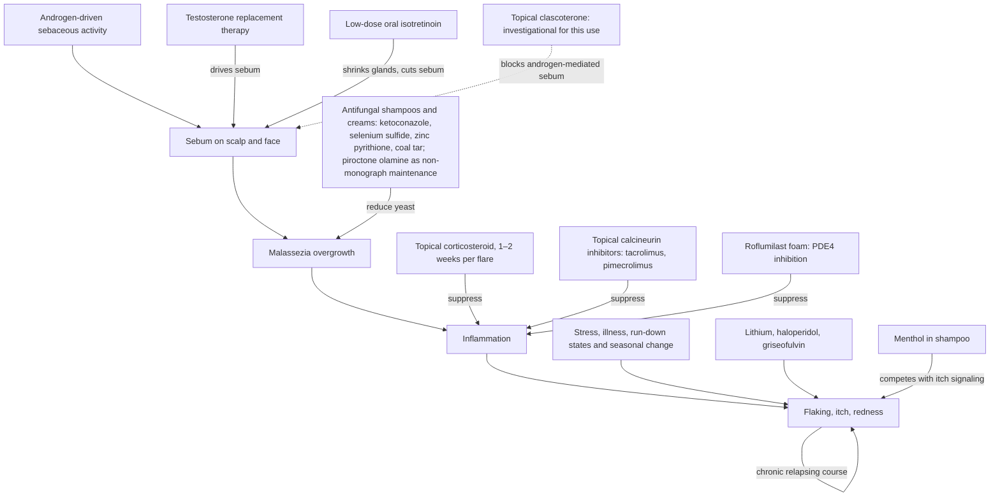

# Seborrheic dermatitis and dandruff

Seborrheic dermatitis is a chronic, relapsing inflammatory skin condition of sebum-rich sites — the scalp, face, ears, and central chest. Dandruff is seborrheic dermatitis of the scalp: the same process expressed as flaking and itch without the more visible redness of facial or trunk disease. The condition is driven by the interaction of sebum with *Malassezia*, a lipid-dependent yeast that is a normal resident of oily skin. Increased or altered sebum supports *Malassezia* overgrowth; the yeast and its metabolic activity promote inflammation, and inflammation accelerates epidermal turnover into visible scale and itch. Because the disease reflects a host–commensal interaction rather than an acquired infection, it is controlled rather than cured. (@DrDrayzday (Dr Dray) — "Can Adapalene Really Prevent Wrinkles? Dermatologist Q&A", 2026-08-15, [link](https://www.youtube.com/watch?v=l30kQh-VdwI)) (@DrDrayzday (Dr Dray) — "Can You Mix Azelaic Acid With Anything? Dermatologist Q&A", 2026-08-16, [link](https://www.youtube.com/watch?v=oyQl5MU3pRQ))

## Mechanism and treatment targets

The treatment ladder maps onto the three causal nodes. At the yeast node, ongoing management usually revolves around regular cleansing with at least one — often alternating — antifungal or antiproliferative shampoo active: ketoconazole, selenium sulfide, zinc pyrithione, or coal tar; prescription antifungal creams and ointments extend the same target to non-scalp sites. At the inflammation node, a topical corticosteroid used for one to two weeks controls a flare; topical calcineurin inhibitors (tacrolimus, pimecrolimus) control inflammation without steroid atrophy risk but cost more and often require prior authorization; and roflumilast foam, a phosphodiesterase-4 inhibitor, is described as very helpful for scalp disease. At the sebum node, some people get good results from low-dose oral isotretinoin (about 10–20 mg daily), which shrinks abnormally enlarged sebaceous glands and cuts the oiliness that drives the disease. Topical clascoterone, which targets androgen-mediated sebum production, is a plausible future option under study; a potential approval for scalp use in androgenetic alopecia could generate observational insight into dandruff, but no seborrheic-dermatitis indication exists today. All of this describes clinical practice patterns and drug mechanisms from an expert source; comparative efficacy between rungs of the ladder was not established there. (@DrDrayzday (Dr Dray) — "Can Adapalene Really Prevent Wrinkles? Dermatologist Q&A", 2026-08-15, [link](https://www.youtube.com/watch?v=l30kQh-VdwI))

Piroctone olamine sits adjacent to the FDA-approved shampoo actives at the yeast node. It is an antifungal that reduces *Malassezia* and helps scalp itch, but it is not an FDA-approved dandruff active and so carries less supporting data than zinc pyrithione or selenium sulfide; its natural role is maintenance between flares rather than primary flare control. In countries that do not allow zinc pyrithione over the counter, piroctone olamine is commonly the over-the-counter alternative people use for dandruff control, so its appearance in imported (notably Korean) shampoos is expected rather than exotic. Menthol, common in itchy-scalp shampoos, acts on the symptom node instead: its cooling sensation competes with itch signaling — useful comfort for those who tolerate it, an avoidable trigger for those allergic to it. (@DrDrayzday (Dr Dray) — "Dermatologist’s TOP Korean Skincare Picks | What’s Actually Worth It?", 2026-08-21, [link](https://www.youtube.com/watch?v=7x1UCXXw6GU))

The course is chronic and flare-prone rather than progressive: for some people the disease eventually burns out, but flares commonly follow stress and, in some, season. Planning for indefinite low-burden maintenance with short anti-inflammatory bursts is therefore more realistic than seeking a one-time cure. (@DrDrayzday (Dr Dray) — "Can Adapalene Really Prevent Wrinkles? Dermatologist Q&A", 2026-08-15, [link](https://www.youtube.com/watch?v=l30kQh-VdwI))

Medications interact with the causal loop at predictable nodes. Drugs associated with aggravating seborrheic dermatitis include lithium, haloperidol, and — paradoxically for an antifungal — griseofulvin; illness, run-down states, and weather changes also flare it, and testosterone replacement therapy can aggravate disease by driving sebum production ([[testosterone-replacement-therapy]]). Doxycycline, by contrast, does not routinely cause seborrheic dermatitis and, being anti-inflammatory (its mode of benefit in acne), might if anything help — though it does not reduce sebum, so it does not treat the upstream driver the way isotretinoin does. The realistic concerns with years of continuous doxycycline are different: antibiotic resistance and a theoretical compromise of the skin microbiome that could favor *Malassezia* overgrowth. Persistent beard-area redness on long-term doxycycline is therefore a diagnostic question, not an antibiotic side effect to assume. (@DrDrayzday (Dr Dray) — "Can Adapalene Cause Facial Fat Loss? Dermatologist Q&A", 2026-08-23, [link](https://www.youtube.com/watch?v=DprHVOUpvaM))

## Scalp oils: an unresolved question

Because *Malassezia* is an oil-loving organism, applying oils to the scalp has long been suspected of feeding the yeast and aggravating dandruff. The evidence does not currently support a firm rule in either direction: there is a mechanism by which oiling might worsen dandruff and a countervailing observation that cultures with widespread hair-oiling practices are not described as having more severe dandruff. Dr Dray's stated position is that she is not convinced scalp oils feed *Malassezia* but remains open to contrary data; the pragmatic middle course is a stopping trial when dandruff is active rather than a universal prohibition. Since no oil — including pumpkin-seed oil — has topical evidence for hair growth ([[hair-loss-diagnosis-and-scalp-health]]), a person oiling the scalp for hair-loss reasons is accepting this uncertainty without an established benefit. (@DrDrayzday (Dr Dray) — "Can You Mix Azelaic Acid With Anything? Dermatologist Q&A", 2026-08-16, [link](https://www.youtube.com/watch?v=oyQl5MU3pRQ))

Azelaic acid is sometimes proposed for scalp inflammation because it is anti-inflammatory, but its benefits are exerted mostly at the skin surface, follicular localization is doubtful, and no one has studied it for scalp irritation or hair growth; it remains a theoretical rather than tested option here. (@DrDrayzday (Dr Dray) — "Can Adapalene Really Prevent Wrinkles? Dermatologist Q&A", 2026-08-15, [link](https://www.youtube.com/watch?v=l30kQh-VdwI))

## Practical implications

- **Ongoing: cleanse regularly with a tolerated antifungal shampoo active (ketoconazole, selenium sulfide, zinc pyrithione, or coal tar), alternating actives if helpful — moderate; source-described standard practice for a chronic condition.** Expect control, not cure. (@DrDrayzday (Dr Dray) — "Can Adapalene Really Prevent Wrinkles? Dermatologist Q&A", 2026-08-15, [link](https://www.youtube.com/watch?v=l30kQh-VdwI))
- **During a flare: a topical corticosteroid for one to two weeks is the common add-on; calcineurin inhibitors or roflumilast foam are clinician-directed alternatives — moderate; prescription selection is individualized.** (@DrDrayzday (Dr Dray) — "Can Adapalene Really Prevent Wrinkles? Dermatologist Q&A", 2026-08-15, [link](https://www.youtube.com/watch?v=l30kQh-VdwI))
- **For frequent, severe recurrences: discuss sebum-directed options such as low-dose isotretinoin with a dermatologist — investigational practice for this indication; isotretinoin carries teratogenicity and monitoring requirements not detailed in the source.**
- **Between flares, or where approved actives are unavailable over the counter: a piroctone-olamine shampoo is a reasonable maintenance option — limited; less data than the FDA-approved actives.** Menthol-containing formulas can additionally relieve itch if tolerated. (@DrDrayzday (Dr Dray) — "Dermatologist’s TOP Korean Skincare Picks | What’s Actually Worth It?", 2026-08-21, [link](https://www.youtube.com/watch?v=7x1UCXXw6GU))
- **If oiling the scalp with active dandruff: run a stopping trial and judge the response — limited evidence in both directions.** There is no hair-growth reason to continue a scalp oil that coincides with worsening flakes. (@DrDrayzday (Dr Dray) — "Can You Mix Azelaic Acid With Anything? Dermatologist Q&A", 2026-08-16, [link](https://www.youtube.com/watch?v=oyQl5MU3pRQ))

## Gaps & open questions

- Does scalp oiling measurably change *Malassezia* density, inflammation, or dandruff severity in controlled comparisons?
- How do the antifungal shampoo actives compare head-to-head for control, remission length, and tolerability across hair types and washing frequencies?
- Does sebum-directed therapy (low-dose isotretinoin, topical clascoterone) durably reduce flares once stopped, and at what harm cost?
- Which patients burn out of the disease, and can they be identified prospectively?
- Does azelaic acid do anything useful on the scalp?
- Are the drug associations (lithium, haloperidol, griseofulvin) causal, and by what mechanism does an antifungal aggravate a *Malassezia*-driven disease?
- Does multi-year doxycycline measurably shift the skin microbiome toward *Malassezia* overgrowth?

## Related

[[hair-loss-diagnosis-and-scalp-health]] · [[skin-barrier-and-moisturization]] · [[skincare-evidence-and-routine-design]] · [[topical-retinoids]] · [[azelaic-acid]] · [[testosterone-replacement-therapy]] · [[dr-dray]]
