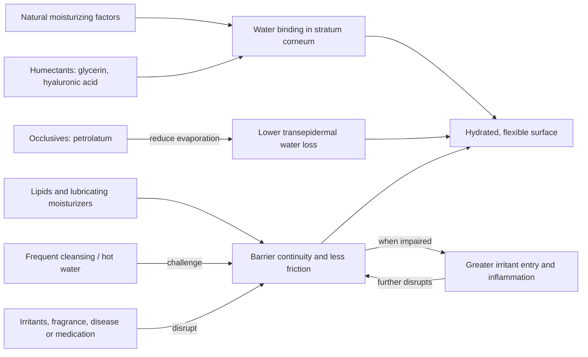

# Skin barrier and moisturization

The skin barrier is the outer epidermal system that limits water loss while restricting entry of irritants, allergens, and microbes. Its performance depends on corneocytes, intercellular lipids, natural moisturizing factors, and an intact surface environment. Dryness is therefore not merely a shortage of surface oil: reduced water-binding capacity, excess evaporation, repeated surfactant exposure, medication effects, age-related change, and inflammation can all lower stratum-corneum hydration. (@DrDrayzday (Dr Dray) — "Copper Peptides, Hair Loss & Retinol Questions Answered", 2026-08-08, [link](https://www.youtube.com/watch?v=0sxHRZPDvss))

## Water balance and barrier support

Humectants increase water retention; glycerin can provide durable hydration and, at higher concentrations, can also reduce water loss. Occlusives such as petrolatum form a film that strongly reduces transepidermal water loss, while ordinary moisturizers also lubricate the surface and reduce friction. Colloidal oatmeal adds soothing, anti-inflammatory, and barrier-protective properties. Marine extracts and hyaluronic acid may improve outer-layer hydration, but these functions do not make an expensive prestige formulation intrinsically superior. (@DrDrayzday (Dr Dray) — "Costco Skincare: What’s Actually Worth Buying? | Dermatologist Shops", 2026-08-10, [link](https://www.youtube.com/watch?v=JukyC7WttqI)) (@DrDrayzday (Dr Dray) — "Copper Peptides, Hair Loss & Retinol Questions Answered", 2026-08-08, [link](https://www.youtube.com/watch?v=0sxHRZPDvss))

Age-related decline in natural moisturizing factors and drying medications can lower the barrier's reserve. Letrozole can cause marked dryness and, less commonly, eczematous drug reactions; this distinction matters because supportive moisturization may relieve uncomplicated xerosis but a new inflammatory eruption warrants clinical assessment. Urea and lactic acid can hydrate and normalize rough epidermal texture, although either may sting when the barrier is already impaired. (@DrDrayzday (Dr Dray) — "Copper Peptides, Hair Loss & Retinol Questions Answered", 2026-08-08, [link](https://www.youtube.com/watch?v=0sxHRZPDvss))

Occlusion is directional while the film is intact: products placed over a fresh petrolatum layer penetrate poorly. By morning, an overnight petrolatum film is generally sufficiently worn down that routine products can be applied without mandatory cleanser removal. This supports simple routines rather than repeated cleansing to create a supposedly blank surface. (@DrDrayzday (Dr Dray) — "Is Sugar Really Bad for Your Skin? | Dermatologist Q&A", 2026-08-09, [link](https://www.youtube.com/watch?v=c0tYCBtxRO4))

## Practical implications

- **Daily and after bathing: apply a tolerated moisturizer to dry or vulnerable skin — strong for symptomatic barrier support.** Choose by function and tolerability rather than prestige category; face-specific and eye-specific branding is not proof of a distinct mechanism.
- **During a dryness flare: simplify to a mild cleanser only when needed, moisturizer, and sunscreen — moderate-to-strong.** Petrolatum provides maximal occlusion; glycerin-rich products may feel lighter. Add urea or lactic acid only as tolerated and stop if burning or inflammation increases. (@DrDrayzday (Dr Dray) — "Copper Peptides, Hair Loss & Retinol Questions Answered", 2026-08-08, [link](https://www.youtube.com/watch?v=0sxHRZPDvss))
- **At each shower: favor shorter, cooler bathing and moisturize afterward — moderate.** A bedroom humidifier may help in a dry environment, but the ideal humidity and magnitude of benefit are not established by these sources. (@DrDrayzday (Dr Dray) — "Copper Peptides, Hair Loss & Retinol Questions Answered", 2026-08-08, [link](https://www.youtube.com/watch?v=0sxHRZPDvss))
- **Never dilute preserved cleansers, shampoos, or liquid soaps in their original container — strong hygiene rationale.** Added water can make the preservative system inadequate and permit microbial contamination. (@DrDrayzday (Dr Dray) — "Costco Skincare: What’s Actually Worth Buying? | Dermatologist Shops", 2026-08-10, [link](https://www.youtube.com/watch?v=JukyC7WttqI))

## Gaps & open questions

- Which moisturizer components add clinically meaningful benefit beyond humectancy, occlusion, and lubrication in specific barrier disorders?
- How much do humidifiers improve xerosis under measured indoor-humidity conditions?
- Which patients with medication-associated dryness are most likely to progress to an eczematous drug eruption?
- What concentrations of glycerin, urea, and lactic acid best balance efficacy, comfort, and adherence on facial skin?

## Related

[[skincare-evidence-and-routine-design]] · [[topical-retinoids]] · [[photoprotection]] · [[procedural-skin-remodeling]] · [[practice-playbook]]
