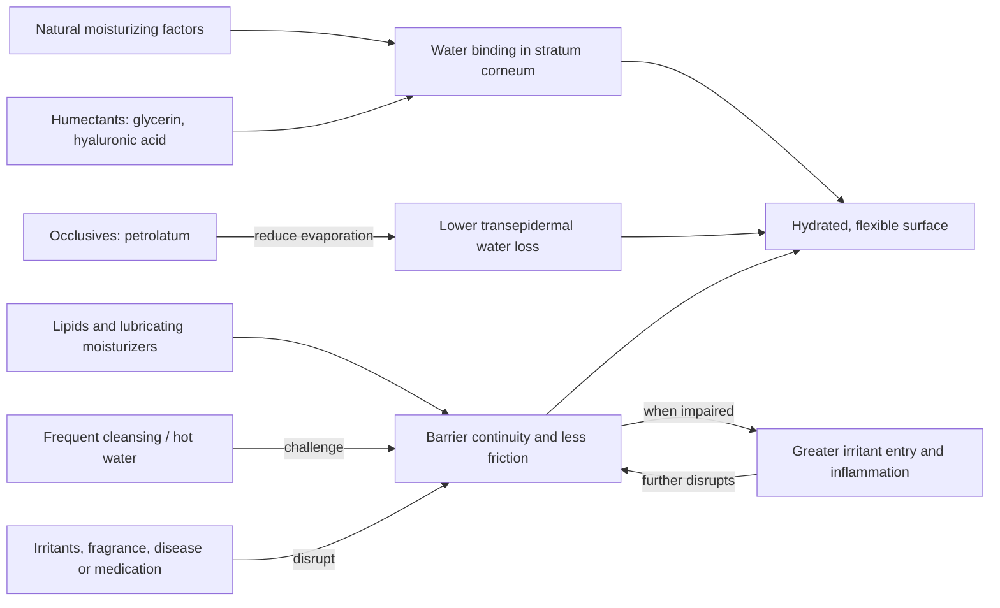
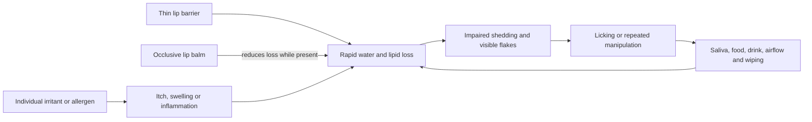

# Skin barrier and moisturization

The skin barrier is the outer epidermal system that limits water loss while restricting entry of irritants, allergens, and microbes. Its performance depends on corneocytes, intercellular lipids, natural moisturizing factors, and an intact surface environment. Dryness is therefore not merely a shortage of surface oil: reduced water-binding capacity, excess evaporation, repeated surfactant exposure, medication effects, age-related change, and inflammation can all lower stratum-corneum hydration. (@DrDrayzday (Dr Dray) — "Copper Peptides, Hair Loss & Retinol Questions Answered", 2026-08-08, [link](https://www.youtube.com/watch?v=0sxHRZPDvss))

## Water balance and barrier support

```mermaid
flowchart LR
  NMF[Natural moisturizing factors] --> BIND[Water binding in stratum corneum]
  HUM[Humectants: glycerin, hyaluronic acid] --> BIND
  OCC[Occlusives: petrolatum] -->|reduce evaporation| TEWL[Lower transepidermal water loss]
  LIP[Lipids and lubricating moisturizers] --> BARR[Barrier continuity and less friction]
  BIND --> FLEX[Hydrated, flexible surface]
  TEWL --> FLEX
  BARR --> FLEX
  WASH[Frequent cleansing / hot water] -->|challenge| BARR
  IRR[Irritants, fragrance, disease or medication] -->|disrupt| BARR
  BARR -->|when impaired| IN[Greater irritant entry and inflammation]
  IN -->|further disrupts| BARR
```

Humectants increase water retention; glycerin can provide durable hydration and, at higher concentrations, can also reduce water loss. Occlusives such as petrolatum form a film that strongly reduces transepidermal water loss, while ordinary moisturizers also lubricate the surface and reduce friction. Colloidal oatmeal adds soothing, anti-inflammatory, and barrier-protective properties. Marine extracts and hyaluronic acid may improve outer-layer hydration, but these functions do not make an expensive prestige formulation intrinsically superior. (@DrDrayzday (Dr Dray) — "Costco Skincare: What’s Actually Worth Buying? | Dermatologist Shops", 2026-08-10, [link](https://www.youtube.com/watch?v=JukyC7WttqI)) (@DrDrayzday (Dr Dray) — "Copper Peptides, Hair Loss & Retinol Questions Answered", 2026-08-08, [link](https://www.youtube.com/watch?v=0sxHRZPDvss))

Humectants do not pull distant water from deeper skin like a magnet: hydrogen bonding requires molecular contact, and water already diffusing toward the surface would otherwise contribute to transepidermal loss. A water-based hyaluronic-acid serum therefore does not inherently dry skin or require damp-skin application. The repeated claim that hyaluronic acid binds 1,000 times its weight in water lacks a traced experimental foundation; the source describes a 2024 chemistry analysis estimating roughly 40–85% of its weight under the examined assumptions, which does not negate product-level hydration or signaling effects. A brand-sponsored comparison reported similar hydration on damp and dry application, but its methods and independence were not externally reviewed here. (@LabMuffinBeautyScience (Lab Muffin Beauty Science) — "Skincare myths I used to believe", 2026-03-04, [link](https://www.youtube.com/watch?v=c5ujp0KftnE))

Moisturization works as a system. Humectants bind nearby water, emollients lubricate and fill surface irregularities, and occlusives slow evaporation; a humectant-only film can contract as it dries and feel tight without having extracted deep water. Damp application may improve spread, while an overlying cream adds emolliency and occlusion when the environment or barrier requires them. Panthenol, squalane, niacinamide, ectoin, and standardized Centella constituents can be compatible co-actives, but a sponsored reviewer's overnight comfort or lack of pore clogging does not establish comparative barrier benefit. (@LabMuffinBeautyScience (Lab Muffin Beauty Science) — "Skincare myths I used to believe", 2026-03-04, [link](https://www.youtube.com/watch?v=c5ujp0KftnE)) (@LabMuffinBeautyScience (Lab Muffin Beauty Science) — "Reviewing popular Korean skincare products (AD)", 2026-01-23, [link](https://www.youtube.com/watch?v=AjEV51neEak))

Several individual humectant-system ingredients have mechanisms worth distinguishing. Glycerin remains the reference humectant: cheap, well-evidenced, capable at higher concentrations of reducing transepidermal water loss, and with a downstream effect on aquaporin expression — the epidermal water channels — so its hydration can outlast the applied film. Polyglutamic acid is both a humectant and a lightweight surface veil that reduces water loss and limits irritant entry, which makes the glycerin-plus-polyglutamic-acid pairing a coherent deep-plus-surface hydration system. Ectoin is an extremolyte — a molecule bacteria produce to survive high salt, dehydration, heat, and cold — that hydrates, soothes, and carries antioxidant activity; whether it meaningfully defends against pollution or UV in use requires more research. Beta glucan is a hydrating, soothing ingredient common in products for distressed or sensitive skin. Fermented ingredients such as Lactobacillus ferment may be enriched in antioxidant, soothing, or conditioning fractions, but the popular equation of "ferment" with direct microbiome support is unearned: anything moisturizing supports the barrier and thereby the microbial environment, and that is the extent of what the label demonstrates. (@DrDrayzday (Dr Dray) — "REMEDY Hydrating Serum Review: Does It Actually Work?", 2026-08-19, [link](https://www.youtube.com/watch?v=VLH7oQHDBk0))

Two consequences of good stratum-corneum hydration deserve explicit statement because they are routinely mistaken for structural change. First, hydration quickly softens fine dehydration lines and evens apparent tone through water content and light scattering — a real, reversible, optical improvement that is not collagen remodeling. Second, hydration supports the enzymes of barrier maintenance and normal desquamation, which is why consistent moisturization smooths texture over time, and why a purely water-based hydrating toner can gently loosen retinoid-associated flaking without any exfoliating acid. Transepidermal water loss is also greater overnight, which is part of why skin can look dry and dull on waking and why morning hydration under sunscreen is a rational slot. Hydration additionally buys tolerance: a well-hydrated barrier makes irritating actives such as retinoids more comfortable, and comfort sustains the consistency on which results depend. The corollary cuts against the popular "skin flooding" trend of stacking many hydrating layers: each added product raises irritation and attribution risk, and one well-formulated humectant product can deliver the same hydration as a multi-step stack. (@DrDrayzday (Dr Dray) — "REMEDY Hydrating Serum Review: Does It Actually Work?", 2026-08-19, [link](https://www.youtube.com/watch?v=VLH7oQHDBk0)) (@DrDrayzday (Dr Dray) — "Dermatologist’s TOP Korean Skincare Picks | What’s Actually Worth It?", 2026-08-21, [link](https://www.youtube.com/watch?v=7x1UCXXw6GU))

The desquamation link deserves its own emphasis because it inverts a common consumer response. The enzymes that separate surface corneocytes are water-dependent: at low stratum-corneum water content they fail, dead cells stay caked in place, and the skin develops the rough, flaky texture that people then treat with exfoliants. Flakiness is skin attempting to exfoliate and failing for lack of water, so the corrective is moisturization, not more exfoliation — added exfoliation on a dry, flaky surface produces further barrier damage and further flaking. Menopause concentrates this failure mode: declining estrogen reduces natural moisturizing factor production, compromises barrier function, and thins the epidermis and dermis, making moisturizer more, not less, central for aging skin; the full exfoliation-load argument lives at [[exfoliation-and-desquamation]]. (@DrDrayzday (Dr Dray) — "How Often Should You Really Exfoliate Your Skin?", 2026-09-02, [link](https://www.youtube.com/watch?v=bLDs-KM0F1o))

Cleanser mildness is a finished-formula property, not a synonym for low foam. Traditional soaps are fatty-acid salts that require alkaline conditions to remain effective surfactants; their small mobile species and high pH can challenge the acidic surface and leave susceptible facial skin tight or irritated. Synthetic surfactant blends can create dense foam at lower pH, while humectants and the total micellar system modify deposition and irritation. Wong's contrasting product experiences support this mechanism but do not establish that every soap cleanser is harmful or that pH alone predicts tolerability. (@LabMuffinBeautyScience (Lab Muffin Beauty Science) — "Products I refuse to use (as a chemist)", 2025-09-08, [link](https://www.youtube.com/watch?v=Lb8DkTzFyYI)) (@LabMuffinBeautyScience (Lab Muffin Beauty Science) — "I tried cult Korean skincare products so you don't have to (Stylevana AD)", 2025-10-15, [link](https://www.youtube.com/watch?v=c6vcx4LIDGA))

Eyelid skin is thin and reactive, but it does not need a category of its own. Any tolerated lotion can moisturize eyelids — Lubriderm or Vanicream face-and-body cream work as well as products sold in small eye-cream tubes, most of which are ordinary moisturizers whose eye-friendliness is marketing. The genuine constraints are ingredient and technique constraints: avoid alpha-hydroxy acids (glycolic, lactic, mandelic), salicylic acid, and retinol on sensitive eyelids because they commonly irritate delicate skin; keep product about a millimeter away from the lash line so nothing enters the eye; and use a tiny amount — roughly a rice grain covers the under-eye and upper lid, and the generous applications common on social media are unnecessary. Glycerin performs well here: a small drop of plain vegetable glycerin or a glycerin-based skin protectant such as La Roche-Posay Cicaplast Gel provides durable hydration that smooths fine dehydration lines, at the cost of some initial stickiness. The recurring milia worry is unfounded: milia arise from skin injury, hereditary conditions, sun damage, age, and certain autoimmune skin disorders, and no formulation has ever been established to cause or prevent them, so there is no such thing as a milia-safe or milia-unsafe cream ([[skincare-evidence-and-routine-design]]). (@DrDrayzday (Dr Dray) — "Can You Mix Azelaic Acid With Anything? Dermatologist Q&A", 2026-08-16, [link](https://www.youtube.com/watch?v=oyQl5MU3pRQ))

Alpha-hydroxy-acid moisturizers can do structural work beyond hydration, with a dose-dependent depth of effect. Ammonium lactate at 12% (the strength in AmLactin 12%) has been shown to improve both epidermal and dermal thickness, whereas lower strengths around 5% improve epidermal thickness only. Since aging thins both compartments, either strength offers some benefit, but when dermal atrophy is the specific target — aging skin, or dermal thinning after a topical-steroid adverse event — the 12% strength is the evidence-matched choice. Tretinoin likewise improves both epidermal and dermal thickness, making the two reasonable alternatives or partners against age-related atrophy ([[topical-retinoids]]). (@DrDrayzday (Dr Dray) — "Can You Mix Azelaic Acid With Anything? Dermatologist Q&A", 2026-08-16, [link](https://www.youtube.com/watch?v=oyQl5MU3pRQ))

The dermal-thickening claim for 12% ammonium lactate rests on two human studies with histological endpoints. In the first, volunteers applied a 12% or 5% lactic-acid test solution to the face twice daily (sparing the eyelids, with a bland cream, titanium-dioxide sunscreen, and sun-avoidance advice layered on top) and were examined at 4, 8, 12, and 16 weeks: the 12% group improved both epidermal and dermal thickness on biopsy, while the 5% group improved epidermal thickness only — itself a genuine, reversible correction of one component of age- and photodamage-related atrophy. In the second, co-applying 12% ammonium lactate in a buffered lotion alongside the superpotent corticosteroid clobetasol induced dermal thickening and prevented the dermal atrophy that inappropriate long-term potent-steroid use otherwise produces; the investigators had been drawn to the question by observing increases in "viable epidermal thickness and ground substance in the dermis" during earlier daily-application studies. Both studies pre-tested tolerance because 12% ammonium lactate burns and stings in some users. The comparison with over-the-counter glycolic acid is asymmetric by setting: in-office high-strength glycolic peels are superior to 12% lactic acid for dermal thickening, but those strengths cannot be used safely at home, and home-safe glycolic formulations are so heterogeneous — some largely humectant, some epidermally exfoliating — that none is established to reach the dermis. Among cosmetic-tier topicals, the ingredients with evidence for dermal effects are 12% ammonium lactate, retinol, retinaldehyde, well-formulated ascorbic acid, and over-the-counter adapalene. (@DrDrayzday (Dr Dray) — "Dermatologist Answers Your Skincare Questions | AmLactin, Fraxel, Sunscreen & KP", 2026-08-29, [link](https://www.youtube.com/watch?v=YIQdXvlvmgA))

Bathing is barrier maintenance, not barrier assault. Daily washing with a gentle cleanser and a washcloth is how most people bathe and is safe even for sensitive skin: it mechanically clears the rough, slow-to-shed buildup, sweat, and surface soil that themselves compromise barrier integrity and can flare atopic dermatitis, and showering helps get water into the skin. Telling people with atopic dermatitis not to bathe is counterproductive — sweat is an irritant, and daily rinsing relieves it. The dose still matters: long hot showers, stacked exfoliants, and heavy surfactant use add insult to an impaired barrier, and water that stings on contact is a signal to use less soap for a few days — washing with just hands until comfort returns — rather than to scrub harder. (@DrDrayzday (Dr Dray) — "Can You Mix Azelaic Acid With Anything? Dermatologist Q&A", 2026-08-16, [link](https://www.youtube.com/watch?v=oyQl5MU3pRQ))

Age-related decline in natural moisturizing factors and drying medications can lower the barrier's reserve. Letrozole can cause marked dryness and, less commonly, eczematous drug reactions; this distinction matters because supportive moisturization may relieve uncomplicated xerosis but a new inflammatory eruption warrants clinical assessment. Urea and lactic acid can hydrate and normalize rough epidermal texture, although either may sting when the barrier is already impaired. (@DrDrayzday (Dr Dray) — "Copper Peptides, Hair Loss & Retinol Questions Answered", 2026-08-08, [link](https://www.youtube.com/watch?v=0sxHRZPDvss))

Drinking more water does not hydrate skin. Oral water intake and transepidermal water loss are uncorrelated in the absence of clinical dehydration (which announces itself through heart rate and skin turgor, not dryness), which is exactly why topical moisturizers work and why no one treats childhood eczema with a ninth glass of water. Any association between water drinkers and better skin is behavioral: attention to hydration travels with attention to nutrition and lifestyle. This is a dermatologist's mechanism-level teaching point consistent with the barrier physiology above, not a reviewed trial claim. (@maxlugavere (Max Lugavere) — "The Skin Doctor: Hair Loss, Itchy Skin, Sunscreen Myths, and Anti-Aging Truths", 2026-07-15, [link](https://www.youtube.com/watch?v=99LCstvkNVw))

Beef tallow, the current social-media moisturizer, resolves cleanly under the same functional analysis: it is a strongly occlusive barrier moisturizer in the petrolatum/Aquaphor family and among the closer approximations to sebum (which additionally carries ceramides). That single property makes it genuinely good for chronically dry, non-acne-prone skin — the surgeon source describes older patients whose tallow-moisturized skin looks great and declines to overrule results — and genuinely bad for acne-prone skin, where pore occlusion plus feeding of *Cutibacterium acnes* worsens breakouts. His two caveats: claimed vitamin and growth-factor benefits are unproven pending biopsy-level comparison against a plain moisturizer, and informally rendered animal products carry sterility and contamination risk absent from regulated formulations. The same age-dependence explains why oily skin appears to age better — a moisturized surface shows fewer cracks, an appearance effect he suspects rather than a biological one. (@maxlugavere (Max Lugavere) — "The Skin Doctor: Hair Loss, Itchy Skin, Sunscreen Myths, and Anti-Aging Truths", 2026-07-15, [link](https://www.youtube.com/watch?v=99LCstvkNVw))

Occlusion is directional while the film is intact: products placed over a fresh petrolatum layer penetrate poorly. By morning, an overnight petrolatum film is generally sufficiently worn down that routine products can be applied without mandatory cleanser removal. This supports simple routines rather than repeated cleansing to create a supposedly blank surface. (@DrDrayzday (Dr Dray) — "Is Sugar Really Bad for Your Skin? | Dermatologist Q&A", 2026-08-09, [link](https://www.youtube.com/watch?v=c0tYCBtxRO4))

Barrier failure can also become a sensory feedback disorder. In [[lichen-simplex-chronicus]], dryness and scratching increase water loss and irritant entry; inflammation then sensitizes itch fibers and drives more scratching. Moisturizer and a breathable physical cover act on different links—hydration and access—while cooling may compete with itch without inflicting new barrier damage. (@DrDrayzday (Dr Dray) — "Why You Can't Stop Scratching That One Spot | Lichen Simplex Chronicus", 2026-07-30, [link](https://www.youtube.com/watch?v=NNXRXZEY4so))

The vermilion lip has a thinner cornified barrier than most external skin and repeatedly contacts saliva, food, drink, airflow, and wiping. Water and lipid loss can impair the enzymes that normally separate surface corneocytes, producing larger visible flakes; licking briefly wets the surface but adds evaporation, removes lipids, and exposes it to saliva constituents. Reapplication after starting a lip balm is therefore not evidence of pharmacologic dependence. A more plausible loop is that occlusion softens the surface, cessation makes ordinary flaking more noticeable, and licking or an irritant or allergen perpetuates symptoms. Allergic contact cheilitis remains a distinct possibility when a particular product causes itch, swelling, or persistent inflammation. This mechanism is transcript-based expert interpretation and has not received an external evidence review here. (@LabMuffinBeautyScience (Lab Muffin Beauty Science) — "Are you falling for these skincare experts?", 2025-08-11, [link](https://www.youtube.com/watch?v=0bRpljNL7ro))

```mermaid
flowchart LR
  THIN[Thin lip barrier] --> LOSS[Rapid water and lipid loss]
  CONTACT[Saliva, food, drink, airflow and wiping] --> LOSS
  LOSS --> FLAKE[Impaired shedding and visible flakes]
  FLAKE --> LICK[Licking or repeated manipulation]
  LICK --> CONTACT
  BALM[Occlusive lip balm] -->|reduces loss while present| LOSS
  ALLERGEN[Individual irritant or allergen] --> INFLAM[Itch, swelling or inflammation]
  INFLAM --> LOSS
```

Reducing exposure can be as important as adding moisturizer. For hand eczema, a dispensing wash tool may reduce direct hand contact with shampoo or body-wash surfactants, although the device itself is not a treatment and still requires cleaning. Mechanical exfoliation adds friction to an already vulnerable barrier; if thick callus is intentionally filed, hydrating it first reduces resistance, but dry brushing has no established cellulite-remodeling mechanism and can simply irritate the surface. (@DrDrayzday (Dr Dray) — "TJ Maxx Skincare: Dermatologist Reviews What's Worth Buying", 2026-07-31, [link](https://www.youtube.com/watch?v=bkruuZQ_QTE))

## Practical implications

- **Daily and after bathing: apply a tolerated moisturizer to dry or vulnerable skin — strong for symptomatic barrier support.** Choose by function and tolerability rather than prestige category; face-specific and eye-specific branding is not proof of a distinct mechanism.
- **During a dryness flare: simplify to a mild cleanser only when needed, moisturizer, and sunscreen — moderate-to-strong.** Petrolatum provides maximal occlusion; glycerin-rich products may feel lighter. Add urea or lactic acid only as tolerated and stop if burning or inflammation increases. (@DrDrayzday (Dr Dray) — "Copper Peptides, Hair Loss & Retinol Questions Answered", 2026-08-08, [link](https://www.youtube.com/watch?v=0sxHRZPDvss))
- **For dehydrated skin, retinoid users, or seasonal transitions: one tolerated lightweight humectant product under moisturizer or sunscreen is a reasonable optional hydration step — transcript-based expert practice; comparative benefit and an evidence-based dose or cadence were not established.** The reviewed product spread over face and neck at a dime-size amount, but that product-specific observation should not be generalized to other formulas. Expect any rapid softening of fine lines to reflect hydration rather than remodeling, and avoid adding multiple layers when one product meets the need. (@DrDrayzday (Dr Dray) — "REMEDY Hydrating Serum Review: Does It Actually Work?", 2026-08-19, [link](https://www.youtube.com/watch?v=VLH7oQHDBk0))
- **When retinoid flaking or product-overuse irritation appears: stop or reduce the suspected irritant and simplify around tolerated moisturizer and sunscreen — moderate-to-strong as a general barrier strategy; the specific toner-plus-cream sequence is transcript-based expert practice, not a validated protocol.** Moisture-supported desquamation may reduce loose flaking without adding an exfoliating acid. (@DrDrayzday (Dr Dray) — "Dermatologist’s TOP Korean Skincare Picks | What’s Actually Worth It?", 2026-08-21, [link](https://www.youtube.com/watch?v=7x1UCXXw6GU))
- **When applying a hyaluronic-acid serum: use damp or dry skin according to comfort and spread, then add moisturizer if dryness requires it — limited product-specific evidence, strong mechanistic rationale against a mandatory damp-skin rule.** Tightness can reflect a contracting film rather than dehydration. (@LabMuffinBeautyScience (Lab Muffin Beauty Science) — "Skincare myths I used to believe", 2026-03-04, [link](https://www.youtube.com/watch?v=c5ujp0KftnE))
- **For eyelid moisturization: use any tolerated plain moisturizer or a small drop of glycerin, a rice-grain amount at most, kept a millimeter from the lash line — moderate; the eye-cream category adds marketing, not safety.** Avoid AHAs, salicylic acid, and retinol on sensitive eyelids. (@DrDrayzday (Dr Dray) — "Can You Mix Azelaic Acid With Anything? Dermatologist Q&A", 2026-08-16, [link](https://www.youtube.com/watch?v=oyQl5MU3pRQ))
- **For age- or steroid-related skin thinning: 12% ammonium lactate is an evidence-matched moisturizer-active because it improves dermal as well as epidermal thickness — moderate; lower strengths address the epidermis only.** (@DrDrayzday (Dr Dray) — "Can You Mix Azelaic Acid With Anything? Dermatologist Q&A", 2026-08-16, [link](https://www.youtube.com/watch?v=oyQl5MU3pRQ))
- **Bathe daily if it suits you, washcloth included, even with sensitive skin or atopic dermatitis — moderate-to-strong; not bathing lets sweat and buildup aggravate disease.** If water stings, temporarily drop soap and washcloth in favor of hands-only washing until the barrier recovers. (@DrDrayzday (Dr Dray) — "Can You Mix Azelaic Acid With Anything? Dermatologist Q&A", 2026-08-16, [link](https://www.youtube.com/watch?v=oyQl5MU3pRQ))
- **At each shower: favor shorter, cooler bathing and moisturize afterward — moderate.** A bedroom humidifier may help in a dry environment, but the ideal humidity and magnitude of benefit are not established by these sources. (@DrDrayzday (Dr Dray) — "Copper Peptides, Hair Loss & Retinol Questions Answered", 2026-08-08, [link](https://www.youtube.com/watch?v=0sxHRZPDvss))
- **Never dilute preserved cleansers, shampoos, or liquid soaps in their original container — strong hygiene rationale.** Added water can make the preservative system inadequate and permit microbial contamination. (@DrDrayzday (Dr Dray) — "Costco Skincare: What’s Actually Worth Buying? | Dermatologist Shops", 2026-08-10, [link](https://www.youtube.com/watch?v=JukyC7WttqI))
- **For ordinary dry or flaky lips: apply a tolerated bland occlusive as needed and avoid habitual licking — moderate barrier rationale, limited lip-specific outcome evidence in this source.** A water-free balm does not inherently need the same preservative system as a water-containing product. If one product repeatedly causes itch, swelling, or worsening, stop it and seek assessment for contact cheilitis when symptoms persist. (@LabMuffinBeautyScience (Lab Muffin Beauty Science) — "Are you falling for these skincare experts?", 2025-08-11, [link](https://www.youtube.com/watch?v=0bRpljNL7ro))
- **At each cleanse: use the least intensive product and frequency that remove the relevant soil without persistent tightness, burning, or worsening dermatitis — moderate formulation and barrier rationale.** If a soap-based facial cleanser leaves skin tight or oily-over-dehydrated, trial a gentler synthetic-surfactant cleanser and moisturize after washing; foam volume alone should not decide. (@LabMuffinBeautyScience (Lab Muffin Beauty Science) — "Products I refuse to use (as a chemist)", 2025-09-08, [link](https://www.youtube.com/watch?v=Lb8DkTzFyYI)) (@LabMuffinBeautyScience (Lab Muffin Beauty Science) — "I tried cult Korean skincare products so you don't have to (Stylevana AD)", 2025-10-15, [link](https://www.youtube.com/watch?v=c6vcx4LIDGA))

## Gaps & open questions

- Which moisturizer components add clinically meaningful benefit beyond humectancy, occlusion, and lubrication in specific barrier disorders?
- How do molecular weight, crosslinking, vehicle, and barrier state change hyaluronic-acid retention, penetration, signaling, and clinically meaningful hydration?
- How much do humidifiers improve xerosis under measured indoor-humidity conditions?
- Which patients with medication-associated dryness are most likely to progress to an eczematous drug eruption?
- What concentrations of glycerin, urea, and lactic acid best balance efficacy, comfort, and adherence on facial skin?
- Does glycerin's reported effect on aquaporin expression translate into measurably longer-lasting hydration than other humectants in finished products?
- Do ectoin or beta glucan add protection against pollution or UV-driven oxidative stress beyond their hydration effect in vivo?
- Which properties of a finished cleanser—free surfactant concentration, micelle size, pH, contact time, rinse behavior, or humectant deposition—best predict irritation across healthy, acne-prone, and eczematous skin?
- How much do lip-barrier thickness, licking, saliva exposure, allergens, climate, and balm formulation each contribute to recurrent cheilitis and perceived dependence on lip balm?

## Related

[[skincare-evidence-and-routine-design]] · [[cosmetic-product-safety-and-regulatory-gaps]] · [[exfoliation-and-desquamation]] · [[topical-retinoids]] · [[photoprotection]] · [[procedural-skin-remodeling]] · [[lichen-simplex-chronicus]] · [[chronic-itch-and-pruritus]] · [[keratosis-pilaris]] · [[teo-soleymani]] · [[practice-playbook]]
