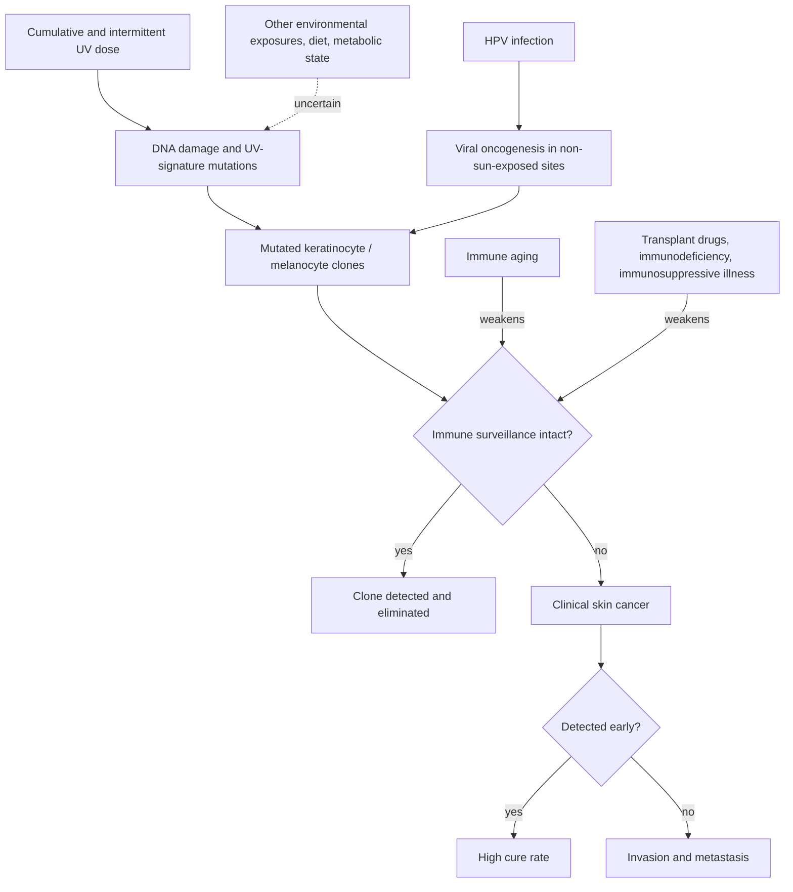

# Skin cancer risk and immune surveillance

Skin cancer is the most common cancer worldwide, spanning basal cell carcinoma (the most frequent and least dangerous), squamous cell carcinoma, and melanoma (the least common but most lethal of the three). Risk is conventionally modeled as a function of cumulative and intermittent ultraviolet dose acting on constitutive pigmentation, but a UV-only model is incomplete: the immune system's capacity to detect and eliminate mutated keratinocytes and melanocytes — immune surveillance — is a second, independently powerful determinant, and some skin cancers (notably HPV-associated tumors in non-sun-exposed sites) have primarily non-UV causes. A fellowship-trained skin cancer surgeon cites roughly 6 million US cases per year and a US skin-cancer death every 23 minutes; those figures, and his further claim that skin cancer is the second most common cancer killer of young women, are transcript statistics that have not been independently verified here. (@maxlugavere (Max Lugavere) — "The Skin Doctor: Hair Loss, Itchy Skin, Sunscreen Myths, and Anti-Aging Truths", 2026-07-15, [link](https://www.youtube.com/watch?v=99LCstvkNVw))

## The two-factor causal structure

The immune arm of this structure is easiest to see where it fails. Organ-transplant recipients take drugs that deliberately restrain immune rejection of the grafted organ; the same restraint suppresses immune surveillance, and their skin cancer incidence rises dramatically regardless of sun behavior — the transcript cites a 65,000% increase (a figure in the direction of, though stated more extremely than, the multi-fold squamous-cell excesses reported in transplant literature; treat the magnitude as unverified). In the 1990s, the transcript adds, metastatic skin cancer was the leading cause of death in transplant recipients unrelated to graft failure. The 2018 Nobel Prize for checkpoint immunotherapy — medicines that unleash the immune system against cancer — is the therapeutic mirror of the same principle, and immunotherapy's success in advanced melanoma (Jimmy Carter's ten-year survival with brain metastases is the transcript's example) shows the immune system can control even disseminated skin cancer when disinhibited. Skin cancer is largely a disease of adulthood because surveillance weakens with age ([[immune-aging-and-rejuvenation]]). (@maxlugavere (Max Lugavere) — "The Skin Doctor: Hair Loss, Itchy Skin, Sunscreen Myths, and Anti-Aging Truths", 2026-07-15, [link](https://www.youtube.com/watch?v=99LCstvkNVw))

A rising incidence in the young is the observation a UV-only model cannot absorb. The most sun-protected US generation on record is showing year-on-year increases in basal and squamous cell carcinoma and non-declining melanoma in people in their late teens and twenties, alongside HPV-driven cancers in genital and other unexposed sites. The surgeon's interpretation — unmeasured environmental and immune factors, potentially including diet and metabolic health — is hypothesis rather than established cause, and parallels the unexplained rise of early-onset colorectal cancer ([[colorectal-cancer-prevention-and-screening]]). (@maxlugavere (Max Lugavere) — "The Skin Doctor: Hair Loss, Itchy Skin, Sunscreen Myths, and Anti-Aging Truths", 2026-07-15, [link](https://www.youtube.com/watch?v=99LCstvkNVw))

## Sun exposure: aging versus cancer, and a contested claim

The sun–skin relationship must be split by outcome. For visible aging the dose–response is close to linear and predictable — chronic UV reliably degrades collagen and elastin the way sun turns a grape into a raisin — so sun avoidance strongly protects appearance ([[visible-skin-and-facial-aging]], [[photoprotection]]). For cancer the relationship is looser: most tumors do arise on the head and neck where lifetime exposure concentrates, but a meaningful fraction arises in unexposed skin, and immune status modifies risk at every exposure level. Chronic blistering sunburns remain clearly harmful; the surgeon's contrarian position is that complete sun avoidance is itself a health cost (he argues moderate exposure supports circadian rhythm, sleep, and well-being) and that exposure should be personalized to one's minimal erythemal dose — the time in midday sun one's skin tolerates without reddening — rather than governed by fear. (@maxlugavere (Max Lugavere) — "The Skin Doctor: Hair Loss, Itchy Skin, Sunscreen Myths, and Anti-Aging Truths", 2026-07-15, [link](https://www.youtube.com/watch?v=99LCstvkNVw))

**Evidence conflict — do decades-old sunburns cause today's cancer?** The transcript asserts that because the epidermis renews every 28 days, mutations from a teenage sunburn do not persist for 30–40 years, and that blaming a patient's cancer on distant sunburns is guilt-mongering rather than biology. The renewal premise is true of differentiated epidermis but does not extend to the long-lived basal and follicular stem cells from which keratinocyte cancers arise: sequencing studies of normal sun-exposed skin show persistent, clonally expanded UV-signature driver mutations accumulating over decades, and epidemiology ties early-life sunburns to later melanoma risk. This page therefore records his claim as an attributed minority position on mechanism — his clinical point, that guilt does not help patients and that many tumors are not attributable to any remembered exposure, stands independently of it. The conflict is unresolved in his favor nowhere in the broader literature; the mainstream persistence model remains the default. (@maxlugavere (Max Lugavere) — "The Skin Doctor: Hair Loss, Itchy Skin, Sunscreen Myths, and Anti-Aging Truths", 2026-07-15, [link](https://www.youtube.com/watch?v=99LCstvkNVw))

## Early detection

Skin cancer is among the most curable cancers when caught early, and the screening examination is brief and non-invasive. Three warning signs justify evaluation of any lesion: an inflammatory-appearing lesion (pimple, insect bite, ingrown hair) that has not healed within a month; a spot that bleeds easily with trivial contact, such as face washing — described as a cardinal sign of basal cell carcinoma; and a new or changing mole, especially one that stands out from its neighbors (the ugly-duckling sign). New moles can appear normally up to roughly age 35–40, so novelty alone is not alarm — change and outlier status are. These thresholds are standard dermatologic teaching relayed by a subspecialist; formal sensitivity and specificity were not reviewed here, and population-level screening trade-offs belong to [[cancer-screening-and-overdiagnosis]]. (@maxlugavere (Max Lugavere) — "The Skin Doctor: Hair Loss, Itchy Skin, Sunscreen Myths, and Anti-Aging Truths", 2026-07-15, [link](https://www.youtube.com/watch?v=99LCstvkNVw))

## Practical implications

- **Any lesion that fails to heal in a month, bleeds with trivial contact, or is a changing/outlier mole: get it examined promptly — strong; early-stage skin cancer is highly curable.** (@maxlugavere (Max Lugavere) — "The Skin Doctor: Hair Loss, Itchy Skin, Sunscreen Myths, and Anti-Aging Truths", 2026-07-15, [link](https://www.youtube.com/watch?v=99LCstvkNVw))
- **Periodic full-skin examination, including areas a partner or mirror cannot see, at a cadence set by personal risk — moderate; guideline bodies differ on population screening, and higher-risk people (fair skin, many moles, immunosuppression, personal or family history) benefit most.**
- **If immunosuppressed (transplant, immunodeficiency, long-term immunosuppressive therapy): treat dermatologic surveillance as part of routine care — strong; the risk multiplication in this population is large even if the transcript's figure is imprecise.**
- **Avoid burning; personalize sun exposure to skin type rather than adopting either extreme — moderate.** Blistering sunburns are an established melanoma risk factor; complete avoidance costs photoaging protection nothing but is not required for cancer prevention at low personal risk, and the claimed harms of avoidance (circadian, mood) are expert interpretation, not outcome data. [[photoprotection]]
- **Investigational practice: optimizing metabolic and immune health as skin-cancer prevention — mechanistically plausible, unproven.** No trial shows diet or immune optimization reduces skin cancer incidence; do not substitute it for photoprotection or surveillance.

## Gaps & open questions

- What explains rising keratinocyte cancers in sun-protected young cohorts — detection artifact, environmental exposures, immune change, HPV, or something else?
- How much lifetime skin-cancer risk is attributable to remote versus recent UV dose, and can persistence of clonal driver mutations be linked quantitatively to individual exposure history?
- Does any measurable index of immune surveillance predict skin-cancer incidence in immunocompetent adults?
- Do metabolic interventions (weight loss, diet quality) change keratinocyte-cancer incidence?
- What is the true benefit–harm balance of routine full-body skin examinations in average-risk adults?

## Related

[[photoprotection]] · [[visible-skin-and-facial-aging]] · [[immune-aging-and-rejuvenation]] · [[uv-phototherapy]] · [[topical-retinoids]] · [[cancer-screening-and-overdiagnosis]] · [[cutaneous-signs-of-systemic-disease]] · [[teo-soleymani]] · [[aging-model]]
