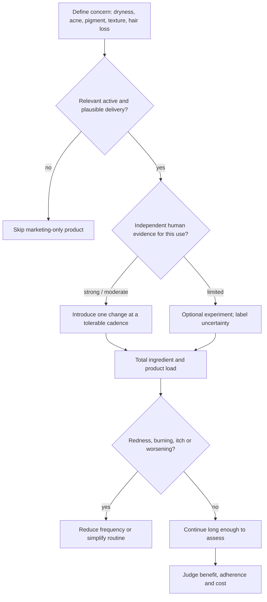

# Skincare evidence and routine design

A skincare routine is a delivery system for a few defined functions: cleansing, barrier support, photoprotection, and treatment of a diagnosed or specified concern. Product category, price, novelty, and ingredient count are weak proxies for performance. The central decision is whether the finished formulation delivers a relevant active at a useful exposure with tolerable irritation and enough convenience to sustain use. (@DrDrayzday (Dr Dray) — "Costco Skincare: What’s Actually Worth Buying? | Dermatologist Shops", 2026-08-10, [link](https://www.youtube.com/watch?v=JukyC7WttqI)) (@DrDrayzday (Dr Dray) — "Copper Peptides, Hair Loss & Retinol Questions Answered", 2026-08-08, [link](https://www.youtube.com/watch?v=0sxHRZPDvss))

## From label to useful intervention

Finished-product context matters. Ferulic acid can stabilize ascorbic acid; salicylic acid is oil-soluble enough to act within follicles while glycolic acid exfoliates the surface; niacinamide can provide more plausible benefit in a complex serum than a fashionable but poorly supported PDRN claim. Conversely, an attractive ingredient list does not reveal concentration, stability, penetration, or clinical effect. Topical PDRN and green-tea shampoo claims remain especially uncertain because effective delivery and active abundance are not established by the label. (@DrDrayzday (Dr Dray) — "Costco Skincare: What’s Actually Worth Buying? | Dermatologist Shops", 2026-08-10, [link](https://www.youtube.com/watch?v=JukyC7WttqI))

Novel ingredients also inherit reputations from non-equivalent routes. Injectable PDRN evidence does not establish topical delivery, and changing DNA source from salmon to a plant does not show that the same active distribution or mechanism is present. A defensible trial pairs the novel ingredient with a function one already wants—such as retinal—then attributes observed benefit cautiously because the co-active and vehicle are alternative explanations. Sponsor-presented testing and personal tolerability can generate hypotheses but rank below independent, controlled finished-product trials. See [[topical-pdrn-and-centella]]. (@LabMuffinBeautyScience (Lab Muffin Beauty Science) — "New K-Beauty finds: PDRN, TECA, lip tint and more (AD)", 2026-06-19, [link](https://www.youtube.com/watch?v=HViQVEobv88))

Most topical combinations are not chemically forbidden. Copper-peptide products can generally be used with azelaic acid, vitamin C, or retinoids if the combination is tolerated; lightweight serums conventionally precede thicker creams, and rinse-off treatments precede leave-on products. The important interaction is often cumulative irritation rather than one ingredient neutralizing another. A genuine exception is concurrent leave-on benzoyl peroxide and topical dapsone, which can cause yellow-orange discoloration. (@DrDrayzday (Dr Dray) — "Is Sugar Really Bad for Your Skin? | Dermatologist Q&A", 2026-08-09, [link](https://www.youtube.com/watch?v=c0tYCBtxRO4)) (@DrDrayzday (Dr Dray) — "Copper Peptides, Hair Loss & Retinol Questions Answered", 2026-08-08, [link](https://www.youtube.com/watch?v=0sxHRZPDvss))

Fragrance is a common allergic-contact-dermatitis trigger and can also cause sensory irritation or headache without allergy. More products increase the number of potential irritants and make causality harder to identify. Likewise, disposable facial towels are a convenience choice, not an established acne-prevention intervention, and salon-quality or medical-grade labels do not by themselves establish superior formulation. Dr Dray's contrarian product-selection rule is therefore to credit the known functional ingredients and finished-formula evidence rather than the prestige category or fashionable hero ingredient. (@DrDrayzday (Dr Dray) — "Costco Skincare: What’s Actually Worth Buying? | Dermatologist Shops", 2026-08-10, [link](https://www.youtube.com/watch?v=JukyC7WttqI)) (@DrDrayzday (Dr Dray) — "Copper Peptides, Hair Loss & Retinol Questions Answered", 2026-08-08, [link](https://www.youtube.com/watch?v=0sxHRZPDvss))

## Practical implications

- **Daily: use the smallest routine that reliably meets the goal — moderate-to-strong.** A baseline is cleanser as needed, moisturizer as needed, and sunscreen; add a treatment only for a defined concern.
- **When adding products: change one variable, begin at a tolerable cadence, and reassess after the biologically plausible response period — moderate.** Delayed irritation is possible, so immediate comfort is not proof of long-term tolerability.
- **At purchase or renewal: ignore prestige categories and compare active, formulation, evidence, tolerability, quantity, and cost — moderate evidentiary method.** Do not infer benefit from ingredient novelty alone.
- **If persistent dermatitis is suspected: stop likely triggers and seek patch testing or clinical evaluation — strong.** Fragrance allergy cannot be diagnosed from the label or symptoms alone.

## Gaps & open questions

- Which common ingredient combinations meaningfully alter stability or delivery in real finished products?
- How well do label-based predictions identify the ingredient responsible for benefit or irritation in multi-active formulas?
- What independent evidence supports topical PDRN, GHK-copper, stemoxydine, or aminexil for specific outcomes?
- Can simpler routines improve adherence and outcomes compared with multi-step routines in randomized pragmatic studies?

## Related

[[skin-barrier-and-moisturization]] · [[topical-retinoids]] · [[topical-pdrn-and-centella]] · [[hair-loss-diagnosis-and-scalp-health]] · [[photoprotection]] · [[procedural-skin-remodeling]] · [[supplement-evidence-and-safety]]
