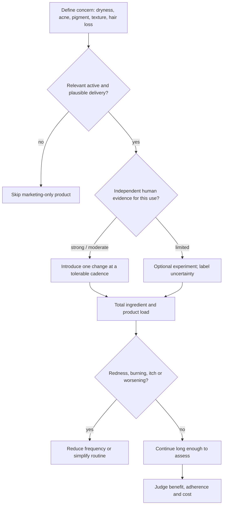

# Skincare evidence and routine design

A skincare routine is a delivery system for a few defined functions: cleansing, barrier support, photoprotection, and treatment of a diagnosed or specified concern. Product category, price, novelty, and ingredient count are weak proxies for performance. The central decision is whether the finished formulation delivers a relevant active at a useful exposure with tolerable irritation and enough convenience to sustain use. (@DrDrayzday (Dr Dray) — "Costco Skincare: What’s Actually Worth Buying? | Dermatologist Shops", 2026-08-10, [link](https://www.youtube.com/watch?v=JukyC7WttqI)) (@DrDrayzday (Dr Dray) — "Copper Peptides, Hair Loss & Retinol Questions Answered", 2026-08-08, [link](https://www.youtube.com/watch?v=0sxHRZPDvss))

## From label to useful intervention

```mermaid
flowchart TD
  GOAL[Define concern: dryness, acne, pigment, texture, hair loss] --> ACTIVE{Relevant active and plausible delivery?}
  ACTIVE -->|no| SKIP[Skip marketing-only product]
  ACTIVE -->|yes| EVID{Independent human evidence for this use?}
  EVID -->|strong / moderate| TRIAL[Introduce one change at a tolerable cadence]
  EVID -->|limited| OPT[Optional experiment; label uncertainty]
  TRIAL --> LOAD[Total ingredient and product load]
  OPT --> LOAD
  LOAD --> TOL{Redness, burning, itch or worsening?}
  TOL -->|yes| SIMPLIFY[Reduce frequency or simplify routine]
  TOL -->|no| CONT[Continue long enough to assess]
  CONT --> VALUE[Judge benefit, adherence and cost]
```

Finished-product context matters. Ferulic acid can stabilize ascorbic acid; salicylic acid is oil-soluble enough to act within follicles while glycolic acid exfoliates the surface; niacinamide can provide more plausible benefit in a complex serum than a fashionable but poorly supported PDRN claim. Conversely, an attractive ingredient list does not reveal concentration, stability, penetration, or clinical effect. Topical PDRN and green-tea shampoo claims remain especially uncertain because effective delivery and active abundance are not established by the label. (@DrDrayzday (Dr Dray) — "Costco Skincare: What’s Actually Worth Buying? | Dermatologist Shops", 2026-08-10, [link](https://www.youtube.com/watch?v=JukyC7WttqI))

An input percentage is therefore not a delivered dose. Degradation before use, packaging, antioxidants or encapsulation, vehicle partitioning, penetration enhancers, skin-barrier state, and application pattern can make two products with the same labeled active perform differently; unlike an approved generic drug, a cosmetic generally has not demonstrated stability and bioequivalence for that use. Finished-product human testing is more informative when it has a relevant comparator, objective endpoint, adequate duration, transparent sponsorship, and a formula matching the sold version. Consumer-perception scores, sponsor testing, and ingredient plausibility remain lower-confidence evidence. (@LabMuffinBeautyScience (Lab Muffin Beauty Science) — "Skincare myths I used to believe", 2026-03-04, [link](https://www.youtube.com/watch?v=c5ujp0KftnE))

Stability is part of efficacy and acceptability. Double bonds in linoleic- and linolenic-rich oils are oxidation sites; oxygen exposure can generate rancid odors and changes in texture, while antioxidants and packaging slow rather than abolish the process. This does not make unsaturated oils intrinsically bad for skin—essential fatty acids can support barrier function—but it makes formula, fragrance masking, storage, package headspace, and time-to-use relevant. A rancid smell, unusual tackiness, lumping, or a broken seal is a product-quality signal rather than proof that dietary unsaturated fat is inflammatory. (@LabMuffinBeautyScience (Lab Muffin Beauty Science) — "Products I do not use (as a chemist)", 2025-12-23, [link](https://www.youtube.com/watch?v=qPonEF3EVcM))

Label quality is a useful manufacturing-screening clue, not a toxicology assay. An ingredient declaration should use jurisdiction-appropriate standardized names and separate ingredients clearly; marketing phrases or trade names in place of composition make identity and safety assessment harder. Conversely, a compliant list cannot reveal exact concentration, impurities, stability, or performance. Water is part of a formula rather than inert fraud, and preservatives trade a low controlled chemical exposure against microbial growth, irritation, toxin production, and infection. Product recalls should therefore be interpreted by contaminant, measured exposure, affected lot, and susceptible population rather than as proof that cheap products or preservatives as a category are unsafe. (@LabMuffinBeautyScience (Lab Muffin Beauty Science) — "Products I do not use (as a chemist)", 2025-12-23, [link](https://www.youtube.com/watch?v=qPonEF3EVcM)) (@LabMuffinBeautyScience (Lab Muffin Beauty Science) — "Which viral hair hacks actually work? Supplements, shampoos, curly care", 2025-11-27, [link](https://www.youtube.com/watch?v=M27QzbADybI))

Irritation is route- and formulation-specific. Sodium lauryl sulfate is an effective surfactant whose free monomer exposure can be reduced in skin cleansers by mixed surfactants and humectants; that does not guarantee the same tolerability in oral mucosa or every toothpaste. Michelle Wong's recurrent-ulcer improvement after switching to SLS-free toothpaste is an attributed personal observation, not proof of a universal cause. For a person with recurrent aphthous ulcers, a time-bounded SLS-free trial is a reasonable low-risk hypothesis test while persistent, severe, or atypical ulcers still require dental or medical assessment. (@LabMuffinBeautyScience (Lab Muffin Beauty Science) — "Products I do not use (as a chemist)", 2025-12-23, [link](https://www.youtube.com/watch?v=qPonEF3EVcM))

Peeling gels illustrate why a dramatic demonstration may misidentify the mechanism. Their visible rolls are predominantly polymer-rich product agglomerates promoted by rubbing, evaporation, and contact with skin oil, not the displayed mass of removed stratum corneum; any exfoliation is a gentle physical effect of the soft rolls. Michelle Wong's oil-on-glove test supports that explanation, but it is an informal bench observation rather than a controlled comparison of exfoliation or acne outcomes. (@LabMuffinBeautyScience (Lab Muffin Beauty Science) — "Skincare myths I used to believe", 2026-03-04, [link](https://www.youtube.com/watch?v=c5ujp0KftnE))

Co-intervention control is a specific trial confound worth checking whenever a topical's before-and-after results look dramatic. Photoaging and pigmentation studies often require — and supply — sunscreen to every participant, so several months of visible improvement in a previously sun-damaged enrollee mixes the tested active with newly consistent photoprotection, the intervention with the strongest evidence for those same endpoints. Split-face placebo-controlled designs (active on one side, sunscreen on both) can isolate the active's contribution; open-label and uncontrolled designs cannot, and even bland moisturization improves apparent tone through water content and light scattering. Vitamin C serum trials are the worked example ([[topical-vitamin-c]]), and derivative labeling is the companion trap: a front label reading vitamin C serum may contain only stable derivatives with undemonstrated penetration and conversion rather than ascorbic acid. (@DrDrayzday (Dr Dray) — "Do You Actually Need Vitamin C Serum? A Dermatologist Explains", 2026-08-17, [link](https://www.youtube.com/watch?v=WQrwaOFMEzc))

Sponsored product reviews can inform texture, fragrance, white cast, cleansing, and short-term tolerability for the reviewer's skin, but they do not establish pore, wrinkle, collagen, absorption, or acne outcomes. In the Korean-product review, differences between cleansers with dense foam and harsh soap-based cleansers correctly separate lather from oil removal: surfactant blend and pH can produce rich foam without the same stripping feel. The named-product impressions and manufacturer studies remain product-specific and commercially conflicted; a shared manufacturer or similar filter list also does not make formulas duplicates because solvents, polymers, and processing change the finished film. (@LabMuffinBeautyScience (Lab Muffin Beauty Science) — "Reviewing popular Korean skincare products (AD)", 2026-01-23, [link](https://www.youtube.com/watch?v=AjEV51neEak))

A second sponsored Korean-product review reinforces the boundary between usability evidence and treatment evidence. It provides direct observations about sunscreen cast and finish, cleanser foam and eye sting, balm spread, cleansing-oil rinse behavior, and dispenser control, but its rinse-off active claims, blackhead-removal suggestion, encapsulated-retinal delivery claim, and comparative efficacy were not independently tested. The reviewer's lack of observed skin change from an active-marketed body wash is consistent with limited rinse-off exposure but cannot establish ineffectiveness. (@LabMuffinBeautyScience (Lab Muffin Beauty Science) — "I tried cult Korean skincare products so you don't have to (Stylevana AD)", 2025-10-15, [link](https://www.youtube.com/watch?v=c6vcx4LIDGA))

Packaging is part of the intervention rather than decorative afterthought. Formula viscosity, pump bore, tube resilience, orifice size, closure security, and dose visibility can cause leakage, contamination, travel failure, excessive dosing, or abandonment. A narrow controlled nozzle is especially useful for an irritating low-dose active, whereas an easy-open shower closure may be inappropriate in a bag. Decanting can solve usability while creating preservation, light, oxygen, and container-compatibility uncertainty; see [[cosmetic-product-safety-and-regulatory-gaps]]. (@LabMuffinBeautyScience (Lab Muffin Beauty Science) — "Products I refuse to use (as a chemist)", 2025-09-08, [link](https://www.youtube.com/watch?v=Lb8DkTzFyYI)) (@LabMuffinBeautyScience (Lab Muffin Beauty Science) — "I tried cult Korean skincare products so you don't have to (Stylevana AD)", 2025-10-15, [link](https://www.youtube.com/watch?v=c6vcx4LIDGA))

Source appraisal follows the same finished-test principle. Peer review establishes that a manuscript passed a limited prepublication process, not that its title, introduction, or references entail a consumer claim. The low-pH-shampoo example measured product pH rather than hair outcomes; tracing its citations failed to recover direct evidence for the advertised damage mechanism. Read methods and results first, follow references to the originating experiment, compare exposure and endpoints with real use, and seek convergence from higher-quality direct studies and specialist references. Journal access model or publisher identity can prompt scrutiny but cannot substitute for claim-level evaluation. (@LabMuffinBeautyScience (Lab Muffin Beauty Science) — "Do most shampoos damage hair? Spotting bad studies", 2025-09-29, [link](https://www.youtube.com/watch?v=Bf_Wl2gpEvM))

Credential checking is a triage tool rather than a substitute for claim checking. Relevant specialty, disclosed commercial interests, primary references, scope of practice, correction behavior, and a consistent track record all change how much initial confidence a communicator deserves; none can make a poorly supported claim true or a well-supported claim false. Emotional hazard words, nonspecific titles, reliance on authority instead of mechanism and evidence, hidden sponsorship, and hostility to ordinary questions should lower confidence and trigger closer verification. Wong organizes these checks through CRABS—conflicts, references, author, buzzwords, and scope—and MUDCAPS, covering misleading credentials, undisclosed interests, defensiveness, missing credit, appeal to authority, questionable peers, and a spotty record. These are attributed heuristics, not validated diagnostic instruments for misinformation. (@LabMuffinBeautyScience (Lab Muffin Beauty Science) — "Are you falling for these skincare experts?", 2025-08-11, [link](https://www.youtube.com/watch?v=0bRpljNL7ro))

Ingredient reasoning must complete the full delivery chain. Beef tallow is principally a triglyceride mixture and can function as an oily emollient or occlusive, but the mere presence of fatty acids or trace vitamins does not establish antimicrobial, anti-inflammatory, anti-wrinkle, or infection-treating effects: the relevant substance must be present at an effective concentration, remain stable, reach the target compartment, and improve an outcome in the finished product. Likewise, silicones and fatty alcohols cannot be classified by ordinary-language connotations; pore blockage, irritation, and benefit depend on molecular structure, formula, dose, skin state, and co-ingredients. Improvement after switching to a plain oil also cannot distinguish benefit from the new product from removal of an irritating prior routine. These are mechanistic interpretations from the transcript, not independently reviewed comparative trials. (@LabMuffinBeautyScience (Lab Muffin Beauty Science) — "Are you falling for these skincare experts?", 2025-08-11, [link](https://www.youtube.com/watch?v=0bRpljNL7ro))

Novel ingredients also inherit reputations from non-equivalent routes. Injectable PDRN evidence does not establish topical delivery, and changing DNA source from salmon to a plant does not show that the same active distribution or mechanism is present. A defensible trial pairs the novel ingredient with a function one already wants—such as retinal—then attributes observed benefit cautiously because the co-active and vehicle are alternative explanations. Sponsor-presented testing and personal tolerability can generate hypotheses but rank below independent, controlled finished-product trials. See [[topical-pdrn-and-centella]]. (@LabMuffinBeautyScience (Lab Muffin Beauty Science) — "New K-Beauty finds: PDRN, TECA, lip tint and more (AD)", 2026-06-19, [link](https://www.youtube.com/watch?v=HViQVEobv88))

Most topical combinations are not chemically forbidden. Copper-peptide products can generally be used with azelaic acid, vitamin C, or retinoids if the combination is tolerated; lightweight serums conventionally precede thicker creams, and rinse-off treatments precede leave-on products. The important interaction is often cumulative irritation rather than one ingredient neutralizing another. A genuine exception is concurrent leave-on benzoyl peroxide and topical dapsone, which can cause yellow-orange discoloration. (@DrDrayzday (Dr Dray) — "Is Sugar Really Bad for Your Skin? | Dermatologist Q&A", 2026-08-09, [link](https://www.youtube.com/watch?v=c0tYCBtxRO4)) (@DrDrayzday (Dr Dray) — "Copper Peptides, Hair Loss & Retinol Questions Answered", 2026-08-08, [link](https://www.youtube.com/watch?v=0sxHRZPDvss))

Physical compatibility is a separate constraint from chemical compatibility. Layered polymers, particles, oils, and water can shear into visible rolls when rubbed, especially as a sunscreen film forms over another product; wearer hydration, sebum, pH, texture, application force, and drying time can change the result. Pilling therefore cannot be predicted from an ingredient blacklist or another reviewer's experience. Simplifying optional layers and reducing friction are reasonable troubleshooting steps, but sunscreen amount should not be reduced to solve the problem; see [[skincare-pilling-and-film-compatibility]]. (@DrDrayzday (Dr Dray) — "Why Your Skincare Is Pilling (And How to Stop It)", 2026-08-18, [link](https://www.youtube.com/watch?v=NvJ3AIUW9X0))

The Korean-market toner categories illustrate how texture, not category name, should assign a product's slot. A water-based toner is a low-viscosity fluid used as an optional early hydration step; a milky toner is a thin emulsion — nearly a very lightweight lotion — for people who want emolliency without a heavy cream. A practical ordering heuristic is ascending substance: watery fluid first, then a more viscous ampoule or serum, then emulsion, then cream, with sunscreen last in the morning. This is formulation-based expert practice rather than a clinically validated sequence, none of the intermediate steps is necessary, and each should earn its place by adding a wanted function without unacceptable irritation. Mattifying products may use silica-type materials to absorb surface sebum, but neither that optical effect nor a botanical ingredient list demonstrates reduced sebaceous-gland output. The source was a sponsored retail review, so its product experiences establish usability observations and commercial provenance, not comparative efficacy or seller reliability. (@DrDrayzday (Dr Dray) — "Dermatologist’s TOP Korean Skincare Picks | What’s Actually Worth It?", 2026-08-21, [link](https://www.youtube.com/watch?v=7x1UCXXw6GU))

Serum is not even a defined vehicle: it is a marketing word with no rules about what qualifies. A product labeled serum may be a thin water-based fluid or may share the exact textures and thickeners of a lotion in different packaging. The persistent social-media claim that actives require a serum to be potent, concentrated, or meaningfully delivered is marketing jargon — a moisturizer with niacinamide is as effective as a serum with niacinamide, whatever the texture. Serums remain legitimate as a texture preference and a convenient way to slot an ingredient into a routine, but the format itself carries no efficacy information. The same logic prices products: a $100 niacinamide face lotion such as OneSkin's offers nothing identifiable over the thousands of niacinamide moisturizers available for a few dollars, and SkinCeuticals' $195 RGN6 is at bottom a 2% niacinamide moisturizer (fragrance-free, with the light humectant ectoin) in a category where niacinamide creams are a dime a dozen. The structural reason such twins exist: CeraVe and SkinCeuticals sit in the same L'Oreal portfolio with many overlapping, very similar products whose main differences are marketing and price point. (@DrDrayzday (Dr Dray) — "Can You Mix Azelaic Acid With Anything? Dermatologist Q&A", 2026-08-16, [link](https://www.youtube.com/watch?v=oyQl5MU3pRQ)) (@DrDrayzday (Dr Dray) — "Can Adapalene Really Prevent Wrinkles? Dermatologist Q&A", 2026-08-15, [link](https://www.youtube.com/watch?v=l30kQh-VdwI)) (@DrDrayzday (Dr Dray) — "Can Adapalene Cause Facial Fat Loss? Dermatologist Q&A", 2026-08-23, [link](https://www.youtube.com/watch?v=DprHVOUpvaM))

Volume-restoration claims are the anatomical version of the same marketing gap. Volufiline is a cosmetic ingredient promoted as restoring lost volume — under-eye hollows are a common target — but the supporting study measured breast-volume increase in women and is characterized by Dr Dray as bogus; no fat restoration was ever demonstrated, and topicals cannot correct volume loss, however strongly consumers want a cream that does ([[visible-skin-and-facial-aging]], [[post-weight-loss-skin-laxity]]). (@DrDrayzday (Dr Dray) — "Can Adapalene Cause Facial Fat Loss? Dermatologist Q&A", 2026-08-23, [link](https://www.youtube.com/watch?v=DprHVOUpvaM))

Azelaic acid illustrates the combination rule in one ingredient: whether over-the-counter at 10% or prescription at 15–20%, it can be used with any skincare ingredient — including topical dapsone or benzoyl peroxide — provided the combination is tolerated. The binding constraint is cumulative dryness: azelaic acid is itself somewhat drying and initially irritating for many, so stacking it with a notoriously drying partner like benzoyl peroxide can push a routine past tolerance even though nothing is chemically incompatible. (@DrDrayzday (Dr Dray) — "Can You Mix Azelaic Acid With Anything? Dermatologist Q&A", 2026-08-16, [link](https://www.youtube.com/watch?v=oyQl5MU3pRQ))

Expiration dates are part of the delivery system. Past expiry, the preservative system can no longer be trusted, opening the product to contamination; formulas can separate and oxidize; and active-ingredient stability is compromised, so the product can become both less effective and more irritating. Waterless ointments such as plain petroleum jelly are the low-risk exception — they need no preservative system and keep a very long shelf life — but an ointment with added ceramides and hyaluronic acid (CeraVe Healing Ointment) no longer earns that pass, because the stability of those additions after expiry is unknown. The general rule is to discard expired products rather than gamble a cheap replacement against irritation and contamination. (@DrDrayzday (Dr Dray) — "Can Adapalene Really Prevent Wrinkles? Dermatologist Q&A", 2026-08-15, [link](https://www.youtube.com/watch?v=l30kQh-VdwI)) A month-format expiration date (12/26) covers use through the end of the printed month — the product expires January 1st, not December 1st. A period-after-opening icon adds a separate clock: record the opening date and discard after the labeled number of months rather than relying on memory. Makeup follows the same preservative logic with water content setting the clock: powder-based products, having no water, keep a long shelf life, while creams turn over faster, and mascara deserves the strictest schedule — an average shelf life of about three months, because a harboring tube near the eye trades hoarded product for styes and infection risk. Large hoarded makeup collections age past those windows quietly. (@DrDrayzday (Dr Dray) — "Can Adapalene Cause Facial Fat Loss? Dermatologist Q&A", 2026-08-23, [link](https://www.youtube.com/watch?v=DprHVOUpvaM)) (@DrDrayzday (Dr Dray) — "Does Spironolactone Age Your Skin? The Truth About Collagen", 2026-08-30, [link](https://www.youtube.com/watch?v=q9Vvl_SJVNA))

Rinse-off and leave-on routes change both benefit and collateral damage. A benzoyl-peroxide wash can reduce odor-forming bacteria during brief skin contact and is less likely to bleach clothing than a leave-on product, but incomplete rinsing or transfer to towels can still decolorize fabric. This is a practical exposure distinction, not proof that a wash cannot cause dryness or irritation. (@DrDrayzday (Dr Dray) — "Does Spironolactone Age Your Skin? The Truth About Collagen", 2026-08-30, [link](https://www.youtube.com/watch?v=q9Vvl_SJVNA))

Serum describes a vehicle, not an indication, and no demographic group needs a generic serum merely because of age or sex. Likewise, luxury price does not improve standardized sunscreen efficacy, while a facial can be a preference without being a treatment; irritation from a facial may worsen acne, rosacea, melasma, or hyperpigmentation. These examples reinforce a diagnosis-and-function rule rather than a category-shopping rule. (@DrDrayzday (Dr Dray) — "Are Chemical Sunscreens Really Safe? Dermatologist Explains", 2026-08-02, [link](https://www.youtube.com/watch?v=BVnGrOMfeRM))

Several niche modalities illustrate the difference between a plausible mechanism and an admitted protocol. Topical or injected carboxytherapy introduces carbon dioxide to provoke vasodilation and may influence circulation, pain, inflammation, and wound healing; small studies suggest that masks may improve recovery after rejuvenation lasers, but generalizability across skin tones and independent clinical benefit remain uncertain. Protease exfoliants are less clinically characterized than established acids such as salicylic acid, and an ingredient's novelty does not justify replacing a better-studied treatment. (@DrDrayzday (Dr Dray) — "Are Chemical Sunscreens Really Safe? Dermatologist Explains", 2026-08-02, [link](https://www.youtube.com/watch?v=BVnGrOMfeRM))

Fragrance is a common allergic-contact-dermatitis trigger and can also cause sensory irritation or headache without allergy. More products increase the number of potential irritants and make causality harder to identify. Likewise, disposable facial towels are a convenience choice, not an established acne-prevention intervention, and salon-quality or medical-grade labels do not by themselves establish superior formulation. Dr Dray's contrarian product-selection rule is therefore to credit the known functional ingredients and finished-formula evidence rather than the prestige category or fashionable hero ingredient. (@DrDrayzday (Dr Dray) — "Costco Skincare: What’s Actually Worth Buying? | Dermatologist Shops", 2026-08-10, [link](https://www.youtube.com/watch?v=JukyC7WttqI)) (@DrDrayzday (Dr Dray) — "Copper Peptides, Hair Loss & Retinol Questions Answered", 2026-08-08, [link](https://www.youtube.com/watch?v=0sxHRZPDvss))

Low price does not change this framework. A basic cleanser, humectant-rich moisturizer, petrolatum-based protectant, hydrocolloid patch, or appropriately formulated exfoliant can perform its function without prestige pricing, while an inexpensive vitamin C, peptide, retinol, or botanical product is not proven merely because the ingredient appears on its label. Ascorbic acid is especially formulation-dependent because stability and penetration constrain benefit; glycolic-acid percentage is also incomplete without pH and free-acid availability. Pads can improve placement away from delicate eyelid skin, but disposable format does not itself improve efficacy. (@DrDrayzday (Dr Dray) — "Dollar Tree Skincare: Dermatologist Reviews What's Worth Buying (2026)", 2026-08-07, [link](https://www.youtube.com/watch?v=sgKXoDJb4-o))

Routine design should match barrier state and total irritation load. Facial cleansing can be reduced to once nightly when twice-daily washing worsens dryness; moisturizer can serve the face, eyelids, and neck when tolerated; and exfoliating acids, scrubs, retinoids, fragrance, tea-tree oil, and other sensitizers should not be stacked indiscriminately. Loose flakes are already separating and can often be lubricated with oil rather than aggressively scrubbed. Sunscreen must remain a finished film: pigment or bronzing drops may be layered after it dries but should not be mixed into the sunscreen because dilution can disrupt protection. (@DrDrayzday (Dr Dray) — "Dollar Tree Skincare: Dermatologist Reviews What's Worth Buying (2026)", 2026-08-07, [link](https://www.youtube.com/watch?v=sgKXoDJb4-o))

Layer order does not have a fully mapped penetration evidence base. In particular, the source reports no direct studies establishing how much active from skincare-infused makeup penetrates through a dried sunscreen film. Petrolatum is a clearer limiting case: its highly occlusive film can deliberately shield eyelids, nose creases, or mouth corners from an irritating peel or treatment. Uncertainty about post-sunscreen delivery means that treatment actives should ordinarily be placed before sunscreen according to their directions, while sunscreen and makeup should be optimized for film integrity rather than presumed drug delivery. (@DrDrayzday (Dr Dray) — "Are Copper Peptides Better Than Vitamin C? Dermatologist Explain", 2026-08-01, [link](https://www.youtube.com/watch?v=YuHLRmJMUzI))

Off-price retail also requires product-level rather than store-level judgment. Overstock can be current inventory displaced by packaging or marketing changes rather than expired stock, but that explanation does not guarantee every unit's age, authenticity, seal, or storage history. Check the expiration date where one exists, packaging integrity, recall status, seller chain, and sensory changes; sunscreens and drugs deserve particular caution because performance depends on a validated, stable finished formula. A discount is not evidence of inferiority, and a fashionable peptide, collagen, PDRN, cellulite, or lip-mask claim is not evidence of benefit. (@DrDrayzday (Dr Dray) — "TJ Maxx Skincare: Dermatologist Reviews What's Worth Buying", 2026-07-31, [link](https://www.youtube.com/watch?v=bkruuZQ_QTE))

Consumer innovation should be separated into formulation, delivery, usability, and outcome evidence. Azelaic acid illustrates the interaction: low solubility makes high-load formulas difficult to texture, yet an elegant vehicle may improve adherence without proving greater pharmacologic efficacy; combining it with salicylic acid, hyaluronic acid, kojic acid, or other actives also prevents attributing a finished-product result to azelaic acid alone. Brand testing can support a product-specific claim, but sponsorship, consulting relationships, population composition, comparator choice, and clinical importance still determine confidence. (@LabMuffinBeautyScience (Lab Muffin Beauty Science) — "Innovative new beauty favourites (Nooance AD)", 2026-04-25, [link](https://www.youtube.com/watch?v=GBTdWi_2DD0))

Milia illustrate the cost of label-based self-diagnosis. These small keratin cysts may follow skin injury or resurfacing and can occur with age-related or steroid-induced dermal change, but the source found no objective evidence that heavy eye creams or supposedly pore-clogging ingredients cause them. Self-extraction near the eye can cause infection, scarring, or pigment change, and a milia-like papule can be another lesion, including basal-cell carcinoma. This is a negative-evidence appraisal from the transcript, not a completed literature review. (@DrDrayzday (Dr Dray) — "Are Copper Peptides Better Than Vitamin C? Dermatologist Explain", 2026-08-01, [link](https://www.youtube.com/watch?v=YuHLRmJMUzI))

## Practical implications

- **Daily: use the smallest routine that reliably meets the goal — moderate-to-strong.** A baseline is cleanser as needed, moisturizer as needed, and sunscreen; add a treatment only for a defined concern.
- **When adding products: change one variable, begin at a tolerable cadence, and reassess after the biologically plausible response period — moderate.** Delayed irritation is possible, so immediate comfort is not proof of long-term tolerability.
- **At purchase or renewal: ignore prestige categories and compare active, formulation, evidence, tolerability, quantity, and cost — moderate evidentiary method.** Do not infer benefit from ingredient novelty alone.
- **When a paper is used to justify a product rule: verify the methods, results, and reference trail before acting — strong evidentiary method.** Confirm that the experiment tested the claimed material, exposure, comparator, and outcome; a peer-reviewed citation or plausible introduction is not enough. (@LabMuffinBeautyScience (Lab Muffin Beauty Science) — "Do most shampoos damage hair? Spotting bad studies", 2025-09-29, [link](https://www.youtube.com/watch?v=Bf_Wl2gpEvM))
- **When evaluating an expert claim: check specialty, conflicts, references, scope, correction behavior, and track record, then inspect the claim itself — moderate source-appraisal method.** Treat credentials as a prior probability, not proof; increase scrutiny when the message relies on fear language or authority without a traceable evidentiary chain. (@LabMuffinBeautyScience (Lab Muffin Beauty Science) — "Are you falling for these skincare experts?", 2025-08-11, [link](https://www.youtube.com/watch?v=0bRpljNL7ro))
- **When a newly promoted moisturizer seems transformative: simplify first, then reintroduce products one at a time — limited direct evidence, moderate causal-isolation rationale.** A bland oil or tallow may reduce dryness, but do not use it to treat infection or assume it has retinoid-like, antimicrobial, or anti-aging activity; stop if acne, itch, or irritation worsens. (@LabMuffinBeautyScience (Lab Muffin Beauty Science) — "Are you falling for these skincare experts?", 2025-08-11, [link](https://www.youtube.com/watch?v=0bRpljNL7ro))
- **At each use: judge packaging by repeatable dose, secure closure, clean dispensing, and compatibility with the setting — moderate usability principle.** Replace a badly matched product/package when practical; do not routinely decant preserved or light-sensitive formulas without accepting added stability and contamination uncertainty. (@LabMuffinBeautyScience (Lab Muffin Beauty Science) — "Products I refuse to use (as a chemist)", 2025-09-08, [link](https://www.youtube.com/watch?v=Lb8DkTzFyYI))
- **At purchase and periodically during use: check standardized labeling, seal, lot or recall notices, odor, texture, and storage history — strong product-quality practice.** Avoid a product with an incoherent ingredient declaration or material sensory change; do not infer safety or danger from “natural,” price, water content, or preservative-free positioning alone. (@LabMuffinBeautyScience (Lab Muffin Beauty Science) — "Products I do not use (as a chemist)", 2025-12-23, [link](https://www.youtube.com/watch?v=qPonEF3EVcM)) (@LabMuffinBeautyScience (Lab Muffin Beauty Science) — "Which viral hair hacks actually work? Supplements, shampoos, curly care", 2025-11-27, [link](https://www.youtube.com/watch?v=M27QzbADybI))
- **For recurrent mouth ulcers temporally associated with toothpaste: an SLS-free toothpaste trial over several recurrence opportunities is reasonable — limited/personal-observation evidence.** Keep fluoride and other dental needs in view; seek care for large, frequent, persistent, systemic, or otherwise atypical ulcers. (@LabMuffinBeautyScience (Lab Muffin Beauty Science) — "Products I do not use (as a chemist)", 2025-12-23, [link](https://www.youtube.com/watch?v=qPonEF3EVcM))
- **When comparing active percentages: treat concentration as one input, not an efficacy ranking — strong formulation principle; product-specific outcome evidence varies.** Prefer stable packaging and applicable finished-product testing, and do not infer bioequivalence between cosmetics. (@LabMuffinBeautyScience (Lab Muffin Beauty Science) — "Skincare myths I used to believe", 2026-03-04, [link](https://www.youtube.com/watch?v=c5ujp0KftnE))
- **If using a peeling gel: use light pressure only as tolerated and judge it as optional physical exfoliation — limited.** The quantity of visible rolls is not a measure of removed skin or treatment success; avoid irritated or abraded skin. (@LabMuffinBeautyScience (Lab Muffin Beauty Science) — "Skincare myths I used to believe", 2026-03-04, [link](https://www.youtube.com/watch?v=c5ujp0KftnE))
- **Choose between a serum and a moisturizer containing the same active by texture and routine fit, not by presumed potency — moderate-to-strong formulation principle.** The serum label carries no concentration or delivery guarantee. (@DrDrayzday (Dr Dray) — "Can You Mix Azelaic Acid With Anything? Dermatologist Q&A", 2026-08-16, [link](https://www.youtube.com/watch?v=oyQl5MU3pRQ))
- **Discard expired products; extend grace only to unopened waterless single-ingredient ointments — moderate-to-strong product-safety practice.** Preservative failure, oxidation, and active degradation make expired multi-ingredient products a poor bargain. (@DrDrayzday (Dr Dray) — "Can Adapalene Really Prevent Wrinkles? Dermatologist Q&A", 2026-08-15, [link](https://www.youtube.com/watch?v=l30kQh-VdwI))
- **When buying discounted skincare: inspect the exact unit rather than assuming either freshness or expiry — strong consumer-safety practice.** Check dates, seals, packaging, recalls, and seller provenance; avoid compromised or altered products. (@DrDrayzday (Dr Dray) — "TJ Maxx Skincare: Dermatologist Reviews What's Worth Buying", 2026-07-31, [link](https://www.youtube.com/watch?v=bkruuZQ_QTE))
- **Nightly or according to dryness: cleanse only as often as needed, then moisturize — moderate.** Once-nightly cleansing is a reasonable simplification when morning washing aggravates dryness; add one concern-specific active rather than building a multi-exfoliant routine. (@DrDrayzday (Dr Dray) — "Dollar Tree Skincare: Dermatologist Reviews What's Worth Buying (2026)", 2026-08-07, [link](https://www.youtube.com/watch?v=sgKXoDJb4-o))
- **At every sunscreen application: apply the sunscreen by itself and let its film form before makeup or pigment — strong formulation-safety principle.** Do not mix bronzing drops or other products directly into sunscreen. (@DrDrayzday (Dr Dray) — "Dollar Tree Skincare: Dermatologist Reviews What's Worth Buying (2026)", 2026-08-07, [link](https://www.youtube.com/watch?v=sgKXoDJb4-o))
- **If persistent dermatitis is suspected: stop likely triggers and seek patch testing or clinical evaluation — strong.** Fragrance allergy cannot be diagnosed from the label or symptoms alone.
- **For an ingrown hair: use a warm compress and avoid digging with a needle — strong harm-minimization practice.** Needle manipulation adds infection, scarring, and post-inflammatory-pigment risk; seek care for worsening pain, pus, spreading redness, or recurrence. (@DrDrayzday (Dr Dray) — "Are Chemical Sunscreens Really Safe? Dermatologist Explains", 2026-08-02, [link](https://www.youtube.com/watch?v=BVnGrOMfeRM))
- **For a new eyelid-area bump thought to be milia: do not cut or extract it yourself — strong harm-minimization practice.** Seek diagnosis for persistence, growth, bleeding, ulceration, recurrence, or uncertainty. (@DrDrayzday (Dr Dray) — "Are Copper Peptides Better Than Vitamin C? Dermatologist Explain", 2026-08-01, [link](https://www.youtube.com/watch?v=YuHLRmJMUzI))
- **For skin tags: there is no reliable or safe at-home removal, and no cream that melts them — strong harm-minimization practice.** Office removal is charged out-of-pocket because insurance does not reimburse it, not because it is a profit center, and at least one removed lesion is often sent to pathology to exclude cancer — a safeguard home removal skips entirely. (@DrDrayzday (Dr Dray) — "Can Adapalene Cause Facial Fat Loss? Dermatologist Q&A", 2026-08-23, [link](https://www.youtube.com/watch?v=DprHVOUpvaM))
- **Replace mascara about every three months and prefer fresh, dated stock for eye-area products — moderate contamination-control practice.** (@DrDrayzday (Dr Dray) — "Can Adapalene Cause Facial Fat Loss? Dermatologist Q&A", 2026-08-23, [link](https://www.youtube.com/watch?v=DprHVOUpvaM))
- **For a diagnosed solar lentigo: clinician-guided hydroquinone can be effective over roughly 8–12 weeks, paired with photoprotection — source-described clinical practice, not independently reviewed here.** It is not intended as indefinite unsupervised use. (@DrDrayzday (Dr Dray) — "Are Chemical Sunscreens Really Safe? Dermatologist Explains", 2026-08-02, [link](https://www.youtube.com/watch?v=BVnGrOMfeRM))

## Gaps & open questions

- Which common ingredient combinations meaningfully alter stability or delivery in real finished products?
- How well do label-based predictions identify the ingredient responsible for benefit or irritation in multi-active formulas?
- What independent evidence supports topical PDRN, GHK-copper, stemoxydine, or aminexil for specific outcomes?
- Can simpler routines improve adherence and outcomes compared with multi-step routines in randomized pragmatic studies?
- How much treatment-active delivery survives realistic layering over different sunscreen and makeup films?
- What proportion of off-price skincare is near-expiry, heat-damaged, counterfeit, or merely displaced by packaging changes?
- When do improved texture and packaging increase adherence enough to change real-world outcomes for difficult-to-formulate actives such as azelaic acid?
- Which cosmetic finished-product tests reliably predict durable consumer-visible benefit rather than transient hydration, optical blurring, or perception scores?
- How well do ingredient-list errors predict contamination, instability, or regulatory noncompliance in the finished product?
- Which packaging, antioxidant systems, and realistic use periods best preserve highly unsaturated topical oils?
- In which recurrent-aphthous-ulcer populations does SLS-free toothpaste reduce frequency, duration, or pain while maintaining oral-health outcomes?
- Which packaging tests best predict accurate consumer dosing, contamination control, portability, and long-term adherence across formula rheologies?
- How often do beauty and health recommendations depend on citation chains that do not entail the final consumer claim?
- Have CRABS, MUDCAPS, or comparable communicator-screening heuristics been tested for accuracy, calibration, inter-rater agreement, or unintended dismissal of correct minority positions?

## Related

[[skin-barrier-and-moisturization]] · [[skincare-pilling-and-film-compatibility]] · [[cosmetic-product-safety-and-regulatory-gaps]] · [[post-weight-loss-skin-laxity]] · [[home-skin-photobiomodulation]] · [[topical-retinoids]] · [[topical-vitamin-c]] · [[topical-estrogen-for-skin-aging]] · [[cyperus-oil-hair-removal]] · [[topical-copper-peptides]] · [[topical-pdrn-and-centella]] · [[hair-loss-diagnosis-and-scalp-health]] · [[hair-shaft-damage-and-bond-builders]] · [[azelaic-acid]] · [[sweating-and-antiperspirants]] · [[visible-skin-and-facial-aging]] · [[photoprotection]] · [[procedural-skin-remodeling]] · [[hyperpigmentation-and-dark-spots]] · [[lichen-simplex-chronicus]] · [[supplement-evidence-and-safety]] · [[michelle-wong]]
