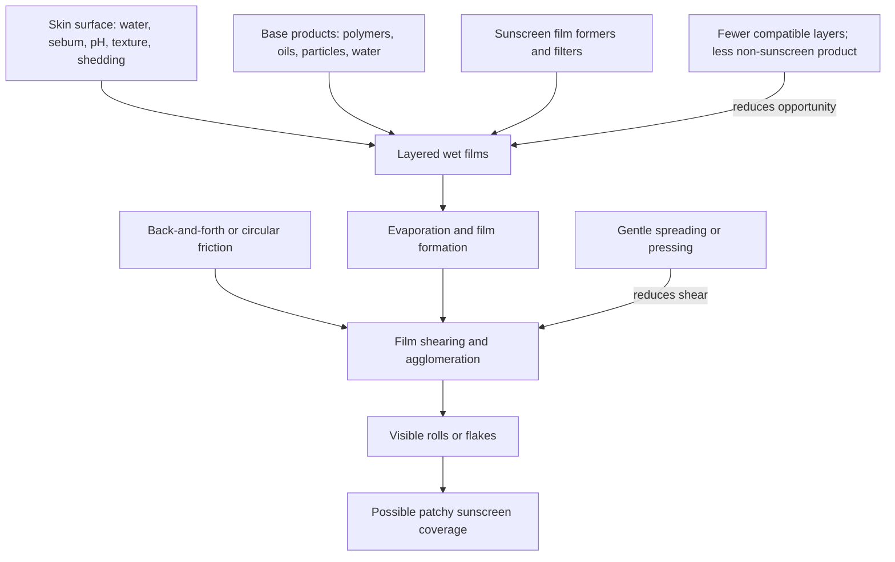

# Skincare pilling and film compatibility

Skincare pilling is the formation of visible rolls, flakes, or balls when a topical film breaks up and agglomerates during or after application. It is primarily a formulation–surface interaction, not a diagnostic sign that skin is peeling and not direct evidence that an active did or did not penetrate. The practical exception is sunscreen: because labeled protection depends on a sufficiently thick, continuous film, visible rolling or removal is a reason to suspect uneven coverage even though the cited study did not measure SPF after pilling. (@DrDrayzday (Dr Dray) — "Why Your Skincare Is Pilling (And How to Stop It)", 2026-08-18, [link](https://www.youtube.com/watch?v=NvJ3AIUW9X0))

## How a film pills

Pilling is not determined by one ingredient pair. Polymers, film formers, mineral particles, oils, water content, viscosity, drying time, amount, application force, and the wearer's skin state can all change whether adjacent layers remain continuous or roll together. This explains why the same pairing can pill for one person but not another and why an ingredient-list rule cannot reliably predict performance. (@DrDrayzday (Dr Dray) — "Why Your Skincare Is Pilling (And How to Stop It)", 2026-08-18, [link](https://www.youtube.com/watch?v=NvJ3AIUW9X0))

## What the observational study found

The source describes a study of 528 Chinese women aged 20–49, Fitzpatrick phototypes II–IV, all selected for a history of pilling. About 41% experienced pilling during the protocol. Researchers measured hydration, sebum, pH, texture, transepidermal water loss, and desquamation, then observed product, sunscreen, and foundation layering plus application technique. Roughly 80% of observed pilling events occurred when sunscreen was placed over a product base; lower hydration and sebum, higher pH, and smoother measured texture were associated with events, while linear rubbing produced the most events. These are within-sample associations, not universal causal rules, and the transcript does not supply the paper citation or adjusted effect estimates needed for claim-level appraisal. (@DrDrayzday (Dr Dray) — "Why Your Skincare Is Pilling (And How to Stop It)", 2026-08-18, [link](https://www.youtube.com/watch?v=NvJ3AIUW9X0))

Foundation appeared to reduce or resolve many observed sunscreen-pilling events, but protection was not measured and the mechanism was unknown. It may have changed hydration, adhesion, or secondary-film formation; it therefore cannot be treated as a repair protocol for disrupted sunscreen. Likewise, the study did not establish a universal waiting interval or identify a reproducible culprit ingredient. (@DrDrayzday (Dr Dray) — "Why Your Skincare Is Pilling (And How to Stop It)", 2026-08-18, [link](https://www.youtube.com/watch?v=NvJ3AIUW9X0))

## Practical implications

- When pilling recurs, change one variable at a time: first remove optional layers beneath sunscreen, then reduce the amount of non-sunscreen products, and test the pairing on ordinary mornings. Do not reduce sunscreen below its labeled application amount. **Evidence: limited observational evidence plus formulation-based expert interpretation.** (@DrDrayzday (Dr Dray) — "Why Your Skincare Is Pilling (And How to Stop It)", 2026-08-18, [link](https://www.youtube.com/watch?v=NvJ3AIUW9X0))
- Apply sunscreen as the final skincare layer with gentle spreading or pressing and minimal repeated rubbing; allow earlier layers to settle when practical, but no evidence-based waiting time is established. **Evidence: limited observational evidence for technique; expert interpretation for timing.** (@DrDrayzday (Dr Dray) — "Why Your Skincare Is Pilling (And How to Stop It)", 2026-08-18, [link](https://www.youtube.com/watch?v=NvJ3AIUW9X0))
- If sunscreen visibly balls up or leaves gaps, do not assume foundation restores the tested protection. Re-establish an even film or choose a tolerable product combination that can be applied at the proper amount. **Evidence: strong mechanistic rationale for film continuity; direct post-pilling protection data absent.**

## Gaps & open questions

- How much does visible pilling reduce measured SPF and UVA protection, and does the effect depend on where the material relocates?
- Which formulation properties predict compatibility across mineral, organic, and hybrid sunscreens?
- Do the observed skin-state associations replicate across ages, sexes, skin tones, climates, and people without a prior pilling history?
- Can a standardized wait time, application geometry, or foundation technique preserve protection while reducing pilling?

## Related

[[skincare-evidence-and-routine-design]] · [[photoprotection]] · [[mineral-and-organic-sunscreens]] · [[skin-barrier-and-moisturization]]
