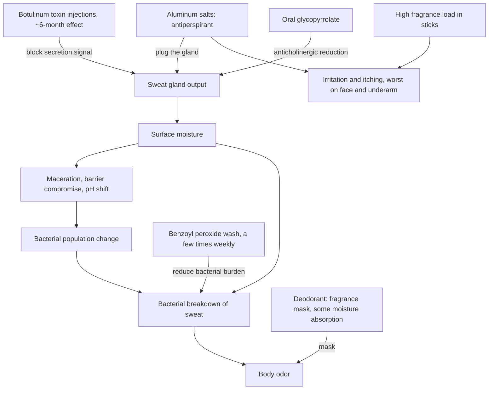

# Sweating, body odor, and antiperspirants

Sweat output and body odor are two linked but separable problems, and the consumer products addressing them work at different nodes. Odor arises when skin bacteria break down sweat on the surface; persistent moisture also macerates skin — especially under the arms — compromising barrier integrity, shifting surface pH, and influencing the bacterial population, which itself contributes to odor. Antiperspirants act upstream: their active ingredients are aluminum salts that physically plug the sweat gland and cut down sweat outflow. Deodorants act downstream: they are essentially solid perfumes — sticks and gels that mostly mask odor — and some additionally absorb moisture, which supports the barrier and indirectly reduces odor. Marketing blurs the categories because many products are antiperspirant–deodorant hybrids sold under the everyday word deodorant, but the functional distinction determines what a switch can and cannot fix. (@DrDrayzday (Dr Dray) — "Can Adapalene Cause Facial Fat Loss? Dermatologist Q&A", 2026-08-23, [link](https://www.youtube.com/watch?v=DprHVOUpvaM))

## Irritation and the "natural" label

There is nothing more natural about a natural deodorant than a conventional one; the word carries no compositional meaning. When a product itches, the plausible culprits are the aluminum salts (in antiperspirants) and fragrance — sticks carry a high fragrance concentration, underarm skin is inclined to irritation, and fragrance is a culprit in both deodorants and antiperspirants. Fragrance-free options in this category are genuinely hard to find; Lume is named as one maker of a fragrance-free deodorant that absorbs excess moisture and is itself somewhat moisturizing. Potassium alum crystal deodorants are anecdotally tolerated by some people who react to standard aluminum salts, but there is no good evidence they reduce sweat as effectively, and irritation to alum is also reported — so the crystal is a trial option, not a guaranteed better alternative. (@DrDrayzday (Dr Dray) — "Can Adapalene Cause Facial Fat Loss? Dermatologist Q&A", 2026-08-23, [link](https://www.youtube.com/watch?v=DprHVOUpvaM))

## Face, scalp, and escalation options

Antiperspirants formulated for the face and scalp exist, but aluminum salts are irritating at baseline and more so on the face, which limits tolerability. When sweating is burdensome and topicals fail or irritate, two clinician-directed options act on gland output directly: botulinum toxin injections (scalp or underarms — painful under the arms, but one treatment buys roughly six months of reduced sweating), and oral glycopyrrolate, an anticholinergic that reduces sweat output at the cost of dose-dependent dry mouth. A complementary odor strategy is washing the underarms with a benzoyl peroxide acne wash a couple of times weekly to cut the bacterial burden that breaks down sweat. Diagnosed hyperhidrosis warrants dermatologic evaluation rather than escalating consumer products. (@DrDrayzday (Dr Dray) — "Can Adapalene Cause Facial Fat Loss? Dermatologist Q&A", 2026-08-23, [link](https://www.youtube.com/watch?v=DprHVOUpvaM))

## Practical implications

- **Match the product to the complaint: aluminum-salt antiperspirant for wetness, deodorant for odor, both only if both are problems — moderate; mechanism-based product taxonomy from an expert source.** (@DrDrayzday (Dr Dray) — "Can Adapalene Cause Facial Fat Loss? Dermatologist Q&A", 2026-08-23, [link](https://www.youtube.com/watch?v=DprHVOUpvaM))
- **If a product causes itching: switch to a fragrance-free formulation before abandoning the category, since fragrance and aluminum are the two leading irritants — moderate.** A potassium alum crystal is a reasonable trial with weaker sweat-reduction evidence. (@DrDrayzday (Dr Dray) — "Can Adapalene Cause Facial Fat Loss? Dermatologist Q&A", 2026-08-23, [link](https://www.youtube.com/watch?v=DprHVOUpvaM))
- **For odor control resistant to deodorant: wash the underarms with a benzoyl peroxide acne wash a couple of times weekly — limited; source-described practice with a plausible antibacterial mechanism.** Expect fabric bleaching from benzoyl peroxide residue. (@DrDrayzday (Dr Dray) — "Can Adapalene Cause Facial Fat Loss? Dermatologist Q&A", 2026-08-23, [link](https://www.youtube.com/watch?v=DprHVOUpvaM))
- **For burdensome facial, scalp, or underarm sweating that topicals cannot control: discuss botulinum toxin (about six months per treatment) or oral glycopyrrolate with a dermatologist — moderate; established clinical options requiring individualized prescribing.** (@DrDrayzday (Dr Dray) — "Can Adapalene Cause Facial Fat Loss? Dermatologist Q&A", 2026-08-23, [link](https://www.youtube.com/watch?v=DprHVOUpvaM))

## Gaps & open questions

- How much odor reduction do moisture-absorbing deodorants achieve compared with masking-only formulas in controlled comparisons?
- Does potassium alum measurably reduce sweat output, and how does its irritation rate compare with standard aluminum salts?
- What benzoyl peroxide wash frequency balances odor-relevant bacterial reduction against underarm barrier irritation?
- How do the long-term tolerability and adherence of facial/scalp antiperspirants compare with periodic botulinum toxin for craniofacial sweating?

## Related

[[skin-barrier-and-moisturization]] · [[skincare-evidence-and-routine-design]] · [[cosmetic-product-safety-and-regulatory-gaps]] · [[dr-dray]]
