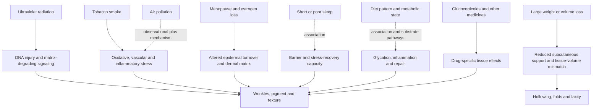

# Systemic modifiers of visible aging

Visible aging is not produced by skincare alone. Ultraviolet radiation, tobacco smoke, air pollution, endocrine transitions, sleep, diet, body-weight change, metabolic disease, and medications can alter the skin or the deeper tissues that support it. These exposures do not have equal evidence: a randomized sunscreen trial supports prevention of photoaging, whereas most claims about sleep, diet, pollution, or “beauty supplements” come from cross-sectional associations, short trials of intermediate skin measurements, or mechanistic studies.[^hughes-2013][^wong-2021]

The correct causal question is not whether an exposure can influence collagen or oxidative signaling. It is whether changing that exposure produces a visible, patient-important benefit, in which population, over what time, and with what trade-offs. [[visible-skin-and-facial-aging]] provides the compartment anatomy and [[visible-aging-outcomes-and-evidence]] explains how to judge the endpoints.

## Exposures with the strongest causal evidence

### Ultraviolet radiation

Solar and artificial ultraviolet radiation injure epidermal DNA, alter pigment, generate oxidative signaling, and increase dermal matrix degradation. WHO identifies premature skin aging as an established UV effect. More importantly, prevention has randomized evidence: in 903 Australian adults younger than 55 years, daily broad-spectrum sunscreen over 4.5 years produced 24% less progression on blinded hand-skin microtopography than discretionary use (relative odds 0.76, 95% CI 0.59–0.98). Beta-carotene supplementation in the same trial had no overall effect.[^who-uv-2022][^hughes-2013]

This trial establishes prevention of additional photoaging in a sunny Australian setting; it does not show reversal of established wrinkles, equivalence among all sunscreen films, or protection of deeper facial volume. Shade, clothing, and correct sunscreen use remain the highest-confidence appearance-preserving intervention because they also reduce a carcinogenic exposure ([[photoprotection]], [[skin-cancer-risk-and-immune-surveillance]]).

### Tobacco smoke

A systematic review and meta-analysis of epidemiologic studies identified smoking, cumulative sun exposure, air pollution, and nutrition among the recurring correlates of visible skin-aging phenotypes. Smoking showed a dose–response relationship with wrinkling across pack-year categories, which strengthens causal inference, but the contributing studies were observational and varied in phenotype definitions and adjustment.[^wong-2021] Tobacco avoidance is nevertheless a strong recommendation because the skin signal is coherent with vascular and connective-tissue mechanisms and because causal cardiopulmonary and cancer harms independently justify cessation. Stopping smoking should be presented as disease prevention with a plausible skin benefit, not as a proven wrinkle-reversal treatment.

## Modifiers supported mainly by human associations or intermediate endpoints

### Air pollution

Fine particles carry redox-active chemicals and can activate inflammatory and aryl-hydrocarbon-receptor pathways in skin. A 2026 systematic review and meta-analysis found only four independent cohorts with extractable long-term PM2.5 exposure and clinical aging outcomes; the direction was more consistent for pigmentary changes than for wrinkles, and the authors characterized the synthesis as hypothesis-generating because cohorts, exposure models, and phenotypes were sparse and heterogeneous.[^tjiu-2026] Pollution reduction is justified for cardiovascular and respiratory health, but no trial shows that a mask, cleanser, topical antioxidant, or home air filter prevents visible aging. Source control and broader air-quality measures therefore outrank “anti-pollution” cosmetics ([[environmental-pollution-and-health]], [[indoor-air-quality]]).

### Menopause and estrogen loss

Skin expresses estrogen receptors, and the menopausal transition coincides with changes in collagen, thickness, hydration, wound repair, and mechanical properties. A 2023 systematic review and meta-analysis of 15 studies involving 1,589 menopausal women reported improvements with oral or transdermal menopausal hormone therapy in elasticity, thickness, and collagen content, but not dryness; the studies were heterogeneous, many were small or old, and most endpoints were tissue or instrument measures rather than blinded visible benefit.[^pivazyan-2023]

This evidence supports estrogen loss as a modifier of skin physiology but not hormone therapy as cosmetic treatment. Systemic MHT should be chosen for established menopausal indications after individualized benefit–risk review, not initiated to treat wrinkles. Compounded facial estrogen and repurposed vaginal products have additional dose, absorption, endometrial, breast, pigment, and long-term safety uncertainties ([[menopause-hormone-therapy]], [[topical-estrogen-for-skin-aging]]).

### Sleep

In a cross-sectional study of 60 healthy White women, those classified as poor sleepers by questionnaire and sleep duration had higher intrinsic-aging scores, higher baseline transepidermal water loss, and slower recovery after tape stripping and simulated UV exposure; barrier recovery at 72 hours was 30% greater in the good-sleeper group.[^oyetakin-white-2015] This is a small association study, not a sleep-extension trial. It cannot distinguish sleep effects from stress, health behavior, socioeconomic factors, or reverse causation, and it does not prove that adding sleep removes wrinkles. Adequate sleep remains worthwhile for health and may support barrier recovery, but appearance is not a validated reason to prescribe a specific sleep duration ([[sleep-quality-and-circadian-alignment]]).

### Nutrition, supplements, and metabolic health

In 2,753 older Rotterdam Study participants, better adherence to Dutch dietary guidance and a fruit-dominant pattern were associated with fewer digitally measured facial wrinkles in women, while a red-meat-and-snack pattern was associated with more; associations were not the same in men, and the cross-sectional design could not separate diet from other health behaviors.[^mekic-2019] Protein, vitamin C, essential fatty acids, zinc, and other nutrients are required for normal tissue maintenance, so correcting deficiency is distinct from supplementing an already adequate diet. Diabetes, insulin resistance, and chronic hyperglycemia plausibly worsen glycation, inflammation, microvascular function, infection risk, and wound repair, but improving glucose for health should not be sold as a proven facial-rejuvenation intervention ([[advanced-glycation-end-products]], [[nutrition-evidence-and-personalization]]).

Oral collagen illustrates why biomarker plausibility and pooled statistical significance are insufficient. A 2025 meta-analysis of 23 randomized trials with 1,474 participants found favorable pooled hydration, elasticity, and wrinkle results overall, but no effect in non-pharmaceutical-funded studies and no significant benefit in high-quality studies; the authors concluded that current clinical evidence does not support collagen supplements to prevent or treat skin aging.[^myung-2025] Products, doses, co-ingredients, instruments, short duration, and sponsor dependence limit external validity. No oral antioxidant or collagen protocol belongs in routine anti-aging care on this evidence.

## Weight change, tissue support, and the weight-cycling distinction

Large loss of fat volume can reveal hollows, folds, and laxity because the skin envelope and retaining structures no longer cover the same volume. In a small observational histology study comparing abdominal skin from 20 post-bariatric massive-weight-loss patients with 20 patients with severe obesity, the weight-loss group had fewer thick organized collagen fibers and more thin, loosely arranged fibers; the design cannot determine how much was caused by obesity, surgery, nutritional change, weight-loss rate, or selection for body-contouring surgery.[^rocha-2021]

This supports tissue-volume mismatch and altered skin structure after massive weight loss, not the claim that GLP-1 medicines directly “age” skin. The same visual change can follow surgical or nonsurgical loss, and cardiovascular or metabolic benefits may greatly outweigh appearance effects. Evidence that repeated weight cycling independently accelerates human skin aging is insufficient; do not turn that hypothesis into advice to avoid medically indicated weight reduction. During intentional loss, preserve adequate nutrition and resistance training, and discuss the likely appearance trade-off when loss is large or rapid ([[post-weight-loss-skin-laxity]], [[glp-1-receptor-agonists]]).

## Medications and disease are specific, not one category

Long-term or high-potency topical glucocorticoids can cause local epidermal and dermal atrophy, telangiectasia, bruising, striae, and fragility by suppressing cell proliferation and matrix synthesis; risk depends on potency, site, occlusion, duration, age, and exposure. Systemic glucocorticoids can add broader connective-tissue and metabolic effects.[^niculet-2020] This is a medication adverse effect, not ordinary chronological aging, and it should be managed by diagnosis, correct potency and duration, and prescriber review—not abrupt discontinuation of necessary therapy.

Other medications affect appearance through distinct routes: anticoagulants can make bruising more visible without aging collagen; photosensitizing drugs can amplify UV injury; and treatments that cause major weight loss can expose pre-existing support changes. A medication list should be reviewed for the actual adverse effect and indication rather than labeling all visible change “accelerated aging” ([[actinic-purpura-and-aging-skin-fragility]], [[cutaneous-signs-of-systemic-disease]]).

## Evidence conflicts and limitations

Visible-aging research is unusually vulnerable to confounding. Age, ancestry, sex, cumulative UV, smoking, occupation, income, skincare, weight history, and health behavior cluster together. Cross-sectional facial photographs cannot prove which exposure produced a phenotype, and instrument changes in hydration, elasticity, collagen density, or pigmentation may be statistically detectable without being visible or important to patients.[^wong-2021]

Commercial incentives are also concentrated in short supplement and cosmetic trials. The oral-collagen literature changes conclusion when funding source and study quality are considered, while systemic MHT studies show physiological changes without establishing a favorable cosmetic benefit–risk trade-off.[^myung-2025][^pivazyan-2023]

## Practical implications

- **Avoid tobacco and protect skin from cumulative UV—strong.** These actions have the best causal case and major non-cosmetic health benefits; daily sunscreen reduced photoaging progression in one randomized community trial, while smoking evidence is observational but dose-responsive and biologically coherent.[^hughes-2013][^wong-2021]
- **Treat sleep, diet quality, metabolic health, and pollution exposure as whole-health foundations with possible skin benefits—moderate for general health, low for visible rejuvenation.** Do not promise wrinkle reversal from sleep extension, a fruit-rich diet, a purifier, or glucose improvement because intervention trials on visible outcomes are absent or inadequate.[^tjiu-2026][^oyetakin-white-2015][^mekic-2019]
- **Do not start systemic hormones, compounded facial hormones, collagen, beta-carotene, or antioxidant supplements solely for visible aging—strong evidence boundary.** MHT decisions belong to menopausal indications and safety review; higher-quality collagen analyses and the beta-carotene randomized comparison do not establish cosmetic benefit.[^pivazyan-2023][^myung-2025][^hughes-2013]
- **During large intentional weight loss, anticipate support-volume change without blaming a specific drug—moderate anatomical evidence, limited causal evidence.** Preserve nutrition and muscle, prioritize the health indication, and reassess after weight stabilizes before deciding on structural treatment.[^rocha-2021]
- **Review suspected medication-related skin change with the prescriber—strong for drug-specific safety.** Potent or prolonged glucocorticoid exposure is a recognized atrophy risk; do not stop necessary medication abruptly.[^niculet-2020]

## Gaps & open questions

- Do sleep improvement, smoking cessation, pollution reduction, or metabolic treatment change blinded, patient-important visible-aging outcomes over years?
- How much of the menopausal skin trajectory is attributable to estrogen loss versus chronological aging, UV history, and body-composition change?
- Which pollution constituents matter independently of UV and socioeconomic confounding, and can exposure reduction prevent pigment or wrinkle progression?
- Does weight-loss rate independently affect long-term laxity after accounting for total loss, age, obesity duration, nutrition, and baseline tissue quality?
- Can independently funded, adequately blinded supplement trials reproduce a visible benefit that exceeds normal measurement variation?

## References

[^hughes-2013]: Hughes MCB, Williams GM, Baker P, Green AC. “Sunscreen and Prevention of Skin Aging: A Randomized Trial.” *Annals of Internal Medicine*, 2013. [RCT]. [doi:10.7326/0003-4819-158-11-201306040-00002](https://doi.org/10.7326/0003-4819-158-11-201306040-00002)
[^wong-2021]: Wong QYA, Chew FT. “Defining Skin Aging and Its Risk Factors: A Systematic Review and Meta-analysis.” *Scientific Reports*, 2021. [systematic review and meta-analysis of observational studies]. [doi:10.1038/s41598-021-01573-z](https://doi.org/10.1038/s41598-021-01573-z)
[^who-uv-2022]: World Health Organization. “Ultraviolet Radiation.” 2022. [authoritative public-health fact sheet]. [WHO fact sheet](https://www.who.int/news-room/fact-sheets/detail/ultraviolet-radiation)
[^tjiu-2026]: Tjiu JW, Lu CF. “Long-Term PM2.5 Exposure and Clinical Skin Aging: A Systematic Review and Meta-Analysis of Pigmentary and Wrinkle Outcomes.” *Life*, 2026. [systematic review and meta-analysis of observational cohorts]. [doi:10.3390/life16010061](https://doi.org/10.3390/life16010061)
[^pivazyan-2023]: Pivazyan L, Avetisyan J, Loshkareva M, Abdurakhmanova A. “Skin Rejuvenation in Women Using Menopausal Hormone Therapy: A Systematic Review and Meta-Analysis.” *Journal of Menopausal Medicine*, 2023. [systematic review and meta-analysis]. [PubMed PMID: 38230593](https://pubmed.ncbi.nlm.nih.gov/38230593/)
[^oyetakin-white-2015]: Oyetakin-White P, Suggs A, Koo B, Matsui MS, Yarosh D, Cooper KD, Baron ED. “Does Poor Sleep Quality Affect Skin Ageing?” *Clinical and Experimental Dermatology*, 2015. [cross-sectional human study with barrier challenge]. [PubMed PMID: 25266053](https://pubmed.ncbi.nlm.nih.gov/25266053/)
[^mekic-2019]: Mekić S, Jacobs LC, Hamer MA, et al. “A Healthy Diet in Women Is Associated With Less Facial Wrinkles in a Large Dutch Population-Based Cohort.” *Journal of the American Academy of Dermatology*, 2019. [cross-sectional population study]. [PubMed PMID: 29601935](https://pubmed.ncbi.nlm.nih.gov/29601935/)
[^myung-2025]: Myung SK, Park Y. “Effects of Collagen Supplements on Skin Aging: A Systematic Review and Meta-Analysis of Randomized Controlled Trials.” *American Journal of Medicine*, 2025. [systematic review and meta-analysis of RCTs]. [PubMed PMID: 40324552](https://pubmed.ncbi.nlm.nih.gov/40324552/)
[^rocha-2021]: Rocha RI, Cintra Junior W, Modolin MLA, Takahashi GG, Caldini ETEG, Gemperli R. “Skin Changes Due to Massive Weight Loss: Histological Changes and the Causes of the Limited Results of Contouring Surgeries.” *Obesity Surgery*, 2021. [cross-sectional human histology study]. [PubMed PMID: 33145720](https://pubmed.ncbi.nlm.nih.gov/33145720/)
[^niculet-2020]: Niculet E, Bobeica C, Tatu AL. “Glucocorticoid-Induced Skin Atrophy: The Old and the New.” *Clinical, Cosmetic and Investigational Dermatology*, 2020. [narrative review of clinical and mechanistic evidence]. [PubMed PMID: 33408495](https://pubmed.ncbi.nlm.nih.gov/33408495/)

## Related

[[visible-skin-and-facial-aging]] · [[visible-aging-outcomes-and-evidence]] · [[photoprotection]] · [[post-weight-loss-skin-laxity]] · [[topical-estrogen-for-skin-aging]] · [[advanced-glycation-end-products]] · [[environmental-pollution-and-health]] · [[sleep-quality-and-circadian-alignment]] · [[nutrition-evidence-and-personalization]] · [[aging-model]] · [[practice-playbook]]
