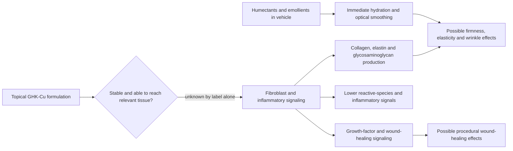

# Topical copper peptides

Copper peptides are short amino-acid chains complexed with copper; the best-known cosmetic example is glycyl-L-histidyl-L-lysine copper (GHK-Cu, commonly labeled copper tripeptide-1). Copper is a cofactor for enzymes involved in extracellular-matrix maintenance, while the peptide can bind and deliver the ion. This biochemical role makes GHK-Cu a plausible repair signal, but plausibility is not equivalent to clinically meaningful penetration or skin rejuvenation from a finished serum. (@DrDrayzday (Dr Dray) — "Do Copper Peptides Really Work? Dermatologist Reviews the Science", 2026-08-03, [link](https://www.youtube.com/watch?v=--tBqDNB-LY))

## Proposed mechanism and evidence boundary

Cell and small-animal studies report fibroblast stimulation, extracellular-matrix synthesis, altered growth-factor signaling, antioxidant effects, and faster wound healing. These models establish possible pathways, not cosmetic benefit in humans. Small human studies over roughly 12 weeks have reported improved firmness, elasticity, wrinkle depth, or healing after dermatologic procedures versus a vehicle, but the evidence base is short, sometimes manufacturer-sponsored, and often tests multi-ingredient formulas. It therefore cannot reliably separate a GHK-Cu effect from moisturization, co-actives, or bias. (@DrDrayzday (Dr Dray) — "Do Copper Peptides Really Work? Dermatologist Reviews the Science", 2026-08-03, [link](https://www.youtube.com/watch?v=--tBqDNB-LY))

Humectants such as glycerin, hyaluronic acid, and polyglutamic acid can rapidly increase stratum-corneum water content, making dehydration lines look shallower and skin feel smoother. That reversible optical and mechanical effect should not be mistaken for new dermal collagen. Likewise, peptide mechanisms borrowed from injection, wound care, or cell culture do not establish the effectiveness or long-term safety of topical cosmetic use; injectable GHK-Cu has still less applicable human safety evidence and should not be inferred safe from serum use. (@DrDrayzday (Dr Dray) — "Do Copper Peptides Really Work? Dermatologist Reviews the Science", 2026-08-03, [link](https://www.youtube.com/watch?v=--tBqDNB-LY))

## Formulation, combinations, and attribution

The finished product controls stability, delivery, sensory feel, and tolerability. Added peptides such as palmitoyl tripeptide-5 or acetyl hexapeptide-8 have laboratory or small cosmetic studies behind them, but the latter's marketing analogy to botulinum toxin is mechanistically misleading because ordinary topical delivery has not been shown to reach the neuromuscular junction. Antioxidant enzymes such as superoxide dismutase are also condition-dependent: their presence on an ingredient list does not prove retained activity in the bottle or skin. (@DrDrayzday (Dr Dray) — "Do Copper Peptides Really Work? Dermatologist Reviews the Science", 2026-08-03, [link](https://www.youtube.com/watch?v=--tBqDNB-LY))

Warnings that copper peptides must never be combined with ascorbic acid, exfoliating acids, or [[topical-retinoids]] are largely theoretical rather than supported by outcome evidence. Cosmetic formulators who make copper-peptide serums report that the formulations are stabilized and are not compromised or degraded when applied alongside other skincare regardless of ingredient, and say they do not understand how the incompatibility claim became widespread; the copper-destabilizes-ascorbic-acid argument makes sense on paper but does not bear out in real-world use on skin. Brand-specific do-not-combine lists (The Ordinary's, for example) are best read as attempts to limit cumulative irritation rather than as evidence of chemical incompatibility. Layering may still fail because the combined routine irritates or pills, and separating products is a reasonable preference when uncertainty or sensitivity matters. (@DrDrayzday (Dr Dray) — "Can Adapalene Really Prevent Wrinkles? Dermatologist Q&A", 2026-08-15, [link](https://www.youtube.com/watch?v=l30kQh-VdwI)) A single-user stop–rechallenge report of immediate tightness from one multi-ingredient copper serum illustrates product-specific intolerance, not a class effect of GHK-Cu. (@DrDrayzday (Dr Dray) — "Do Copper Peptides Really Work? Dermatologist Reviews the Science", 2026-08-03, [link](https://www.youtube.com/watch?v=--tBqDNB-LY))

Injectable use is a separate and much riskier proposition. GHK-Cu is being heavily promoted as an injectable anti-aging treatment — not injected into skin but into the body, with the hope of systemic collagen production — on the strength of a claim ("anti-aging") that is nonspecific by construction. There is no evidence that injecting copper peptide into the body produces any long-term human health benefit, and the pharmacology cuts against casual use: the body tightly regulates copper, and excess copper can be actively harmful. Topical evidence for hair growth exists but is limited, and it does not transfer to injection. The safe-use boundary for injectable peptides generally — clinician-prescribed, regulated medications versus an unregulated market with purity and contamination hazards — is developed at [[experimental-peptides]] and [[topical-peptides]]. (@DrDrayzday (Dr Dray) — "Peptides for Skin: Which Ones Actually Work? Dermatologist Explains", 2026-08-20, [link](https://www.youtube.com/watch?v=bQvrFrhUets))

Copper participates in tyrosinase biology, but that biochemical connection does not show that a topical copper peptide competes with the enzyme or lightens human hyperpigmentation. Dr Dray's evidence-ranked position is that copper peptides are not a reliable pigment treatment and that formulated vitamin C has the stronger, though still formulation-dependent, clinical case. This is a comparative expert appraisal rather than a head-to-head trial. [[hyperpigmentation-and-dark-spots]] (@DrDrayzday (Dr Dray) — "Are Copper Peptides Better Than Vitamin C? Dermatologist Explain", 2026-08-01, [link](https://www.youtube.com/watch?v=YuHLRmJMUzI))

## Practical implications

- **Daily: prioritize moisturizer, [[photoprotection]], and a concern-specific established treatment before a copper-peptide serum — moderate-to-strong evidence hierarchy.** Copper peptides are optional, not a foundational anti-aging treatment.
- **If choosing a topical product: introduce one formula at the labeled cadence and judge tolerability and appearance over about 12 weeks — limited evidence.** Do not interpret immediate plumping as structural remodeling, and stop if persistent dryness, burning, redness, or itch appears.
- **When layering: use a simple texture-based order and combine only what the skin tolerates — limited evidence.** There is no established need to segregate copper peptides from vitamin C, acids, or retinoids, but there is also no demonstrated incremental benefit from a crowded routine. (@DrDrayzday (Dr Dray) — "Do Copper Peptides Really Work? Dermatologist Reviews the Science", 2026-08-03, [link](https://www.youtube.com/watch?v=--tBqDNB-LY))
- **Do not inject cosmetic GHK-Cu for anti-aging outside a properly governed clinical context — strong precaution, limited direct safety data.** Topical tolerability cannot establish systemic sterility, dose, efficacy, or safety, and copper homeostasis makes systemic copper loading a plausible harm in its own right. (@DrDrayzday (Dr Dray) — "Do Copper Peptides Really Work? Dermatologist Reviews the Science", 2026-08-03, [link](https://www.youtube.com/watch?v=--tBqDNB-LY)) (@DrDrayzday (Dr Dray) — "Peptides for Skin: Which Ones Actually Work? Dermatologist Explains", 2026-08-20, [link](https://www.youtube.com/watch?v=bQvrFrhUets))

## Gaps & open questions

- Do independent, adequately powered trials of standardized topical GHK-Cu show durable patient-important benefit beyond the vehicle?
- What concentration, vehicle, skin exposure, and tissue penetration are required for a biological effect?
- Which reported benefits persist after hydration and optical smoothing are controlled?
- What are the long-term sensitization and safety profiles of repeated topical use, and how do they differ from injected exposure?

## Related

[[topical-peptides]] · [[experimental-peptides]] · [[skincare-evidence-and-routine-design]] · [[skin-barrier-and-moisturization]] · [[topical-retinoids]] · [[photoprotection]] · [[procedural-skin-remodeling]] · [[hyperpigmentation-and-dark-spots]]
