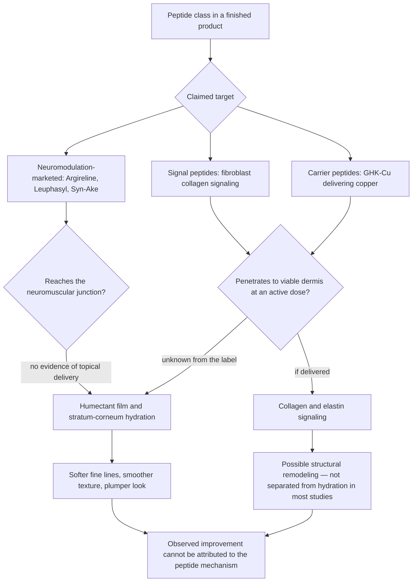

# Topical peptides

Peptides are short chains of amino acids — small fragments of protein. In skin biology, different peptides do entirely different jobs: some act as signaling molecules that tell fibroblasts to produce collagen and other structural components, some participate in wound healing, and some influence pigmentation pathways. "Peptide" is therefore a chemical class, not an ingredient, and asking whether peptides work is as underspecified as asking whether medications work; the answer depends on the specific molecule, its intended target, and whether a finished cosmetic can deliver it there. (@DrDrayzday (Dr Dray) — "Peptides for Skin: Which Ones Actually Work? Dermatologist Explains", 2026-08-20, [link](https://www.youtube.com/watch?v=bQvrFrhUets))

## The delivery problem and what studies actually show

The central constraint on every topical peptide claim is penetration. Many peptides are large molecules, and the stratum corneum is structured to keep large molecules out; cosmetic chemists have formulation strategies to improve delivery, but no industry requirement obliges a brand to demonstrate that its peptide product reaches viable skin, and labels do not disclose how much peptide is present relative to the amounts used in studies. A consumer therefore has no way to distinguish a well-delivered peptide formula from a pleasant moisturizer carrying an inert marketing ingredient, and a reviewer's favorable experience with one product cannot resolve that ambiguity either. (@DrDrayzday (Dr Dray) — "Peptides for Skin: Which Ones Actually Work? Dermatologist Explains", 2026-08-20, [link](https://www.youtube.com/watch?v=bQvrFrhUets))

Where human studies exist, the improvements are modest — smoother texture, slightly diminished wrinkles, softer fine lines, perhaps some firmness — and the studies generally cannot say whether the effect exceeds that of a comparable humectant, because collagen change is rarely measured directly. Hydration alone makes dehydration lines shallower within days through water content and light scattering, so a before-and-after wrinkle photograph is compatible with pure moisturization. This attribution gap recurs across the class and is the reason a peptide's presence should not decide a purchase. (@DrDrayzday (Dr Dray) — "Peptides for Skin: Which Ones Actually Work? Dermatologist Explains", 2026-08-20, [link](https://www.youtube.com/watch?v=bQvrFrhUets)) (@DrDrayzday (Dr Dray) — "REMEDY Hydrating Serum Review: Does It Actually Work?", 2026-08-19, [link](https://www.youtube.com/watch?v=VLH7oQHDBk0))

## The main marketed peptides

**Collagen-signaling (matrikine) peptides.** Matrixyl (palmitoyl pentapeptide-4) mimics a collagen fragment and acts as a signaling molecule; human studies report improved wrinkle appearance, but the delivered dose in any given product is unknown and the moisturization confound is unresolved. Matrixyl 3000 combines two peptides — one directed at inflammation that degrades collagen, one at stimulating collagen production. Sepilift DPHP mimics hydroxyproline, an amino acid characteristic of collagen structure, with more limited human evidence. Palmitoyl tripeptide-5 is a common anti-aging formulation peptide whose supporting research is largely industry-conducted cell work plus small human applications with appearance endpoints that do not measure collagen. These are reasonable supporting ingredients, most plausibly acting through moisture retention. (@DrDrayzday (Dr Dray) — "Peptides for Skin: Which Ones Actually Work? Dermatologist Explains", 2026-08-20, [link](https://www.youtube.com/watch?v=bQvrFrhUets)) (@DrDrayzday (Dr Dray) — "REMEDY Hydrating Serum Review: Does It Actually Work?", 2026-08-19, [link](https://www.youtube.com/watch?v=VLH7oQHDBk0))

**Carrier peptides.** GHK-Cu binds and delivers copper, a cofactor for matrix-maintaining enzymes; it has the longest study history of the cosmetic peptides, particularly for wound healing, with small topical studies reporting improvements in wrinkling, elasticity, and firmness — the fuller mechanism, formulation, and safety picture is at [[topical-copper-peptides]]. (@DrDrayzday (Dr Dray) — "Peptides for Skin: Which Ones Actually Work? Dermatologist Explains", 2026-08-20, [link](https://www.youtube.com/watch?v=bQvrFrhUets))

**Neuromodulation-marketed peptides.** Acetyl hexapeptide-8 (Argireline) is sold as "Botox in a bottle" on the theory that it relaxes dynamic wrinkles by influencing signaling at the neuromuscular junction. Topically applied peptides have not been shown to reach the neuromuscular junction, so the analogy is mechanistically misleading; there is some evidence of improved eye-area wrinkle appearance with repeated use, most plausibly a hydration effect. Leuphasyl and Syn-Ake carry considerably less evidence still, essentially manufacturer studies without independent blinded peer review — research produced by parties motivated to sell the ingredient. (@DrDrayzday (Dr Dray) — "Peptides for Skin: Which Ones Actually Work? Dermatologist Explains", 2026-08-20, [link](https://www.youtube.com/watch?v=bQvrFrhUets)) (@DrDrayzday (Dr Dray) — "REMEDY Hydrating Serum Review: Does It Actually Work?", 2026-08-19, [link](https://www.youtube.com/watch?v=VLH7oQHDBk0))

**Newer laboratory-stage peptides.** Aquatide, a synthetic peptide marketed as stimulating autophagy and encouraging skin cells to make barrier lipids, and nonapeptide-1, marketed for hyperpigmentation, illustrate the frontier: interesting laboratory findings that do not necessarily translate into any measurable change in skin from a finished product. (@DrDrayzday (Dr Dray) — "Dermatologist’s TOP Korean Skincare Picks | What’s Actually Worth It?", 2026-08-21, [link](https://www.youtube.com/watch?v=7x1UCXXw6GU))

## Boundary with injectable peptides

Peptides as medications unambiguously can work — insulin and the GLP-1 receptor agonists are peptide drugs — but that fact is being borrowed to market unapproved injectable peptides (BPC-157, TB-500, MOTS-c, humanin, epithalon) whose human evidence, purity, and oversight are absent; that market, its regulatory status, and its contamination hazards are covered at [[experimental-peptides]]. The dermatologic point of contact is risk asymmetry: topical peptides are innocuous apart from ordinary irritation potential, while unregulated injectables carry contamination and quality risks that topicals do not — Dr Dray's illustrative parallel is levamisole-contaminated cocaine, which triggers disfiguring vasculitis with skin necrosis in some users, as a demonstration of what an uncontrolled injected supply chain can do. Injectable GHK-Cu promoted for nonspecific anti-aging has no evidence of long-term human benefit, and the body's tight copper regulation means excess copper can be actively harmful. (@DrDrayzday (Dr Dray) — "Peptides for Skin: Which Ones Actually Work? Dermatologist Explains", 2026-08-20, [link](https://www.youtube.com/watch?v=bQvrFrhUets))

## Practical implications

- **Daily: keep sunscreen and, where indicated, a topical retinoid as the anti-aging core — strong; that is where the human evidence is.** No peptide has evidence that would justify displacing either, and peptides are not treatments for any skin disease. (@DrDrayzday (Dr Dray) — "Peptides for Skin: Which Ones Actually Work? Dermatologist Explains", 2026-08-20, [link](https://www.youtube.com/watch?v=bQvrFrhUets)) [[photoprotection]] [[topical-retinoids]]
- **When a tolerated product happens to contain peptides: use it without concern — moderate for safety; limited for benefit.** Topical peptides are generally innocuous; irritation is possible with any topical and should prompt stopping. (@DrDrayzday (Dr Dray) — "Peptides for Skin: Which Ones Actually Work? Dermatologist Explains", 2026-08-20, [link](https://www.youtube.com/watch?v=bQvrFrhUets))
- **At purchase: do not pay a premium for a product because it lists peptides, especially on a constrained budget — moderate evidence-appraisal guidance.** If choosing among peptides, Matrixyl, Matrixyl 3000, GHK-Cu, and Argireline have the longest track records, which is a statement about familiarity more than proof. (@DrDrayzday (Dr Dray) — "Peptides for Skin: Which Ones Actually Work? Dermatologist Explains", 2026-08-20, [link](https://www.youtube.com/watch?v=bQvrFrhUets))
- **Judge results against the hydration baseline: reassess after several weeks and attribute softer fine lines to moisturization unless something more is demonstrated — moderate.** (@DrDrayzday (Dr Dray) — "REMEDY Hydrating Serum Review: Does It Actually Work?", 2026-08-19, [link](https://www.youtube.com/watch?v=VLH7oQHDBk0))
- **Do not inject cosmetic or gray-market peptides for anti-aging — strong precaution.** Safely usable injectable peptides are doctor-prescribed medications under clinical oversight; see [[experimental-peptides]] for the full safety and regulatory picture. (@DrDrayzday (Dr Dray) — "Peptides for Skin: Which Ones Actually Work? Dermatologist Explains", 2026-08-20, [link](https://www.youtube.com/watch?v=bQvrFrhUets))

## Gaps & open questions

- How much of any marketed peptide penetrates to viable epidermis or dermis from a finished cosmetic, and at what applied concentration?
- Do any signal-peptide products improve wrinkles or firmness beyond a matched humectant vehicle in independent, blinded trials with objective collagen or ultrastructural endpoints?
- What fraction of products carrying studied peptides contain them at study-comparable concentrations?
- Does repeated Argireline use produce any effect distinguishable from hydration around the eyes, and by what mechanism if so?
- Do autophagy-marketed peptides such as aquatide produce any measurable barrier-lipid or turnover change in human skin in vivo?

## Related

[[topical-copper-peptides]] · [[experimental-peptides]] · [[skincare-evidence-and-routine-design]] · [[skin-barrier-and-moisturization]] · [[topical-retinoids]] · [[topical-vitamin-c]] · [[photoprotection]] · [[visible-skin-and-facial-aging]] · [[dr-dray]]
