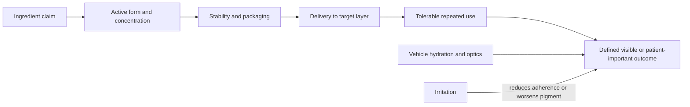

# Topical visible-aging interventions

Topical visible-aging interventions act mainly at the stratum corneum, viable epidermis, pigment system, and superficial dermis. They can reduce ultraviolet dose, improve hydration and optical smoothness, alter epidermal turnover, or—if the molecule reaches its target in an active form—modify pigment and matrix signaling. They cannot reposition descended fat, tighten retaining ligaments, restore craniofacial bone, or reliably replace lost deep volume ([[visible-skin-and-facial-aging]]).

## The evidence belongs to the finished formula

An ingredient name is not an exposure. Clinical performance depends on chemical form, concentration, vehicle, pH, packaging, oxidation and light stability, skin penetration, applied amount, cadence, duration, and whether irritation limits adherence. A positive ingredient trial therefore supports only a reasonably similar finished exposure; it does not validate every serum carrying the same marketing term.

Trials should separate an acute moisturizing-film effect from durable visible change and should use the construct-matched outcomes in [[visible-aging-outcomes-and-evidence]]. Histology, antioxidant capacity, or collagen-related gene expression is mechanistic evidence, not proof that a wrinkle became visibly or meaningfully smaller.

## Foundation: prevent dose before treating damage

Daily broad-spectrum sunscreen has the clearest direct prevention evidence. In a community randomized trial of 903 Australian adults younger than 55 years, daily sunscreen use produced 24% less progression on blinded hand-skin microtopography over 4.5 years than discretionary use (relative odds 0.76, 95% CI 0.59–0.98); the trial measured photoaging progression, not reversal of established structural facial aging.[^hughes-2013] Shade and clothing also reduce dose, while finished-film coverage and reapplication determine real-world sunscreen performance ([[photoprotection]]).

Moisturizers improve stratum-corneum hydration and can temporarily soften the optical appearance of fine lines. That is useful skin function, especially when an active causes dryness, but it is not evidence of deep remodeling ([[skin-barrier-and-moisturization]]). The vehicle itself can explain part of the response in cosmetic trials, so vehicle-controlled comparisons matter.

## Prescription retinoids: strongest treatment evidence

Topical tretinoin activates nuclear retinoic-acid receptors, changes epidermal differentiation, and modifies matrix turnover. A systematic review of seven randomized trials found consistent clinical improvement across photoaging outcomes, but formulations, doses, endpoints, and durations were heterogeneous and participants were predominantly women.[^sitohang-2022] A newer comparative systematic review still identified tretinoin as the reference therapy; irritation limits use, and evidence for retinol, retinaldehyde, or conjugated products cannot be assumed equivalent.[^siddiqui-2024]

The distinction between prescription tretinoin and cosmetic retinol is evidentiary as well as chemical. A critical review found nine randomized double-blind vehicle-controlled OTC vitamin-A trials: four were null, while the five positive studies had major methodological limitations and supported at most mild fine-line improvement.[^spierings-2021] Retinoid dermatitis, photosensitivity management, pregnancy-related precautions, and gradual tolerance are covered in [[topical-retinoids]].

## Other actives: narrower and more formula-dependent

### Niacinamide

Niacinamide can support barrier lipid synthesis and influence inflammatory and pigment-transfer pathways. In a manufacturer-authored, 12-week, randomized double-blind split-face trial of 50 White women aged 40–60, a 5% niacinamide moisturizer improved investigator-rated fine lines, spots, texture, blotchiness, and sallowness versus its moisturizer vehicle.[^bissett-2005] This is direct human finished-formula evidence, but it is one small, demographically narrow study with an industry provenance; it does not establish the same effect for arbitrary concentrations or combinations.

### Vitamin C and other antioxidants

Ascorbic acid is a water-soluble antioxidant and collagen-enzyme cofactor, but it is unstable and delivery through the stratum corneum is formulation-sensitive. A systematic review found only seven wrinkle studies; all combined vitamin C with other ingredients or treatment mechanisms, preventing clean attribution to vitamin C itself.[^sanabria-2023] It is therefore a nonessential adjunct with product-specific uncertainty, not a substitute for photoprotection or a prescription retinoid ([[topical-vitamin-c]]). Mechanistic antioxidant claims for vitamins, polyphenols, and botanicals should not be upgraded to visible benefit without controlled finished-product trials.

### Alpha-hydroxy acids

Alpha-hydroxy acids can reduce corneocyte cohesion and, depending on acid, free-acid concentration, pH, and duration, produce epidermal exfoliation or a controlled peel. Older literature supports some improvement in photoaged texture and fine wrinkling, but concentration on a label does not specify delivered free acid and irritation can worsen erythema or post-inflammatory hyperpigmentation.[^imfeld-2020] Home cosmetics and clinician-performed chemical peels are different exposures; stronger is not automatically more effective or safer. Within the class, buffered 12% ammonium lactate is the notable home-use exception on depth of action: human histology studies found that twice-daily 12% lactic acid increased dermal as well as epidermal thickness (5% increased only epidermal thickness), and that 12% ammonium lactate mitigated clobetasol-induced epidermal and dermal atrophy without blocking the steroid's anti-inflammatory effect — intermediate biopsy outcomes, not visible-outcome trials, but more than home glycolic products can claim at any labeled percentage ([[alpha-hydroxy-acids]]). (@DrDrayzday (Dr Dray) — "Amlactin vs. Glycolic Acid: Which Is Better for Anti-Aging?", 2026-08-31, [link](https://www.youtube.com/watch?v=pnlFKtIQSNE))

### Peptides, growth factors, and polynucleotide products

Peptide labels cover chemically and biologically different molecules, and intact-skin delivery is a central constraint ([[topical-peptides]]). A 2026 systematic review pooled oral and topical peptide RCTs together; most apparent benefit came from oral formulations, limiting inference for a topical product, while the pooled wrinkle effect was modest.[^nukaly-2026] Copper-peptide evidence and route boundaries are developed in [[topical-copper-peptides]].

A systematic review of topical growth-factor preparations found 33 prospective studies but only nine controlled trials, 23 different products, poorly standardized outcomes, and three comparative RCTs with no significant between-treatment difference; persistence beyond six months was unknown.[^quinlan-2023] These findings support possible modest product-specific effects, not a class-wide regenerative claim. Large proteins also face a delivery problem: a growth response in cultured cells does not show that an intact topical reaches viable human target cells, remains active, produces the desired signal without off-target effects, and improves a visible outcome beyond the moisturizer vehicle. Dr Dray therefore treats growth-factor serums as expensive moisturizers unless an exact finished product clears that chain—a deliberately skeptical interpretation compatible with, but stronger than, the systematic review. (@DrDrayzday (Dr Dray) — "Does Spironolactone Age Your Skin? The Truth About Collagen", 2026-08-30, [link](https://www.youtube.com/watch?v=q9Vvl_SJVNA)) Polynucleotide and PDRN evidence is largely for injection or wound healing rather than passive topical facial delivery; route-specific evidence cannot be transferred to a cosmetic cream ([[topical-pdrn-and-centella]]).

## Combination formulas and replication

Combination formulas may improve several domains or simply make attribution impossible. A trial of a retinoid plus moisturizer, antioxidant, or sunscreen establishes the package, not each component. Credibility increases when the exact marketed formula is stable through the study, the comparator matches its vehicle, outcomes and time points were prespecified, photographs were standardized and blinded, adverse effects and withdrawals were reported, diverse skin tones were included, and an independent group replicated the result.

Irritation is an outcome, not proof that an active is working. Burning, scaling, acneiform eruption, or dermatitis can undermine adherence and worsen pigment, especially in skin prone to post-inflammatory hyperpigmentation. Adding multiple actives at once also makes both benefit and harm attribution difficult ([[skincare-evidence-and-routine-design]]).

## Practical implications

- **Make broad-spectrum photoprotection the preventive foundation—strong evidence for slowing photoaging progression in the studied population.** Use shade and clothing as well as a tolerable finished sunscreen; match reapplication to exposure and film loss.
- **For treatment of established photoaging, prescription tretinoin has the strongest topical evidence—moderate-to-strong evidence for local visible outcomes.** Use clinician guidance where appropriate and titrate around irritation; do not assume cosmetic retinol is equivalent.
- **Use moisturizer for dryness and barrier support—strong evidence for hydration, not deep structural reversal.** Judge success by comfort and barrier function rather than a collagen narrative.
- **Treat niacinamide, vitamin C, alpha-hydroxy acids, and other antioxidants as optional, concern-specific additions—limited-to-moderate and finished-formula-dependent evidence.** Introduce one at a time and stop or reduce exposure if persistent irritation develops.
- **Treat peptides, growth-factor, and topical polynucleotide novelty claims as unestablished unless the exact formula has controlled, independently replicated visible-outcome evidence.** Biomarkers, ingredient supplier studies, and evidence from injections or oral products do not establish topical benefit.

## Gaps & open questions

- Which finished OTC formulas produce patient-important visible changes beyond their moisturizer vehicles?
- What concentrations and schedules maximize retinoid benefit while preserving long-term adherence across skin tones and barrier disorders?
- Which topical vitamin C forms remain chemically active through ordinary storage and deliver clinically meaningful exposure?
- Can independent, adequately blinded trials replicate niacinamide, peptide, or growth-factor benefits using validated visible and patient-reported outcomes?
- How often do multi-ingredient products outperform a simpler sunscreen, moisturizer, and retinoid routine after cost, irritation, and adherence are counted?

## References

[^hughes-2013]: Hughes MCB, Williams GM, Baker P, Green AC. “Sunscreen and Prevention of Skin Aging: A Randomized Trial.” *Annals of Internal Medicine*, 2013. [community randomized controlled trial]. [PubMed PMID: 23732711](https://pubmed.ncbi.nlm.nih.gov/23732711/)
[^sitohang-2022]: Sitohang IBS, et al. “Topical Tretinoin for Treating Photoaging: A Systematic Review of Randomized Controlled Trials.” *International Journal of Women's Dermatology*, 2022. [systematic review of RCTs]. [doi:10.1097/JW9.0000000000000003](https://doi.org/10.1097/JW9.0000000000000003)
[^siddiqui-2024]: Siddiqui Z, et al. “Comparing Tretinoin to Other Topical Therapies in the Treatment of Skin Photoaging: A Systematic Review.” *American Journal of Clinical Dermatology*, 2024. [systematic review]. [doi:10.1007/s40257-024-00893-w](https://doi.org/10.1007/s40257-024-00893-w)
[^spierings-2021]: Spierings NMK. “Evidence for the Efficacy of Over-the-Counter Topical Vitamin A Cosmetic Products in the Improvement of Facial Skin Aging: A Systematic Review.” *Journal of Clinical and Aesthetic Dermatology*, 2021. [systematic review of randomized vehicle-controlled trials]. [PubMed PMID: 34980969](https://pubmed.ncbi.nlm.nih.gov/34980969/)
[^bissett-2005]: Bissett DL, Oblong JE, Berge CA. “Niacinamide: A B Vitamin That Improves Aging Facial Skin Appearance.” *Dermatologic Surgery*, 2005. [manufacturer-authored randomized double-blind split-face controlled trial]. [PubMed PMID: 16029679](https://pubmed.ncbi.nlm.nih.gov/16029679/)
[^sanabria-2023]: Sanabria B, Berger LE, Mohd H, et al. “Clinical Efficacy of Topical Vitamin C on the Appearance of Wrinkles: A Systematic Literature Review.” *Journal of Drugs in Dermatology*, 2023. [systematic review]. [doi:10.36849/JDD.7332](https://doi.org/10.36849/JDD.7332)
[^imfeld-2020]: Imhof L, Leuthard D. “Topical Over-the-Counter Antiaging Agents: An Update and Systematic Review.” *Dermatology*, 2021. [systematic review of in-vivo studies]. [doi:10.1159/000509296](https://doi.org/10.1159/000509296)
[^nukaly-2026]: Nukaly HY, et al. “Oral and Topical Peptides for Skin Aging: Systematic Review and Meta-analysis of Randomized Controlled Trials.” *Frontiers in Medicine*, 2026. [systematic review and meta-analysis of RCTs]. [PubMed PMID: 41924746](https://pubmed.ncbi.nlm.nih.gov/41924746/)
[^quinlan-2023]: Quinlan DJ, Ghanem AM, Hassan H. “Topical Growth Factor Preparations for Facial Skin Rejuvenation: A Systematic Review.” *Journal of Cosmetic Dermatology*, 2023. [systematic review]. [doi:10.1111/jocd.15644](https://doi.org/10.1111/jocd.15644)

## Related

[[visible-skin-and-facial-aging]] · [[visible-aging-outcomes-and-evidence]] · [[photoprotection]] · [[topical-retinoids]] · [[skin-barrier-and-moisturization]] · [[topical-vitamin-c]] · [[topical-peptides]] · [[alpha-hydroxy-acids]] · [[procedures-injectables-and-structural-facial-aging]] · [[practice-playbook]]
