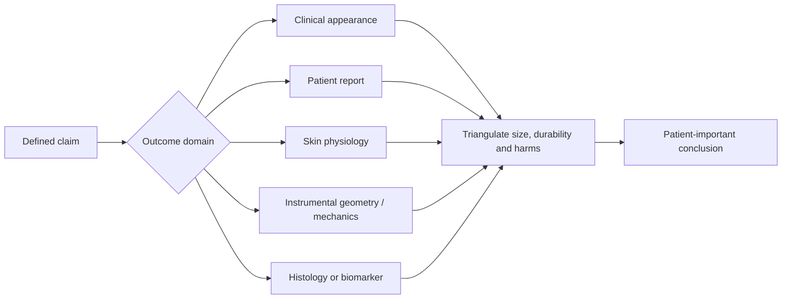

# Visible-aging outcomes and evidence

Visible-aging outcomes are measurements used to decide whether an appearance intervention changed what it claims to change. No single metric captures “younger-looking skin.” Wrinkle severity, color, laxity, texture, hydration, barrier function, histology, and patient satisfaction belong to different domains; agreement among them strengthens interpretation, while movement in one cannot be silently renamed as benefit in another.

## Start with the construct

An outcome is interpretable only when the target construct, anatomical site, acquisition method, time point, and meaningful-change threshold are specified before analysis. A cheek hydration reading does not measure facial laxity; a biopsy showing more collagen does not prove a visible wrinkle changed; a rater detecting a photographic difference does not prove the patient noticed or valued it.

## Clinical appearance outcomes

### Wrinkles, folds, and laxity

Validated photonumeric scales pair ordered verbal grades with reference photographs for a defined site and facial state. In the original seven-rater validation of a nine-point photodamage scale, photonumeric grading produced greater intergrader agreement than a written descriptive scale, though agreement remained imperfect.[^griffiths-1992] A later live-subject validation of a five-point fine-line scale enrolled 289 participants and reported high intra-rater agreement; physicians also judged a one-grade difference to be clinically detectable in image-pair testing.[^werschler-2016] These are measurement-development studies, not treatment trials, and manufacturer involvement in proprietary scales should be disclosed.

Wrinkles at rest and at maximum expression are different constructs. Site-specific scales should not be interchanged among forehead lines, crow’s feet, nasolabial folds, and generalized photodamage. “Laxity” likewise needs a defined region and scale; a fold can change because of volume, expression, position, or swelling without the skin envelope mechanically tightening ([[visible-skin-and-facial-aging]]).

### Dyspigmentation and erythema

Clinical grading can capture mottling or lesion counts, while calibrated colorimetry or spectrophotometry measures reflected color under specified conditions. A professional guideline from the European Society of Contact Dermatitis identifies anatomy, constitutive pigmentation, temperature, activity, posture, hormonal state, lighting, and instrument variables as sources of variation and recommends standardized measurement conditions.[^fullerton-1996] Instrumental color change is not automatically diagnostic: melanin, hemoglobin, inflammation, and optical geometry can contribute to the signal.

### Texture and standardized photography

Texture includes roughness, pores, scale, and fine topography and therefore requires a prespecified definition. Two-dimensional photographs are sensitive to lighting direction, exposure, white balance, focus, camera distance, lens, facial pose, expression, cosmetics, and skin hydration. Three-dimensional optical systems can estimate surface topography or wrinkle volume, but device outputs remain instrument- and algorithm-dependent. A systematic review of reliability and validity studies found comparatively good reliability for particular color and surface-topography devices but insufficient construct-validity evidence to call any reviewed device universally valid; elasticity evidence was especially weak.[^hadi-2022]

Blinded photographic assessment is stronger when images are acquired under fixed conditions, stripped of dates and treatment identifiers, randomized in order, rated independently by multiple trained readers, and analyzed with agreement statistics. Side-by-side “before and after” images selected by a sponsor are illustrative, not an unbiased outcome.

## Patient-reported outcomes

Patient satisfaction, perceived age, distress, naturalness, and quality of life cannot be inferred from a device reading. FACE-Q scales were developed through patient concept elicitation and psychometric testing. The Aging Appraisal and perceived-age measures were field-tested in 288 facial-procedure patients, while later skin and facial-rhytid scales were evaluated in 783 pretreatment, post-treatment, and trial participants and demonstrated high internal reliability and expected correlations.[^panchapakesan-2013][^klassen-2016]

A validated questionnaire is not self-interpreting. The exact scale, scoring transformation, missing-data handling, timing, and responder definition matter. A systematic review of 114 studies using FACE-Q found administration or reporting errors in 30 studies, most commonly reporting raw ordinal totals instead of converted scores.[^chen-2023] Satisfaction is also shaped by expectations, cost, discomfort, clinician interaction, and knowledge of treatment allocation; open-label improvement can therefore coexist with small or absent blinded visible change.

## Physiological and structural measurements

### Hydration and barrier function

Capacitance-based instruments estimate stratum-corneum hydration from electrical properties. Transepidermal water loss (TEWL) estimates the water-vapor flux from skin and is primarily a barrier-function measure, not a direct hydration or anti-aging score. EEMCO guidance emphasizes that airflow, ambient humidity and temperature, acclimatization, anatomical site, sweating, probe handling, and chamber design can materially alter TEWL; standardized conditions are essential.[^rogiers-2001]

A moisturizer can improve capacitance within hours and may reduce TEWL without changing wrinkles, pigment, or dermal structure. Conversely, an occlusive film can alter readings while present. Trials should define washout and acclimatization and distinguish an acute film effect from sustained barrier recovery ([[skin-barrier-and-moisturization]]).

### Mechanical properties and laxity

Suction, torsion, indentation, ballistometry, and elastography probe different combinations of distensibility, recoil, stiffness, viscosity, thickness, and attachment to underlying tissue. “Elasticity” is not one universal variable. EEMCO biomechanical guidance notes inconsistent nomenclature, calibration, procedures, and biological interpretation across instruments and recommends careful standardization; an instrumental change should be named by its actual parameter rather than translated automatically into visible tightening.[^rodrigues-2020]

### Histology and molecular biomarkers

Biopsy can measure epidermal thickness, collagen organization, elastic material, cell populations, or molecular markers at a sampled site. It offers mechanistic or structural evidence, but the sample is tiny, invasive, vulnerable to processing and reader choices, and may not represent the whole treated area. More collagen staining, altered gene expression, or a biomarker shift is not a validated surrogate for visible benefit, patient satisfaction, durability, or safety.

## Statistical detection versus meaningful benefit

A small standard error can make a tiny mean change statistically significant. Clinical interpretation instead asks:

- How large was the absolute change on the original scale, with its confidence interval?
- How many participants crossed a prospectively justified responder threshold, compared with control?
- Does the threshold exceed measurement error and ordinary within-person variation?
- Was change visible to blinded raters and important to patients?
- Did benefit persist after swelling, erythema, peeling, or a moisturizing film resolved?
- What adverse effects, withdrawals, downtime, and treatment burden accompanied it?

A one-grade difference can be meaningful for one validated scale under its validation conditions, but that does not make one grade universally meaningful across sites, populations, scales, or interventions.[^werschler-2016] Minimal detectable change, which exceeds measurement noise, is also distinct from minimal important change, which reflects value to patients.

## Trial design and sponsor-image audit

Split-face or within-person randomized designs can control stable person-level differences, but need protection against cross-over of topical products, asymmetric sun exposure, treatment-order cues, and correlated analysis errors. Parallel randomized vehicle-controlled trials better address systemic or whole-face interventions but require larger samples. Blinding is weakened when irritation, peeling, bruising, swelling, or procedural sensation reveals allocation.

Before accepting an appearance claim, audit:

1. Was the primary outcome registered or prospectively specified, or selected after many measures were examined?
2. Was the scale validated for this feature, site, facial state, skin-tone range, language, and population?
3. Were photographs standardized, complete, time-matched, randomized, and independently blinded—not merely sponsor-selected examples?
4. Was the comparator a vehicle, sham, active treatment, or baseline only, and did both groups receive sunscreen or moisturizer?
5. Were assessors, participants, and analysts blinded where feasible, and could visible adverse effects reveal allocation?
6. Were absolute effects, uncertainty, withdrawals, harms, and all prespecified time points reported?
7. Were multiplicity, missing data, and within-person correlation handled appropriately?
8. Did an independent group replicate the finished product or device rather than only an ingredient, prototype, or predecessor?

## Applicability and evidence conflicts

Scale validation samples have often been predominantly female aesthetic-clinic populations and historically underrepresented the full range of skin pigmentation, facial anatomy, ages, and cultural interpretations. Even a reliable scale can lack content validity outside the population and construct for which it was built. Instrument readings may appear more objective than ratings yet still depend on calibration, algorithms, site placement, environmental control, and proprietary processing.[^hadi-2022]

There is no conflict in saying that an instrument reliably repeats its number while the number’s clinical meaning remains uncertain. Reliability, validity, responsiveness, and patient importance are separate tests. Evidence is strongest when blinded clinical appearance, a validated patient-reported outcome, and a construct-matched objective measure converge without disproportionate harms.

## Practical implications

- **For personal tracking: standardize location, camera, lighting, distance, pose, expression, time of day, and product timing—moderate measurement principle.** Compare full image sets rather than choosing the most flattering pair.
- **Before buying from a trial or advertisement: ask what changed, by how much, versus what comparator, and whether patients could see or value it—strong evidence-appraisal principle.** A significant hydration, histology, or instrument result is not automatically visible rejuvenation.
- **For clinicians and researchers: prespecify one construct-matched primary outcome and a meaningful responder threshold, then pair it with harms and a patient-reported measure—strong measurement principle.** Use validated scales only within defensible populations and report absolute effects.
- **Treat sponsor-selected photographs as examples, not proof—strong bias-control principle.** Prefer complete standardized sets read by blinded independent assessors and replicated by an independent study.

## Gaps & open questions

- What changes on common wrinkle, pigment, laxity, and texture scales are important to patients across diverse skin tones and facial anatomies?
- Which instrumental measures have adequate construct validity and test–retest performance for longitudinal facial-aging trials?
- How long should trials wait after irritation, edema, peeling, or occlusion before measuring durable benefit?
- How often do sponsor-selected images disagree with complete blinded photographic sets or patient-reported outcomes?
- Can a core outcome set reduce selective reporting while preserving feature- and compartment-specific measurement?

## References

[^griffiths-1992]: Griffiths CEM, Wang TS, Hamilton TA, Voorhees JJ, Ellis CN. “A Photonumeric Scale for the Assessment of Cutaneous Photodamage.” *Archives of Dermatology*, 1992. [measurement validation study]. [PubMed PMID: 1550366](https://pubmed.ncbi.nlm.nih.gov/1550366/)
[^werschler-2016]: Carruthers J, Donofrio L, Hardas B, et al. “Development and Validation of a Photonumeric Scale for Evaluation of Facial Fine Lines.” *Dermatologic Surgery*, 2016. [manufacturer-affiliated live-subject measurement validation study]. [doi:10.1097/DSS.0000000000000847](https://doi.org/10.1097/DSS.0000000000000847)
[^fullerton-1996]: Fullerton A, Fischer T, Lahti A, Wilhelm KP, Takiwaki H, Serup J. “Guidelines for Measurement of Skin Colour and Erythema.” *Contact Dermatitis*, 1996. [professional measurement guideline and review]. [doi:10.1111/j.1600-0536.1996.tb02258.x](https://doi.org/10.1111/j.1600-0536.1996.tb02258.x)
[^hadi-2022]: Hadi H, Awadh AI, Hanif NM, Md Sidik NF, Mohd Rani MR, Suhaimi MS. “Skin Measurement Devices to Assess Skin Quality: A Systematic Review on Reliability and Validity.” *Skin Research and Technology*, 2022. [systematic review]. [doi:10.1111/srt.13113](https://doi.org/10.1111/srt.13113)
[^panchapakesan-2013]: Panchapakesan V, Klassen AF, Cano SJ, Scott AM, Pusic AL. “Development and Psychometric Evaluation of the FACE-Q Aging Appraisal Scale and Patient-Perceived Age Visual Analog Scale.” *Aesthetic Surgery Journal*, 2013. [multicenter psychometric validation study]. [doi:10.1177/1090820X13510170](https://doi.org/10.1177/1090820X13510170)
[^klassen-2016]: Klassen AF, Cano SJ, Schwitzer JA, et al. “Development and Psychometric Validation of the FACE-Q Skin, Lips, and Facial Rhytids Appearance Scales and Adverse Effects Checklists for Cosmetic Procedures.” *JAMA Dermatology*, 2016. [psychometric validation study]. [doi:10.1001/jamadermatol.2016.0018](https://doi.org/10.1001/jamadermatol.2016.0018)
[^chen-2023]: Gallo L, Kim P, Yuan M, et al. “Best Practices for FACE-Q Aesthetics Research: A Systematic Review of Study Methodology.” *Aesthetic Surgery Journal*, 2023. [systematic review]. [doi:10.1093/asj/sjad141](https://doi.org/10.1093/asj/sjad141)
[^rogiers-2001]: Rogiers V, EEMCO Group. “EEMCO Guidance for the Assessment of Transepidermal Water Loss in Cosmetic Sciences.” *Skin Pharmacology and Applied Skin Physiology*, 2001. [professional measurement guideline]. [doi:10.1159/000056341](https://doi.org/10.1159/000056341)
[^rodrigues-2020]: Rodrigues LM, Fluhr JW, EEMCO Group. “EEMCO Guidance for the In Vivo Assessment of Biomechanical Properties of the Human Skin and Its Annexes: Revisiting Instrumentation and Test Modes.” *Skin Pharmacology and Physiology*, 2020. [professional measurement guideline]. [doi:10.1159/000504063](https://doi.org/10.1159/000504063)

## Related

[[visible-skin-and-facial-aging]] · [[skincare-evidence-and-routine-design]] · [[skin-barrier-and-moisturization]] · [[hyperpigmentation-and-dark-spots]] · [[post-weight-loss-skin-laxity]] · [[topical-retinoids]] · [[procedural-skin-remodeling]] · [[practice-playbook]]
