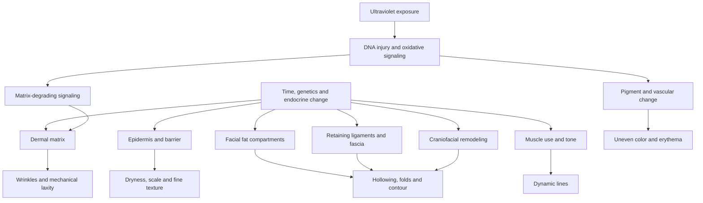

# Visible skin and facial aging

Visible facial aging is the combined appearance produced by changes in the epidermis, dermal extracellular matrix, pigment and vessels, subcutaneous fat, fibrous retaining structures, muscles, and craniofacial skeleton. “Skin aging” is therefore both useful and incomplete: fine surface roughness may be primarily epidermal, but a tear trough, jowl, or deep fold can reflect several deeper compartments. Reviews integrating human histology, imaging, and anatomical dissection consistently describe aging as asynchronous across layers and variable by facial region, ancestry, sex, exposure history, and individual anatomy.[^shah-2016][^cotofana-2021]

## Intrinsic aging and photoaging

Intrinsic aging is the time-associated change that occurs even in relatively protected skin. Photoaging is the additional injury produced mainly by cumulative solar ultraviolet exposure. They overlap rather than form two mutually exclusive diseases. A review of human skin research describes reduced epidermal renewal, fragmentation of the collagen-rich dermal matrix, altered pigmentation, vasculature, immunity, innervation, wound repair, and subcutaneous-fat homeostasis with aging; chronic ultraviolet exposure accelerates and changes several of these processes.[^rittie-fisher-2015]

Clinically, intrinsically aged protected skin tends toward thinning, dryness, fine lines, and reduced resilience. Chronically photoaged skin more often develops coarse wrinkles, mottled pigmentation, lentigines, telangiectasia, roughness, laxity, and—in severely damaged skin—yellowed, thickened solar elastosis. These are tendencies, not a bedside test of cause: intrinsic and extrinsic processes coexist, and visible phenotype does not quantify cumulative dose.[^rittie-fisher-2015][^lee-2021]

## The anatomical compartments

### Epidermis and barrier

The epidermis continually renews its outer stratum corneum. With age, renewal and repair reserve decline, the epidermal–dermal junction flattens, and barrier recovery after challenge can slow. Lower water-binding capacity or greater water loss can make the surface dry, scaly, less flexible, and optically rough. Hydration can temporarily soften dehydration lines and change light reflection without rebuilding the dermis or changing facial volume; [[skin-barrier-and-moisturization]] covers that functional distinction.[^rittie-fisher-2015]

### Dermal collagen, elastin, and ground substance

The dermis is a load-bearing composite. Collagen fibers provide tensile strength, elastic fibers contribute recoil, and glycosaminoglycans and proteoglycans organize water and matrix interactions. Human skin research summarized in reviews shows age-related collagen fragmentation and lower fibroblast mechanical support; ultraviolet-triggered signaling also increases matrix-degrading activity. Photoaged elastic material can accumulate in a disorganized form, so “more elastin” on histology need not mean better elasticity.[^rittie-fisher-2015][^shin-2016]

Matrix change contributes to fine and coarse wrinkles, fragility, slower repair, and some loss of mechanical recoil. It does not by itself explain every fold or sag. [[advanced-glycation-end-products]], [[cellular-senescence]], and [[extracellular-matrix-aging]] describe connected mechanisms, but their presence does not establish that a cosmetic product reverses an intact face’s visible aging.

### Pigment and vessels

Melanocyte number, melanocyte activity, inflammatory signaling, and ultraviolet exposure can produce both focal and mottled dyspigmentation. Vascular dilation, vessel visibility through thinner tissue, and chronic photodamage can contribute to erythema or telangiectasia. Pigment and redness are optical outcomes affected by constitutive skin color and illumination; visual erythema is less reliable in melanin-rich skin, and a brown or gray area may combine pigment with inflammation. See [[hyperpigmentation-and-dark-spots]].[^fullerton-1996]

### Subcutaneous fat

Facial fat is partitioned into superficial and deep compartments rather than forming one uniform layer. Anatomical-dissection and computed-tomography literature synthesized in a review describes region-specific volume loss and redistribution across the forehead, periorbital area, cheeks, lips, chin, and jowl.[^wan-2015] Loss of deep support can expose the orbital rim or deepen a hollow; relative persistence, displacement, or enlargement of an adjacent superficial compartment can accentuate a fold. Whole-face weight loss can add a separate tissue–volume mismatch ([[post-weight-loss-skin-laxity]]).

Because fat-compartment loss becomes noticeable at roughly the ages when people adopt anti-aging skincare, its cause is often misattributed to the products. Retinol, tretinoin, and adapalene do not cause facial fat loss; the internet claim linking them to volume loss is, in Dr Dray's phrase, "guilty by association" — the aging process itself is thinning the fat while the user happens to be applying a retinoid ([[topical-retinoids]]). The converse marketing error also fails anatomically: no topical (Volufiline is the marketed example) can restore lost volume, whatever its label claims. (@DrDrayzday (Dr Dray) — "Can Adapalene Cause Facial Fat Loss? Dermatologist Q&A", 2026-08-23, [link](https://www.youtube.com/watch?v=DprHVOUpvaM))

### Retaining ligaments, fascia, and muscle

Fibrous septa and retaining ligaments connect mobile soft tissue to deeper fixed planes. Age-related change in surrounding bone, fat, and soft-tissue mechanics alters the loads across this support network; reviews describe these structures as part of facial descent, although direct longitudinal quantification of isolated “ligament laxity” is limited.[^shah-2016][^cotofana-2021] Repeated muscle contraction creates dynamic lines that appear with expression. As dermal recoil and structural support diminish, some lines persist at rest. Muscle activity is therefore one contributor, not a universal cause of wrinkles or sagging.

### Craniofacial skeleton

Adult facial bones continue to remodel. Human imaging studies summarized in anatomical reviews describe region-specific changes around the orbital aperture, maxilla, pyriform aperture, and mandible; these change the platform supporting overlying soft tissue.[^shah-2016][^mendelson-wong-2020] This is not uniform “facial bone loss,” and cross-sectional comparisons cannot prove every person follows the same trajectory. Dental status and sex, ancestry, and age distributions also affect applicability.

## Feature-to-compartment map

| Visible feature | Frequent contributors | What the feature does not prove |
|---|---|---|
| Fine surface lines | Stratum-corneum hydration, epidermal texture, superficial dermal matrix | That deep volume has been lost |
| Coarse static wrinkles | Dermal matrix damage, repeated folding, underlying contour | One single molecular cause |
| Dynamic expression lines | Muscle contraction plus overlying skin mechanics | General facial laxity |
| Mottled brown or gray color | Melanin distribution, inflammation, ultraviolet injury | Whether pigment is epidermal or dermal by appearance alone |
| Persistent redness or visible vessels | Vascular dilation or prominence, inflammation, photodamage | That all redness is cosmetic rather than disease |
| Tear trough or hollow cheek | Bone platform, deep and superficial fat, ligaments, dermal envelope | That a topical collagen stimulant can replace volume |
| Nasolabial fold or jowl | Regional fat behavior, retaining structures, skeletal support, skin mechanics | That the crease resides only in skin |
| General laxity after weight loss | Reduced underlying volume plus skin and connective-tissue reserve | A medication-specific toxic lesion |

## Prevention, partial improvement, and anatomical reach

Photoprotection prevents additional ultraviolet dose; it does not erase all established structural change. Moisturizers can improve barrier function, hydration, scale, and surface optics. Topical retinoids can influence epidermal turnover, pigment, and dermal matrix over months. These are meaningful effects within reachable skin compartments, but ordinary topical products cannot restore resorbed bone, reposition deep fat, tighten a retaining ligament, replace a missing fat compartment, or remove redundant tissue. See [[photoprotection]], [[topical-retinoids]], and [[skincare-evidence-and-routine-design]].

Procedures also require target matching. Pigment- or vessel-directed light treatments, resurfacing, neuromodulation, volume replacement, energy-based tightening, and surgery act on different layers and carry different risks. A change in one outcome—such as dermal thickness, hydration, or muscle motion—must not be presented as whole-face rejuvenation ([[procedural-skin-remodeling]]).

## Evidence conflicts and limitations

Much facial-aging anatomy comes from cross-sectional imaging, cadaver dissection, and expert synthesis rather than longitudinal observation of the same living faces. These designs describe plausible structural differences and spatial relationships but cannot cleanly separate aging from cohort effects, dental history, body-weight change, or selective samples. Some anatomy reviews are written for aesthetic-treatment planning and discuss commercial procedures; that context can bias causal emphasis toward treatable compartments.[^shah-2016][^wan-2015][^cotofana-2021]

The main conflict is not whether multiple layers change, but how much each layer contributes to a particular person’s visible feature. A compartment model prevents the opposite errors of attributing everything to dermal collagen or treating every anatomical observation as a proven treatment target.

## Practical implications

- **Daily: reduce avoidable ultraviolet exposure with shade, clothing, and a tolerated sunscreen—strong for preventing additional photodamage.** This protects epidermal and dermal tissue but cannot reverse established skeletal or volume change. [[photoprotection]]
- **For dryness or superficial roughness: support the barrier and judge the outcome as hydration and comfort—moderate-to-strong.** Do not interpret temporarily smoother dehydration lines as deep remodeling. [[skin-barrier-and-moisturization]]
- **Before choosing an intervention: name the feature and likely compartment—strong anatomical reasoning, intervention evidence varies.** Persistent inflammation, a changing pigmented lesion, bleeding, ulceration, pain, or rapid asymmetry warrants clinical diagnosis rather than cosmetic treatment.
- **Treat claims of topical “lifting,” volume replacement, ligament tightening, or bone remodeling as anatomically implausible unless direct human evidence shows otherwise—strong anatomical boundary.** A topical may change surface optics or dermal mechanics without reaching the structure named in the claim.

## Gaps & open questions

- What are the longitudinal, within-person contributions of bone, fat compartments, retaining structures, muscle, and skin to specific visible features?
- How do these trajectories differ across ancestry, sex, menopause status, dental status, lifetime ultraviolet exposure, and weight history?
- Which noninvasive measurements can separate true tissue remodeling from hydration, lighting, expression, and short-lived swelling?
- Which changes matter to patients, and what magnitude is visibly meaningful rather than merely instrument-detectable?

## References

[^shah-2016]: Cotofana S, Fratila AAM, Schenck TL, Redka-Swoboda W, Zilinsky I, Pavicic T. “The Anatomy of the Aging Face: A Review.” *Facial Plastic Surgery*, 2016. [narrative review]. [doi:10.1055/s-0036-1582234](https://doi.org/10.1055/s-0036-1582234)
[^cotofana-2021]: Swift A, Liew S, Weinkle S, Garcia JK, Silberberg MB. “The Facial Aging Process From the ‘Inside Out.’” *Aesthetic Surgery Journal*, 2021. [commercially affiliated narrative review]. [doi:10.1093/asj/sjaa339](https://doi.org/10.1093/asj/sjaa339)
[^rittie-fisher-2015]: Rittié L, Fisher GJ. “Natural and Sun-Induced Aging of Human Skin.” *Cold Spring Harbor Perspectives in Medicine*, 2015. [review of human mechanistic and histologic evidence]. [doi:10.1101/cshperspect.a015370](https://doi.org/10.1101/cshperspect.a015370)
[^lee-2021]: Lee H, Hong Y, Kim M. “Structural and Functional Changes and Possible Molecular Mechanisms in Aged Skin.” *International Journal of Molecular Sciences*, 2021. [narrative review]. [PubMed PMID: 34830368](https://pubmed.ncbi.nlm.nih.gov/34830368/)
[^shin-2016]: Shin JW, Kwon SH, Choi JY, Na JI, Huh CH, Choi HR, Park KC. “Molecular Mechanisms of Dermal Aging and Antiaging Approaches.” *International Journal of Molecular Sciences*, 2019. [narrative review]. [doi:10.3390/ijms20092126](https://doi.org/10.3390/ijms20092126)
[^fullerton-1996]: Fullerton A, Fischer T, Lahti A, Wilhelm KP, Takiwaki H, Serup J. “Guidelines for Measurement of Skin Colour and Erythema.” *Contact Dermatitis*, 1996. [professional measurement guideline and review]. [doi:10.1111/j.1600-0536.1996.tb02258.x](https://doi.org/10.1111/j.1600-0536.1996.tb02258.x)
[^wan-2015]: Sadick NS, Dorizas AS, Krueger N, Nassar AH. “The Facial Adipose System: Its Role in Facial Aging and Approaches to Volume Restoration.” *Dermatologic Surgery*, 2015. [anatomical review]. [doi:10.1097/DSS.0000000000000494](https://doi.org/10.1097/DSS.0000000000000494)
[^mendelson-wong-2020]: Mendelson B, Wong CH. “Changes in the Facial Skeleton With Aging: Implications and Clinical Applications in Facial Rejuvenation.” *Aesthetic Plastic Surgery*, 2020. [anatomical review]. [doi:10.1007/s00266-020-01823-x](https://doi.org/10.1007/s00266-020-01823-x)

## Related

[[systemic-modifiers-of-visible-aging]] · [[visible-aging-outcomes-and-evidence]] · [[skin-barrier-and-moisturization]] · [[photoprotection]] · [[topical-retinoids]] · [[procedural-skin-remodeling]] · [[post-weight-loss-skin-laxity]] · [[hyperpigmentation-and-dark-spots]] · [[extracellular-matrix-aging]] · [[aging-model]] · [[practice-playbook]]
