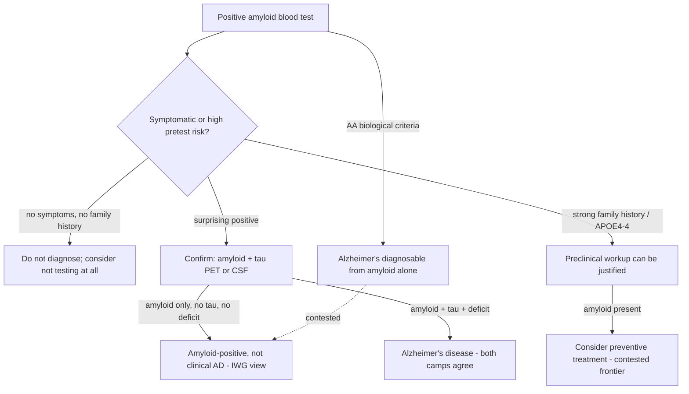

# Alzheimer's diagnosis — biological versus clinical-biological

The live institutional dispute is whether Alzheimer's disease can be diagnosed from biomarkers alone or requires biomarkers plus clinical symptoms and functional deficit. The Alzheimer's Association criteria diagnose primarily on the presence of amyloid, whether measured in blood or brain. The International Working Group (largely European but international, with National Institute on Aging participation and some major American centers) holds that because so many people harbor amyloid without ever developing disease, diagnosis should require amyloid plus tau plus symptoms—a clinical-biological condition rather than a primarily biological one. (Peter Attia MD — "399 - The evolution of Alzheimer's disease and dementia care | Gayatri Devi, M.D.", 2026-07-13, [link](https://www.youtube.com/watch?v=x7NhqMOwdOM))

The base rates drive the disagreement: about 25% of community-dwelling people in their 70s, over 30% in their 80s, and roughly 44% at 90 have brain amyloid without symptoms, and current commercial blood assays are validated mostly against amyloid PET rather than against amyloid plus tau. A biomarker-only definition therefore risks creating what the International Working Group calls a large population of patients in waiting—people waiting to become patients who may meanwhile change their whole approach to living. (Peter Attia MD — "399 - The evolution of Alzheimer's disease and dementia care | Gayatri Devi, M.D.", 2026-07-13, [link](https://www.youtube.com/watch?v=x7NhqMOwdOM))

## Positions

**Gayatri Devi (clinical-biological camp, with selective preclinical exceptions).** She calls herself old school on blood biomarkers—the future but not yet the present—and confirms any serious concern with amyloid-plus-tau PET or lumbar puncture, citing a high-functioning man in his 70s diagnosed with Alzheimer's by one neurologist from an abnormal blood Aβ42 whose amyloid PET then came back negative after three weeks of believing he had the disease. She is careful about testing asymptomatic people, except at genuinely high pretest probability: a physician in her 50s with two confirmed-Alzheimer's parents and APOE4/4 was tested, found amyloid-positive with borderline tau and subtle domain weaknesses, and started on preventive treatment including a GLP-1 and an anti-amyloid monoclonal. (Peter Attia MD — "399 - The evolution of Alzheimer's disease and dementia care | Gayatri Devi, M.D.", 2026-07-13, [link](https://www.youtube.com/watch?v=x7NhqMOwdOM))

**Peter Attia (concurring, and distinguishing this from cancer screening).** Although vocally in favor of early aggressive cancer screening, he argues amyloid screening is fundamentally different because of pretest probability and because the implications of what to do about a positive result are unsettled. Devi's PSA analogy predicts the resolution: PSA screening initially inflated prostate-cancer diagnoses until interpretation became nuanced (age-adjusted, multi-factor), and amyloid-equals-Alzheimer's is likely to undergo the same correction. (Peter Attia MD — "399 - The evolution of Alzheimer's disease and dementia care | Gayatri Devi, M.D.", 2026-07-13, [link](https://www.youtube.com/watch?v=x7NhqMOwdOM))

The stakes compound downstream: anti-amyloid drugs are approved and risky, so where the diagnostic line sits determines who is exposed to ARIA risk and cost, and historical misdiagnosis (about 30% of earlier trial participants lacked Alzheimer's pathology) shows how a loose clinical or biomarker definition contaminates evidence. [[anti-amyloid-immunotherapy]] (Peter Attia MD — "399 - The evolution of Alzheimer's disease and dementia care | Gayatri Devi, M.D.", 2026-07-13, [link](https://www.youtube.com/watch?v=x7NhqMOwdOM))

## Practical implications

- **Do not seek or accept an Alzheimer's diagnosis from a blood biomarker alone; a surprising positive warrants amyloid-plus-tau confirmation — strong within this source, institutionally contested.**
- **Asymptomatic testing is reasonable mainly at high pretest probability (confirmed family history, APOE4 homozygosity); routine screening of low-risk asymptomatic people is discouraged — moderate, evolving.**
- **When a family history of "Alzheimer's" is reported, ask how it was diagnosed; before ~2007–2008 antemortem confirmation was generally impossible, so record dementia of unknown type unless verified — strong documentation practice.**

## Gaps & open questions

- Will blood assays standardized against amyloid plus tau (or plus symptoms) resolve the specificity problem, and at what thresholds?
- Does preclinical anti-amyloid treatment in high-risk amyloid-positive people prevent or delay clinical disease? No trial answer yet.
- What is the psychological and behavioral cost of a patients-in-waiting label, and does earlier knowledge improve or worsen outcomes?
- How should the field handle the asymptomatic 70+ population as blood tests spread through direct-to-consumer channels?

## Related

[[alzheimers-spectrum-and-diagnosis]] · [[anti-amyloid-immunotherapy]] · [[gayatri-devi]] · [[proactive-health-monitoring]] · [[biological-age-biomarkers]] · [[cognitive-reserve-and-brain-health]] · [[practice-playbook]] · [[aging-model]]
