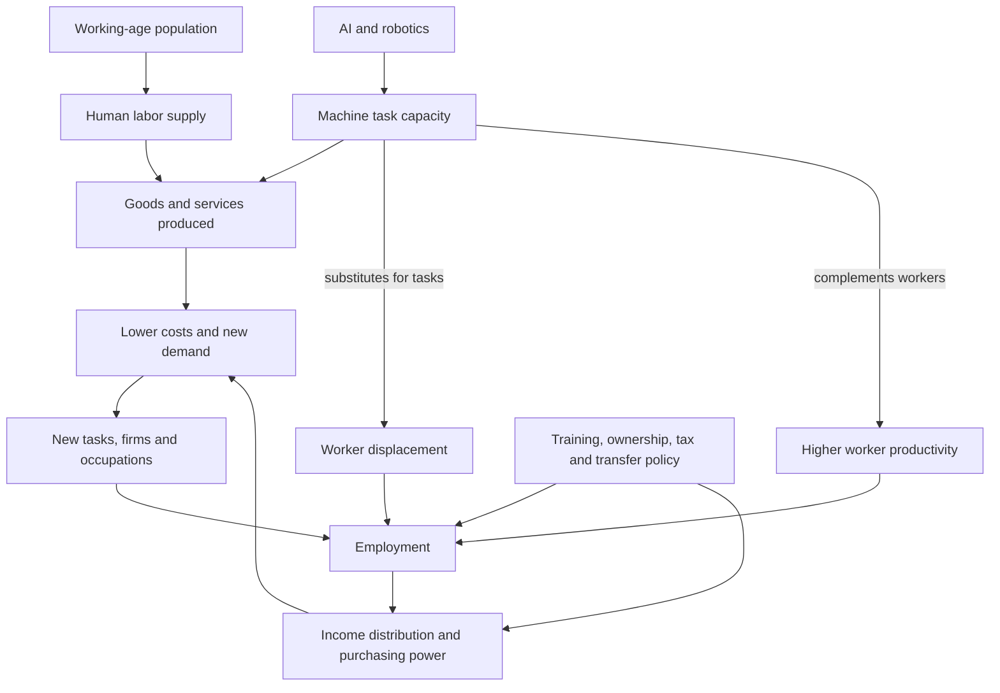

# Automation, employment, and population decline

Automation changes the amount and composition of productive capacity, while population aging changes the number of workers and dependents. The central disagreement is not simply whether machines replace tasks—they do—but whether new demand, complementary work, falling prices, and policy responses create enough new paid roles and distribute the gains broadly enough to offset displacement. Population decline adds a second uncertainty: fewer workers can constrain production, yet machines may substitute for some missing labor. (@MikeIsraetelMakingProgress (Mike Israetel) — "The Future of Work According to Elon Musk | Unqualified Thoughts Ep. 3", 2026-08-10, [link](https://www.youtube.com/watch?v=SrGRiSoI6Vo))

## What is actually being predicted

Task automation is not identical to occupation elimination. Jobs bundle physical, cognitive, social, legal, and accountability tasks; a machine may replace one component, complement another, and create monitoring or integration work. Aggregate production can therefore rise while particular workers, regions, or occupations lose. Whether measured unemployment rises depends on the speed of adoption, demand elasticity, labor mobility, skill matching, ownership of capital, and institutions—not merely on the number of robots. This is an analytical decomposition of the source's competing forecasts. (@MikeIsraetelMakingProgress (Mike Israetel) — "The Future of Work According to Elon Musk | Unqualified Thoughts Ep. 3", 2026-08-10, [link](https://www.youtube.com/watch?v=SrGRiSoI6Vo))

A shrinking or aging population can reduce labor supply and raise dependency burdens, especially in care, infrastructure, and other locally delivered services. Automation can relieve that constraint only where systems are capable, affordable, energy- and material-supported, and deployable in the affected setting. It cannot be inferred from a forecast of general AI capability that nursing, construction, logistics, or public administration will be automated on the same schedule. (@MikeIsraetelMakingProgress (Mike Israetel) — "The Future of Work According to Elon Musk | Unqualified Thoughts Ep. 3", 2026-08-10, [link](https://www.youtube.com/watch?v=SrGRiSoI6Vo))

## Competing positions

Elon Musk’s position in the source is that labor shortages will persist while automation produces abundance: very cheap machine labor would satisfy presently unmet demand rather than exhaust useful work. Mike Israetel extends this into a strongly expansionary scenario in which billions of software and robotic workers arrive in the 2030s–2040s, generate new machine-to-machine activity, and more than offset demographic contraction. These are attributed forecasts, not empirical findings in the transcript. (@MikeIsraetelMakingProgress (Mike Israetel) — "The Future of Work According to Elon Musk | Unqualified Thoughts Ep. 3", 2026-08-10, [link](https://www.youtube.com/watch?v=SrGRiSoI6Vo))

The displacement position holds that machines can reduce demand for human labor faster than new tasks or demand appear, particularly when automated output is a close substitute for labor and income becomes concentrated among capital owners. Even if aggregate abundance rises, weak redistribution or slow retraining could leave people without wages, bargaining power, or socially valued roles. The transcript mentions this fear but supplies no proponent, data, adoption curve, or distributional model; it therefore does not resolve the debate. (@MikeIsraetelMakingProgress (Mike Israetel) — "The Future of Work According to Elon Musk | Unqualified Thoughts Ep. 3", 2026-08-10, [link](https://www.youtube.com/watch?v=SrGRiSoI6Vo))

Historical population growth without permanent aggregate job exhaustion is evidence that labor supply and demand can co-evolve, but it is not decisive evidence about autonomous machine labor. Humans are also consumers and income recipients; machines need not participate in demand or ownership in the same way. Israetel’s historical analogy is therefore a useful challenge to a fixed-number-of-jobs model, but not a quantified prediction of the next transition. (@MikeIsraetelMakingProgress (Mike Israetel) — "The Future of Work According to Elon Musk | Unqualified Thoughts Ep. 3", 2026-08-10, [link](https://www.youtube.com/watch?v=SrGRiSoI6Vo))

## Evidence and decision thresholds

The source is commentary built around forecasts and contains no labor-market study, demographic projection, productivity series, or uncertainty interval. Its evidentiary strength is low for timing and net-employment effects. A useful forecast should separately track task-level capability, deployment cost, capital formation, adoption by sector, hours worked, vacancies, wages, labor share, unemployment duration, new occupational categories, and the age structure of the population. [[human-centered-ai-and-learning]] supplies a complementary constraint: benchmark capability does not establish safe or economically viable autonomy in changing physical environments.

## Practical implications

- **Quarterly or annually: monitor exposure by tasks rather than treating an occupation as wholly safe or doomed — moderate as a planning method, low for any dated forecast.** Identify which tasks are substitutable, which become more valuable as complements, and which require trust, responsibility, physical adaptability, or domain licensure. (@MikeIsraetelMakingProgress (Mike Israetel) — "The Future of Work According to Elon Musk | Unqualified Thoughts Ep. 3", 2026-08-10, [link](https://www.youtube.com/watch?v=SrGRiSoI6Vo))
- **Continuously during adoption: measure distribution as well as total output — strong economic-accounting principle.** Productivity growth does not by itself show that displaced workers share gains; track wages, labor share, hours, transitions, and regional effects. (@MikeIsraetelMakingProgress (Mike Israetel) — "The Future of Work According to Elon Musk | Unqualified Thoughts Ep. 3", 2026-08-10, [link](https://www.youtube.com/watch?v=SrGRiSoI6Vo))
- **For workforce and city planning: prepare both shortage and displacement contingencies — moderate.** Training, portable benefits, income support, housing mobility, and human-centered system design remain useful across multiple scenarios; committing essential services to a precise robotics timeline is speculative. (@MikeIsraetelMakingProgress (Mike Israetel) — "The Future of Work According to Elon Musk | Unqualified Thoughts Ep. 3", 2026-08-10, [link](https://www.youtube.com/watch?v=SrGRiSoI6Vo))

## Gaps & open questions

- At what task capability, reliability, and cost thresholds does deployment produce substitution rather than complementarity in each sector?
- How elastic will demand be when machine production lowers prices, and how much new human work will that demand induce?
- Who will own productive machines, and through which wage, dividend, public-service, or transfer channels will households obtain purchasing power?
- Can automation scale fast enough in care, construction, energy, and logistics to offset geographically uneven population aging?
- How would meaning, status, and social participation change if paid employment ceased to be the main distribution mechanism?

## Related

[[human-centered-ai-and-learning]] · [[mental-strength-and-behavioral-skills]] · [[durable-well-being-and-hedonic-adaptation]]
