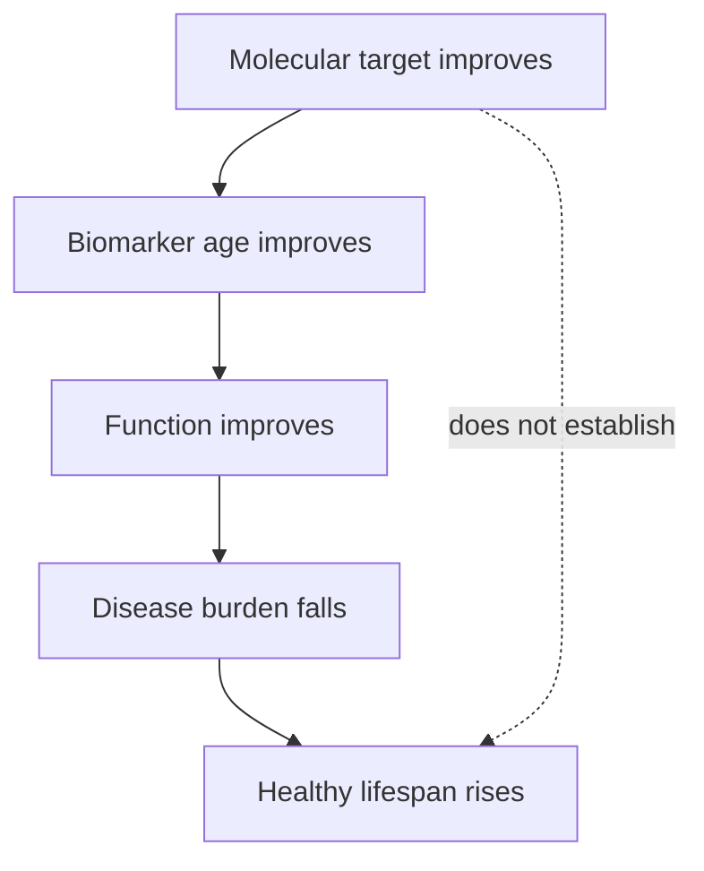

# What counts as biological age reversal?

“Age reversal” can refer to at least three different outcomes: reversing one molecular lesion, moving a composite biomarker toward a younger reference, or restoring integrated function and reducing disease and mortality. These are not interchangeable. A tissue can become younger on one chemical measure while its other damage classes and function remain unchanged. (@LongevityScienceNews (Longevity Science News) — "BREAKTHROUGH Skin Age Reversal: New Enzyme Removed 40 Years Of Damage", 2026-07-25, [link](https://www.youtube.com/watch?v=_Vf9pdoU3tU))

## Positions

Matt Kaeberlein’s restrictive position is that reversing a small subset of age-related changes is not reversal of biological aging as a whole; he also stresses that discovery can move quickly while human safety trials remain the translational bottleneck. Aubrey de Grey’s repair-based position is that no single therapy is expected to reverse the whole system: healthspan extension will require a portfolio that repairs distinct damage classes in the same person. These views conflict mainly over terminology and expectations, not over the narrowness of the CML result. (@LongevityScienceNews (Longevity Science News) — "BREAKTHROUGH Skin Age Reversal: New Enzyme Removed 40 Years Of Damage", 2026-07-25, [link](https://www.youtube.com/watch?v=_Vf9pdoU3tU))

Partial epigenetic reprogramming and thymus-regeneration studies provide other meanings of reversal—cell-state change and organ regrowth—but human evidence remains early, and moving an age clock or MRI endpoint does not itself prove longer healthy life. (@ABCNewsIndepth (ABC News In-depth) — "The health trends outpacing regulation and putting people at risk | Four Corners Documentary", 2026-07-20, [link](https://www.youtube.com/watch?v=77TTDkR3nbI))

The pig-plasma-fraction literature supplies an unusually clean demonstration of how unstable the middle level of that hierarchy is. The same investigator's work reported roughly 54% epigenetic rejuvenation in old rats in a 2020 preprint and, in later peer-reviewed work using a different method, 6 to 7% on average with higher values in some organs. A tenfold difference in reported reversal attributable to methodological choice, within one research line, shows that "biological age reversed by X%" is a quantity contingent on clock selection, tissue, and analysis pipeline rather than a property of the animal. This is why the replication effort adds grip strength, memory testing, and survival to the epigenetic endpoint: those readouts do not change when the clock does. [[pig-plasma-fraction-rejuvenation]] [[plasma-derived-extracellular-particles]] (@TheSheekeyScienceShow (The Sheekey Science Show) — "Reproducing Rejuvenation: Inside the Pig Plasma Longevity Experiments", 2025-08-22, [link](https://www.youtube.com/watch?v=Q-lS1UMHG1o))

A related caution concerns what a large clock movement licenses. The strongest reading offered by proponents of that work — that animals rejuvenated by two-thirds epigenetically and maintained by continued dosing might live indefinitely — treats the clock as the organism's age rather than a statistical estimate of it. This wiki does not adopt that reading; the survival arm of the planned experiment, not the clock, is what could support any claim about lifespan. (@TheSheekeyScienceShow (The Sheekey Science Show) — "Reproducing Rejuvenation: Inside the Pig Plasma Longevity Experiments", 2025-08-22, [link](https://www.youtube.com/watch?v=Q-lS1UMHG1o))

## Practical implications

When evaluating a reversal claim, identify the level measured, comparator, study system, and downstream function every time the claim is encountered. Confidence should fall sharply when an ex vivo molecular endpoint is generalized to whole-body longevity. No personal intervention follows from the label alone. (@LongevityScienceNews (Longevity Science News) — "BREAKTHROUGH Skin Age Reversal: New Enzyme Removed 40 Years Of Damage", 2026-07-25, [link](https://www.youtube.com/watch?v=_Vf9pdoU3tU))

## Gaps & open questions

- Which intermediate biomarkers are validated surrogates for morbidity or lifespan?
- How many damage classes must improve before whole-organism reversal becomes a useful term?
- Can repair portfolios be tested without losing the ability to identify the active component?
- How much of a reported percentage rejuvenation is a property of the intervention rather than of the clock and pipeline chosen to measure it?

## Related

[[biological-age-biomarkers]] · [[advanced-glycation-end-products]] · [[thymus-regeneration]] · [[pig-plasma-fraction-rejuvenation]] · [[plasma-derived-extracellular-particles]] · [[circulating-rejuvenation-signaling]] · [[replication-and-research-incentives]] · [[aging-model]]
