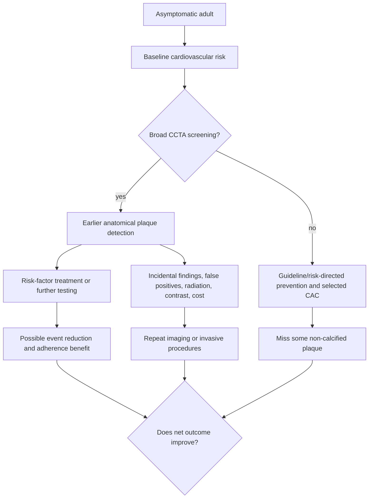

# Coronary CT angiography screening in asymptomatic adults

The dispute is whether contrast-enhanced [[coronary-ct-angiography]] should be offered broadly to adults without chest pain or another diagnostic indication in order to discover non-calcified coronary plaque earlier than symptoms, stress-test abnormalities, or calcium. The question is not whether CCTA can see plaque; it is whether a screening program improves patient-important outcomes enough to justify radiation, contrast, false positives, incidental findings, cost, repeat scans, and downstream procedures. (@matt.kaeberlein (Healthspan Medicine) — "THIS Helps Detect Heart Disease Before It Happens", 2026-03-08, [link](https://www.youtube.com/watch?v=SSFkNCVXv6U))

## The case for broad earlier imaging

Kim Brockenbrough proposes CCTA in men in their 40s and women in their 50s when cholesterol, diabetes, or family history raises risk, ten years later without those factors, and ultimately describes screening as something that should become universal. Her case is that CAC misses non-calcified plaque, functional tests become abnormal relatively late, anatomy can make otherwise abstract risk visible, and effective lipid-lowering treatment already exists. She and Nikki Byrne also report that seeing disease can change medication acceptance, although the transcript supplies no controlled adherence or outcome comparison. (@matt.kaeberlein (Healthspan Medicine) — "THIS Helps Detect Heart Disease Before It Happens", 2026-03-08, [link](https://www.youtube.com/watch?v=SSFkNCVXv6U))

The position gains plausibility from the causal structure of atherosclerosis: plaque accumulates before an event, non-obstructive disease is not benign, and lowering causal risk factors earlier can reduce cumulative exposure. Yet those premises do not by themselves prove that imaging everyone is superior to treating risk factors from established clinical measurements. The practice series in the transcript is enriched by referral and provides no control group, denominator representative of the public, event follow-up, or estimate of screening harms. (@matt.kaeberlein (Healthspan Medicine) — "THIS Helps Detect Heart Disease Before It Happens", 2026-03-08, [link](https://www.youtube.com/watch?v=SSFkNCVXv6U))

## The case for risk-directed restraint

The restraint position applies the screening rule in [[proactive-health-monitoring]]: test when baseline risk, test accuracy, an effective response, and evidence that the whole pathway improves outcomes jointly justify it. CCTA entails more than finding plaque; it can initiate repeat imaging, numerical overinterpretation, CT-derived flow analysis, invasive angiography, or revascularization even when symptoms and outcome benefit are uncertain. The guest herself warns that acquisition differences undermine serial quantification, current AI can misread artifacts, CT-derived flow information may not change asymptomatic management, and evidence does not establish her preferred repeat interval. (@matt.kaeberlein (Healthspan Medicine) — "THIS Helps Detect Heart Disease Before It Happens", 2026-03-08, [link](https://www.youtube.com/watch?v=SSFkNCVXv6U))

This position does not treat CAC zero as absence of disease. It accepts the sensitivity limitation while asking whether the incremental detections are numerous and actionable enough to improve outcomes over risk-based prevention. It also distinguishes diagnosis from treatment selection: detection may motivate adherence, but established risk factors can already justify blood-pressure control, smoking cessation, lipid lowering, glycemic management, exercise, and dietary change without serial anatomical proof. (@matt.kaeberlein (Healthspan Medicine) — "THIS Helps Detect Heart Disease Before It Happens", 2026-03-08, [link](https://www.youtube.com/watch?v=SSFkNCVXv6U))

## Practical implications

- **Do not treat universal CCTA screening or the transcript's sex-specific starting ages as established care—strong caution from the evidence gap.** They are Brockenbrough's attributed proposal; the transcript provides no randomized screening-outcome evidence. (@matt.kaeberlein (Healthspan Medicine) — "THIS Helps Detect Heart Disease Before It Happens", 2026-03-08, [link](https://www.youtube.com/watch?v=SSFkNCVXv6U))
- **At routine preventive visits, calculate and treat cardiovascular risk before considering advanced imaging—strong.** If CCTA is proposed, document the unresolved question, how each plausible result changes care, and the downstream plan. (@matt.kaeberlein (Healthspan Medicine) — "THIS Helps Detect Heart Disease Before It Happens", 2026-03-08, [link](https://www.youtube.com/watch?v=SSFkNCVXv6U))
- **For an asymptomatic person considering CCTA, use shared decision-making rather than a recurring consumer-imaging cadence—moderate.** Discuss radiation, contrast, incidental findings, false precision, cost, and the possibility that treatment would be recommended from existing risk factors anyway. (@matt.kaeberlein (Healthspan Medicine) — "THIS Helps Detect Heart Disease Before It Happens", 2026-03-08, [link](https://www.youtube.com/watch?v=SSFkNCVXv6U))

## Gaps & open questions

- Does CCTA screening reduce myocardial infarction, cardiovascular mortality, or all-cause mortality in asymptomatic adults compared with modern risk-factor care?
- Which baseline-risk threshold produces a favorable balance of useful detection and downstream harm?
- Is the benefit mediated by different treatment, better adherence, or both?
- Do sex-specific starting ages improve calibration, and what biological or outcome evidence should determine them?
- How should radiation and contrast exposure be counted when serial scans are part of the proposed pathway?

## Related

[[coronary-ct-angiography]] · [[proactive-health-monitoring]] · [[lipoprotein-retention-and-atherogenesis]] · [[pcsk9-inhibition]] · [[practice-playbook]]
