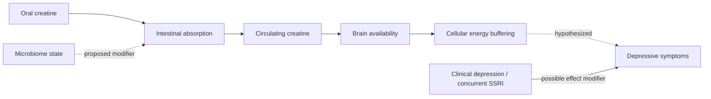

# Does creatine improve depression?

Creatine buffers cellular energy by helping recycle adenosine triphosphate through the phosphocreatine system. That mechanism makes a brain effect plausible, but trials of creatine supplementation for depressive symptoms are internally mixed and should not be generalized from its established exercise-performance use. (@Physionic (Physionic) — "I analyzed 1,000 Health Studies: Here are 10 Things I Learned", 2026-08-06, [link](https://www.youtube.com/watch?v=sx8MyamJf3g))

## Competing positions

Across roughly 16–17 randomized trials reviewed by Physionic, about half showed benefit and half did not. The pro-effect interpretation is that benefit may concentrate in clinically diagnosed depression and perhaps in people already receiving an SSRI; the null interpretation is that this apparent subgroup boundary may be unstable because the total literature is small and heterogeneous. Physionic treats the intervention as promising but incomplete rather than established. (@Physionic (Physionic) — "I analyzed 1,000 Health Studies: Here are 10 Things I Learned", 2026-08-06, [link](https://www.youtube.com/watch?v=sx8MyamJf3g))

A small recent trial paired creatine with a microbiome-directed pill and reported greater Hamilton Depression Rating Scale improvement than inert placebo. Its proposed mechanism was that depression-associated microbiome changes reduce creatine absorption and that modifying the microbiome restores systemic and brain delivery. However, the design lacked creatine-only and microbiome-only groups, so it cannot identify which component caused the effect or whether their combination is necessary. (@Physionic (Physionic) — "I analyzed 1,000 Health Studies: Here are 10 Things I Learned", 2026-08-06, [link](https://www.youtube.com/watch?v=sx8MyamJf3g))

## Practical implications

- **Do not substitute creatine for evidence-based depression assessment or treatment — strong.** Depression can be serious, and the supplementation evidence is inconsistent. (@Physionic (Physionic) — "I analyzed 1,000 Health Studies: Here are 10 Things I Learned", 2026-08-06, [link](https://www.youtube.com/watch?v=sx8MyamJf3g))
- **If an adult with diagnosed depression considers creatine as an adjunct, discuss it with the treating clinician and reassess symptoms with the same validated measure after a predefined interval — limited evidence.** The transcript does not establish a preferred dose, duration, or need for a microbiome product.
- **Do not infer antidepressant efficacy from strength-performance evidence — strong as an evidentiary rule.** The target tissue, population, endpoint, and concomitant treatment differ. (@Physionic (Physionic) — "I analyzed 1,000 Health Studies: Here are 10 Things I Learned", 2026-08-06, [link](https://www.youtube.com/watch?v=sx8MyamJf3g))

## Gaps & open questions

- Are diagnosis, baseline creatine status, sex, diet, SSRI exposure, or microbiome composition true treatment-effect modifiers?
- Does creatine alone reproduce the combination trial’s result?
- Which microbial features alter creatine pharmacokinetics, and are they causal?
- Are improvements durable, clinically meaningful, and safe alongside specific antidepressants?

## Related

[[supplement-evidence-and-safety]] · [[cognitive-reserve-and-brain-health]] · [[nutrition-evidence-and-personalization]]
