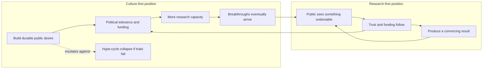

# Is public legitimacy or research progress the binding constraint on longevity?

Every field has a limiting reagent. For aging research the candidates are the science itself — no intervention yet demonstrably slows human aging — and the field's social position: how much money, talent, political tolerance, and regulatory permission a sceptical public is willing to grant. The question is not whether both matter but which one currently binds, because the answer determines where a marginal dollar and a marginal year of effort should go. It also determines whether cultural work should precede scientific breakthroughs or follow them. The measurement apparatus behind the cultural position is described in [[public-trust-in-longevity-science]].

The two positions are drawn as loops on purpose: neither party denies the other's arrow exists. The dispute is about which arrow is currently rate-limiting, and about what happens to the system when the research arrow fails to fire for a long time.

## The culture-first position

Sho Joseph Ozaki Tan of the Public Longevity Group argues that public trust is a bottleneck the field has not been targeting at all, and that longevity is not exempt from the requirement facing any movement in a democracy: resources, talent, capital, and political backing all depend on convincing people that what you are doing is good for society. Historically, he argues, surveys of public attitudes toward life extension have not been favorable. (@TheSheekeyScienceShow (The Sheekey Science Show) — "Does Longevity Have a Culture Problem? Mapping Public Trust in Life Extension Science", 2025-10-13, [link](https://www.youtube.com/watch?v=bnUPDSe-YXI))

The distinctive and genuinely contrarian move is the second one: the field's standing should be deliberately *decoupled* from its research win rate. The reasoning is a risk argument. Aging is a problem at least comparable in complexity to cancer; the field is far less well funded than cancer or diabetes and has not won an equivalent public narrative; and the probability that a decisive result arrives on any given schedule is not high enough to build a movement on — we don't want to be dependent on hype cycling. If public support is contingent on the next big result, then a normal run of negative trials does not merely disappoint, it exhausts the audience and withdraws the resources needed for the next attempt. The climate movement is offered as the model of the alternative: its public support rests on a widely shared desire for a particular kind of world, not on annual technical victories. The goal, correspondingly, is for people to actively desire longer healthier life as a social good — a state of affairs that is stable under scientific failure. (@TheSheekeyScienceShow (The Sheekey Science Show) — "Does Longevity Have a Culture Problem? Mapping Public Trust in Life Extension Science", 2025-10-13, [link](https://www.youtube.com/watch?v=bnUPDSe-YXI))

## The research-first position

Eleanor Sheekey puts the opposing case as a direct challenge: if no therapy is found that works robustly, or if results are negative, is the bottleneck really public perception rather than the research itself — the problem of actually finding a solution? On this view trust is downstream. A field with nothing to show has a communication problem that is a symptom, not a cause, and the remedy is the result. (@TheSheekeyScienceShow (The Sheekey Science Show) — "Does Longevity Have a Culture Problem? Mapping Public Trust in Life Extension Science", 2025-10-13, [link](https://www.youtube.com/watch?v=bnUPDSe-YXI))

Her own resolution is not a flat rejection but a reframing as a cycle: better public perception increases funding, which brings more researchers into the field, which raises the chance of results, which improves perception. If that loop is the right description, the two positions are not rivals about direction but about entry point, and the practical question becomes which node is cheapest to push. (@TheSheekeyScienceShow (The Sheekey Science Show) — "Does Longevity Have a Culture Problem? Mapping Public Trust in Life Extension Science", 2025-10-13, [link](https://www.youtube.com/watch?v=bnUPDSe-YXI))

A stronger version of the research-first case, not made in this source but implied by material elsewhere in this wiki, is that the trust deficit is substantially *earned*. If the most visible public face of longevity includes clinics selling unvalidated procedures ([[longevity-clinics-and-evidence]]), supplements sold on mechanism rather than outcome ([[supplement-evidence-and-safety]]), and biomarker claims that outrun their endpoints ([[biological-age-reversal]]), then scepticism is calibrated rather than a communications failure — and narrative work aimed at dissolving it would be treating the symptom.

## A third candidate: the constraint researchers themselves name

Both positions above are arguments about where the constraint lies, offered by people arguing from the outside of the daily research process. A separate class of evidence asks the researchers. A bottleneck survey of longevity researchers conducted by the Longevity Biotech Fellowship is reported to have found that respondents ranked the unavailability of publicly available datasets above both regulatory change and increased funding. (@TheSheekeyScienceShow (The Sheekey Science Show) — "The Hidden Crisis Slowing Longevity Research - Tim Glinin (First Approval)", 2025-08-16, [link](https://www.youtube.com/watch?v=lB5aqym8V98)) This wiki has not reviewed the survey's instrument, sample, or response rate; it is recorded as a reported finding about stated researcher priorities, not as a measurement of the field's true limiting reagent.

Taken at face value the finding is awkward for both existing positions rather than decisive for either. It sits on the research-first side of the ledger in that it locates the constraint inside the scientific process rather than in public sentiment — but it names neither of the two things the culture-first argument treats as the payoff of legitimacy, since funding and regulatory permission are exactly what respondents ranked below data access. It is equally awkward for a strong research-first reading, which usually presumes the constraint is the difficulty of the biology and the scarcity of resources for attacking it, not the accessibility of evidence already generated. The claim implied is a third one: that a substantial share of the field's existing information is unusable, so the marginal return to making it usable exceeds the marginal return to buying more ([[open-data-and-research-infrastructure]], [[replication-and-research-incentives]]).

Two cautions apply before this is read as settling anything. Self-reported bottleneck rankings measure what practitioners find salient and tractable to name, which is not the same as what binds — researchers are poorly placed to observe a funding constraint that operates by never creating the laboratory they would have worked in, and well placed to notice a dataset they wanted and could not obtain. And tractability was explicitly part of the argument attached to the finding: sharing existing data is presented as a cheaper lever than raising funding levels. A cheapest-available lever and a binding constraint are different objects, and conflating them is the standard error in this debate on all sides.

## What each position predicts

The disagreement is testable in principle, which is unusual for a strategy debate. The culture-first position predicts that measured public sentiment moves in response to framing and narrative interventions largely independently of research news, and that funding and regulatory outcomes track sentiment with a lag. The research-first position predicts that sentiment is dominated by result-driven shocks, that narrative interventions produce small and decaying effects, and that a single convincing demonstration would move public opinion more than any communications programme could. The instrumentation described in [[public-trust-in-longevity-science]] — continuous multi-source sentiment tracking plus before-and-after analysis of high-profile events — is capable of distinguishing these, and the analogous case of GLP-1 receptor agonists offers a natural test of the research-first mechanism: a result visible without statistics, whose effect on public attitudes could be measured directly ([[glp-1-receptor-agonists]]).

Neither position has been tested this way. The evidence currently consists of a preliminary descriptive map and two strategic arguments, so this page records a live and consequential disagreement, not a resolved question.

## Practical implications

- **Do not treat this as a question about whether a given intervention works — strong as a boundary.** Where a field's bottleneck lies has no bearing on the evidence for rapamycin, exercise, or plasma exchange. Personal decisions belong with [[practice-playbook]] and the individual intervention pages.
- **For anyone allocating effort or funding in the field, state which arrow you believe is rate-limiting — moderate.** The two positions imply materially different portfolios: one funds sentiment measurement, message testing, and advocacy; the other funds trials and replication ([[replication-and-research-incentives]]).
- **Distinguish the cheapest lever from the binding constraint when reading bottleneck claims — strong as a reasoning discipline.** Data access can be the highest-return marginal investment while funding remains the true limiting reagent; an argument that establishes tractability has not established bindingness ([[open-data-and-research-infrastructure]]).
- **Guard the decoupling strategy against its failure mode — strong as a reasoning discipline.** Building durable public desire independently of results is defensible; building it by making claims the evidence does not support converts a trust-building programme into the hype cycle it was designed to escape.

## Gaps & open questions

- Does public sentiment toward longevity in fact respond more to narrative interventions or to research news, when both are measured on the same time series?
- Has any comparable field successfully decoupled its public standing from its technical win rate, and what did that require?
- How much of current public scepticism is attributable to unproven commercial products versus unfamiliarity with the science?
- Would a single unambiguous human result — of the kind GLP-1 agonists supplied for obesity — reset the trust question entirely, making the strategic debate moot?
- Do funding and regulatory decisions actually track measured public sentiment, and at what lag?
- Do researchers' self-reported bottleneck rankings predict where added resources actually produce results, or only what practitioners find salient?
- If data access is genuinely the top-ranked constraint, does that make this a strategy debate between two positions that both misidentify the limiting reagent?

## Related

[[public-trust-in-longevity-science]] · [[replication-and-research-incentives]] · [[open-data-and-research-infrastructure]] · [[longevity-clinics-and-evidence]] · [[supplement-evidence-and-safety]] · [[biological-age-reversal]] · [[healthspan-versus-maximum-lifespan]] · [[longevity-intervention-prioritization]] · [[glp-1-receptor-agonists]] · [[aging-model]] · [[practice-playbook]]
