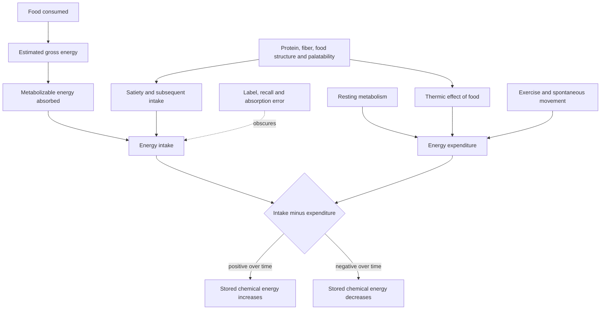

# Energy balance and calorie counting

Energy balance is the conservation-of-energy constraint on body-mass change: over a chosen interval, stored body energy changes by metabolizable energy absorbed minus energy expended. Calorie counting is a measurement and behavior tool for estimating one side of that balance. Confusing these two claims creates much of the dispute. Imperfect food labels, variable absorption, and changing expenditure can make a calorie budget inaccurate without invalidating conservation; conversely, conservation alone does not tell a person what intake will be sustainable or predict the exact scale response from a menu. (@biolayne1 (Dr. Layne Norton) — "Stacy Sims PHD Says Calories Are BS | What the Fitness | Biolayne", 2026-08-07, [link](https://www.youtube.com/watch?v=tN97LNccMGQ))

## What is not in dispute

A sustained increase in stored fat requires that carbon and chemical energy enter the body and are retained; sustained loss requires stored substrate to be oxidized and its products leave the body. Layne Norton's position is that this constraint is non-negotiable even when neither intake nor expenditure can be measured exactly. He distinguishes an error in estimating the terms from a failure of the governing relation. (@biolayne1 (Dr. Layne Norton) — "Stacy Sims PHD Says Calories Are BS | What the Fitness | Biolayne", 2026-08-07, [link](https://www.youtube.com/watch?v=tN97LNccMGQ))

Food quality remains inside this model rather than competing with it. Protein and fiber can raise the thermic cost of digestion and affect fullness, while food processing and palatability can change how much is eaten. Organ tissues also differ in energy use per unit mass. These facts alter the inputs, outputs, or behavioral feedbacks; they do not create energy from nothing or make stored energy disappear. (@biolayne1 (Dr. Layne Norton) — "Stacy Sims PHD Says Calories Are BS | What the Fitness | Biolayne", 2026-08-07, [link](https://www.youtube.com/watch?v=tN97LNccMGQ)) [[dietary-fiber]] [[nutrition-evidence-and-personalization]]

An extreme one-day menu comparison reported 1,994 versus 8,312 kcal despite the lower-energy menu providing large portions. This illustrates how beverage calories, added fat, energy density, protein, fiber, and food structure can make the accounting behaviorally easier or harder; it does not validate the calorie estimates, predict long-term adherence, or show that the lower-energy menu works for every person. (@JeremyEthier (Jeremy Ethier) — "I Proved My 6-Pack Abs Diet Works For ANYONE", 2026-07-12, [link](https://www.youtube.com/watch?v=HkrWExj1QNk)) [[satiety-oriented-diet-design]]

## The live disagreement

Stacy Sims's position, as excerpted in the source, is that the body is not usefully treated as an algorithm, food calories are rough estimates, food quality differs across dietary environments, and timing deserves more emphasis than calorie accounting. Norton accepts measurement error and the importance of quality but rejects the inference that either makes energy balance false; he also rejects elevating timing above total energy without evidence that timing changes the sustained balance independently. Because the source is a critical excerpt rather than Sims's full evidentiary presentation, it establishes the positions but cannot fairly establish the strongest version of her case. (@biolayne1 (Dr. Layne Norton) — "Stacy Sims PHD Says Calories Are BS | What the Fitness | Biolayne", 2026-08-07, [link](https://www.youtube.com/watch?v=tN97LNccMGQ)) [[caloric-restriction-and-meal-timing]]

The useful reconciliation is layered. Energy conservation is an accounting identity; a calorie label is an estimate; a weight-change forecast is a dynamic model; and a diet is a behavioral system. The identity is strong physics, whereas the accuracy of a particular count, the response of an individual, and the superiority of one timing protocol require empirical evidence. (@biolayne1 (Dr. Layne Norton) — "Stacy Sims PHD Says Calories Are BS | What the Fitness | Biolayne", 2026-08-07, [link](https://www.youtube.com/watch?v=tN97LNccMGQ)) [[evolutionary-mismatch-and-weight-regulation]]

## Practical implications

- **For a weight-change goal: monitor the several-week trend in body mass and adjust intake or activity gradually — strong for the direction imposed by energy balance, moderate for any particular tracking method.** Treat labels and logs as estimates whose usefulness is judged by repeated outcomes, not exact truth. (@biolayne1 (Dr. Layne Norton) — "Stacy Sims PHD Says Calories Are BS | What the Fitness | Biolayne", 2026-08-07, [link](https://www.youtube.com/watch?v=tN97LNccMGQ))
- **Daily: choose protein- and fiber-containing foods that improve satiety and diet quality — moderate mechanistic support in this source.** This can make the required energy intake easier to sustain; it does not exempt the diet from energy balance. (@biolayne1 (Dr. Layne Norton) — "Stacy Sims PHD Says Calories Are BS | What the Fitness | Biolayne", 2026-08-07, [link](https://www.youtube.com/watch?v=tN97LNccMGQ))
- **Use meal timing as an adherence, sleep, or performance tool rather than assuming it overrides total intake — evidence for timing-independent weight effects is not supplied here.** Review timing only after the broader intake pattern is workable. (@biolayne1 (Dr. Layne Norton) — "Stacy Sims PHD Says Calories Are BS | What the Fitness | Biolayne", 2026-08-07, [link](https://www.youtube.com/watch?v=tN97LNccMGQ))

## Gaps & open questions

- How large are real-world errors from labels, portion estimation, absorption, and adaptive expenditure for different people and diets?
- Which tracking methods improve long-term adherence without increasing distress or disordered eating?
- How much do food processing and macronutrient composition change spontaneous intake when protein and offered energy are controlled?
- Does meal timing produce clinically meaningful body-composition differences when energy intake, sleep, and adherence are genuinely matched?
- How would Sims formulate and support the strongest version of her position outside the excerpt used by the source?

## Related

[[evolutionary-mismatch-and-weight-regulation]] · [[satiety-oriented-diet-design]] · [[nutrition-evidence-and-personalization]] · [[caloric-restriction-and-meal-timing]] · [[dietary-fiber]] · [[visceral-and-ectopic-fat]] · [[practice-playbook]] · [[aging-model]]
