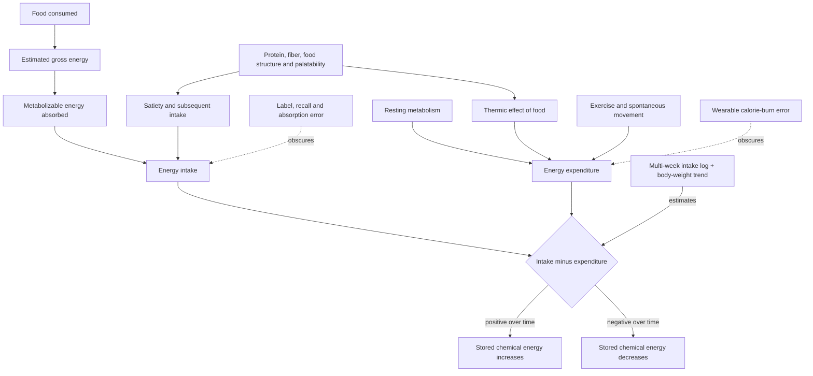

# Energy balance and calorie counting

Energy balance is the conservation-of-energy constraint on body-mass change: over a chosen interval, stored body energy changes by metabolizable energy absorbed minus energy expended. Calorie counting is a measurement and behavior tool for estimating one side of that balance. Confusing these two claims creates much of the dispute. Imperfect food labels, variable absorption, and changing expenditure can make a calorie budget inaccurate without invalidating conservation; conversely, conservation alone does not tell a person what intake will be sustainable or predict the exact scale response from a menu. (@biolayne1 (Dr. Layne Norton) — "Stacy Sims PHD Says Calories Are BS | What the Fitness | Biolayne", 2026-08-07, [link](https://www.youtube.com/watch?v=tN97LNccMGQ))

```mermaid
flowchart TD
  FOOD[Food consumed] --> LABEL[Estimated gross energy]
  LABEL --> ABS[Metabolizable energy absorbed]
  ABS --> IN[Energy intake]
  BMR[Resting metabolism] --> OUT[Energy expenditure]
  TEF[Thermic effect of food] --> OUT
  MOVE[Exercise and spontaneous movement] --> OUT
  IN --> BAL{Intake minus expenditure}
  OUT --> BAL
  BAL -->|positive over time| STORE[Stored chemical energy increases]
  BAL -->|negative over time| DRAW[Stored chemical energy decreases]
  QUALITY[Protein, fiber, food structure and palatability] --> TEF
  QUALITY --> APP[Satiety and subsequent intake]
  APP --> IN
  ERROR[Label, recall and absorption error] -. obscures .-> IN
  DEVERR[Wearable calorie-burn error] -. obscures .-> OUT
  TREND[Multi-week intake log + body-weight trend] -->|estimates| BAL
```

## What is not in dispute

A sustained increase in stored fat requires that carbon and chemical energy enter the body and are retained; sustained loss requires stored substrate to be oxidized and its products leave the body. Layne Norton's position is that this constraint is non-negotiable even when neither intake nor expenditure can be measured exactly. He distinguishes an error in estimating the terms from a failure of the governing relation. (@biolayne1 (Dr. Layne Norton) — "Stacy Sims PHD Says Calories Are BS | What the Fitness | Biolayne", 2026-08-07, [link](https://www.youtube.com/watch?v=tN97LNccMGQ))

Food quality remains inside this model rather than competing with it. Protein and fiber can raise the thermic cost of digestion and affect fullness, while food processing and palatability can change how much is eaten. Organ tissues also differ in energy use per unit mass. These facts alter the inputs, outputs, or behavioral feedbacks; they do not create energy from nothing or make stored energy disappear. (@biolayne1 (Dr. Layne Norton) — "Stacy Sims PHD Says Calories Are BS | What the Fitness | Biolayne", 2026-08-07, [link](https://www.youtube.com/watch?v=tN97LNccMGQ)) [[dietary-fiber]] [[nutrition-evidence-and-personalization]]

An extreme one-day menu comparison reported 1,994 versus 8,312 kcal despite the lower-energy menu providing large portions. This illustrates how beverage calories, added fat, energy density, protein, fiber, and food structure can make the accounting behaviorally easier or harder; it does not validate the calorie estimates, predict long-term adherence, or show that the lower-energy menu works for every person. (@JeremyEthier (Jeremy Ethier) — "I Proved My 6-Pack Abs Diet Works For ANYONE", 2026-07-12, [link](https://www.youtube.com/watch?v=HkrWExj1QNk)) [[satiety-oriented-diet-design]]

## The live disagreement

Stacy Sims's position, as excerpted in the source, is that the body is not usefully treated as an algorithm, food calories are rough estimates, food quality differs across dietary environments, and timing deserves more emphasis than calorie accounting. Norton accepts measurement error and the importance of quality but rejects the inference that either makes energy balance false; he also rejects elevating timing above total energy without evidence that timing changes the sustained balance independently. Because the source is a critical excerpt rather than Sims's full evidentiary presentation, it establishes the positions but cannot fairly establish the strongest version of her case. (@biolayne1 (Dr. Layne Norton) — "Stacy Sims PHD Says Calories Are BS | What the Fitness | Biolayne", 2026-08-07, [link](https://www.youtube.com/watch?v=tN97LNccMGQ)) [[caloric-restriction-and-meal-timing]]

The useful reconciliation is layered. Energy conservation is an accounting identity; a calorie label is an estimate; a weight-change forecast is a dynamic model; and a diet is a behavioral system. The identity is strong physics, whereas the accuracy of a particular count, the response of an individual, and the superiority of one timing protocol require empirical evidence. (@biolayne1 (Dr. Layne Norton) — "Stacy Sims PHD Says Calories Are BS | What the Fitness | Biolayne", 2026-08-07, [link](https://www.youtube.com/watch?v=tN97LNccMGQ)) [[evolutionary-mismatch-and-weight-regulation]]

## A coach's operationalization of the identity

Performance coach Dan Garner's fat-loss template shows what treating energy balance as an estimate-then-measure loop looks like in practice, and is recorded here as coaching practice rather than trial-validated protocol. Estimate maintenance crudely (body weight in pounds × 15), set protein at 1 g per pound of body weight and fat at 30% of calories with carbohydrate as the remainder, then adjust weekly from measured weight change against a target loss rate of 1–2 lb/week — faster is read as sacrificing lean mass. The deficit is staged around a planned maintenance break: roughly four weeks at a 5% deficit, four at 10%, two weeks at maintenance, then 15% and 20% to completion. During the break, added calories go to carbohydrate and fat while protein holds constant and training stays hard — the deliberately asymmetric framing of eating at maintenance while training like the deficit never happened. If appetite struggles emerge, protein escalates stepwise (1.0 → 1.4 g/lb) while calories come out of fat first, and carbohydrate is kept clustered around training so sessions do not degrade; retaining muscle, and the training stimulus that retains it, is treated as the diet's real product. The rationale for the mid-diet break — marker and symptom recovery — is developed in [[low-energy-availability-and-menstrual-function]]. His openly contrarian corollary: when dieting, he shifts a large share of calories to the evening, against generic don't-eat-near-bedtime advice, on the argument that a hungry, sympathetically activated dieter sleeps worse than a fed one and that the late-eating literature was not collected on lean, training people in a deficit — a population-transfer objection he checks per client with subjective feedback and wearable total sleep time. That position conflicts with general sleep-hygiene guidance and is recorded as an attributed, population-bounded disagreement, not a general recommendation. (@drandygalpin (Andy Galpin) — "How to Reach Your Fitness Goals (Hard-to-Grow Muscles, Lose Fat, Busy Schedule & More) | Dan Garner", 2026-08-19, [link](https://www.youtube.com/watch?v=-M50mes3nig))

## Protein overfeeding: a possible partial exception

The identity's most interesting live test is protein overfeeding. Exercise scientist Bill Campbell's reading of the literature, as relayed here, is that adding a few hundred calories per day of pure protein above maintenance has not produced measurable fat-mass increase in the studies available. If it holds, this does not break conservation — protein's thermic cost of digestion is high, absorption is incomplete, surplus amino acids are diverted to urea and gluconeogenesis, and lean-tissue synthesis consumes energy — but it does break the naive translation from a calorie surplus to fat gain when the surplus is delivered as one specific macronutrient. Layne Norton's response to the same claim was to reserve judgment pending review, and the obvious boundary questions are unanswered: whether the effect has a ceiling (200 or 400 kcal versus 1,000), and whether it varies by age, adiposity, and training state. Deliberate protein-overfeeding designs are meticulous and few, so this is a small and provisional literature, relayed secondhand by an interested party rather than read directly. (@maxlugavere (Max Lugavere) — "The Protein Expert: Fat Loss Gets EASIER When You Understand This - Angelo Keely", 2026-06-01, [link](https://www.youtube.com/watch?v=XTWDoFs4PE8)) [[layne-norton]] [[essential-amino-acid-supplementation]]

## Locating the discretionary calories

Operationally, most spontaneous weight gain is a small daily surplus accumulated invisibly — one estimate offered in the source is that as little as 15–25 kcal/day above maintenance underlies the population drift into obesity (a figure quoted without citation, and implausibly low against measured weight-gain trajectories, but directionally illustrating that the surplus is small relative to measurement error). The practical corollary is that the intervention is diagnostic before it is arithmetic: identify *where* an individual's surplus enters. Keely's own 25-lb loss over six months came from locating three specific evening routines — a pre-dinner improvised snack when arriving home hungry at the wrong hour, habitually eating past comfortable fullness at dinner, and a post-dinner dessert — that together supplied about 500 kcal/day; substituting a ~100 kcal chocolate protein shake for a ~300 kcal dessert and keeping it permanently ready in the fridge removed the largest and most failure-prone one. He frames the underlying pattern as dysregulated night eating with an emotional rather than informational cause, addressed through journaling, cognitive-behavioral techniques, and changing his relationship to the urges rather than reacting to them. Time-restricted eating works, on this reading, only insofar as it removes calories — if intake is compressed rather than reduced, nothing changes. This is a single well-documented self-report from someone in the supplement industry, not evidence for a protocol; its transferable content is the method of auditing one's own intake for the two or three recurring occasions that carry the surplus. (@maxlugavere (Max Lugavere) — "The Protein Expert: Fat Loss Gets EASIER When You Understand This - Angelo Keely", 2026-06-01, [link](https://www.youtube.com/watch?v=XTWDoFs4PE8)) [[caloric-restriction-and-meal-timing]] [[satiety-oriented-diet-design]]

## Measuring the expenditure side: smartwatch calorie estimates

The expenditure side of the ledger has its own instrument error, and it is large. Wrist-worn devices measure heart rate and steps well, but heart rate is a poor proxy for energy expenditure outside steady locomotion, and the estimates inherit that gap. An earlier study found smartwatches overestimated exercise energy expenditure by 28% to 93%; a newer study of recent models (Apple Watch, Samsung Galaxy, Fitbit, Garmin) found the error is mode-dependent — endurance exercise was *under*estimated by 9% to 30% (Galaxy closest, Garmin furthest), while resistance training was *over*estimated by 4% to 116% (Fitbit +4%, Galaxy +112%, Garmin +116%). Even the device with the best average error showed wide spread and large within-individual variability, so a near-zero mean does not make any given user's reading trustworthy. Two salvageable uses remain: within-person relative comparison (a session reading well above one's own usual probably did cost more than usual, even if the absolute number is wrong), and the accurate underlying signals of heart rate and step count themselves. (@biolayne1 (Dr. Layne Norton) — "How Accurate is the Calorie Burn on Your Smartwatch? | Educational Video | Biolayne", 2026-09-02, [link](https://www.youtube.com/watch?v=qC9zqm0Y8ik))

This measurement failure dissolves a common apparent paradox rather than creating one. A dieter who reports eating below their watch-derived expenditure yet not losing weight is not violating conservation; one of the estimates — usually the device's — is wrong. The workable alternative bypasses per-session expenditure entirely: track intake and body weight over weeks, and back out total daily energy expenditure from the observed trend, exactly the estimate-then-measure loop described above. Norton reports maintaining a stable body weight of about 208 lb on roughly 3,300–3,400 kcal/day derived this way, and notes the method needs no exercise-calorie input at all. He promotes his own subscription app (Carbon Diet Coach) as the vehicle in the same video — a disclosed commercial interest in the tracking approach, though the method itself requires nothing more than a log and a scale. (@biolayne1 (Dr. Layne Norton) — "How Accurate is the Calorie Burn on Your Smartwatch? | Educational Video | Biolayne", 2026-09-02, [link](https://www.youtube.com/watch?v=qC9zqm0Y8ik)) [[exercise-recovery-and-readiness]]

## Practical implications

- **Audit for the two or three recurring eating occasions that carry your surplus before changing anything global — moderate behavioral rationale, single-case illustration.** Common candidates are arriving home hungry before dinner, eating past comfortable fullness at the evening meal, and post-dinner dessert; a standing lower-calorie substitute kept ready removes the highest-failure occasion. (@maxlugavere (Max Lugavere) — "The Protein Expert: Fat Loss Gets EASIER When You Understand This - Angelo Keely", 2026-06-01, [link](https://www.youtube.com/watch?v=XTWDoFs4PE8))
- **Use time-restricted eating only as a means to remove calories, not as an independent mechanism — moderate.** Compressing the same intake into a shorter window, or bingeing within it, produces no change. (@maxlugavere (Max Lugavere) — "The Protein Expert: Fat Loss Gets EASIER When You Understand This - Angelo Keely", 2026-06-01, [link](https://www.youtube.com/watch?v=XTWDoFs4PE8))
- **Do not use smartwatch calorie-burn numbers to set intake or to "eat back" exercise calories — moderate-to-strong from repeated validation studies.** Errors run from ~30% underestimation (endurance) to ~116% overestimation (resistance training) with high within-person variability; use the device for heart rate, steps, and within-person session comparison only, and derive expenditure from the multi-week intake-and-weight trend instead. (@biolayne1 (Dr. Layne Norton) — "How Accurate is the Calorie Burn on Your Smartwatch? | Educational Video | Biolayne", 2026-09-02, [link](https://www.youtube.com/watch?v=qC9zqm0Y8ik))
- **For a weight-change goal: monitor the several-week trend in body mass and adjust intake or activity gradually — strong for the direction imposed by energy balance, moderate for any particular tracking method.** Treat labels and logs as estimates whose usefulness is judged by repeated outcomes, not exact truth. (@biolayne1 (Dr. Layne Norton) — "Stacy Sims PHD Says Calories Are BS | What the Fitness | Biolayne", 2026-08-07, [link](https://www.youtube.com/watch?v=tN97LNccMGQ))
- **Daily: choose protein- and fiber-containing foods that improve satiety and diet quality — moderate mechanistic support in this source.** This can make the required energy intake easier to sustain; it does not exempt the diet from energy balance. (@biolayne1 (Dr. Layne Norton) — "Stacy Sims PHD Says Calories Are BS | What the Fitness | Biolayne", 2026-08-07, [link](https://www.youtube.com/watch?v=tN97LNccMGQ))
- **Use meal timing as an adherence, sleep, or performance tool rather than assuming it overrides total intake — evidence for timing-independent weight effects is not supplied here.** Review timing only after the broader intake pattern is workable. (@biolayne1 (Dr. Layne Norton) — "Stacy Sims PHD Says Calories Are BS | What the Fitness | Biolayne", 2026-08-07, [link](https://www.youtube.com/watch?v=tN97LNccMGQ))

## Gaps & open questions

- How large are real-world errors from labels, portion estimation, absorption, and adaptive expenditure for different people and diets?
- Why do wearable expenditure algorithms fail in opposite directions by exercise mode (underestimating endurance, overestimating resistance work), and can non-heart-rate signals close the gap?
- Which tracking methods improve long-term adherence without increasing distress or disordered eating?
- How much do food processing and macronutrient composition change spontaneous intake when protein and offered energy are controlled?
- Does meal timing produce clinically meaningful body-composition differences when energy intake, sleep, and adherence are genuinely matched?
- How would Sims formulate and support the strongest version of her position outside the excerpt used by the source?
- Does protein overfeeding above maintenance genuinely fail to add fat mass, at what surplus size does the effect break down, and does it differ by age, adiposity, and training status?

## Related

[[evolutionary-mismatch-and-weight-regulation]] · [[satiety-oriented-diet-design]] · [[low-energy-availability-and-menstrual-function]] · [[essential-amino-acid-supplementation]] · [[layne-norton]] · [[dan-garner]] · [[exercise-recovery-and-readiness]] · [[nutrition-evidence-and-personalization]] · [[caloric-restriction-and-meal-timing]] · [[dietary-fiber]] · [[visceral-and-ectopic-fat]] · [[practice-playbook]] · [[aging-model]]
