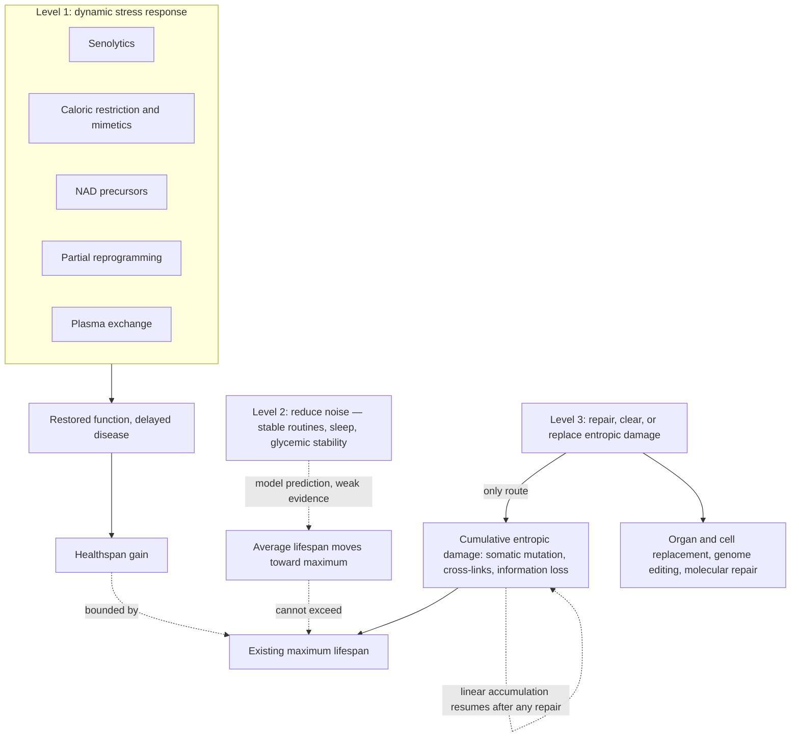

# Can current rejuvenation therapies raise maximum lifespan?

Three outcomes are routinely conflated under the heading of life extension: reducing the risk of a specific disease, raising *average* lifespan toward the observed human maximum, and raising the *maximum* itself. The contested question is whether the interventions currently in development — senolytics, caloric restriction and its mimetics, NAD precursors, partial cellular reprogramming, plasma exchange — can do the third, or whether they are structurally confined to the first two. The disagreement is not about whether these interventions do anything. It is about what class of thing they do. [[biological-age-reversal]] handles the parallel question of what counts as reversal at the level of measurement.

## The restrictive position: level 1 has a ceiling

The minimal model of Peter Fedichev and Jan Gruber assigns aging to three macroscopic variables and sorts interventions by which one they move. Its central claim about current therapeutics is that senolytics, caloric restriction, NAD boosters, and cellular reprogramming all act on the same variable — the dynamic stress response, the reversible component — and therefore share a ceiling: they can restore function and prevent disease without touching the thermodynamic arrow of aging. Maximum lifespan is set by cumulative entropic damage, which accumulates linearly and irreversibly; only interventions that repair, remove, or replace that damage (level 3) can move it. An intermediate level 2, reducing physiological noise through stable routines, consistent sleep, and steady blood sugar, is predicted to move individuals closer to the maximum — a modeled 30 to 40 years for a given person — without raising the maximum itself. (@TheSheekeyScienceShow (The Sheekey Science Show) — "the 3 levels of aging therapeutics", 2026-02-08, [link](https://www.youtube.com/watch?v=c-_Pdp5IIvw))

The placement of cellular reprogramming in level 1 is the position's most surprising and most contestable element, since reprogramming is usually presented as the paradigm rejuvenation technology. The argument is that although reprogramming visibly resets DNA-methylation marks toward a youthful state, the marks that move appear to be those driven by the reversible dynamic component rather than the entropic one — and that reprogramming does nothing at all about somatic mutations, which accumulate linearly with age. Heterochronic parabiosis is offered as a parallel case with the same signature: connecting old mice to young mice improved stress markers while leaving entropy markers unchanged. The prediction for the Life Biosciences ocular reprogramming programme entering human trials is correspondingly specific — it may restore function, but the eye itself will continue to age, and eventually replacement would be more effective than reprogramming. (@TheSheekeyScienceShow (The Sheekey Science Show) — "the 3 levels of aging therapeutics", 2026-02-08, [link](https://www.youtube.com/watch?v=c-_Pdp5IIvw))

Sheekey's own contrarian conclusion follows the logic to its uncomfortable end: if you want to live longer and healthier, you probably do just need to replace your organs — while acknowledging this is impractical for most tissues and would require organs derived from a person's own material to avoid rejection. She is simultaneously skeptical of the model's own level 2, on the grounds that the evidence for noise reduction adding decades is lacking. (@TheSheekeyScienceShow (The Sheekey Science Show) — "the 3 levels of aging therapeutics", 2026-02-08, [link](https://www.youtube.com/watch?v=c-_Pdp5IIvw))

## The permissive position: the boundary is not established

The opposing view does not defend a specific mechanism so much as deny that the partition has been demonstrated. Several objections stand.

The assignment of interventions to variables is inferred from curve-fitting to biomarker dynamics, not from experiments showing that an intervention class cannot move the entropic component. Classifying reprogramming as level 1 rests on interpreting which methylation marks change, and [[epigenetic-alterations-and-reprogramming]] documents that methylation clocks are statistical constructions whose components are not cleanly partitioned into reversible and irreversible categories to begin with. Nor is the distinction between restoring function and reversing damage as clean as the model requires: a rejuvenated cell might clear damage in its environment, which would move a level-1 intervention into level-3 territory — a possibility Sheekey herself raises while noting the evidence for it is currently lacking. (@TheSheekeyScienceShow (The Sheekey Science Show) — "the 3 levels of aging therapeutics", 2026-02-08, [link](https://www.youtube.com/watch?v=c-_Pdp5IIvw))

The elastin-fragment work in [[extracellular-matrix-aging]] supplies a concrete case that resists the partition: blocking a matrix-fragment receptor extended mouse lifespan, and did so additively with rapamycin. A damage species that is simultaneously accumulated structural injury and an active signaling ligand does not sit comfortably on either side of a damage-versus-dynamics line. (@TheSheekeyScienceShow (The Sheekey Science Show) — "This years biggest breakthroughs in longevity! (2025)", 2025-12-21, [link](https://www.youtube.com/watch?v=X-Hzyzo1Jpk))

The repair-portfolio position recorded in [[biological-age-reversal]] — that no single therapy will reverse the whole system, and that healthspan extension requires repairing distinct damage classes in the same person — is compatible with the restrictive model's diagnosis while rejecting its pessimism about the near term. On that view level 3 is not a distant technology but the explicit programme of damage-repair research already underway.

## A third reading: the exponential-decay argument

A position from drug development shares the restrictive model's pessimism about incremental gains while reaching an opposite prescription. On this account humans are physiologically fairly stable through most of adult life and then enter an exponential decline from roughly the sixth decade, earlier in some people and later in others. The consequence drawn is that curing individual age-related diseases would add relatively few years of healthy life, because the decline is a general collapse of the system rather than the sum of separable diseases. The prescription is therefore neither disease-by-disease treatment nor eventual organ replacement, but preventing the decline in an otherwise healthy population — treating people before systems have broken down, when restoring them is far harder. This is offered as the rationale for a stated goal of adding ten years to human life. (@TheSheekeyScienceShow (The Sheekey Science Show) — "OpenAI Meets Longevity: Inside the Retro Biosciences Partnership That Beat Evolution", 2025-09-12, [link](https://www.youtube.com/watch?v=dwWjpKzBNnY))

The argument is a mortality-curve intuition rather than a demonstrated partition, and it is compatible with either side of the main dispute — an intervention that flattens the exponential phase could be raising average lifespan toward an unchanged maximum, which is exactly what the restrictive position permits. Its genuine contribution is the observation that preventive administration in healthy people is a different trial design, with different endpoints and a far longer readout, than treating established disease. Meinl's own concession names the resulting difficulty: proxy indications establish safety on a workable timescale, while trials for healthspan in humans take longer and may need different approaches, and "time is not our friend." (@TheSheekeyScienceShow (The Sheekey Science Show) — "OpenAI Meets Longevity: Inside the Retro Biosciences Partnership That Beat Evolution", 2025-09-12, [link](https://www.youtube.com/watch?v=dwWjpKzBNnY))

## The stable-versus-unstable species argument

A distinct claim within the restrictive position has consequences well beyond this debate, because it bears on the interpretation of essentially all preclinical longevity data. Analysis of longitudinal blood data from the mouse phenome database is reported to show that the temporal autocorrelation function in mice is essentially flat across life: mice show no restoring force pulling biomarkers back to baseline after perturbation, and their markers diverge exponentially. Humans instead show a temporal autocorrelation that decays slowly in age, with divergence that is hyperbolic rather than exponential, extrapolating to zero resilience around 120 years. Mice are therefore classified as dynamically *unstable* species and humans as *stable* ones. (@TheSheekeyScienceShow (The Sheekey Science Show) — "the 3 levels of aging therapeutics", 2026-02-08, [link](https://www.youtube.com/watch?v=c-_Pdp5IIvw))

The translational consequence is severe: an intervention that supplies stabilization to an animal that had none should look dramatic, while the same intervention in an already-stable human should look modest. This is offered as an explanation for why rapamycin extends mouse lifespan substantially and appears to have far more modest effects in humans — and, more consequentially, for why most cellular-reprogramming work, having been done in mice, may overstate what reprogramming can do in people. [[mtor-and-rapamycin]] records the parallel human evidence, which is genuinely modest, though the human trials tested narrow immune and functional endpoints rather than lifespan, so they cannot distinguish this explanation from simple dose, duration, and endpoint mismatch.

If the stability argument is right, most preclinical longevity screening is calibrated on the wrong regime. If it is wrong, the field's model organisms remain informative and the argument has retired a large body of evidence on the strength of an autocorrelation analysis. The dispute is currently unresolved: it turns on longitudinal data quality, sampling frequency, and measurement error in exactly the way [[aging-dynamics-and-resilience]] describes, and no independent replication is cited.

## What would settle it

The debate is decidable in principle. The restrictive position predicts that level-1 interventions produce effects that decay after withdrawal, compress mortality without extending the tail of the survival curve, and fail to alter markers of somatic mutation or protein cross-linking. The permissive position predicts that at least one such intervention will move an entropic marker, or that maximum-lifespan effects will appear where the model forbids them. Both predictions require what does not currently exist: validated measurements of the three proposed variables. Sheekey identifies this as the model's core practical difficulty — whether the temporal autocorrelation variable and system noise can be measured reliably at all is unknown. A framework whose variables cannot be measured cannot yet adjudicate the interventions it classifies. (@TheSheekeyScienceShow (The Sheekey Science Show) — "the 3 levels of aging therapeutics", 2026-02-08, [link](https://www.youtube.com/watch?v=c-_Pdp5IIvw))

One concrete test of the restrictive prediction is already scheduled in an animal model. The replication described in [[plasma-derived-extracellular-particles]] plans, conditional on positive rejuvenation results, to keep treated rats alive and continue dosing every three months for at least a further twelve months to obtain a survival readout — the original experiment killed its animals at five months, so no survival data exists. A circulating-factor intervention belongs to the restrictive model's level 1, so it should restore function while leaving the survival ceiling intact; treated rats passing the maximum lifespan of their species would be direct evidence against the partition, while functional gains with an unchanged ceiling would support it. [[pig-plasma-fraction-rejuvenation]] (@TheSheekeyScienceShow (The Sheekey Science Show) — "Reproducing Rejuvenation: Inside the Pig Plasma Longevity Experiments", 2025-08-22, [link](https://www.youtube.com/watch?v=Q-lS1UMHG1o))

## Practical implications

- **Ask which outcome class an intervention claims before assessing whether it works — strong as a reasoning discipline.** Disease-risk reduction, average-lifespan gain, and maximum-lifespan gain carry different evidentiary requirements, and marketing routinely substitutes the first for the third.
- **Do not treat this debate as a reason to discount level-1 interventions — the healthspan claim is the one with the most support.** Preventing disease and restoring function is what current therapeutics plausibly offer, and it is worth having whether or not the maximum ever moves.
- **Note that the model's level 2 recommendations — stable routines, consistent sleep, steady blood sugar — coincide with established advice arrived at by other routes.** Follow them on the strength of that established evidence ([[sleep-quality-and-circadian-alignment]], [[practice-playbook]]), not on the modeled 30-to-40-year projection, which Sheekey herself regards as poorly evidenced. (@TheSheekeyScienceShow (The Sheekey Science Show) — "the 3 levels of aging therapeutics", 2026-02-08, [link](https://www.youtube.com/watch?v=c-_Pdp5IIvw))
- **Discount mouse lifespan results somewhat when the mechanism is stabilization or stress-response restoration — moderate, contested.** The stable-versus-unstable species argument is not established, but it is a specific and plausible reason that a class of mouse results may not transfer.

## Gaps & open questions

- Can the three proposed variables be measured reliably enough in individual humans to classify an intervention empirically rather than by argument?
- Does any level-1 intervention measurably reduce somatic mutation burden, protein cross-linking, or another entropic marker?
- Do the effects of senolytics, reprogramming, or plasma exchange persist after withdrawal, and by how much do they decay?
- Is the flat mouse temporal autocorrelation a real biological difference or an artifact of sampling frequency and measurement error in the source data?
- Can rejuvenated cells clear damage in their environment, which would break the level-1/level-3 partition?
- Does the human resilience extrapolation to ~120 years reflect a hard limit or the properties of the biomarkers that were measured?
- Is organ replacement from autologous material a realistic route at scale, and what does it imply for the brain, which cannot be replaced?
- Is late-life decline genuinely an exponential system collapse rather than the sum of separable diseases, and would flattening it raise the maximum or only move people toward it?
- Can preventive treatment of healthy people be tested on any feasible timescale, given that proxy indications establish safety but not healthspan?

## Related

[[aging-dynamics-and-resilience]] · [[hallmarks-of-aging]] · [[biological-age-reversal]] · [[epigenetic-alterations-and-reprogramming]] · [[engineered-reprogramming-factors]] · [[circulating-rejuvenation-signaling]] · [[plasma-derived-extracellular-particles]] · [[pig-plasma-fraction-rejuvenation]] · [[cellular-senescence]] · [[extracellular-matrix-aging]] · [[therapeutic-plasma-exchange]] · [[mtor-and-rapamycin]] · [[nad-supplementation]] · [[caloric-restriction-and-meal-timing]] · [[biological-age-biomarkers]] · [[longevity-intervention-prioritization]] · [[aging-model]]
