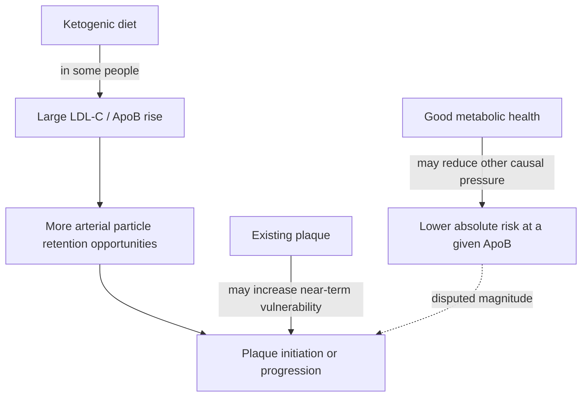

# Does metabolic health neutralize high ApoB on a ketogenic diet?

ApoB-containing lipoproteins participate causally in atherosclerosis, while blood pressure, smoking, diabetes, inflammation, and existing plaque modify absolute cardiovascular risk. The live disagreement is narrower: whether exceptionally high diet-induced ApoB in a metabolically healthy person produces materially less plaque than the same ApoB burden in a metabolically unhealthy person, and whether that difference is large enough to change treatment.

## Competing positions

The **cumulative-exposure position** treats ApoB particle burden as a causal driver whose risk is not cancelled by favorable insulin, triglycerides, HDL, fitness, or body composition. Those factors change absolute risk, but do not make high ApoB biologically inert.

The **effect-modification position**, associated here with Tommy Wood, accepts that ApoB is necessary to atherogenesis but questions whether it is sufficient and how strongly metabolic context changes progression. Observational studies suggest lower cardiovascular risk at a given LDL-C or ApoB among metabolically healthier people, but such comparisons cannot establish safety under extreme, diet-induced exposures. Wood also rejects interpreting the available ketogenic-diet imaging study as blanket reassurance: individual progression was heterogeneous, some metabolically healthy participants progressed rapidly, and baseline plaque appeared related to the fastest progression. (@matt.kaeberlein (Healthspan Medicine) — "Neuroscientist Reveals What's Actually Working for Brain Longevity (with Dr. Tommy Wood)", 2026-04-05, [link](https://www.youtube.com/watch?v=XXmZtn4R0Ow))

Ketosis and metabolic health are not synonyms. A ketogenic diet can stabilize glucose while excess energy intake still increases visceral fat and leaves insulin resistance or inflammatory risk unresolved. Conversely, a ketogenic diet may be medically valuable for seizure control, creating a genuine tradeoff when LDL-C or ApoB rises dramatically. (@matt.kaeberlein (Healthspan Medicine) — "Neuroscientist Reveals What's Actually Working for Brain Longevity (with Dr. Tommy Wood)", 2026-04-05, [link](https://www.youtube.com/watch?v=XXmZtn4R0Ow))

## Practical implications

- **Do not assume favorable glucose, triglycerides, or fitness neutralizes a major ApoB increase — strong precaution, contested magnitude of residual risk.** Measure lipids before and after a major diet change and assess absolute risk with a clinician.
- **If ApoB becomes very high or plaque is already present: reconsider diet composition and established lipid-lowering options — moderate-to-strong.** Existing plaque plus higher particle burden is a particularly poor setting for reassurance from group averages.
- **When ketogenic therapy controls epilepsy: use shared decision-making across neurology and cardiovascular care — strong.** The neurological benefit and cardiovascular uncertainty must both remain visible.
- **Do not use serial plaque imaging casually or at an invented universal cadence — moderate caution.** Whether and when imaging changes management depends on baseline risk, radiation or test burden, and clinical guidance.

## Gaps & open questions

- How much does metabolic health modify risk at extreme diet-induced ApoB levels after accounting for confounding and duration of exposure?
- Which baseline features predict rapid plaque progression in ketogenic-diet hyper-responders?
- Are diet-induced and genetically elevated ApoB equivalent at the arterial wall for the same cumulative exposure?
- What monitoring strategy best balances early detection, radiation, cost, and actionable information?

## Related

[[pcsk9-inhibition]] · [[nmr-blood-analysis]] · [[caloric-restriction-and-meal-timing]] · [[aging-model]] · [[practice-playbook]]
