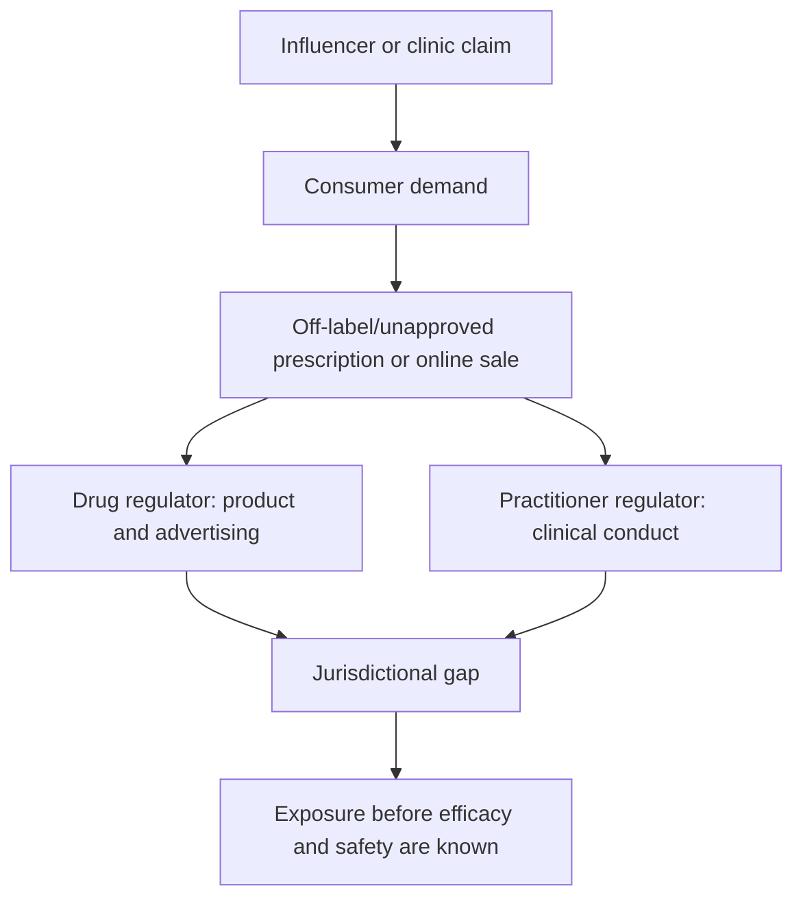

# Longevity clinics and the evidence gap

The central governance problem in consumer longevity medicine is a mismatch among plausible mechanisms, clinical evidence, product quality, and legal availability. A lawful prescription of an unapproved product may reflect clinician discretion without demonstrating efficacy; a compounded product may improve traceability without becoming an approved drug. (@ABCNewsIndepth (ABC News In-depth) — "The health trends outpacing regulation and putting people at risk | Four Corners Documentary", 2026-07-20, [link](https://www.youtube.com/watch?v=77TTDkR3nbI))

## Competing positions

The permissive position holds that informed patients and clinicians should be able to accept uncertainty to innovate and that regulated compounding may displace dirtier black-market supply. The precautionary position holds that consent cannot substitute for missing human trials, especially where commercial framing turns speculation into apparent care and invasive delivery adds immediate risk. Kaeberlein and Ranney agree that a compounding decision does not change the efficacy evidence; they differ mainly in how much room self-experimentation should retain. (@mkaeberlein (Matt Kaeberlein) — "Longevity Science Update: The Biggest Stories in Longevity Medicine — July 2026", 2026-07-31, [link](https://www.youtube.com/watch?v=A0xNnGsGAJg))

Australia illustrates fragmented oversight: the TGA regulates therapeutic goods and advertising, while AHPRA regulates practitioners. The documentary found clinics prescribing unapproved products after telehealth review and noted regulator concern that practitioners may put profit ahead of patients. Nearly 100 Australian longevity-related operators were identified, but this count does not establish misconduct by the sector as a whole. (@ABCNewsIndepth (ABC News In-depth) — "The health trends outpacing regulation and putting people at risk | Four Corners Documentary", 2026-07-20, [link](https://www.youtube.com/watch?v=77TTDkR3nbI))

Two further pressure points on this gap deserve recording. The first is compassionate-use access: pathways designed for patients with imminently fatal conditions and no remaining options can in principle be reached with evidence from a single species, and a group planning human use of an uncharacterized rejuvenation preparation has named that route explicitly as its entry point for 2028. Aging is not an imminently fatal condition with exhausted alternatives, so this is a route whose criteria fit poorly what it would be used for. [[plasma-derived-extracellular-particles]] (@TheSheekeyScienceShow (The Sheekey Science Show) — "Reproducing Rejuvenation: Inside the Pig Plasma Longevity Experiments", 2025-08-22, [link](https://www.youtube.com/watch?v=Q-lS1UMHG1o))

The second is that the evidence gap has a cost the sector does not bear individually. Sentiment analysis of longevity discourse finds unproven products — advertisements promising to make a buyer decades younger — functioning as a direct input to public scepticism, with resemblance to earlier manias driving the reaction. On that account each clinic selling ahead of the evidence draws down a shared reserve of public trust that the whole field, including its legitimate research, depends on for funding and regulatory tolerance. [[public-trust-in-longevity-science]] (@TheSheekeyScienceShow (The Sheekey Science Show) — "Does Longevity Have a Culture Problem? Mapping Public Trust in Life Extension Science", 2025-10-13, [link](https://www.youtube.com/watch?v=bnUPDSe-YXI))

## Practical implications

Before any invasive longevity service, require the exact regulatory status, human trial evidence, product source and assay, prescriber credentials, adverse-event plan, total cost, and plausible alternatives. Apply this checklist at each new treatment and at every renewal. Strong evidence supports avoiding black-market injectables; evidence for most clinic-marketed longevity infusions and experimental peptide stacks is weak or absent. (@ABCNewsIndepth (ABC News In-depth) — "The health trends outpacing regulation and putting people at risk | Four Corners Documentary", 2026-07-20, [link](https://www.youtube.com/watch?v=77TTDkR3nbI))

## Gaps & open questions

- What are complication and complaint rates across clinic types?
- Does regulated compounding reduce overall harm or legitimize ineffective treatment?
- Which consent and advertising standards communicate uncertainty effectively?
- Should compassionate-use pathways be available for interventions targeting aging rather than a specific fatal disease?
- How much measurable public scepticism toward legitimate aging research is attributable to clinic and supplement marketing?

## Related

[[experimental-peptides]] · [[nad-supplementation]] · [[biological-age-biomarkers]] · [[plasma-derived-extracellular-particles]] · [[public-trust-in-longevity-science]] · [[replication-and-research-incentives]] · [[practice-playbook]]
