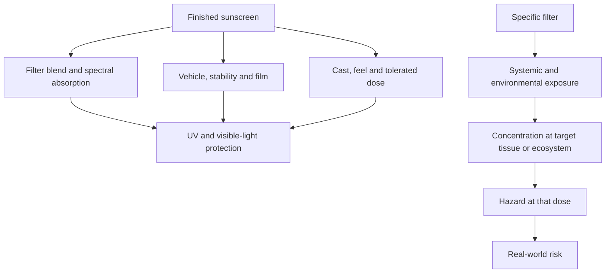

# Mineral and organic sunscreens

The mineral-versus-organic sunscreen debate asks whether zinc oxide and titanium dioxide are intrinsically safer, more protective, or more environmentally responsible than carbon-based UV filters often called chemical filters. Those category claims are too coarse: protection belongs to the finished spectrum and film, safety belongs to filter-specific dose and exposure, and environmental risk belongs to concentration in a particular ecosystem. (@LabMuffinBeautyScience (Lab Muffin Beauty Science) — "Debunking this year's top sunscreen myths", 2026-05-23, [link](https://www.youtube.com/watch?v=wATBG1X7HX4))

## Where the categories do and do not differ

Both mineral and organic filters protect mainly by absorbing UV and dissipating its energy; the additional heat is too small to establish a pigment-worsening advantage for minerals. Zinc oxide has broad but relatively low absorption per amount, while organic filters can be blended to build high protection across selected bands. High mineral loading can create cast, heaviness, settling, and underapplication. Conversely, a user may prefer and reliably apply a mineral product. The operative comparison is therefore finished-product spectrum, stability, wear, and adherence—not reflection versus absorption. (@LabMuffinBeautyScience (Lab Muffin Beauty Science) — "Debunking this year's top sunscreen myths", 2026-05-23, [link](https://www.youtube.com/watch?v=wATBG1X7HX4))

Visible-light protection illustrates the category error. Iron oxides absorb blue visible wavelengths because their orange-brown tint removes complementary blue light; tinted mineral and tinted organic products can both perform well, while untinted products of either class generally do little. Some nominally mineral products also contain non-listed SPF boosters structurally and functionally similar to organic filters, further weakening a binary label. (@LabMuffinBeautyScience (Lab Muffin Beauty Science) — "Debunking this year's top sunscreen myths", 2026-05-23, [link](https://www.youtube.com/watch?v=wATBG1X7HX4))

## Safety disagreement

The precautionary position emphasizes FDA maximal-use studies showing measurable blood concentrations after topical application, persistence of some filters, and endocrine effects at sufficient doses in animal experiments; proponents recommend mineral filters to avoid an exposure they regard as unnecessary. The toxicological position distinguishes detection from harm: a molecule in blood matters only if exposure reaches a biologically active dose, animal effect levels help define limits, and regulators apply large uncertainty margins when translating those data to permitted human use. Lab Muffin adopts the latter position and notes that European assessors reconsidered commonly used US organic filters with systemic absorption included; her numerical oxybenzone illustration is an explanatory interpretation of a regulatory margin, not new clinical outcome evidence. (@LabMuffinBeautyScience (Lab Muffin Beauty Science) — "Debunking this year's top sunscreen myths", 2026-05-23, [link](https://www.youtube.com/watch?v=wATBG1X7HX4))

Neither side can legitimately promise absolute safety. Minerals undergo safety assessment too, all substances have dose-dependent toxicity, and poor acceptability can indirectly increase UV harm by reducing application. Evidence described in the transcript supports regulatory toxicology more directly than it supports long-term randomized comparisons of endocrine or neurologic outcomes in sunscreen users; the latter remain an evidence gap. (@LabMuffinBeautyScience (Lab Muffin Beauty Science) — "Debunking this year's top sunscreen myths", 2026-05-23, [link](https://www.youtube.com/watch?v=wATBG1X7HX4))

## Environmental disagreement

The reef-harm position traces much public concern to experiments and environmental measurements suggesting oxybenzone could damage coral near observed concentrations. Lab Muffin's contrarian interpretation, drawing on a 2022 National Academies review described in the transcript, is that the influential 2015 exposure and toxicity results were outliers, that mineral and organic filters overlap in laboratory toxicity, and that sunscreen is far below ocean warming among drivers of reef bleaching. Individual sunscreen substitution is especially unlikely to matter away from direct proximity to coral; this does not prove zero local effect, because realistic exposure data remain sparse. (@LabMuffinBeautyScience (Lab Muffin Beauty Science) — "Debunking this year's top sunscreen myths", 2026-05-23, [link](https://www.youtube.com/watch?v=wATBG1X7HX4))

## Practical implications

- **At purchase: choose the finished product you can apply generously and repeatedly — strong for adherence, moderate for comparative performance.** Do not reject an otherwise suitable product solely because its filters are mineral or organic; prioritize broad spectrum, water resistance for the activity, comfort, and reliable provenance. (@LabMuffinBeautyScience (Lab Muffin Beauty Science) — "Debunking this year's top sunscreen myths", 2026-05-23, [link](https://www.youtube.com/watch?v=wATBG1X7HX4))
- **For visible-light-sensitive pigmentation: choose tint and adequate UVA performance rather than a mineral label — moderate.** Iron oxides are the relevant visible-light component. (@LabMuffinBeautyScience (Lab Muffin Beauty Science) — "Debunking this year's top sunscreen myths", 2026-05-23, [link](https://www.youtube.com/watch?v=wATBG1X7HX4))
- **When evaluating a safety claim: ask for filter, dose, route, endpoint, and regulatory exposure margin — strong reasoning principle; outcome evidence varies.** Blood detection or an animal hazard at high dose is not by itself a demonstrated human harm at labeled use. (@LabMuffinBeautyScience (Lab Muffin Beauty Science) — "Debunking this year's top sunscreen myths", 2026-05-23, [link](https://www.youtube.com/watch?v=wATBG1X7HX4))
- **Near fragile reefs: follow local rules and reduce product release where practical, but do not treat a mineral purchase as a climate intervention — moderate, with substantial ecological uncertainty.** Clothing and shade can reduce both UV exposure and sunscreen entering water. (@LabMuffinBeautyScience (Lab Muffin Beauty Science) — "Debunking this year's top sunscreen myths", 2026-05-23, [link](https://www.youtube.com/watch?v=wATBG1X7HX4))

## Gaps & open questions

- What long-term human endocrine, reproductive, and neurologic outcomes accompany real-world cumulative exposure to each filter?
- How accurately do regulatory maximal-use assumptions represent children, pregnancy, damaged skin, and whole-body daily use?
- What concentrations of individual filters and mixtures reach reefs under realistic hydrology, and what chronic effects occur amid warming, pollution, and disease?
- Which tinted formulations provide reproducible visible-light protection across skin tones without reducing applied amount?

## Related

[[photoprotection]] · [[skincare-evidence-and-routine-design]] · [[environmental-pollution-and-health]] · [[aging-model]] · [[practice-playbook]]
