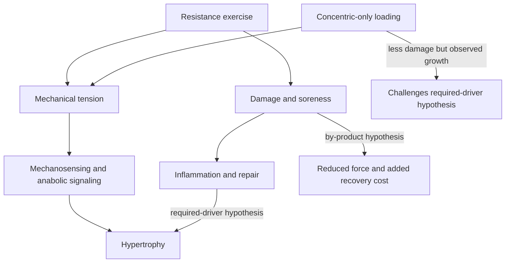

# Is muscle damage required for hypertrophy?

Resistance exercise can produce mechanical tension, metabolic disturbance, microscopic damage, inflammation, and delayed soreness at the same time. The debate is whether damage is an independent causal requirement for muscle growth or a frequent by-product of the loading that actually drives it. The distinction matters because deliberately maximizing damage increases soreness and recovery cost; if damage is not causal, that cost need not buy additional hypertrophy. (@drandygalpin (Andy Galpin) — "What Drives Muscle Growth & What Doesn't | Dr. Mike Roberts", 2026-07-08, [link](https://www.youtube.com/watch?v=CoU8-R0Id-g))

## Required-driver position

The traditional model holds that eccentric loading produces microtears whose repair makes muscle larger. The existing [[resistance-training]] chapter previously expressed a version of this position by describing eccentric stress and microtears as the primary hypertrophy stimulus. Eccentric actions can create high tension and often produce more damage, so observations that eccentric training grows muscle are compatible with the model; they do not isolate damage from tension. (Peter Attia MD — "Building strength and muscle mass: optimize training & nutrition for longevity (AMA #71 rebroadcast)", 2026-07-06, [link](https://www.youtube.com/watch?v=CqNqfb37gig)) (@drandygalpin (Andy Galpin) — "What Drives Muscle Growth & What Doesn't | Dr. Mike Roberts", 2026-07-08, [link](https://www.youtube.com/watch?v=CoU8-R0Id-g))

## By-product position

Mike Roberts's position is that mechanical tension is the prevailing driver and that damage is not required. He points to concentric-only comparisons that produced hypertrophy, meta-analytic evidence he recalls as finding no necessity for an eccentric component, and the absence of a meaningful relationship between soreness and later growth. Damage produced without an adequate loading signal has a different molecular signature, while soreness can rise simply because a useful mechanical stimulus was unfamiliar. The source itself notes uncertainty in recalling individual citations, so the direction of the evidence is more secure here than any exact effect estimate. (@drandygalpin (Andy Galpin) — "What Drives Muscle Growth & What Doesn't | Dr. Mike Roberts", 2026-07-08, [link](https://www.youtube.com/watch?v=CoU8-R0Id-g))

The disagreement does not imply that eccentric training is useless. Eccentrics can supply large forces, train lengthening capacity, and support other goals; the narrower conclusion is that soreness and tissue disruption should not be optimized as proxies for growth. The same reasoning cautions against interpreting an absence of soreness as a failed workout.

## Practical implications

- **Program for progressive tension and recoverable hard work two or more times weekly, not for maximal soreness — moderate-to-strong for hypertrophy; strong load-management rationale.** (@drandygalpin (Andy Galpin) — "What Drives Muscle Growth & What Doesn't | Dr. Mike Roberts", 2026-07-08, [link](https://www.youtube.com/watch?v=CoU8-R0Id-g))
- **Use controlled concentric and eccentric phases according to the exercise and goal, but do not add pure eccentric work solely because damage is assumed necessary — moderate.** Eccentric-specific strength, tendon, or rehabilitation goals may justify it independently. (@drandygalpin (Andy Galpin) — "What Drives Muscle Growth & What Doesn't | Dr. Mike Roberts", 2026-07-08, [link](https://www.youtube.com/watch?v=CoU8-R0Id-g))
- **After each session, judge dose mainly by logged performance, progression, pain, and recovery; treat soreness as a weak secondary signal — moderate.** (@drandygalpin (Andy Galpin) — "What Drives Muscle Growth & What Doesn't | Dr. Mike Roberts", 2026-07-08, [link](https://www.youtube.com/watch?v=CoU8-R0Id-g))

## Gaps & open questions

- At matched fiber tension, recruitment, volume, and range, does additional damage change long-term hypertrophy?
- Do eccentric-only and concentric-only programs produce equal growth across muscles, training ages, and study durations?
- Is some repair signaling permissive for growth even if the magnitude of damage does not predict growth?
- Which biomarkers distinguish productive remodeling from damage that merely consumes recovery capacity?

## Related

[[skeletal-muscle-hypertrophy]] · [[resistance-training]] · [[training-frequency-and-hypertrophy]] · [[tendon-adaptation-and-rehabilitation]]
