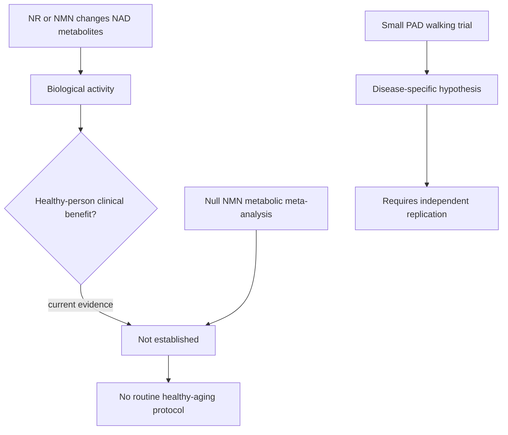

# Do NAD precursors have a use case in healthy people?

The live question is narrower than “does NAD biology matter?” NR and NMN alter the human NAD metabolome, and disease-specific trials can reasonably continue. The question is whether any patient-important benefit has been shown in people without a relevant disease or deficiency state. As of 2026-09-01, it has not. [[nad-supplementation]] contains the intervention detail; [[nad-metabolism]] covers the biology.

## Strongest fair synthesis

The affirmative case is that oral precursors consistently change NAD metabolites, short trials have generally been tolerated, some inflammatory biomarkers move in favorable directions, and a 90-person peripheral-artery-disease trial found a 17.6 m six-minute-walk advantage with NR versus placebo. A low-cost intervention with biological activity could plausibly benefit a responder subgroup before a mortality trial is feasible.[^mcdermott-2024]

The skeptical case is stronger for healthy use. PAD is symptomatic vascular disease, the trial was small and used a prespecified one-sided 90% confidence procedure, and the result has not been independently replicated. In mostly healthy middle-aged and older adults, an eight-trial NMN meta-analysis found no significant benefit for glucose, insulin, HbA1c, insulin resistance, or lipids; a physical-performance review found nonsignificant changes. Blood-NAD and inflammatory-marker changes remain unvalidated surrogates.[^chen-2024][^wen-2024]

## Adversarial pass and evidence conflicts

- **What would falsify the current skeptical conclusion:** replicated trials in healthy or generally healthy adults showing a clinically meaningful improvement in function, symptoms, infection incidence, disease events, or quality of life, with adequate duration and independent manufacture.
- **Population mismatch:** signals from PAD, COPD, Parkinson disease, or inflammatory states cannot be generalized to healthy aging. They may identify the population in which treatment is worth testing.
- **Outcome mismatch:** NAD-metabolite and cytokine changes do not establish slower aging, and no validated surrogate connects them to lifespan.
- **Source dependence and conflicts:** several influential NR studies involve pathway discoverers, patent holders, or manufacturer support. That does not invalidate the trials, but it raises the value of independent replication.
- **Negative evidence:** short NMN trials are broadly null for common metabolic outcomes and do not show meaningful physical-performance improvement.
- **Alternate explanation:** apparent responders may have low baseline status, disease-related consumption, regression to the mean, training changes, or expectancy effects rather than a general age-related deficiency.

## Evidence update — 2026-09-01

> **What changed:** The old page described anti-inflammatory activity as “proven” and framed the debate as whether it already justified routine healthy use. That overstated the clinical implication of biomarkers. The revised debate treats pharmacodynamic activity as established but healthy-person benefit as unestablished. A new proprietary oral-NAD phase 0/1b study also shows why transport arguments alone cannot settle the question: changing blood intracellular NAD still does not demonstrate a health outcome.[^renewal-2026]

## Resolution

No routine NR, NMN, oral NAD, or IV NAD protocol is admitted for healthy aging. This is not a claim of proven zero effect; it is a decision under uncertainty in which no patient-important benefit, target population, dose, duration, or long-term safety boundary has been established. The PAD result remains a credible, disease-specific research signal.

## Gaps & open questions

- Does the PAD result replicate with conventional two-sided inference and stronger adherence?
- Can baseline NAD metabolism or inflammatory status prospectively identify responders?
- Will any independent healthy-adult trial improve a patient-important endpoint rather than a biomarker?

## Related

[[nad-supplementation]] · [[nad-metabolism]] · [[charles-brenner]] · [[inflammaging-and-il-6]] · [[supplement-evidence-and-safety]] · [[longevity-intervention-prioritization]] · [[healthspan-versus-maximum-lifespan]] · [[practice-playbook]]

## References

[^mcdermott-2024]: McDermott MM, et al. “Nicotinamide Riboside for Peripheral Artery Disease: The NICE Randomized Clinical Trial.” *Nature Communications*, 2024. [phase 2 RCT]. [doi:10.1038/s41467-024-49092-5](https://doi.org/10.1038/s41467-024-49092-5)
[^chen-2024]: Chen X, et al. “Effect of Nicotinamide Mononucleotide Supplementation on Metabolic Parameters: A Systematic Review and Meta-analysis.” *Current Diabetes Reports*, 2024. [systematic review and meta-analysis]. [doi:10.1007/s11892-024-01557-z](https://doi.org/10.1007/s11892-024-01557-z)
[^wen-2024]: Wen Y, et al. “Nicotinamide Mononucleotide Supplementation and Physical Performance.” *Cureus*, 2024. [systematic review]. [doi:10.7759/cureus.65961](https://doi.org/10.7759/cureus.65961)
[^renewal-2026]: “RENEWAL-NAD+: Oral NAD Pharmacokinetics and Pharmacodynamics.” 2026. [industry-supported phase 0/1b trial]. [PubMed](https://pubmed.ncbi.nlm.nih.gov/42530810/)
