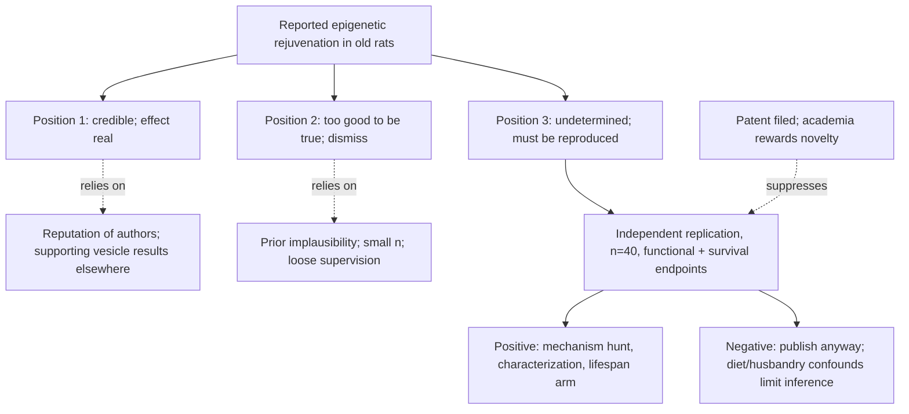

# Did concentrated pig plasma rejuvenate rats?

A 2020 preprint reported that injecting a concentrated plasma fraction from young pigs into old rats produced roughly 54% epigenetic rejuvenation as measured by methylation clock, with Steve Horvath as first author and Harold Katcher as the originator of the approach. A peer-reviewed publication some years later, using a different method, reported a considerably smaller average figure of 6 to 7%, higher in some organs. The magnitude of the original claim — among the largest rejuvenation effects ever reported in a mammal — is the reason it has neither been quietly absorbed into the literature nor dismissed. Six years on, the question of whether it is real remains open. The preparation and the ongoing replication are described in [[plasma-derived-extracellular-particles]]; the mechanism it presupposes is in [[circulating-rejuvenation-signaling]]. (@TheSheekeyScienceShow (The Sheekey Science Show) — "Reproducing Rejuvenation: Inside the Pig Plasma Longevity Experiments", 2025-08-22, [link](https://www.youtube.com/watch?v=Q-lS1UMHG1o))

## The positions

**That the result is credible.** The supporting arguments are indirect but not empty. Steve Horvath's standing in the field makes it improbable that he would attach his name as first author to a fabricated result — a reputational rather than evidentiary argument, but a real constraint on the fraud hypothesis. Aubrey de Grey, asked directly, declined to dismiss it, arguing that too good to be true is not itself an argument while noting that the work had been performed in India without close supervision. Separately, an independent Spanish group reported that small vesicles derived from human plasma reduced fibrosis in the heart and other organs of old rats, which supplies convergent support for the general class of effect. (@TheSheekeyScienceShow (The Sheekey Science Show) — "Reproducing Rejuvenation: Inside the Pig Plasma Longevity Experiments", 2025-08-22, [link](https://www.youtube.com/watch?v=Q-lS1UMHG1o))

**That the result should be dismissed.** The skeptical case rests on prior implausibility and the conditions of the original experiment: an effect size far outside anything the field has produced, roughly six animals, an unsupervised setting, and a three-and-a-half-year delay before the composition of the injected material was disclosed. Josh Mitteldorf's blog treatment of Katcher's work is cited as an early skeptical reference point. The field's response is described as bimodal — enthusiasts on one side and people unwilling to hear the name on the other. (@TheSheekeyScienceShow (The Sheekey Science Show) — "Reproducing Rejuvenation: Inside the Pig Plasma Longevity Experiments", 2025-08-22, [link](https://www.youtube.com/watch?v=Q-lS1UMHG1o))

**That the question is simply undetermined.** The position taken by the Rejuvenation Science Institute is explicitly a third option: "we still don't know if it's true," with several hints that it might be. This is the epistemically correct posture for a claim of this size with this evidence, and it is rarer than it should be — it requires tolerating an open question for years rather than resolving it by disposition. Nicolás describes arriving at it by investigation rather than instinct: expecting five minutes of checking to reveal the claim as unserious, and still not knowing five years later. The intended resolution is neither argument nor authority but reproduction: "the person I want to convince first is me". (@TheSheekeyScienceShow (The Sheekey Science Show) — "Reproducing Rejuvenation: Inside the Pig Plasma Longevity Experiments", 2025-08-22, [link](https://www.youtube.com/watch?v=Q-lS1UMHG1o))

## Why the discrepancy between 54% and 6–7% matters

The two figures come from the same investigator using different methods, and the gap between them is itself evidence about the fragility of the measurement. A tenfold difference in reported rejuvenation attributable to methodological choice indicates that the quantity being reported is highly sensitive to clock selection, tissue, normalization, and analysis pipeline — which is the general warning issued in [[biological-age-biomarkers]] made concrete. It also complicates replication: an experiment that reproduces 6% while failing to reproduce 54% is neither a clean confirmation nor a clean refutation, and both sides could reasonably claim it. The replication group's decision to route epigenetic measurement through Horvath's foundation, matching the original, is a direct response to this problem, and adding functional and survival endpoints is the deeper response — those endpoints do not depend on which clock is chosen. (@TheSheekeyScienceShow (The Sheekey Science Show) — "Reproducing Rejuvenation: Inside the Pig Plasma Longevity Experiments", 2025-08-22, [link](https://www.youtube.com/watch?v=Q-lS1UMHG1o))

## The strong reading and why this wiki does not adopt it

The most expansive interpretation offered is that if rats were genuinely rejuvenated by two-thirds epigenetically, and if that state could be maintained by continued dosing, the animals might live indefinitely — presented with the acknowledgment that it sounds sensationalist and the caveat that accident would still kill them. It should be recorded as the proponents' stated aim, and it should not be adopted, for two independent reasons. First, it treats a methylation clock as if it were the organism's age rather than a statistical estimate of it, an inference [[biological-age-biomarkers]] specifically forbids. Second, it runs against the classification developed in [[healthspan-versus-maximum-lifespan]], under which circulating-factor interventions act on the reversible dynamic component while entropic damage — somatic mutation, cross-linking — continues to accumulate untouched, predicting restored function with an unchanged maximum lifespan. Notably, the planned survival arm is exactly the experiment that would test this: an intervention that raised maximum rat lifespan would be strong evidence against the restrictive model. (@TheSheekeyScienceShow (The Sheekey Science Show) — "Reproducing Rejuvenation: Inside the Pig Plasma Longevity Experiments", 2025-08-22, [link](https://www.youtube.com/watch?v=Q-lS1UMHG1o))

## What would settle it

The design in [[plasma-derived-extracellular-particles]] is capable of resolving the question in a way argument cannot, and the resolution conditions are worth stating in advance. A confirmation requires epigenetic-age reduction accompanied by movement in grip strength, memory, or survival in the treated 25-month cohort relative to age-matched controls. A refutation requires the enlarged cohort to show no difference on any endpoint — with the caveat that a null result in Brazil cannot fully exclude an effect in the original setting, since diet composition, substrain, and husbandry differ. A partial result — clock movement without functional change — would be the most informative outcome of all, because it would separate what the intervention does to a biomarker from what it does to an animal.

The replication's commitment to publish negative results, and to publish methods, materials, and results in full detail so others can repeat the work, is what makes it capable of settling anything: "we also want to to publish even if the results are bad." Why that commitment is unusual, and what structural forces normally prevent replications of striking results, is the subject of [[replication-and-research-incentives]]. (@TheSheekeyScienceShow (The Sheekey Science Show) — "Reproducing Rejuvenation: Inside the Pig Plasma Longevity Experiments", 2025-08-22, [link](https://www.youtube.com/watch?v=Q-lS1UMHG1o))

## Practical implications

- **Hold the claim as undetermined rather than resolving it by disposition — strong as a reasoning discipline.** Neither the authors' reputation nor the effect's implausibility is evidence about whether it replicates.
- **Do not act on it personally in any form — strong.** An unresolved rat result with an uncharacterized preparation supports no human decision; exosome and young-plasma products sold on this literature are ahead of it by a wide margin ([[longevity-clinics-and-evidence]]).
- **When the 2026 results appear, read the functional and survival endpoints first — strong as an evaluation rule.** The epigenetic number is the most fragile quantity in the experiment and the one that has already shifted tenfold with method.

## Gaps & open questions

- Why did the same investigator's reported rejuvenation fall from ~54% to 6–7% with a change of method, and which figure, if either, reflects a biological effect?
- Has any group outside this lineage attempted the replication, and if so has anything been published or quietly abandoned?
- Would a partial replication — clock movement without functional gain — be interpreted consistently by both camps, or would it entrench them?
- Does any effect require the very high dose used, and does it scale with dose in a way consistent with a specific signaling mechanism?
- If the survival arm shows extended maximum lifespan in rats, what would that imply for the dynamic-versus-entropic partition in [[healthspan-versus-maximum-lifespan]]?

## Related

[[plasma-derived-extracellular-particles]] · [[circulating-rejuvenation-signaling]] · [[therapeutic-plasma-exchange]] · [[biological-age-biomarkers]] · [[biological-age-reversal]] · [[healthspan-versus-maximum-lifespan]] · [[replication-and-research-incentives]] · [[longevity-clinics-and-evidence]] · [[epigenetic-alterations-and-reprogramming]] · [[aging-model]]
