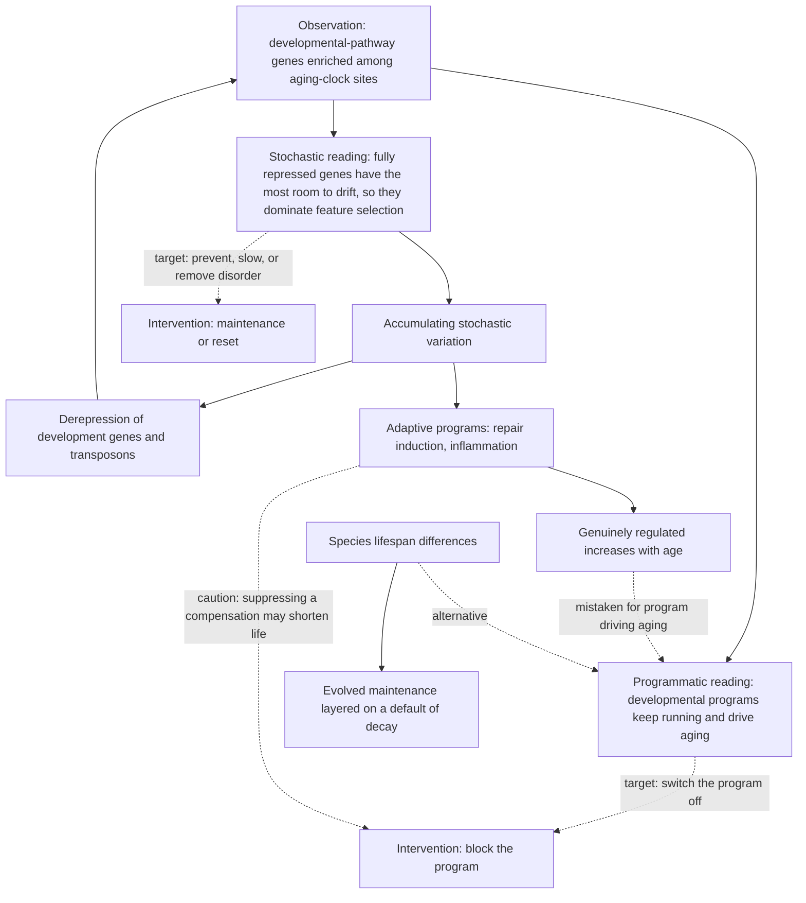

# Is aging programmed or stochastic?

The dispute is over what kind of thing aging is. On the programmatic reading, aging is at least partly the continued execution of biological programs — developmental or otherwise — that produce decline as an output. On the stochastic reading, aging is the accumulation of undirected error in a system whose maintenance is imperfect, and the apparent programs visible in aging data are readouts of that accumulation rather than its cause. The distinction matters practically because the two accounts identify different targets: a program could in principle be switched off, whereas accumulated disorder must be either prevented, slowed, or removed. [[stochastic-aging-and-molecular-noise]] develops the mechanism; this page records who holds what and why.

## The observation that motivated the programmatic reading

The empirical anchor is real and needs an explanation from either side. Genes involved in developmental processes are consistently enriched among the CpG sites that make up DNA-methylation clocks — a pattern reproducible enough that it became one of the standing puzzles of the clock literature. The natural inference was that developmental programs do not stop at the end of development but continue running through adult life, and that their continued operation drives aging. That inference is what gives programmatic aging its most quantitative supporting evidence. (@TheSheekeyScienceShow (The Sheekey Science Show) — "How Randomness Drives Aging - DNA Repair, Clocks & Rejuvenation (David Meyer)", 2025-07-04, [link](https://www.youtube.com/watch?v=Buj07nWt7o0))

Methylation is also, on its own, a hard signal to interpret causally. Gene expression or protein levels can be read fairly directly as something going up or down; methylation acts through cis and trans effects and multiple sites sit near any given gene, so the functional consequence of a methylation change is not straightforwardly predictable. Enrichment of a pathway among clock sites is therefore weaker evidence about that pathway than the equivalent enrichment in a transcriptomic dataset would be. (@TheSheekeyScienceShow (The Sheekey Science Show) — "How Randomness Drives Aging - DNA Repair, Clocks & Rejuvenation (David Meyer)", 2025-07-04, [link](https://www.youtube.com/watch?v=Buj07nWt7o0))

## The stochastic reinterpretation

David Meyer's position, developed with Björn Schumacher, is that most of aging can be explained by the accumulation of noise, and that the developmental enrichment is a statistical artifact of where noise is most visible rather than evidence of a running program. The argument runs from a selection effect. Developmental genes are fully repressed after development ends. A gene at complete repression can only move in one direction, so as random errors erode the marks holding it down, it shows the largest possible change — while a gene that is only partly repressed shows the same drift with a smaller effect size. Feature selection in clock building preferentially picks up whatever changes most, so developmental sites dominate the clocks even though nothing about them is special beyond their starting position. The direct support is that conventional clocks applied to young samples with artificially added random noise return ages increasing approximately linearly with the amount of noise added: the clock signal is reproducible from dispersion alone, with no program required. (@TheSheekeyScienceShow (The Sheekey Science Show) — "How Randomness Drives Aging - DNA Repair, Clocks & Rejuvenation (David Meyer)", 2025-07-04, [link](https://www.youtube.com/watch?v=Buj07nWt7o0)) [[biological-age-biomarkers]]

Meyer's position is not that aging is uniformly random. He characterizes it as quasi-random or quasi-stochastic, on the grounds that genome architecture strongly biases where damage lands: transcribed and non-transcribed regions use different repair pathways, heterochromatin and euchromatin differ in vulnerability, and long genes present larger targets and are downregulated with age for that geometric reason. The randomness is in the individual event, not in the distribution. (@TheSheekeyScienceShow (The Sheekey Science Show) — "How Randomness Drives Aging - DNA Repair, Clocks & Rejuvenation (David Meyer)", 2025-07-04, [link](https://www.youtube.com/watch?v=Buj07nWt7o0))

The evolutionary half of his position is what makes it a positive account rather than only a debunking. Species differ enormously in lifespan, which is the observation programmatic accounts most often invoke. Meyer's reading is that decay is the default state and maintenance is the evolved layer: species did not evolve different aging programs, they evolved better or worse repair and maintenance systems, and those that evolved better ones live longer and reproduce later. Damage comes first, in this ordering; everything else is response. (@TheSheekeyScienceShow (The Sheekey Science Show) — "How Randomness Drives Aging - DNA Repair, Clocks & Rejuvenation (David Meyer)", 2025-07-04, [link](https://www.youtube.com/watch?v=Buj07nWt7o0))

## The adaptive-response caveat, which both sides need

Meyer explicitly concedes that not everything is noise. DNA damage triggers genuine programs — repair induction and inflammation — and these rise with age because the damage that provokes them does. This is a real programmatic component, but it is downstream of stochastic insult rather than a driver of it, and Meyer treats it as consistent with rather than contrary to his position. (@TheSheekeyScienceShow (The Sheekey Science Show) — "How Randomness Drives Aging - DNA Repair, Clocks & Rejuvenation (David Meyer)", 2025-07-04, [link](https://www.youtube.com/watch?v=Buj07nWt7o0))

The caveat carries a safety implication that survives whichever side of the debate prevails: not everything that goes up with age is bad. Some age-associated increases are what the cell needs to cope with accumulated damage, and reducing them could impair cell survival and shorten rather than lengthen life. An age-associated rise is therefore not by itself an argument for suppression. (@TheSheekeyScienceShow (The Sheekey Science Show) — "How Randomness Drives Aging - DNA Repair, Clocks & Rejuvenation (David Meyer)", 2025-07-04, [link](https://www.youtube.com/watch?v=Buj07nWt7o0)) [[inflammaging-and-il-6]]

Meyer also declines to close the question. He states that a programmed or programmatic component cannot be ruled out, while holding that the current balance of evidence favors accumulation of damage and epimutations. Eleanor Sheekey positions herself between the two camps. Neither participant defends the strong programmatic position, which is a real limitation of this source as a record of the debate: the strongest programmatic arguments are represented here mainly through the observation they were built on. (@TheSheekeyScienceShow (The Sheekey Science Show) — "How Randomness Drives Aging - DNA Repair, Clocks & Rejuvenation (David Meyer)", 2025-07-04, [link](https://www.youtube.com/watch?v=Buj07nWt7o0))

## Where this sits relative to the minimal model

The wiki already records a second stochastic-leaning framework, the three-variable minimal model of Peter Fedichev and Jan Gruber described in [[aging-dynamics-and-resilience]]. The two agree substantially and differ in ways worth keeping distinct.

They agree that undirected accumulation is a first-class driver rather than a nuisance term, that clocks largely measure it, and that this is bad news for reading a clock as a report on regulated biology. They agree in dissolving rather than settling the programmed-versus-random question: Fedichev's framework answers it as all three at once, with programmed, random, and damage components each corresponding to a different variable, and Meyer's answer is structurally similar — mostly noise, with genuine adaptive programs downstream and a program not excluded.

They differ on the partition. The minimal model separates *entropic damage*, which is linear and irreversible, from *noise*, which is a fluctuation amplitude, and from the *dynamic stress response*; it uses that separation to argue that epigenetic reprogramming touches only the reversible component and therefore cannot raise maximum lifespan. Meyer's account does not draw that line in the same place. What he calls accumulating stochastic variation is epigenetic and, on his evidence, both modifiable and removable: caloric-restricted mice score younger on dispersion-based clocks, and diapause exit rejuvenates post-mitotic cells transcriptionally. He agrees that mutations are the irreversible residue reprogramming does not address, which is the same boundary the minimal model draws — but he places most of the aging signal on the reversible side of it, where the minimal model places a linear irreversible component that reprogramming cannot reach. That is a substantive disagreement about how much of accumulated disorder is recoverable, and it bears directly on [[healthspan-versus-maximum-lifespan]]. (@TheSheekeyScienceShow (The Sheekey Science Show) — "How Randomness Drives Aging - DNA Repair, Clocks & Rejuvenation (David Meyer)", 2025-07-04, [link](https://www.youtube.com/watch?v=Buj07nWt7o0)) (@TheSheekeyScienceShow (The Sheekey Science Show) — "the 3 levels of aging therapeutics", 2026-02-08, [link](https://www.youtube.com/watch?v=c-_Pdp5IIvw))

They also differ in quantitative claim. The minimal model reports that clocks built from dispersion alone recover roughly 70 to 80% of conventional clock prediction; Meyer's noise-injection result describes an approximately linear relationship between added noise and predicted age across the clocks tested, without a corresponding fraction. These are compatible findings from different analyses, not a replication of one by the other.

The relation to the hallmarks framework in [[hallmarks-of-aging]] is different again. The hallmarks enumerate without ordering; both stochastic accounts impose an ordering, and Meyer's is explicit — damage first, adaptive response second, everything visible in aging data third. An enumerative list is compatible with either side of this debate, which is exactly the criticism made of it.

## What would settle it

The programmatic position predicts that some specific regulator, when blocked, slows aging broadly rather than treating a downstream consequence — and that the developmental signature in clocks reflects the activity of that regulator. The stochastic position predicts that the signature is reproducible from dispersion with no regulator involved, which the noise-injection simulation already supports, and that the residual clock signal not reproducible from dispersion should shrink as noise models improve rather than resolve into a coherent program.

Two more discriminating tests are available. The first is repair capacity: on the stochastic account, raising maintenance should slow aging broadly, which is the prediction [[dream-complex-and-repair-capacity]] makes testable, though its cancer risk is unexamined. The second is post-mitotic rejuvenation: the diapause-exit finding that *C. elegans* age during the state and rejuvenate transcriptionally on exit, in cells that cannot divide or be selectively culled, demands a cell-intrinsic reset mechanism. Identifying that mechanism would show what a cell can undo, and thereby how much of accumulated aging is recoverable disorder rather than fixed loss. (@TheSheekeyScienceShow (The Sheekey Science Show) — "How Randomness Drives Aging - DNA Repair, Clocks & Rejuvenation (David Meyer)", 2025-07-04, [link](https://www.youtube.com/watch?v=Buj07nWt7o0))

## Practical implications

- **Nothing an individual does changes with the outcome of this debate — it is a research-targeting dispute.** No behavior, supplement, or test is licensed or excluded by either position.
- **Do not treat an age-associated increase as a target for suppression — moderate, and the one genuine safety point here.** Repair induction and inflammatory signaling may be adaptive compensations for prior damage; blunting a compensation can impair survival. This is a caution both sides accept.
- **Read pathway stories derived from clock features skeptically — moderate to strong.** The developmental-enrichment case shows how a selection effect can be mistaken for a mechanism, and the same reasoning applies to any pathway narrative built from which features a clock happened to select. [[biological-age-biomarkers]]
- **Prefer interventions justified by outcomes over interventions justified by which theory of aging they fit — strong as a reasoning discipline.** Both camps generate plausible targets; neither has produced a human outcome result, and framework fit is not evidence.

## Gaps & open questions

- Is there any age-associated change that is demonstrably programmed and upstream of damage, rather than a response to it?
- How much clock signal remains after the best available noise model is subtracted, and does the residual have a coherent biological interpretation?
- Does Meyer's accumulating stochastic variation correspond to the minimal model's noise term, its entropic damage term, or neither?
- If most accumulated disorder is epigenetic and resettable, why should maximum lifespan be bounded as the minimal model claims?
- Does raising repair capacity slow aging broadly, as the damage-first ordering predicts, or only improve acute damage survival?
- What cell-intrinsic mechanism rejuvenates post-mitotic cells on diapause exit, and does anything analogous exist in mammals?
- Do species lifespan differences reduce entirely to differences in maintenance investment, or is there a residual requiring a programmatic explanation?
- How would one distinguish quasi-stochastic damage biased by genome architecture from a weak program, given that both predict non-uniform, reproducible patterns?

## Related

[[stochastic-aging-and-molecular-noise]] · [[dream-complex-and-repair-capacity]] · [[aging-dynamics-and-resilience]] · [[hallmarks-of-aging]] · [[healthspan-versus-maximum-lifespan]] · [[biological-age-biomarkers]] · [[epigenetic-alterations-and-reprogramming]] · [[genomic-instability-and-dna-repair]] · [[inflammaging-and-il-6]] · [[biological-age-reversal]] · [[aging-model]]
