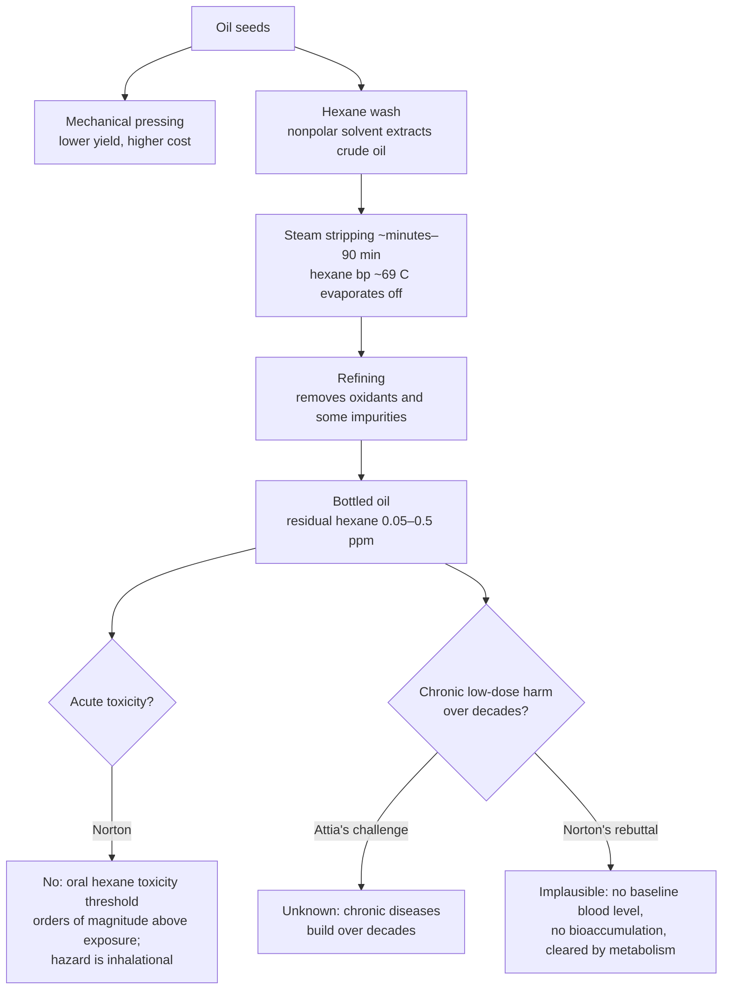

# Are seed oils uniquely harmful?

The seed-oil controversy contains distinct questions that should not be collapsed: whether linoleic acid is harmful at modern intakes, whether replacing saturated fat with polyunsaturated fat changes cardiovascular outcomes, whether industrial extraction leaves harmful contaminants, and whether repeated high-temperature frying generates harmful oxidation products. A century ago linoleic acid made up less than 3% of total food availability; today the figure is closer to 10%, but a historical increase is an exposure fact rather than proof of harm. (@PeterAttiaMD (Peter Attia MD) — "380 ‒ The seed oil debate: are they uniquely harmful relative to other dietary fats?", 2026-01-19, [link](https://www.youtube.com/watch?v=iB49uq-t1UM)) (@PeterAttiaMD (Peter Attia MD) — "Is Industrial Processing the Real Problem With Seed Oils? | Layne Norton, Ph.D.", 2026-01-23, [link](https://www.youtube.com/watch?v=Tsqzx3L6UWs))

## The central evidentiary disagreement

The case that seed oils are uniquely harmful emphasizes the unprecedented rise in linoleic-acid exposure, the chemical oxidizability of polyunsaturated fats, and older substitution trials in which cholesterol fell without a mortality benefit or in which the intervention arm did worse. The counterposition, developed by Layne Norton, is that this reading mistakes plausibility and historical novelty for outcomes, and treats confounded trials asymmetrically: Minnesota and Sydney used trans-fat-rich margarines, while favorable trials sometimes added omega-3 fats. If trials confounded against polyunsaturated fat are retained, trials confounded in its favor must also be retained; if one class is excluded, both should be. (@PeterAttiaMD (Peter Attia MD) — "380 ‒ The seed oil debate: are they uniquely harmful relative to other dietary fats?", 2026-01-19, [link](https://www.youtube.com/watch?v=iB49uq-t1UM))

Once those limitations are separated, the evidence streams do not have equal force. Feeding studies strongly show that replacing saturated fat with polyunsaturated fat lowers LDL; cohorts and tissue biomarkers associate higher linoleic acid with lower cardiovascular risk; and the least trans-fat-confounded substitution trials generally point toward benefit. None alone is decisive, but their convergence weighs against unique cardiovascular harm from ordinary seed-oil consumption. The old randomized record remains imperfect enough that exact effect size is less certain than direction. [[dietary-fat-quality-and-cardiovascular-risk]] (@PeterAttiaMD (Peter Attia MD) — "380 ‒ The seed oil debate: are they uniquely harmful relative to other dietary fats?", 2026-01-19, [link](https://www.youtube.com/watch?v=iB49uq-t1UM))

## The process at issue

Oil is removed from seeds either mechanically (pressing — lower yield, higher cost) or chemically. Chemical extraction washes seeds with hexane, chosen because it is a nonpolar solvent that mixes with oil and has a low boiling point (~69 °C); steam is then bubbled through the crude oil to evaporate the hexane off, a step on the order of minutes to about 90 minutes at temperatures modestly above the boiling point. Residual hexane in finished oils is well under 1 part per million — typically 0.05–0.5 ppm, often below detection limits. Meaningful oxidation of seed oils requires far harsher conditions than the stripping step: most oils need sustained heating well above 200 °C for hours (soybean oil held at ~240 °C for three hours reaches roughly 8% oxidized, and remains at small single-digit percentages even after five). (@PeterAttiaMD (Peter Attia MD) — "Is Industrial Processing the Real Problem With Seed Oils? | Layne Norton, Ph.D.", 2026-01-23, [link](https://www.youtube.com/watch?v=Tsqzx3L6UWs))

## Positions

**Layne Norton: processing is not the harm vector.** Refining removes oxidants and some negative impurities rather than adding them (while acknowledging some compounds do increase, deferred in this excerpt). On hexane specifically: documented human toxicity is inhalational, not oral — no recorded ingestion death, and a case of drinking straight hexane produced only gastrointestinal upset. Rodent studies needed 5,000 mg/kg body weight to produce even mild liver toxicity and neurotoxicity, and Norton's own back-calculation is that a person would need to consume 11,340 kg of oil at one time to reach even mild side effects from its residual hexane. Because hexane does not bioaccumulate, is present at sub-ppm levels, and is metabolized to something innocuous and excreted, he sees no plausible route to harm at dietary exposures. (@PeterAttiaMD (Peter Attia MD) — "Is Industrial Processing the Real Problem With Seed Oils? | Layne Norton, Ph.D.", 2026-01-23, [link](https://www.youtube.com/watch?v=Tsqzx3L6UWs))

**Peter Attia: the chronic-exposure question is not fully closed by acute-toxicity math.** His challenge: the diseases that matter — neurodegeneration, cancer, cardiovascular disease — develop over decades, so how do we know lifetime accumulation of an industrial solvent or other processing products is not raising risk in a way acute thresholds miss? He also frames food processing candidly as big industrial chemistry, with heating, cooling, and solvent steps that could plausibly matter independent of pure linoleic acid. Norton's rebuttal distinguishes hexane from a genuinely cumulative exposure like LDL: LDL is always present at high concentration in blood, whereas there is no appreciable baseline hexane level and clearance outpaces intake — the chronic-exposure logic that applies to lipoproteins does not transfer to a non-bioaccumulating trace solvent. Attia's question is a standing epistemic challenge rather than a positive claim of harm. (@PeterAttiaMD (Peter Attia MD) — "Is Industrial Processing the Real Problem With Seed Oils? | Layne Norton, Ph.D.", 2026-01-23, [link](https://www.youtube.com/watch?v=Tsqzx3L6UWs))

Where the two agree: mechanical (pressed) extraction avoids the solvent question entirely at higher cost, and the dramatic rise of linoleic acid's share of the food supply is real and worth interrogating separately from processing chemistry. (@PeterAttiaMD (Peter Attia MD) — "Is Industrial Processing the Real Problem With Seed Oils? | Layne Norton, Ph.D.", 2026-01-23, [link](https://www.youtube.com/watch?v=Tsqzx3L6UWs))

## Practical implications

- **Do not pay a premium to avoid residual hexane on acute-toxicity grounds — moderate-to-strong.** Measured residues sit orders of magnitude below any observed harm threshold, and the documented hazard route is occupational inhalation, not diet. (@PeterAttiaMD (Peter Attia MD) — "Is Industrial Processing the Real Problem With Seed Oils? | Layne Norton, Ph.D.", 2026-01-23, [link](https://www.youtube.com/watch?v=Tsqzx3L6UWs))
- **If solvent exposure still concerns you: mechanically pressed (expeller/cold-pressed) oils are a genuine, costlier alternative — preference, not evidence-mandated.** (@PeterAttiaMD (Peter Attia MD) — "Is Industrial Processing the Real Problem With Seed Oils? | Layne Norton, Ph.D.", 2026-01-23, [link](https://www.youtube.com/watch?v=Tsqzx3L6UWs))
- **Keep the processing question separate from the linoleic-acid-quantity question — strong as an epistemic practice.** Refuting the hexane claim does not settle whether a tenfold century-scale rise in linoleic acid share of the food supply is benign; that requires its own evidence.
- **When reducing seed oils, specify the replacement — strong.** Replacing them with saturated-fat-rich lard or tallow is not equivalent to replacing them with olive oil, avocado oil, or leaner protein; cardiovascular inference is about substitution. [[dietary-fat-quality-and-cardiovascular-risk]] (@PeterAttiaMD (Peter Attia MD) — "Cooking with Lard vs Seed Oils | Layne Norton, Ph.D.", 2026-01-21, [link](https://www.youtube.com/watch?v=7_cbaDXAWYM))
- **Avoid repeatedly heated frying oil and treat fried foods as occasional regardless of medium — moderate mechanistic evidence, weak comparative-outcome evidence.** Lard resists oxidation better but raises LDL relative to polyunsaturated oil, and no human randomized outcome trial resolves the tradeoff. (@PeterAttiaMD (Peter Attia MD) — "Cooking with Lard vs Seed Oils | Layne Norton, Ph.D.", 2026-01-21, [link](https://www.youtube.com/watch?v=7_cbaDXAWYM))

## Gaps & open questions

- No long-term human data directly test chronic sub-ppm dietary hexane exposure; the reassurance is mechanistic (clearance, no bioaccumulation) plus acute-toxicity margins, not lifetime outcome data.
- Which compounds actually increase during refining (Norton alludes to some), and at what levels do they matter?
- Health effects of the population-level shift of linoleic acid from under 3% to roughly 10% of food availability — the deeper seed-oil question — remain outside this excerpt's scope.
- Are mechanically pressed and solvent-extracted versions of the same oil distinguishable on any health-relevant endpoint?
- Which frying medium produces the best net human cardiovascular outcome after accounting for both oxidation products and LDL/ApoB effects?

## Related

[[dietary-fat-quality-and-cardiovascular-risk]] · [[nutrition-evidence-and-personalization]] · [[free-sugars-and-glycemic-response]] · [[satiety-oriented-diet-design]] · [[energy-balance-and-calorie-counting]] · [[peter-attia]] · [[practice-playbook]]
