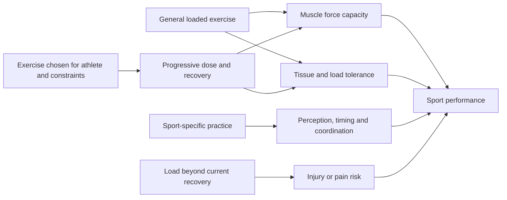

# Strength transfer and exercise specificity

Training transfer is the degree to which adaptation from one task improves performance, resilience, or capacity in another. Specific practice is needed to coordinate the exact timing, perception, and technique of a sport, while general resistance training can raise the force-producing capacity of muscle groups used by that sport. The practical question is not whether an exercise looks like competition, but whether its adaptations address a limiting factor at an acceptable cost in fatigue, pain, time, and injury risk. (@biolayne1 (Dr. Layne Norton) — "Powerlifting is Bad for Athletic Performance? | What the Fitness | Biolayne", 2026-07-31, [link](https://www.youtube.com/watch?v=xK6nNmazh4s))

## Capacity and skill are complementary

Squats and deadlifts train substantial lower-body and trunk force production, but increased force capacity does not automatically teach sprinting, jumping, cutting, or sport tactics. Transfer is most plausible when the trained tissues and force qualities constrain the target task and sport practice continues to convert capacity into coordinated performance. Norton’s position is that contractile tissue need not be trained with a movement that visually imitates the sport; stronger quadriceps, hamstrings, gluteals, trunk, and upper body can support performance while specific skill is practiced separately. He points to improved jumping, running, and sport performance among people using these lifts, but the transcript provides no studies or effect sizes, so the empirical breadth of that claim cannot be graded above moderate from this source alone. (@biolayne1 (Dr. Layne Norton) — "Powerlifting is Bad for Athletic Performance? | What the Fitness | Biolayne", 2026-07-31, [link](https://www.youtube.com/watch?v=xK6nNmazh4s))

Specificity also applies within the force–velocity curve, not just between gym and sport. Power training — moving submaximal loads with maximal concentric speed — outperforms traditional slow resistance training for power gains; a review of 13 studies is cited comparing the same loads lifted quickly versus conventionally, with power improvements favoring the fast condition. The governing principle is stated plainly: "you will become better at whatever it is you train for". This strengthens the page's core claim that adaptations track trained qualities (force, velocity, endurance) more than movement appearance, and it matters for aging because power is the earliest capacity lost ([[muscle-strength-and-mortality]]). (Peter Attia MD — "Building strength and muscle mass: optimize training & nutrition for longevity (AMA #71 rebroadcast)", 2026-07-06, [link](https://www.youtube.com/watch?v=CqNqfb37gig))

## The live disagreement

Naudi Aguilar’s position, as presented in the source, is that back squats and deadlifts lack long-term evidence, produce mainly contextual strength, transfer little, may compound imbalance, and are impractical because of a slippery slope of risk. Norton disputes each generalization: he argues that strength transfers through shared contractile capacity, asks for evidence that cable-based alternatives transfer better or that the barbell lifts create imbalance, and separates high-level powerlifting exposure from ordinary progressive resistance training. Because the source supplies Aguilar’s short public statement through a hostile response rather than a full evidence review, it establishes a disagreement but does not adjudicate every version of the functional-patterns case. (@biolayne1 (Dr. Layne Norton) — "Powerlifting is Bad for Athletic Performance? | What the Fitness | Biolayne", 2026-07-31, [link](https://www.youtube.com/watch?v=xK6nNmazh4s))

## Injury, pain, and dose

An exercise is neither universally safe nor inherently dangerous independent of dose and context. Progressive loading can improve capacity and is presented as reducing low-back pain over time when appropriately performed, while maximal sport exposes athletes near the boundary between recoverable stress and injury. Norton uses his own injuries, later strength, and reduced pain only as an illustration; an individual history cannot estimate population risk. The important distinction is between using a squat or deadlift as a scalable training tool and competing in powerlifting at maximal loads. (@biolayne1 (Dr. Layne Norton) — "Powerlifting is Bad for Athletic Performance? | What the Fitness | Biolayne", 2026-07-31, [link](https://www.youtube.com/watch?v=xK6nNmazh4s)) [[daily-movement-mobility-and-pain]]

## Exercise selection as a decision

No single lift is mandatory. Choose an exercise when its trainable adaptation matches the athlete's need, the person can learn and tolerate it, equipment is available, and fatigue does not impair higher-priority practice. A machine, split squat, trap-bar pull, cable, or bodyweight movement may sometimes solve the same capacity problem more efficiently. This conclusion preserves Norton’s general-capacity mechanism without turning his defense of squats and deadlifts into a claim that they are always optimal. (@biolayne1 (Dr. Layne Norton) — "Powerlifting is Bad for Athletic Performance? | What the Fitness | Biolayne", 2026-07-31, [link](https://www.youtube.com/watch?v=xK6nNmazh4s)) [[trunk-training]] [[youth-resistance-training]]

## Practical implications

- **Two or more times weekly: progressively train the major muscle groups with tolerable movements — strong for resistance training generally, moderate from this source for sport transfer through squats and deadlifts specifically.** Keep sport practice in the program because force capacity does not replace skill. (@biolayne1 (Dr. Layne Norton) — "Powerlifting is Bad for Athletic Performance? | What the Fitness | Biolayne", 2026-07-31, [link](https://www.youtube.com/watch?v=xK6nNmazh4s))
- **At each programming block: identify the target adaptation and verify transfer with a sport-relevant test — moderate decision framework.** Retain a lift when strength and target performance improve at acceptable fatigue; modify it when pain, recovery cost, or poor transfer persists. (@biolayne1 (Dr. Layne Norton) — "Powerlifting is Bad for Athletic Performance? | What the Fitness | Biolayne", 2026-07-31, [link](https://www.youtube.com/watch?v=xK6nNmazh4s))
- **Progress load over weeks rather than testing maximal capacity continuously — moderate.** Ordinary training and maximal powerlifting are different exposures; pain or injury warrants load modification and appropriate assessment rather than a universal ban on a movement. (@biolayne1 (Dr. Layne Norton) — "Powerlifting is Bad for Athletic Performance? | What the Fitness | Biolayne", 2026-07-31, [link](https://www.youtube.com/watch?v=xK6nNmazh4s))

## Gaps & open questions

- How do squat, deadlift, machine, unilateral, and cable programs compare for transfer when volume, effort, and sport practice are matched?
- Which athlete characteristics make general strength a limiting factor versus coordination, speed, endurance, or tactics?
- What are the long-term injury rates of specific lifts at ordinary training doses rather than competitive extremes?
- Which definitions and objective measures of imbalance predict pain or performance?
- How much movement resemblance is useful after shared muscles, force direction, velocity, range, and fatigue are accounted for?

## Related

[[daily-movement-mobility-and-pain]] · [[trunk-training]] · [[youth-resistance-training]] · [[resistance-training]] · [[muscle-strength-and-mortality]] · [[performance-nutrition-and-hydration]] · [[practice-playbook]] · [[aging-model]]
