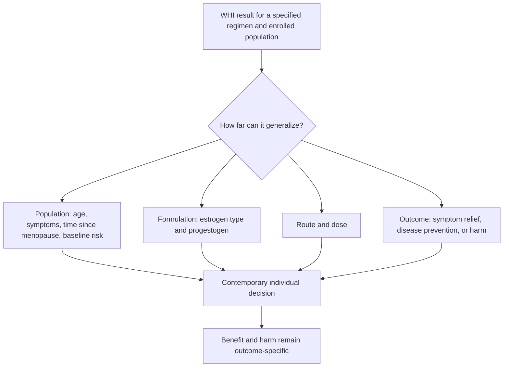

# The WHI and menopause hormone therapy

The Women’s Health Initiative (WHI) debate concerns what an older randomized trial of specific hormone regimens in a particular population can establish about menopause hormone therapy (MHT) as a broader category. The central error on either side is class substitution: neither harm from one formulation nor benefit plausibility for another automatically transfers across molecule, route, age, time since menopause, uterine status, baseline risk, or treatment goal. [[menopause-hormone-therapy]] (@matt.kaeberlein (Healthspan Medicine) — "The Study That Derailed Women's Health And What We're Doing About It (with Dr. Jennifer Pearlman)", 2026-03-08, [link](https://www.youtube.com/watch?v=lQREELkPSIo))

## What the trial changed

The WHI’s public interpretation sharply reduced hormone prescribing: Jennifer Pearlman estimates use at about 27% in the late 1990s and below 5% after the results, while also attributing two decades of reduced clinician training to the shift. Those figures and the training effect are claims in the interview rather than a complete historical utilization analysis, but they identify an important evidence-translation mechanism: a prominent trial can change practice far beyond the precise population and products it tested. (@matt.kaeberlein (Healthspan Medicine) — "The Study That Derailed Women's Health And What We're Doing About It (with Dr. Jennifer Pearlman)", 2026-03-08, [link](https://www.youtube.com/watch?v=lQREELkPSIo))

## The competing interpretations

Pearlman’s position is that WHI did not adequately represent the younger, healthy, symptomatic women commonly considering treatment near menopause and that its US-standard oral conjugated-estrogen/medroxyprogesterone-acetate regimen should not be treated as interchangeable with transdermal estradiol and micronized progesterone. She further contends that removal of a micronized-progesterone arm after funding was withdrawn left a major comparative question unanswered. This is a formulation- and applicability-based critique; the transcript does not itself establish the funding history independently or quantify the comparative clinical outcomes that the missing arm would have produced. (@matt.kaeberlein (Healthspan Medicine) — "The Study That Derailed Women's Health And What We're Doing About It (with Dr. Jennifer Pearlman)", 2026-03-08, [link](https://www.youtube.com/watch?v=lQREELkPSIo))

The cautious position accepts that age, timing, formulation, and route limit generalization but rejects the reverse inference that a poorly matched historical trial proves contemporary MHT prevents cardiovascular disease, dementia, cancer, or organism-wide aging. Symptom efficacy, endometrial protection, thrombotic risk, breast outcomes, and long-term prevention are separate questions. The sound synthesis is therefore neither category-wide avoidance nor category-wide promotion: use evidence matched to the exact regimen, indication, and patient, and describe residual uncertainty explicitly. (@matt.kaeberlein (Healthspan Medicine) — "The Study That Derailed Women's Health And What We're Doing About It (with Dr. Jennifer Pearlman)", 2026-03-08, [link](https://www.youtube.com/watch?v=lQREELkPSIo))

Pearlman also argues that commercial funding distorted the research agenda and that public or otherwise independent funding is needed for neglected comparisons. Kaeberlein agrees that sponsor incentives can bias which questions are studied and offers the contrarian institutional claim that erroneous medical dogma can take roughly two decades to unwind. These claims motivate transparent funding and replication, but sponsor identity alone neither invalidates nor validates a result. (@matt.kaeberlein (Healthspan Medicine) — "The Study That Derailed Women's Health And What We're Doing About It (with Dr. Jennifer Pearlman)", 2026-03-08, [link](https://www.youtube.com/watch?v=lQREELkPSIo))

## Practical implications

- **At each MHT decision and annual review, name the exact formulation, route, dose, indication, age, time since menopause, uterine status, and baseline risks—strong as an evidence-matching principle.** Neither a category-wide claim of danger nor a dismissal of the WHI as flawed is a complete decision rule. (@matt.kaeberlein (Healthspan Medicine) — "The Study That Derailed Women's Health And What We're Doing About It (with Dr. Jennifer Pearlman)", 2026-03-08, [link](https://www.youtube.com/watch?v=lQREELkPSIo))
- **For bothersome symptoms, seek individualized clinical assessment rather than avoiding all MHT because of category-level fear—moderate-to-strong.** This does not make MHT a universal preventive or longevity treatment. (@matt.kaeberlein (Healthspan Medicine) — "The Study That Derailed Women's Health And What We're Doing About It (with Dr. Jennifer Pearlman)", 2026-03-08, [link](https://www.youtube.com/watch?v=lQREELkPSIo))

## Gaps & open questions

- What are the long-term cardiovascular, breast, cognitive, and mortality effects of contemporary transdermal estradiol plus micronized progesterone, stratified by initiation timing and baseline risk?
- How much of the post-WHI prescribing decline reflected the trial itself, media framing, regulatory communication, clinician training, or changing patient preferences?
- Which unanswered comparisons are most affected by commercial funding incentives, and which funding models would produce credible long-term trials?
- How should symptomatic benefit be weighed against uncertain preventive effects when the same regimen can influence several outcomes differently?

## Related

[[menopause-hormone-therapy]] · [[perimenopause-assessment-and-testing]] · [[jennifer-pearlman]] · [[menopause-related-cognitive-impairment]] · [[proactive-health-monitoring]]
