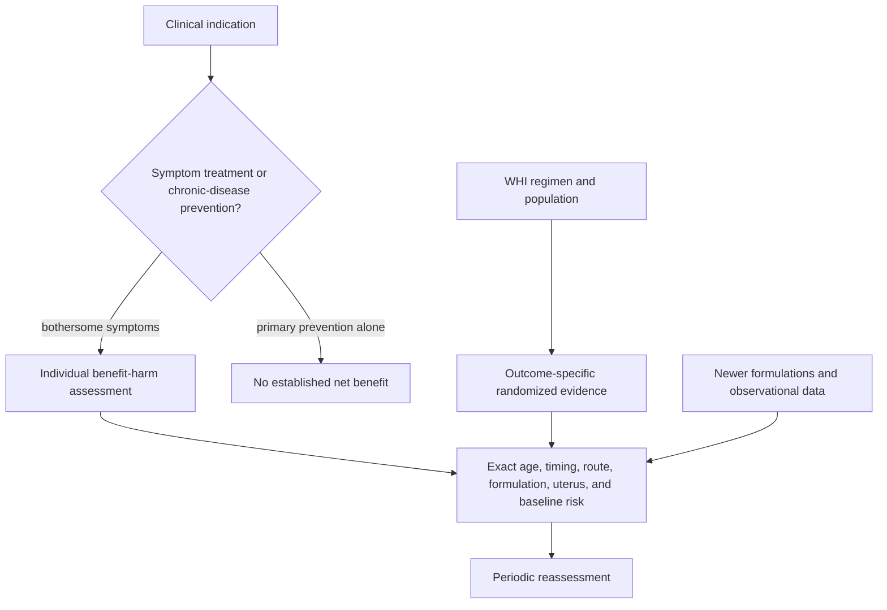

# The WHI and menopause hormone therapy

The Women's Health Initiative (WHI) tested specific systemic regimens in particular postmenopausal populations. Its results cannot be generalized without regard to age, time since menopause, formulation, route, uterine status, baseline risk, indication, and outcome. The reverse error is equally important: limitations of WHI do not prove that contemporary menopause hormone therapy (MHT) prevents cardiovascular disease, dementia, cancer, or aging. [[menopause-hormone-therapy]]

```mermaid
flowchart TD
  I[Clinical indication] --> M{Symptom treatment or chronic-disease prevention?}
  M -->|bothersome symptoms| S[Individual benefit-harm assessment]
  M -->|primary prevention alone| P[No established net benefit]
  S --> X[Exact age, timing, route, formulation, uterus, and baseline risk]
  WHI[WHI regimen and population] --> E[Outcome-specific randomized evidence]
  E --> X
  NEW[Newer formulations and observational data] --> X
  X --> R[Periodic reassessment]
```

## Strongest fair synthesis

MHT is effective for bothersome vasomotor symptoms and prevents bone loss while used. The Menopause Society's 2022 position statement concluded that, for women younger than 60 or within 10 years of menopause onset without contraindications, the benefit–risk ratio is generally favorable for symptom treatment and bone-loss prevention. Later initiation carries a less favorable balance because absolute cardiovascular, thrombotic, stroke, and dementia risks rise with age and time since menopause.[^nams-2022]

WHI was not a trial of every modern regimen in every symptomatic patient. Conjugated equine estrogen plus medroxyprogesterone acetate and conjugated estrogen alone should not be treated as bioequivalent to transdermal estradiol or micronized progesterone. Route and formulation plausibly alter hepatic and thrombotic effects, but comparative long-term outcome evidence for contemporary combinations remains substantially observational.

## Adversarial pass: what narrows the pro-MHT conclusion

The USPSTF evidence review found no net benefit from systemic MHT used solely for primary prevention of chronic conditions. In combined-therapy trial evidence, benefits such as fewer fractures and diabetes cases coexisted with absolute increases in breast cancer, gallbladder disease, stroke, VTE, probable dementia in older initiators, and urinary incontinence. Post hoc timing analyses did not consistently demonstrate cardiovascular prevention. This recommendation does not apply to treatment of bothersome symptoms, but it directly falsifies a universal longevity or cardioprotective protocol. [USPSTF recommendation](https://www.uspreventiveservicestaskforce.org/uspstf/document/RecommendationStatementFinal/menopausal-hormone-therapy-preventive-medication) · [USPSTF evidence summary](https://www.uspreventiveservicestaskforce.org/uspstf/document/final-evidence-summary28/menopausal-hormone-therapy-preventive-medication)

The claim that starting MHT before age 60 or within 10 years cuts cardiovascular disease or cardiovascular death by at least 50% is not established by a randomized trial of contemporary therapy. Age- or timing-stratified subgroup analyses are hypothesis-strengthening and can inform absolute-risk counseling, but they do not justify saying estrogen is superior to statins for primary prevention. Cardiovascular prevention remains distinct from symptom treatment.

## Evidence conflicts: FDA labeling and residual risk

In November 2025 FDA requested removal of cardiovascular disease, breast cancer, and probable dementia statements from boxed warnings for menopausal hormone products while retaining the endometrial-cancer boxed warning for systemic estrogen used without adequate progestogen in a person with a uterus. On February 12, 2026, FDA approved revised labeling for an initial six products across systemic and local categories. [FDA 2025 request](https://www.fda.gov/drugs/drug-alerts-and-statements/fda-requests-labeling-changes-related-safety-information-clarify-benefitrisk-considerations) · [FDA 2026 approvals](https://www.fda.gov/news-events/press-announcements/fda-approves-labeling-changes-menopausal-hormone-therapy-products)

This is a material regulatory correction to the old post-WHI landscape, but moving risk language out of a box does not show that the underlying outcome risks are zero, erase product-specific contraindications, or create a prevention indication. The label action also generated a credible process conflict: proponents view it as correction of category-wide fear; critics note that labeling changed without a conventional standing advisory-committee review and that newer regimens still lack long-term randomized outcome trials. The current resolution is outcome- and product-specific counseling, not either “WHI applies to everything” or “WHI no longer matters.”

## The downstream distrust economy

The dispute now has a documented second-order consequence: primary-care internist Lucy McBride — who says she was herself part of the problem, having relayed the establishment's post-2002 message that hormone therapy is harmful — describes the WHI misreading (a good study, a flawed interpretation, in her framing) as a generation-scale trust injury that the wellness industry actively monetizes: fear-based messaging about hormones sells supplements and guruified menopause programs to women who then forgo effective treatment. Her clinical illustration: a highly educated patient convinced HRT caused her relatives' breast cancers took an ineffective supplement stack (one causing a liver problem) for years before agreeing to hormone therapy, with symptom resolution in three weeks. Her stated position — that HRT is the standard of care for all women in perimenopause and menopause unless there is a reason not to be on it, starting from HRT rather than toward it — is stronger than current guidance and conflicts with the USPSTF material above: professional guidance supports MHT for bothersome symptoms in appropriate candidates with favorable timing, not a universal default for all menopausal women. Both her default-on framing and the guidance-anchored narrower indication are preserved here as the live disagreement; the trust-repair point stands independently of which is right. (@maxlugavere (Max Lugavere) — "Wellness Myths Debunked: How to Navigate 'Optimization Slop' Culture", 2026-08-12, [link](https://www.youtube.com/watch?v=z4A12iaH7I0)) [[lucy-mcbride]] [[health-misinformation-and-media-incentives]]

## Evidence update — 2026-09-01

> **What changed:** The page now incorporates FDA's November 2025 request and February 2026 approval of boxed-warning changes. Historical accounts that WHI caused a prescribing and training collapse remain useful as attributed context, and the formulation/applicability critique remains valid. However, the strong early-initiation cardiovascular-prevention claim has been narrowed against USPSTF evidence: favorable timing can improve benefit–harm balance for symptom treatment, but no reviewed evidence establishes a ≥50% cardiovascular reduction or superiority to statins. The FDA label change is preserved as a regulatory update, not converted into proof of prevention.

## Practical implications

- **For bothersome symptoms, assess the exact product, route, age, time since menopause, uterine status, contraindications, and baseline cardiovascular, thrombotic, breast, and bone risks—strong.** Use current labeling and professional guidance, with periodic reevaluation.
- **Do not use systemic MHT solely to prevent cardiovascular disease, dementia, or aging—strong against this indication.** [USPSTF](https://www.uspreventiveservicestaskforce.org/uspstf/document/RecommendationStatementFinal/menopausal-hormone-therapy-preventive-medication)
- **Do not treat removal of boxed-warning language as removal of all risk—strong.** Read the current product-specific label; endometrial protection remains necessary with systemic estrogen when the uterus is present.
- **Do not deny symptom treatment solely because an older WHI regimen showed harms in a different population—strong evidence-matching principle.** Individual contraindications still govern.

## Gaps & open questions

- What are long-term cardiovascular, breast, cognitive, and mortality effects of transdermal estradiol plus micronized progesterone?
- Would a randomized early-initiation trial of a contemporary regimen show cardiovascular benefit, neutrality, or harm?
- How should the 2026 label process and future product-specific revisions change counseling without overstating certainty?

## Related

[[menopause-hormone-therapy]] · [[perimenopause-assessment-and-testing]] · [[genitourinary-syndrome-of-menopause]] · [[jennifer-pearlman]] · [[menopause-related-cognitive-impairment]] · [[coronary-ct-angiography]] · [[proactive-health-monitoring]] · [[health-misinformation-and-media-incentives]] · [[lucy-mcbride]]

## References

[^nams-2022]: The North American Menopause Society. “The 2022 Hormone Therapy Position Statement.” *Menopause*, 2022. [professional position statement]. [doi:10.1097/GME.0000000000002028](https://doi.org/10.1097/GME.0000000000002028)
