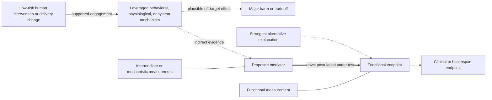

# Hypothesis template

Copy this file to `hypotheses/descriptive-hypothesis-name.md`, remove the leading underscore, and complete every section. Do not publish an empty scaffold.

```yaml
---
type: hypothesis
title: Precise, causal hypothesis title
tags: [longevity]
updated: YYYY-MM-DD
evidence_reviewed: never
evidence_cutoff: unknown
review_status: review-due
review_interval: 90d
hypothesis_status: seed
---
```

# Precise, causal hypothesis title

State the hypothesis in one falsifiable sentence: changing **X** in **human population P**, through **mechanism M**, will change **human functional, symptomatic, behavioral, clinical, or quality-of-life endpoint Y** relative to **comparator C** over **time T**.

## Causal rationale

Explain the chain from intervention or exposure to mechanism to endpoint. Link every node to the relevant textbook chapter and distinguish direct evidence from extrapolation. Include credible alternative explanations.

## Mechanistic model

Use Mermaid to show what is being leveraged and how the hypothesis could succeed or fail. Replace every placeholder. Solid arrows should represent comparatively established links, dotted arrows indirect or uncertain links, and a thick arrow the novel causal postulation being tested. Include the strongest competing pathway, measured endpoints at distinct biological levels, and at least one major harm branch.



Explain beneath the diagram which edges are established, extrapolated, or newly proposed, and what measurement interrogates each uncertain edge.

## Testable predictions

List predictions that are quantitative where possible. At least one should discriminate this hypothesis from its strongest alternative, and at least one should address an adverse or paradoxical effect.

## Proposed test

Specify the human population, low-risk intervention or exposure, comparator, randomization and blinding where possible, accessible measurements, primary human outcome, important secondary endpoints, duration, analysis, confounders, and prerequisites. Prefer a randomized N-of-1, pragmatic, crossover, factorial, cohort, or secondary-data design that does not require a wet lab. Explain why this is the safest decisive test. Biomarkers may support the mechanism but cannot be the sole primary endpoint.

## What would change our minds

Precommit to results that would support, narrow, revise, or retire the hypothesis. Distinguish a failed intervention from a failed mechanism and an underpowered or invalid test from meaningful negative evidence.

## Safety and translation boundary

Describe known and plausible harms, off-target effects, monitoring, stopping rules, and the evidence required before any human translation. State explicitly that the page is not medical advice or a self-experimentation protocol.

## Evidence ledger

Track supporting, conflicting, and null results with study type, endpoint level, major limitations, and citations. Preserve superseded reasoning and status changes.

## Related

Link the relevant mechanisms, interventions, debates, and synthesis pages.
