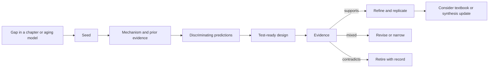

# Hypothesis lab

The hypothesis lab develops testable ideas that could directly improve human health, function, and healthspan. It is where Coral moves from organizing what is known to asking how established or reasonably supported tools might be applied, combined, timed, measured, or delivered more effectively.

A hypothesis belongs here only when it is more than an interesting possibility. It must identify a proposed causal relationship, explain why existing evidence makes that relationship plausible, produce at least one prediction that distinguishes it from credible alternatives, and describe observations that would weaken or defeat it. Novelty is useful; falsifiability is mandatory.

## Boundaries

- A hypothesis is not a finding, treatment recommendation, or invitation to self-experiment.
- The decisive test must involve humans and be feasible without a wet lab: for example, a low-risk randomized N-of-1, pragmatic, crossover, factorial, cohort, or secondary-data study.
- The primary endpoint must be human function, symptoms, behavior, clinical state, or quality of life. Biomarkers and wearable measurements can explain a pathway but cannot be the sole definition of success.
- Cell, animal, gene-editing, novel-target, and unapproved-compound hypotheses are outside this lab. They require a different literature base, expertise, infrastructure, and safety model.
- Hypotheses may improve the implementation of established practices; they must not instruct readers to start, stop, or alter prescription treatment outside clinical care.
- Mechanistic plausibility does not establish organism-level benefit. Biomarkers, function, disease, healthspan, and lifespan remain distinct endpoints.
- The safest informative human test comes first: secondary-data analysis before new exposure where possible, then a low-risk pilot before a larger pragmatic trial.
- Risks, failure modes, off-target effects, and cancer or immune tradeoffs receive the same attention as the proposed benefit.
- Null and negative findings remain attached to the idea. They cause revision, narrowing, or retirement rather than silent deletion.

## From gap to tested idea

Each page progresses through `seed`, `specified`, `test-ready`, `tested`, `revised`, or `retired`. Status describes the maturity of the idea, not the magnitude of its promise.

## Development cadence

A bounded hypothesis workshop runs every Sunday at 9:00 AM, after the weekly evidence-enrichment pass. It reviews existing hypotheses first, then mines the aging model, research queue, and chapter-level open questions for cross-system causal ideas. It generates three explicitly unreviewed seeds in the [idea nursery](_idea-queue.md) unless twelve are active, prunes weaker or redundant ideas, and develops the highest-ranked candidate. It may publish at most one new hypothesis per week, and publishing none is the correct result when no candidate meets the standard. Existing ideas may be refined, narrowed, or retired as evidence changes.

This cadence separates idea generation from ordinary transcript ingestion. Podcast claims can reveal a gap, but they do not enter the lab as hypotheses until checked against scholarly evidence and expressed as a discriminating test.

## Evaluation questions

1. **Human value:** If correct, could the idea directly improve function, symptoms, adherence, clinical state, or quality of life?
2. **Leverage:** Does it make an established or reasonably supported practice more effective, usable, personalized, or sustainable?
3. **Coherence:** Is it compatible with established physiology, or does it clearly identify the assumption being challenged?
4. **Discrimination:** Would its predictions differ from expectancy, regression to the mean, increased attention, or another plausible mechanism?
5. **Feasibility:** Can people realistically run or participate in the test with accessible measurements, adequate duration, and useful controls?
6. **Safety:** Is the proposed test low-risk, and does it avoid unsupervised changes to medical treatment?

## Mechanistic maps

Every promoted hypothesis includes a Mermaid causal model. The diagram must make the proposal inspectable rather than merely decorative: it identifies the behavioral, physiological, measurement, or delivery-system node being leveraged; traces the expected downstream path to human outcomes; shows the strongest competing explanation; and branches toward foreseeable harms. Link labels distinguish established evidence, indirect support, and novel postulation. As evidence changes, the map changes with it.

## Current hypotheses

- [[performance-gated-recovery-progression]] — `test-ready`; tests whether subjective-triggered, performance-confirmed, bounded exercise-dose adjustment improves six-month function and reduces interruption days without chronic underloading.

## Changelog

- **2026-08-12 — weekly workshop:** created [[performance-gated-recovery-progression]] at `test-ready` after narrowing the seed so subjective recovery signals trigger, but do not determine, a performance check. Added exactly three seeds—post-meal movement allocation, add-before-subtract dietary counseling, and morning-light-first sleep sequencing—and retained five active seeds. **Existing hypothesis review:** the earlier preclinical draft remained out of scope and was subsequently removed. **Synthesis-impact check:** no update to [[aging-model]]; this specifies an implementation test within the mapped exercise-to-functional-reserve pathway and establishes no new causal edge.
- **2026-08-12 — scope correction:** removed the earlier preclinical hypothesis and its detailed development history after narrowing the lab to feasible human-direct research. **Synthesis-impact check:** no material change to [[aging-model]] because this was a project-scope correction, not new biological evidence.

## Related

[[aging-model]] · [[biological-age-reversal]] · [[longevity-intervention-prioritization]]
