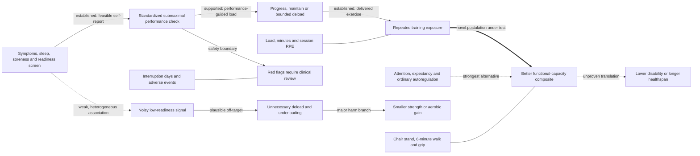

# Performance-gated recovery adjustment will improve functional exercise adaptation

In insufficiently active adults aged 50–75 who are medically cleared for exercise, a weekly rule in which adverse symptoms or poor recovery trigger a standardized submaximal performance check—and only a confirmed decrement changes the next week’s resistance or aerobic dose—will improve a six-month functional-capacity composite and reduce health-related interruption days relative to fixed percentage progression with attention-matched sham feedback.

## Causal rationale

[[exercise-program-design]] treats progression as a feedback loop, while [[resistance-training]] identifies performance decline, persistent soreness, pain, sleep, and willingness after warm-up as candidate recovery signals. This hypothesis narrows that logic: subjective signals trigger an objective low-risk check; the check selects a prespecified progress, maintain, or deload option. [[aging-dynamics-and-resilience]] supplies a conceptual distinction between reversible perturbation and persistent decline, but its physiological-noise model is extrapolation, not evidence that smoothing variability improves health.

**Direct human evidence:** systematic reviews of APRE, repetitions-in-reserve/RPE, velocity feedback, and fixed percentage loading suggest autoregulated resistance training can improve maximal strength at least as well as fixed loading, with some pooled comparisons favoring autoregulation.[^huang-2025] [^zhang-2021] [^larsen-2021] A randomized crossover trial in 20 amateur rugby players directly compared velocity- and RPE-based autoregulation, but not the proposed recovery gate or an older general population.[^graham-2022]

**Conflicting evidence and extrapolation:** trials are short, small, and mostly athletic; maximal strength is not broad function, disease, healthspan, or lifespan. A systematic review found single-item soreness, fatigue, sleep, stress, and mood measures had relationships with training load ranging from none to very large and predominantly trivial to moderate in the largest datasets.[^duignan-2020] Sleep-deprivation experiments show that recovery state can impair performance, but do not validate a multivariable readiness score or prove that deloading improves later adaptation.[^kong-2025]

The strongest alternative is that ordinary within-session autoregulation, attention, and expectancy explain any advantage, while the dashboard adds noise and undertraining. Sham feedback, a fixed exposure floor, measured delivered dose, and the objective gate distinguish that alternative.

## Mechanistic model

Exercise exposure to adaptation is established generally; performance-based autoregulation has direct but narrow trial support. The thick arrow to broad function is new. The subjective-screen edge is intentionally weak. Delivered dose detects undertraining, sham feedback tests attention, and functional and adverse-event endpoints prevent a smoother log or biomarker from masquerading as benefit.

## Testable predictions

1. The gated arm will improve a preregistered standardized composite of 30-second chair-stand repetitions, six-minute walk distance, and grip strength by at least 0.20 SD more than control at six months.
2. It will have at least 20% fewer health-related interruption days without completing more than 10% less total resistance volume or aerobic minutes.
3. **Discriminating prediction:** after a poor screen, a confirmed performance decline of at least 5%—not the screen alone—will predict excess adverse-symptom or missed-training risk the following week. Equal prediction by the screen makes the check unnecessary; prediction by neither defeats the matching mechanism.
4. Treatment effects will remain after adjustment for week-2 expectancy and coaching contact; disappearance favors the attention alternative.
5. **Adverse/paradoxical prediction:** participants with poor screens but stable check performance will not deload. A dose reduction greater than 10% or at least 0.15 SD smaller strength/aerobic gains retires an oversensitive rule even if interruptions fall.
6. Molecular markers and wearables are not success criteria. Disease, healthspan, and lifespan remain untested.

## Proposed test

Run a six-month, assessor-blinded, multicenter pragmatic randomized trial in 360 insufficiently active adults aged 50–75 who have medical clearance for moderate exercise and can walk independently. Exclude unstable cardiovascular disease, acute injury, untreated severe sleep disorder, uncontrolled psychiatric illness, or conditions requiring individualized rehabilitation; medication changes remain solely within clinical care.

Both arms receive the same progressive program: two weekly whole-body resistance sessions, one interval or moderate aerobic session selected by baseline capacity, and low-intensity walking. Both record the same weekly four-item screen and complete a standardized warm-up. In the intervention arm, a poor screen triggers a fixed-load sit-to-stand or equivalent check plus a short constant-work-rate walk. A reproducible decrement of at least 5% selects one week of maintenance or a 15–20% reduction; stable performance preserves progression. Red-flag pain, chest symptoms, syncope, new neurologic symptoms, fever, or marked breathlessness bypass the algorithm for clinical assessment. Control participants receive plausible non-directive sham feedback and fixed progression, with identical contact and ordinary in-session safety modification.

The primary endpoint is the six-month functional composite. Secondary endpoints are interruption days, attendance, delivered dose, PROMIS physical function and fatigue, falls, pain flares, adverse events, expectancy, and enjoyment. Optional sleep and heart-rate measures are mechanistic only. Analyze intention to treat with a constrained longitudinal mixed model, site as a random effect, and baseline function, age, sex, multimorbidity, and prior training as covariates; use a count model for interruption days. Preregister mediation from screen through check, dose decision, completed exposure, and function. Important confounders include acute illness, caregiving/work stress, season, sleep disorder, analgesic use, expectancy, trainer discretion, exercise familiarity, and regression to the mean. This is the safest decisive test because both groups receive established exercise, reductions are bounded, and red flags leave the algorithm.

## What would change our minds

- **Support:** at least 0.20 SD better function, fewer interruption days, no material dose deficit, and no excess adverse events, with directionally consistent mediation.
- **Narrow:** credible replicated benefit confined to low baseline function, high interruption burden, or one training mode.
- **Revise:** use simple performance autoregulation if the check helps but subjective screening adds no predictive value; recast as attention/adherence if effects track expectancy rather than dose matching.
- **Retire:** no 0.20-SD functional benefit and no interruption advantage; fewer interruptions purchased with more than 10% less dose and smaller adaptation; no near-term prediction by screen/check; or increased adverse events. Biomarker or wearable improvement cannot rescue null function.
- **Invalid test:** erased between-arm contrast, poor check fidelity, differential contact, or confidence intervals spanning important benefit and harm requires a better test. Implemented gating with null function challenges the mechanism; failure to deliver gating is an intervention failure.

## Safety and translation boundary

Noisy symptoms could cause chronic underloading and loss of reserve; a normal check could falsely reassure someone with evolving injury or illness. Required safeguards are a fixed exposure floor, bounded one-week changes, independent red-flag rules, clinician review, and stopping for chest pain, syncope, new neurologic signs, escalating focal pain, repeated falls, or serious events. The algorithm cannot diagnose overtraining, injury, infection, apnea, or cardiovascular disease.

No cancer, immune, or repair benefit is proposed. Excess load during illness or injury could impair repair, while underloading could weaken reserve relevant to cancer treatment or infection recovery. Prescription treatment must never be altered by the protocol. Functional benefit would justify replication, not claims of disease prevention, biological-age reversal, healthspan, or lifespan. This page is not medical advice or a self-experimentation protocol.

## Evidence ledger

| Date reviewed | Evidence | Endpoint level | Direction | Limits and consequence |
|---|---|---|---|---|
| 2026-08-12 | Huang et al. network meta-analysis ranked APRE above other methods for maximal-strength outcomes.[^huang-2025] | Human performance | Supports adaptable loading | Short resistance studies; no recovery gate, broad function, interruptions, older adults, or concurrent training. |
| 2026-08-12 | Zhang et al. pooled eight studies with 166 trained athletes over 5–10 weeks.[^zhang-2021] | Human performance | Supports narrowly | Small athletic evidence base with maximal-strength endpoints. |
| 2026-08-12 | Larsen et al. included 14 studies and 356 participants; readiness as mechanism remained speculative.[^larsen-2021] | Human performance | Feasibility support | Heterogeneous methods and no functional or quality-of-life endpoint. |
| 2026-08-12 | Graham and Cleather randomized 20 rugby players to velocity- versus RPE-based blocks.[^graham-2022] | Human performance | Direct tool comparison | No fixed or sham arm; small sport sample. |
| 2026-08-12 | Duignan et al. found heterogeneous, mainly trivial-to-moderate wellbeing–load relationships in larger datasets.[^duignan-2020] | Measurement | Conflicts with readiness determinism | Team-sport observational evidence; supports objective confirmation. |
| 2026-08-12 | Kong et al. found experimental sleep deprivation impaired several performance domains.[^kong-2025] | Human performance | Indirect support | Experimental deprivation is not ordinary variation and does not test deloading. |
| 2026-08-12 | No located trial jointly tested subjective-triggered performance gating, sham feedback, bounded adjustment, interruption burden, and broad function in midlife/older adults. | Evidence gap | Unresolved | Justifies `test-ready`, not expected healthspan benefit. |

The seed allowed subjective recovery signals to adjust workload directly. This review supersedes that formulation because wellbeing–load relations are heterogeneous; the published claim requires objective confirmation and a minimum training dose. Negative evidence narrowed rather than strengthened the claim.

## References

[^huang-2025]: Huang Z, Sun J, Li D, et al. “Autoregulated resistance training for maximal strength enhancement: A systematic review and network meta-analysis.” *Journal of Exercise Science & Fitness* (2025). [systematic review and network meta-analysis]. [PubMed](https://pubmed.ncbi.nlm.nih.gov/40791980/) · [DOI](https://doi.org/10.1016/j.jesf.2025.07.006)
[^zhang-2021]: Zhang X, Li H, Bi S, et al. “Auto-Regulation Method vs. Fixed-Loading Method in Maximum Strength Training for Athletes: A Systematic Review and Meta-Analysis.” *Frontiers in Physiology* (2021). [systematic review and meta-analysis]. [PubMed](https://pubmed.ncbi.nlm.nih.gov/33776802/) · [DOI](https://doi.org/10.3389/fphys.2021.651112)
[^larsen-2021]: Larsen S, Kristiansen E, van den Tillaar R. “Effects of subjective and objective autoregulation methods for intensity and volume on enhancing maximal strength during resistance-training interventions: a systematic review.” *PeerJ* (2021). [systematic review]. [PubMed](https://pubmed.ncbi.nlm.nih.gov/33520457/) · [DOI](https://doi.org/10.7717/peerj.10663)
[^graham-2022]: Graham T, Cleather DJ. “Autoregulation in Resistance Training: A Comparison of Subjective Versus Objective Methods.” *Journal of Strength and Conditioning Research* (2022). [randomized crossover trial]. [PubMed](https://pubmed.ncbi.nlm.nih.gov/32058357/) · [DOI](https://doi.org/10.1519/JSC.0000000000003530)
[^duignan-2020]: Duignan C, Doherty C, Caulfield B, Blake C. “Single-Item Self-Report Measures of Team-Sport Athlete Wellbeing and Their Relationship With Training Load: A Systematic Review.” *Journal of Athletic Training* (2020). [systematic review]. [PubMed](https://pubmed.ncbi.nlm.nih.gov/32991706/) · [DOI](https://doi.org/10.4085/1062-6050-0528.19)
[^kong-2025]: Kong Y, Yu B, Guan G, Wang Y, He H. “Effects of sleep deprivation on sports performance and perceived exertion in athletes and non-athletes: a systematic review and meta-analysis.” *Frontiers in Physiology* (2025). [systematic review and meta-analysis of randomized studies]. [PubMed](https://pubmed.ncbi.nlm.nih.gov/40236824/) · [DOI](https://doi.org/10.3389/fphys.2025.1544286)

## Related

[[exercise-program-design]] · [[resistance-training]] · [[time-efficient-concurrent-training]] · [[aging-dynamics-and-resilience]] · [[sleep-quality-and-circadian-alignment]] · [[muscle-strength-and-mortality]] · [[aging-model]]
