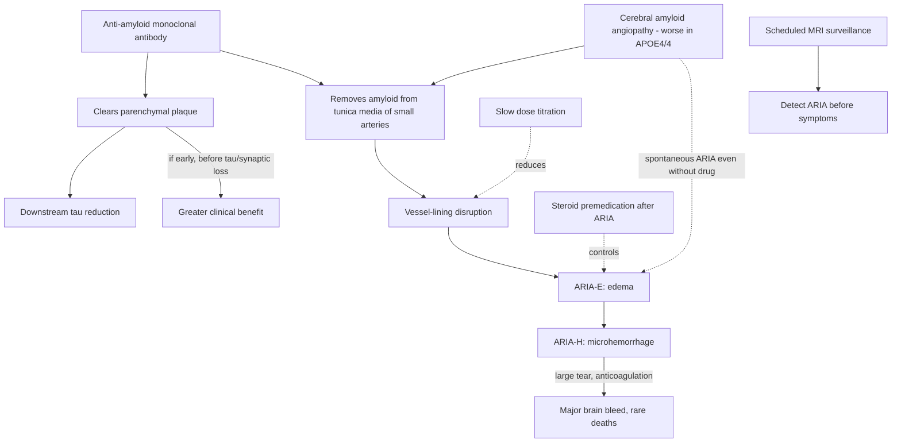

# Anti-amyloid immunotherapy

Anti-amyloid monoclonal antibodies are the first approved drugs that alter the biology of Alzheimer's disease rather than only its symptoms. Aducanumab (approved July 2021, later withdrawn from the market), lecanemab (intravenous, once every two weeks), and donanemab (once monthly) clear amyloid plaque from the brain; although they target amyloid, they also produce downstream reduction in tau. The central tension is that biomarker clearance is dramatic while average clinical benefit in trial populations has been small, and the vascular side-effect profile is serious—especially in APOE4 homozygotes, the group most likely to progress and most in need of treatment. (Peter Attia MD — "399 - The evolution of Alzheimer's disease and dementia care | Gayatri Devi, M.D.", 2026-07-13, [link](https://www.youtube.com/watch?v=x7NhqMOwdOM))

> [!CAUTION]
> This treatment is approved for selected patients with **early symptomatic** Alzheimer's disease and confirmed amyloid pathology. It is not a general longevity or prevention treatment. Selection, dosing, MRI surveillance, management of amyloid-related imaging abnormalities (ARIA), and decisions about antithrombotic therapy require a specialist program. The off-label slow-titration and steroid strategies described below are hypotheses or practice experience, not established standards of care.

## Mechanism of benefit and of harm

The antibody clears amyloid from brain parenchyma, but it also strips amyloid from the tunica media of small cerebral arteries—where cerebral amyloid angiopathy (CAA) deposits it. Removing that vascular amyloid disrupts the vessel lining: first fluid leaks (ARIA-E, edema), then blood extravasates through tears in the lining (ARIA-H, microhemorrhage), and a large disruption can cause a massive, occasionally fatal brain bleed, particularly on anticoagulation. APOE4/4 carriers have more prevalent and more severe CAA, so they suffer more frequent and larger ARIA—and can have spontaneous ARIA from CAA alone, which is why microbleeds also appear in placebo arms. (Peter Attia MD — "399 - The evolution of Alzheimer's disease and dementia care | Gayatri Devi, M.D.", 2026-07-13, [link](https://www.youtube.com/watch?v=x7NhqMOwdOM))

## Evidence and its limits

Aducanumab's approval was controversial and it was later discontinued commercially. The two pivotal phase 3 trials provide the relevant clinical estimates for current agents. In CLARITY-AD, lecanemab produced a placebo-adjusted difference of **−0.45 points on the 18-point CDR-SB at 18 months**. In TRAILBLAZER-ALZ 2, donanemab produced a difference of **−0.70 points at 76 weeks** in the combined population. Both results were statistically significant and represent slowing—not reversal—of decline; whether the average differences are clinically meaningful remains debated. Trial eligibility was limited to early symptomatic disease with biomarker-confirmed amyloid, so these results cannot be extrapolated to cognitively normal people or moderate-to-severe dementia. ARIA, including symptomatic and rarely fatal events, is a central risk rather than a monitoring inconvenience.

Individual dramatic responses and comparisons between treated and untreated relatives are anecdotes. They can generate hypotheses but cannot estimate treatment efficacy or identify a responder subgroup. (Peter Attia MD — "399 - The evolution of Alzheimer's disease and dementia care | Gayatri Devi, M.D.", 2026-07-13, [link](https://www.youtube.com/watch?v=x7NhqMOwdOM))

Attia frames the underlying logic: like LDL-lowering and atherosclerosis, chronic-disease benefit is about time and area under the curve, so short trials late in disease may understate what early, sustained amyloid lowering could do—an alternative explanation to the drugs don't work, but one that remains unproven pending the low-slow-early trial nobody has yet funded. (Peter Attia MD — "399 - The evolution of Alzheimer's disease and dementia care | Gayatri Devi, M.D.", 2026-07-13, [link](https://www.youtube.com/watch?v=x7NhqMOwdOM))

## Investigational practice: slow titration and steroids

The podcast describes a clinician's off-label approach of starting below labeled doses, titrating slowly, and sometimes using corticosteroids around ARIA. These observations are not sufficient to establish that the strategy reduces ARIA, preserves efficacy, or is safe in APOE ε4 homozygotes. FDA labeling and published appropriate-use recommendations—not a single-practice series—should anchor care. The claim of an approximately 4% ARIA rate requires verification against the underlying peer-reviewed report before it is used quantitatively. Treatment of asymptomatic, amyloid-positive adults outside a clinical trial is not supported by the pivotal efficacy trials. (Peter Attia MD — "399 - The evolution of Alzheimer's disease and dementia care | Gayatri Devi, M.D.", 2026-07-13, [link](https://www.youtube.com/watch?v=x7NhqMOwdOM))

## Cost, logistics, and eligibility engineering

Total cost includes drug, infusion or injection services, specialist assessment, amyloid confirmation, and serial MRI. Exact prices vary by agent, payer, site, and year and should not be treated as durable clinical facts. FDA labeling warns that anticoagulant exposure may increase intracerebral-hemorrhage risk and calls for additional caution; lecanemab appropriate-use recommendations advise against treatment in patients who require anticoagulants pending better data. Replacing indicated anticoagulation with left-atrial-appendage occlusion solely to enable an anti-amyloid antibody is not an established general protocol. That decision has independent procedural risks and must be made through cardiology, neurology, and shared decision-making based on the patient's competing stroke and bleeding risks. (Peter Attia MD — "399 - The evolution of Alzheimer's disease and dementia care | Gayatri Devi, M.D.", 2026-07-13, [link](https://www.youtube.com/watch?v=x7NhqMOwdOM))

## Precedent and pipeline

IVIG (pooled immunoglobulin, studied by Norman Relkin's group at Cornell) was abandoned for Alzheimer's overall, but Devi reports that APOE4 carriers were far more likely to benefit, and among her own tap-diagnosed IVIG patients two became plaque-negative, one stable for 17 years—an early hint that immune-based clearance works best in high-risk genotypes, echoed by obeticholic-acid pilot biomarker data Attia cites where 4/4s show the most profound response. Expected next generations: agents with less edema and hemorrhage risk, oral dosing, and home administration; both speakers converge on subtype-stratified treatment (the breast-cancer model of receptor-defined disease) rather than one hammer for a heterogeneous disease. (Peter Attia MD — "399 - The evolution of Alzheimer's disease and dementia care | Gayatri Devi, M.D.", 2026-07-13, [link](https://www.youtube.com/watch?v=x7NhqMOwdOM))

## Practical implications

- **Use only for the labeled early symptomatic population after amyloid confirmation and specialist assessment.** Tau confirmation is not universally required by US labeling. [[alzheimers-diagnosis-biological-vs-clinical]]
- **Discuss APOE genotype before treatment.** APOE ε4 homozygotes have substantially higher ARIA risk, but US labeling frames this as risk information rather than an automatic exclusion.
- **Obtain baseline and label-specified surveillance MRI.** New neurologic symptoms require urgent assessment; management depends on symptoms and radiographic severity.
- **Describe benefit as modest average slowing of decline, not stabilization, improvement, or prevention.** Pivotal placebo-adjusted CDR-SB differences were −0.45 for lecanemab and −0.70 for donanemab over roughly 18 months.
- **Do not turn antithrombotic decisions into a wiki protocol.** Anticoagulation and thrombolysis raise serious hemorrhage concerns; agent-specific labeling and specialist appropriate-use guidance differ in force and must be applied to the individual patient.
- **Treat slow titration, routine steroid premedication, and use in asymptomatic adults as investigational unless supported by an applicable trial and regulatory guidance.**

## Gaps & open questions

- Does low-slow-early anti-amyloid treatment in high-risk asymptomatic or minimally symptomatic patients bend the disease course? The definitive trial is unfunded.
- Is Devi's 4% ARIA rate reproducible under randomized conditions, and does steroid premedication compromise amyloid clearance?
- How much of the clinical-benefit shortfall reflects late treatment and trial-population misdiagnosis (~30% historically) versus a wrong or incomplete amyloid hypothesis?
- Which patients account for dramatic responses (amyloid- and tau-negative after treatment), and can immune phenotype predict them?
- Will neuroinflammation-targeted drugs outperform or complement amyloid clearance?

## References

1. van Dyck CH, et al. Lecanemab in Early Alzheimer's Disease. *N Engl J Med*. 2023;388:9-21. [doi:10.1056/NEJMoa2212948](https://doi.org/10.1056/NEJMoa2212948)
2. Sims JR, et al. Donanemab in Early Symptomatic Alzheimer Disease: The TRAILBLAZER-ALZ 2 Randomized Clinical Trial. *JAMA*. 2023;330:512-527. [PMID: 37459141](https://pubmed.ncbi.nlm.nih.gov/37459141/)
3. US Food and Drug Administration. *LEQEMBI (lecanemab-irmb) Prescribing Information*. Revised 2025. [FDA label](https://www.accessdata.fda.gov/drugsatfda_docs/label/2025/761269s005lbl.pdf)
4. Cummings J, et al. Lecanemab: Appropriate Use Recommendations. *J Prev Alzheimers Dis*. 2023;10:362-377. [PMID: 37357276](https://pubmed.ncbi.nlm.nih.gov/37357276/)

## Related

[[alzheimers-spectrum-and-diagnosis]] · [[alzheimers-diagnosis-biological-vs-clinical]] · [[gayatri-devi]] · [[lewy-body-disease-and-synucleinopathies]] · [[inflammaging-and-il-6]] · [[glp-1-receptor-agonists]] · [[cognitive-reserve-and-brain-health]] · [[aging-model]] · [[practice-playbook]]
