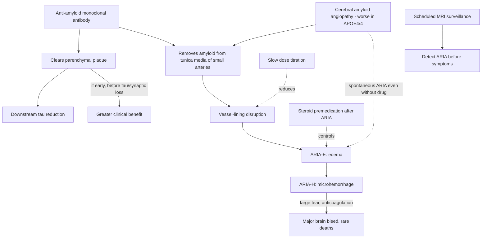

# Anti-amyloid immunotherapy

Anti-amyloid monoclonal antibodies are the first approved drugs that alter the biology of Alzheimer's disease rather than only its symptoms. Aducanumab (approved July 2021, later withdrawn from the market), lecanemab (intravenous, once every two weeks), and donanemab (once monthly) clear amyloid plaque from the brain; although they target amyloid, they also produce downstream reduction in tau. The central tension is that biomarker clearance is dramatic while average clinical benefit in trial populations has been small, and the vascular side-effect profile is serious—especially in APOE4 homozygotes, the group most likely to progress and most in need of treatment. (Peter Attia MD — "399 - The evolution of Alzheimer's disease and dementia care | Gayatri Devi, M.D.", 2026-07-13, [link](https://www.youtube.com/watch?v=x7NhqMOwdOM))

## Mechanism of benefit and of harm

The antibody clears amyloid from brain parenchyma, but it also strips amyloid from the tunica media of small cerebral arteries—where cerebral amyloid angiopathy (CAA) deposits it. Removing that vascular amyloid disrupts the vessel lining: first fluid leaks (ARIA-E, edema), then blood extravasates through tears in the lining (ARIA-H, microhemorrhage), and a large disruption can cause a massive, occasionally fatal brain bleed, particularly on anticoagulation. APOE4/4 carriers have more prevalent and more severe CAA, so they suffer more frequent and larger ARIA—and can have spontaneous ARIA from CAA alone, which is why microbleeds also appear in placebo arms. (Peter Attia MD — "399 - The evolution of Alzheimer's disease and dementia care | Gayatri Devi, M.D.", 2026-07-13, [link](https://www.youtube.com/watch?v=x7NhqMOwdOM))

## Evidence and its limits

Aducanumab's FDA approval went against its advisory board, which objected that plaque clearance did not translate into significant clinical benefit while carrying serious brain-bleeding and swelling risk (reported ARIA incidence above 40%) at an initial cost in the mid-$50,000s per year; it was ultimately withdrawn, per Devi, because required pulse monitoring made it commercially unfeasible rather than for new efficacy or safety findings. For lecanemab and donanemab, the drug-versus-placebo difference on the CDR sum-of-boxes is about 0.3–0.4 points out of 18—small—and early donanemab data showed essentially no CDR-SB difference, which Devi attributes to enrolling moderate-to-severe patients. Treating earlier—before extensive tau pathology and synaptic loss—has shown greater benefit, and treating amyloid-positive people before any symptoms is an open question with no trial answer. Individual responses span the spectrum: one woman in her 70s on lecanemab cleared amyloid, then had a negative tau scan, and is doing remarkably well clinically; a treated identical twin fared much better than her institutionalized untreated twin. Anecdotes from a single open-label practice cannot establish efficacy. (Peter Attia MD — "399 - The evolution of Alzheimer's disease and dementia care | Gayatri Devi, M.D.", 2026-07-13, [link](https://www.youtube.com/watch?v=x7NhqMOwdOM))

Attia frames the underlying logic: like LDL-lowering and atherosclerosis, chronic-disease benefit is about time and area under the curve, so short trials late in disease may understate what early, sustained amyloid lowering could do—an alternative explanation to the drugs don't work, but one that remains unproven pending the low-slow-early trial nobody has yet funded. (Peter Attia MD — "399 - The evolution of Alzheimer's disease and dementia care | Gayatri Devi, M.D.", 2026-07-13, [link](https://www.youtube.com/watch?v=x7NhqMOwdOM))

## The slow-titration position (Devi, contrarian)

Standard practice generally excludes APOE4/4 patients because of ARIA risk. Devi's contrarian protocol treats them anyway, on the reasoning that amyloid accumulated over decades does not need to be cleared in eighteen months: begin at low dose and titrate very slowly, accept clearing plaque in two years instead of one and a half. Her published series reports about 4% ARIA in such patients versus the much higher conventional incidence, and in over five years of use only one symptomatic ARIA case—everything else was caught on protocol MRI surveillance in asymptomatic patients. After ARIA is diagnosed she premedicates with steroids before subsequent doses, as one would treat CAA-related inflammation, and reduces dose rather than necessarily stopping. Practical frictions: donanemab's approved 350→700→1050→1400 mg titration permits lingering at low doses, but lecanemab starts at 10 mg/kg, and insurers will not reimburse off-protocol lower starts—so a safer schedule becomes an out-of-pocket cost; she has seen severe ARIA in 4/4 patients at just 3 mg/kg lecanemab. This is open-label practice evidence, not randomized; the trial that would test low-slow-early treatment in high-risk 50-to-60-year-olds has not been done, likely for cost reasons. (Peter Attia MD — "399 - The evolution of Alzheimer's disease and dementia care | Gayatri Devi, M.D.", 2026-07-13, [link](https://www.youtube.com/watch?v=x7NhqMOwdOM))

## Cost, logistics, and eligibility engineering

The drugs themselves cost about $26,000 per year, with administration fees from roughly $400 per infusion at an infusion center to as much as $10,000 in institutional settings, plus surveillance MRIs and amyloid imaging. Anticoagulation is a relative contraindication because ARIA-H on a blood thinner can be catastrophic; in patients anticoagulated for atrial fibrillation, Devi arranges a left-atrial-appendage occlusion (Watchman) so the anticoagulant can be stopped and the monoclonal started—also used in vascular-dementia patients at fall risk. (Peter Attia MD — "399 - The evolution of Alzheimer's disease and dementia care | Gayatri Devi, M.D.", 2026-07-13, [link](https://www.youtube.com/watch?v=x7NhqMOwdOM))

## Precedent and pipeline

IVIG (pooled immunoglobulin, studied by Norman Relkin's group at Cornell) was abandoned for Alzheimer's overall, but Devi reports that APOE4 carriers were far more likely to benefit, and among her own tap-diagnosed IVIG patients two became plaque-negative, one stable for 17 years—an early hint that immune-based clearance works best in high-risk genotypes, echoed by obeticholic-acid pilot biomarker data Attia cites where 4/4s show the most profound response. Expected next generations: agents with less edema and hemorrhage risk, oral dosing, and home administration; both speakers converge on subtype-stratified treatment (the breast-cancer model of receptor-defined disease) rather than one hammer for a heterogeneous disease. (Peter Attia MD — "399 - The evolution of Alzheimer's disease and dementia care | Gayatri Devi, M.D.", 2026-07-13, [link](https://www.youtube.com/watch?v=x7NhqMOwdOM))

## Practical implications

- **Eligibility first: biomarker-confirmed disease (amyloid plus tau or CSF), APOE genotype, anticoagulation review, and baseline MRI — strong procedural requirement.** [[alzheimers-diagnosis-biological-vs-clinical]]
- **For APOE4/4 carriers who proceed: a very slow titration protocol materially reduces ARIA in one published open-label series (~4%) — moderate-to-low evidence strength (no RCT), and insurance may not cover off-label schedules.**
- **During treatment: scheduled MRI surveillance regardless of symptoms; nearly all ARIA is radiographic before it is clinical — strong within this practice's experience.**
- **Expect modest average clinical effect (CDR-SB ~0.3–0.4/18) in trial-like late populations; the strongest case for treatment is early disease — moderate.**
- **Do not combine with anticoagulation; resolve the indication (e.g., appendage occlusion) first — strong safety position from this source.**

## Gaps & open questions

- Does low-slow-early anti-amyloid treatment in high-risk asymptomatic or minimally symptomatic patients bend the disease course? The definitive trial is unfunded.
- Is Devi's 4% ARIA rate reproducible under randomized conditions, and does steroid premedication compromise amyloid clearance?
- How much of the clinical-benefit shortfall reflects late treatment and trial-population misdiagnosis (~30% historically) versus a wrong or incomplete amyloid hypothesis?
- Which patients account for dramatic responses (amyloid- and tau-negative after treatment), and can immune phenotype predict them?
- Will neuroinflammation-targeted drugs outperform or complement amyloid clearance?

## Related

[[alzheimers-spectrum-and-diagnosis]] · [[alzheimers-diagnosis-biological-vs-clinical]] · [[gayatri-devi]] · [[lewy-body-disease-and-synucleinopathies]] · [[inflammaging-and-il-6]] · [[glp-1-receptor-agonists]] · [[cognitive-reserve-and-brain-health]] · [[aging-model]] · [[practice-playbook]]
