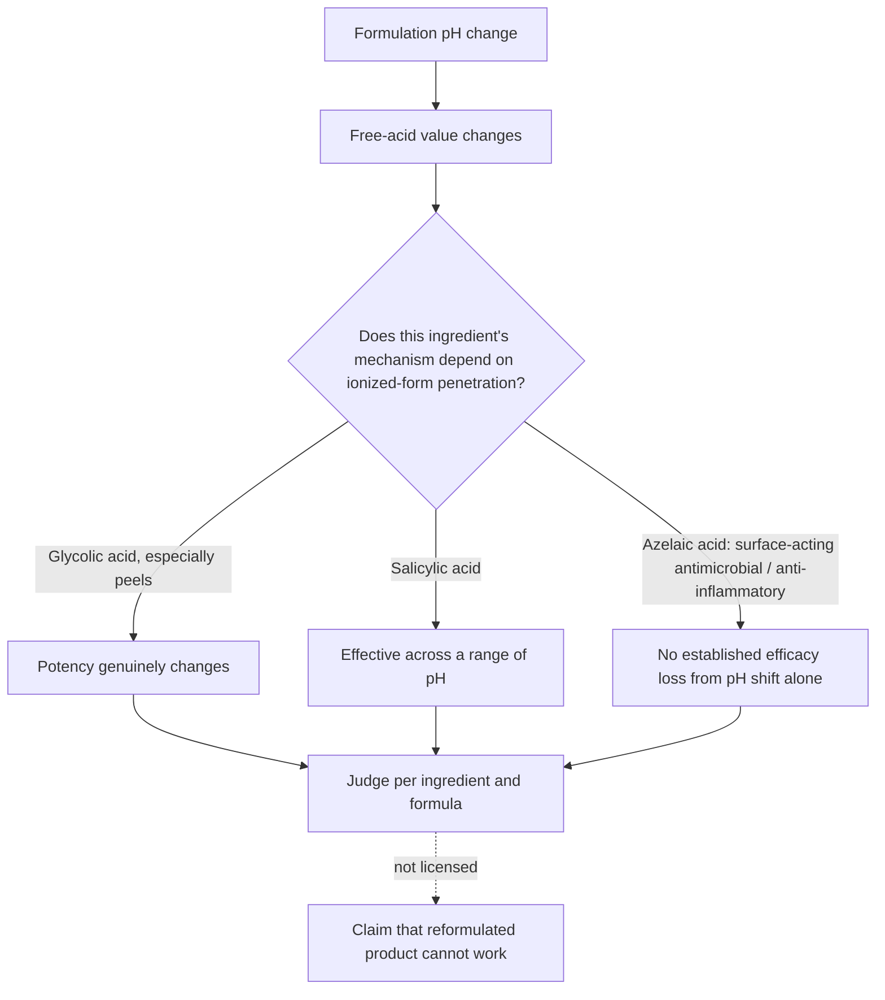

# Azelaic acid

Azelaic acid is a dicarboxylic acid used topically for acne, rosacea, and uneven skin tone. In the United States it exists in two tiers: prescription medications at 15–20% in FDA-approved vehicles with disease indications, and cosmetic serums around 10% sold over the counter. The prescription tier offers a higher concentration and, more importantly, a vehicle and formulation system approved for treating disease, so its formulas are consistent and can be expected to make a meaningful difference in a diagnosed condition; the cosmetic tier can still meaningfully improve cosmetic concerns — uneven tone, redness, discoloration, texture, and smoothness — without carrying disease-treatment evidence. Azelaic acid is prescription-only in the US but sold over the counter in other countries, and Dr Dray's stated position is that it is an even stronger candidate for over-the-counter reclassification than adapalene, with no clear reason for it to remain prescription-bound. (@DrDrayzday (Dr Dray) — "Anua Azelaic Acid REFORMULATED? Controversy Explained | Derm Q&A", 2026-08-22, [link](https://www.youtube.com/watch?v=1b7nGYAIktw))

## Mechanism and where it acts

Azelaic acid works primarily at the surface of the skin: it is an antimicrobial and an anti-inflammatory with mild, gentle exfoliating properties. This surface-weighted mechanism matters for evaluating formulation controversies, because arguments built on penetration depth carry less force for an ingredient whose main actions do not require deep follicular delivery. It also bounds expectations elsewhere on the body: proposed scalp use rests on the anti-inflammatory mechanism, but follicular delivery is doubtful and no one has studied it for scalp irritation or hair growth ([[hair-loss-diagnosis-and-scalp-health]], [[seborrheic-dermatitis]]). (@DrDrayzday (Dr Dray) — "Anua Azelaic Acid REFORMULATED? Controversy Explained | Derm Q&A", 2026-08-22, [link](https://www.youtube.com/watch?v=1b7nGYAIktw))

## When pH and free-acid value matter

A 2026 controversy illustrates how a real formulation variable can be over-generalized. A chemist's viral video noted that the Anua 10% azelaic-acid serum (and some other Korean products) had changed formulation in a way that shifted pH and therefore the free-acid value of azelaic acid, and concluded the reformulated product was likely ineffective. Dr Dray's counter-analysis: the argument assumes free-acid value governs azelaic acid's efficacy through penetration, but azelaic acid acts mainly at the surface, and no evidence establishes that the pH change produced an ineffective product. The general rule is ingredient-specific. For glycolic acid — especially in-office peels — pH and free-acid value genuinely change the ionized fraction and potency, which is why an 8% glycolic toner from one brand cannot be assumed equivalent to another's. For salicylic acid, effectiveness persists across different pHs despite the widespread belief that a specific pH is required. pH still matters for formulation, penetration, and tolerability — it is the leap from a pH change to a scam product that is unsupported, and the brand has no evident incentive to sabotage its own formula. Dr Dray defers to [[michelle-wong]]'s chemistry explanation of the change, and reports that her own recent bottles of the serum performed no differently. If a reformulation coincides with a real loss of benefit for an individual user, that is worth acting on personally; it is not evidence of fraud. (@DrDrayzday (Dr Dray) — "Anua Azelaic Acid REFORMULATED? Controversy Explained | Derm Q&A", 2026-08-22, [link](https://www.youtube.com/watch?v=1b7nGYAIktw))

## Derivatives

Potassium azeloyl diglycinate (PAD) is a long-available modified form of azelaic acid used in many cosmetic serums marketed under azelaic-sounding names. The glycine modification is claimed to make it more hydrating and less drying, but it is not the same molecule, it is unclear whether it does what unmodified azelaic acid does, and there is much less data behind it — so confidence in PAD for the anti-redness, skin-calming, anti-inflammatory, and tone-evening effects should be lower than for azelaic acid itself. This is the same labeled-ingredient-versus-delivered-evidence trap documented for vitamin C derivatives ([[topical-vitamin-c]]) and retinoid look-alikes ([[topical-retinoids]]). (@DrDrayzday (Dr Dray) — "Anua Azelaic Acid REFORMULATED? Controversy Explained | Derm Q&A", 2026-08-22, [link](https://www.youtube.com/watch?v=1b7nGYAIktw))

## Keratosis pilaris

Azelaic acid is not a standard keratosis-pilaris treatment, but it can be a helpful addition to keratolytic therapy: its mild exfoliation may modestly smooth follicular roughness, and its anti-inflammatory action targets the redness of the KP rubra variant specifically. The workhorse remains urea, whose humectant and keratolytic actions address the keratin build-up directly; the combination of a keratolytic urea cream with 15% azelaic acid pairs the two mechanisms ([[keratosis-pilaris]]). (@DrDrayzday (Dr Dray) — "Dermatologist Answers Your Skincare Questions | AmLactin, Fraxel, Sunscreen & KP", 2026-08-29, [link](https://www.youtube.com/watch?v=YIQdXvlvmgA))

## Combinations and tolerability

Azelaic acid can be combined with essentially any other skincare ingredient — including benzoyl peroxide or topical dapsone — provided the combination is tolerated; nothing is chemically incompatible. The binding constraint is cumulative dryness and initial irritation: azelaic acid is itself somewhat drying, so stacking it with another drying active can push a routine past tolerance. Low solubility also makes high-load formulas hard to texture, so an elegant vehicle may improve adherence without proving greater pharmacologic effect ([[skincare-evidence-and-routine-design]]). (@DrDrayzday (Dr Dray) — "Can You Mix Azelaic Acid With Anything? Dermatologist Q&A", 2026-08-16, [link](https://www.youtube.com/watch?v=oyQl5MU3pRQ))

## Practical implications

- **For diagnosed acne or rosacea: prefer the prescription 15–20% tier, whose approved vehicle and disease evidence the cosmetic tier does not carry — moderate-to-strong; source-described regulatory and practice distinction.** (@DrDrayzday (Dr Dray) — "Anua Azelaic Acid REFORMULATED? Controversy Explained | Derm Q&A", 2026-08-22, [link](https://www.youtube.com/watch?v=1b7nGYAIktw))
- **For cosmetic redness, tone, and texture: a ~10% cosmetic azelaic-acid serum is a reasonable option; judge it by your own response rather than by pH-based social-media verdicts — moderate for the cosmetic endpoints; the pH-inefficacy claim is unsubstantiated.** If a reformulated product stops working for you personally, switch products; that observation does not generalize. (@DrDrayzday (Dr Dray) — "Anua Azelaic Acid REFORMULATED? Controversy Explained | Derm Q&A", 2026-08-22, [link](https://www.youtube.com/watch?v=1b7nGYAIktw))
- **When a product lists potassium azeloyl diglycinate instead of azelaic acid: treat it as a different, less-evidenced ingredient — moderate label-interpretation principle.** It is fine to use, but do not credit it with azelaic acid's evidence. (@DrDrayzday (Dr Dray) — "Anua Azelaic Acid REFORMULATED? Controversy Explained | Derm Q&A", 2026-08-22, [link](https://www.youtube.com/watch?v=1b7nGYAIktw))
- **When combining: pair freely by tolerance, watching cumulative dryness rather than imagined chemical conflicts — moderate.** (@DrDrayzday (Dr Dray) — "Can You Mix Azelaic Acid With Anything? Dermatologist Q&A", 2026-08-16, [link](https://www.youtube.com/watch?v=oyQl5MU3pRQ))

## Gaps & open questions

- Does the free-acid value of azelaic acid measurably change any clinical endpoint, or is the surface-acting mechanism genuinely pH-robust across the formulated range?
- Does potassium azeloyl diglycinate reproduce azelaic acid's anti-inflammatory and pigment effects at cosmetic concentrations in independent trials?
- Would over-the-counter azelaic acid at prescription strengths perform as safely as the OTC record of adapalene 0.1% suggests?
- Does azelaic acid do anything useful on the scalp, where its surface-weighted action and doubtful follicular delivery predict little?

## Related

[[skincare-evidence-and-routine-design]] · [[topical-retinoids]] · [[topical-vitamin-c]] · [[seborrheic-dermatitis]] · [[hair-loss-diagnosis-and-scalp-health]] · [[hyperpigmentation-and-dark-spots]] · [[keratosis-pilaris]] · [[michelle-wong]] · [[dr-dray]]
