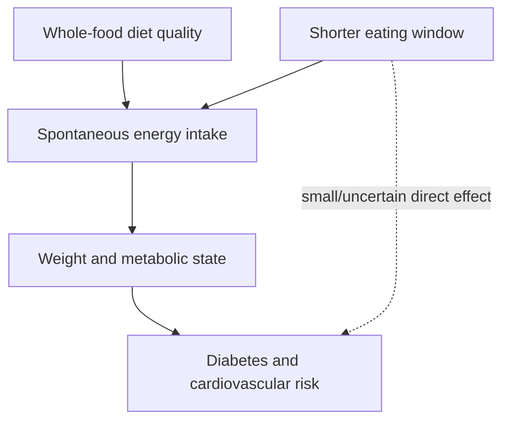

# Caloric restriction and meal timing

Dietary interventions vary along three separable axes: food quality, energy quantity, and timing. Time-restricted eating can reduce intake by shortening opportunity to eat, but a timing window is not itself proof of calorie-independent benefit.

## Evidence

Randomized trials show that intermittent fasting can reduce weight and improve risk markers, but calorie-matched comparisons generally find similar benefits with and without fasting. This makes fasting a delivery strategy for moderating energy intake rather than evidence of a uniquely necessary ancestral trigger. Autophagy or mitochondrial-renewal mechanisms may be biologically interesting, but they do not establish extra human clinical benefit when energy intake and weight change are matched. The source's corrective position is neither that fasting is ineffective nor that it is magical: adherence and fit determine whether the strategy is useful. (@NutritionMadeSimple (Nutrition Made Simple!) — "New York Times Botches Food Advice (Doctor Explains)", 2026-07-18, [link](https://www.youtube.com/watch?v=y3SyUGWOO68))

Caloric restriction robustly extends lifespan in normally fed mice, not only in diet-induced obesity. In humans, controlled CALERIE studies support metabolic benefit from roughly 20–30% restriction in overweight or metabolically impaired groups, while equivalent questions in optimal-weight healthy people are difficult and potentially unethical; exercise produced many similar benefits. (@mkaeberlein (Matt Kaeberlein) — "Longevity Science Update: The Biggest Stories in Longevity Medicine — July 2026", 2026-07-31, [link](https://www.youtube.com/watch?v=A0xNnGsGAJg))

In mouse studies, time restriction produces little or no lifespan benefit when calories are held equal. Human intake is hard to measure, but current evidence likewise provides little support for major benefits independent of eating less. Kaeberlein and Ranney therefore rank food quality first, quantity second, and timing third for the typical person—a perspective that conflicts with timing-first social-media protocols. (@mkaeberlein (Matt Kaeberlein) — "Longevity Science Update: The Biggest Stories in Longevity Medicine — July 2026", 2026-07-31, [link](https://www.youtube.com/watch?v=A0xNnGsGAJg))

Earlier calorie distribution may produce a small metabolic advantage over otherwise comparable late eating, but the effect is inconsistent and much smaller than food quality and total energy intake. A six-hour morning eating window ending before noon is therefore an optional lifestyle arrangement, not an evidence-based requirement for longevity. The same source cautions that further restriction in an already lean, physically active person could trade speculative longevity benefit for loss of muscle, bone, or reproductive and endocrine function. (@NutritionMadeSimple (Nutrition Made Simple!) — "Bryan Johnson´s $2M Anti-AgingPlan, Fact-Checked", 2026-06-12, [link](https://www.youtube.com/watch?v=zqDW_Ouz1M0))

## Practical implications

Use intermittent fasting daily or on a chosen recurring schedule only when it makes energy moderation easier without rebound overeating, distress, or conflict with training and social life; evidence is strong that it can support weight loss but weak for unique calorie-independent benefit. If it makes adherence worse, choose another method of controlling intake rather than treating fasting as biologically mandatory. (@NutritionMadeSimple (Nutrition Made Simple!) — "New York Times Botches Food Advice (Doctor Explains)", 2026-07-18, [link](https://www.youtube.com/watch?v=y3SyUGWOO68))

Daily, prioritize minimally processed foods, vegetables, and adequate protein; use an eating window only if it reliably prevents overconsumption. For obesity or metabolic disease, pursue a sustainable energy deficit with clinical support; evidence is strong for risk-factor improvement but not for prescribing a fixed restriction to already lean people. Pair nutrition with aerobic and muscle-strengthening exercise. (@ABCNewsIndepth (ABC News In-depth) — "The health trends outpacing regulation and putting people at risk | Four Corners Documentary", 2026-07-20, [link](https://www.youtube.com/watch?v=77TTDkR3nbI))

If timing is easy to change, place more energy earlier in the day and avoid routinely large late-night meals; assess the pattern over weeks for adherence, sleep, training, and weight rather than enforcing a noon cutoff. Evidence is low-to-moderate for a small timing effect and weak for an extreme early window. Once an appropriate body composition is reached, maintain rather than continuing to cut calories automatically, especially when strength, bone health, or hormonal function deteriorates. (@NutritionMadeSimple (Nutrition Made Simple!) — "Bryan Johnson´s $2M Anti-AgingPlan, Fact-Checked", 2026-06-12, [link](https://www.youtube.com/watch?v=zqDW_Ouz1M0))

## Gaps & open questions

- Are there clinically important calorie-independent timing effects in specific populations?
- What restriction is sustainable without frailty or lean-mass loss across age groups?
- How much of animal longevity benefit translates to humans?
- Which earlier-eating effects remain after rigorous control of energy intake, sleep, and chronotype?

## Related

[[glp-1-receptor-agonists]] · [[nutrition-evidence-and-personalization]] · [[aging-model]] · [[practice-playbook]]
