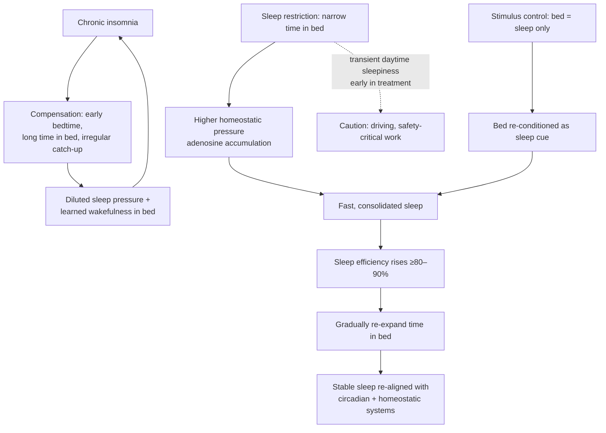

# Cognitive behavioral therapy for insomnia (CBT-I)

Cognitive behavioral therapy for insomnia (CBT-I) is a structured, multi-component behavioral treatment for chronic insomnia — the condition of persistent difficulty falling asleep, staying asleep, or obtaining restorative sleep despite adequate opportunity. It is not one technique but a bundle: sleep education and hygiene, stimulus control, sleep-diary monitoring, cognitive strategies for arousal, control of caffeine and alcohol, and — the counterintuitive core — temporary sleep restriction. Professional guidance (American College of Physicians, 2016; American Academy of Sleep Medicine, 2021) recommends CBT-I as the first-line treatment for chronic insomnia disorder in adults, ahead of medication. The randomized evidence reviewed here — twelve trials across delivery formats and populations, every one finding an effect — supports that placement. (@Physionic (Physionic) — "Cure Insomnia: Use this Science backed Therapy", 2026-07-02, [link](https://www.youtube.com/watch?v=YOtHe5qQCe0))

## Why restricting sleep treats insomnia

Sleep is governed by two coupled systems: homeostatic sleep pressure, which accumulates with time awake (adenosine build-up is one signal), and circadian timing. Chronic insomnia typically involves learned arousal in the sleep context and compensatory behaviors — going to bed early, lingering awake in bed, irregular catch-up sleep — that dilute sleep pressure and decouple bedtime from the circadian window, teaching wakefulness in bed ([[pre-sleep-routines-and-stimulus-control]]). CBT-I's sleep-restriction phase deliberately narrows time in bed below habitual levels, concentrating sleep pressure and making sleep onset fast and predictable again; time in bed is then gradually re-expanded as efficiency recovers, re-integrating the homeostatic and circadian systems. Stimulus control simultaneously re-trains the bed as a cue for sleep rather than wakeful frustration. (@Physionic (Physionic) — "Cure Insomnia: Use this Science backed Therapy", 2026-07-02, [link](https://www.youtube.com/watch?v=YOtHe5qQCe0))

The perpetuating mechanism can be understood as conditioned arousal. An acute stressor first disrupts sleep; compensatory effort then makes the bed a place for monitoring, frustration, scrolling, and prolonged wakefulness. Anticipatory arousal appears before sleep is attempted, makes sleep less likely, and confirms the expectation that bed is stressful. Stimulus control breaks that learned link, while sleep restriction strengthens homeostatic pressure. This explains why sedation can increase sleepiness without directly correcting the excessive wake signal that maintains chronic insomnia. (@FoundMyFitness (FoundMyFitness) — "Why You Can’t Sleep (and How to Fix It) |  Dr. Michael Grandner", 2025-10-06, [link](https://www.youtube.com/watch?v=AQF_eopP1ys))

Chronic insomnia disorder is distinct from occasional poor sleep or insufficient opportunity: the staged source describes persistent initiation, maintenance, or early-waking difficulty at least three nights weekly for at least three months, with daytime impairment despite adequate opportunity. This pattern still requires differential assessment because [[obstructive-sleep-apnea]], circadian disorders, pain, medications, mood disorders, and substance effects can coexist with or mimic insomnia. (@FoundMyFitness (FoundMyFitness) — "Why You Can’t Sleep (and How to Fix It) |  Dr. Michael Grandner", 2025-10-06, [link](https://www.youtube.com/watch?v=AQF_eopP1ys))

## Evidence

The anchor trial (Espie et al. 2012, Sleep) randomized 164 adults with diagnosed insomnia disorder to web-delivered CBT, imagery-relief therapy, or treatment as usual, and scored sleep efficiency — a composite reflecting sleep-onset latency, wake after sleep onset, and total time in bed — against the standard normal-sleep threshold of 80%. After treatment, more than 70% of the CBT group crossed the 80% threshold (resolution to normal-range sleep) and almost 40% reached 90%; the comparison groups changed little. Two months after treatment ended, gains had partly regressed but were substantially maintained, especially at the 80% threshold. These are self-reported sleep-diary outcomes — a scientific weakness, though for a symptom defined by the sufferer's experience the patient report is itself the clinically meaningful endpoint, and trials using objective measures show similar benefit. (@Physionic (Physionic) — "Cure Insomnia: Use this Science backed Therapy", 2026-07-02, [link](https://www.youtube.com/watch?v=YOtHe5qQCe0))

Delivery format matters at the margin, not for whether it works. A randomized wait-list-controlled comparison (Lancee et al. 2016, Sleep) found both guided-online and face-to-face CBT-I lowered the insomnia severity index against control, with face-to-face producing the larger drop — and both formats holding their gains at three- and six-month follow-up. Across the twelve trials, CBT-I worked when delivered by web application, mobile app, telephone (older adults with osteoarthritis pain), voice assistant, and therapist, and in comorbid populations including breast-cancer survivors, chronic pain, and traumatic brain injury — every trial, across varying size and methodology, identified an effect, many of clinically meaningful magnitude. (@Physionic (Physionic) — "Cure Insomnia: Use this Science backed Therapy", 2026-07-02, [link](https://www.youtube.com/watch?v=YOtHe5qQCe0))

A free, non-commercial entry point exists: the CBT-I Coach app produced by the US Department of Veterans Affairs, which the source recommends while noting no affiliation. (@Physionic (Physionic) — "Cure Insomnia: Use this Science backed Therapy", 2026-07-02, [link](https://www.youtube.com/watch?v=YOtHe5qQCe0))

## Gaps & open questions

- How durable are gains beyond six months, and does periodic booster CBT-I extend them?
- Which components carry the effect — sleep restriction, stimulus control, cognitive work — and can the bundle be shortened without losing efficacy?
- Who fails digital CBT-I and needs the therapist-delivered format from the start?
- How large are downstream effects on depression, pain, cardiometabolic risk, and daytime function relative to the sleep improvement itself?
- How should CBT-I be sequenced or combined with treatment for comorbid sleep apnea, circadian disorders, or hypnotic-medication tapering?
- Which patients need clinician-supervised rather than digitally delivered sleep restriction because of sleepiness, bipolar-spectrum illness, seizure risk, or safety-critical work?

## Practical implications

- **For chronic insomnia, use CBT-I as the first-line treatment before or instead of sleep medication — strong: professional-guideline recommendation plus twelve consistent randomized trials.** Expect meaningful, durable improvement; most trial participants reached normal-range sleep efficiency. [[sleep-quality-and-circadian-alignment]] (@Physionic (Physionic) — "Cure Insomnia: Use this Science backed Therapy", 2026-07-02, [link](https://www.youtube.com/watch?v=YOtHe5qQCe0))
- **Prefer a trained professional when accessible — moderate, from one head-to-head trial favoring face-to-face delivery; digital or guided-online CBT-I is an effective alternative — strong for effectiveness across formats.** The VA's free CBT-I Coach app is a reasonable no-cost starting resource. (@Physionic (Physionic) — "Cure Insomnia: Use this Science backed Therapy", 2026-07-02, [link](https://www.youtube.com/watch?v=YOtHe5qQCe0))
- **Expect the sleep-restriction phase to be demanding and initially sleepiness-inducing — standard clinical caution.** Plan around driving and safety-critical tasks early in treatment, and keep a sleep diary throughout; the method requires dedication and some detailed work over weeks. (@Physionic (Physionic) — "Cure Insomnia: Use this Science backed Therapy", 2026-07-02, [link](https://www.youtube.com/watch?v=YOtHe5qQCe0))
- **Do not substitute supplements for CBT-I — strong as a comparative-evidence statement.** No sleep supplement has evidence approaching this consistency; unrefreshing sleep despite adequate opportunity, snoring or witnessed apneas, or daytime sleepiness still warrant clinical evaluation for causes CBT-I does not treat. [[sleep-quality-and-circadian-alignment]] [[supplement-evidence-and-safety]]

## Related

[[sleep-quality-and-circadian-alignment]] · [[pre-sleep-routines-and-stimulus-control]] · [[obstructive-sleep-apnea]] · [[mental-strength-and-behavioral-skills]] · [[catastrophizing-and-uncertainty]] · [[supplement-evidence-and-safety]] · [[practice-playbook]]
